# 使用 OpenID Connect 保护外部系统 REST APIs

> 原文：<https://itnext.io/protect-outsystems-rest-apis-using-openid-connect-87a2ac7575c1?source=collection_archive---------4----------------------->

在本文中，我们将研究如何使用 OpenID Connect 保护暴露的 OutSystems REST API 端点。


OpenID Connect 是基于 OAuth 2.0 框架的身份层。它允许应用程序(客户端)对用户进行身份验证。实际的身份验证是由一个名为 OpenID provider 的中央服务执行的。在成功的**认证**之后，提供商发布身份、访问和刷新令牌。访问令牌可用于**授权**应用程序访问资源(API)。

当然，这只是一个粗略的解释，我强烈建议在将 OAuth 2.0 和 OpenID Connect 应用于生产环境之前，先对它们有一个很好的理解。一个很好的起点是下面这篇由身份管理平台提供商首席执行官[特拉维斯·斯潘塞](https://medium.com/u/b1c144048921?source=post_page-----87a2ac7575c1--------------------------------)撰写的文章。

[](https://nordicapis.com/api-security-oauth-openid-connect-depth/) [## API 安全性:深入研究 OAuth 和 OpenID 连接

### OAuth 2 和 OpenID Connect 是保护 API 的基础。为了保护您的服务公开的数据，您…

nordicapis.com](https://nordicapis.com/api-security-oauth-openid-connect-depth/) 

Curity 在 medium.com 上发表关于身份和访问管理的各种主题的文章。

在本演练中，我们将使用以下内容

*   **OutSystems** (当然)——这里我们公开了一个示例 REST API 端点，并执行一个定制的身份验证，获取客户端应用程序发送的每个请求的访问令牌。我们将验证该令牌，并尝试使用相应的 OutSystems 用户帐户登录。我们将在后面看到何时以及为什么需要后者。
*   **Postman** —我们将使用 [Postman](https://www.postman.com/) 作为我们的客户端应用程序。这比设置示例(如 ReactJS 应用程序)更容易。Postman 具有多种功能，包括一个集成的向导来获取 OpenID 连接令牌。
*   **AWS Cognito** —在本文中，我们使用 AWS Cognito 作为我们的身份提供者。Cognito 将识别和验证用户，并向邮递员发放访问令牌。随意使用任何其他 OAuth 2.0 / OpenID Connect 支持的身份提供者( [Curity](https://www.curity.io) 、 [Auth0](https://www.auth0.com) 、 [Okta](https://www.okta.com) 、 [KeyCloak](https://www.keycloak.org/) 、 [IdentityServer4](https://duendesoftware.com/) 以及许多其他商业和开源身份提供者)。概念是相同的，但是您必须自己找出在哪里配置客户端和用户😒。

> 像 AWS Cognito 这样的身份提供者很容易设置。这就是我们在本文中使用它的原因。但是它们不提供与上面更成熟的身份提供者相同的功能。您的安全需求越高，或者您的(API)环境越复杂，您就需要越多的功能。就我个人而言，我喜欢使用开源产品 KeyCloak。

除了 Postman 和对 AWS Cognito(或任何其他身份提供者)的访问，您还需要将以下 [OutSystems Forge](https://www.outsystems.com/forge/) 组件下载到您的开发环境中。

[](https://www.outsystems.com/forge/component-overview/1853/jwt) [## JWT

### 用于处理服务器端 OAuth 身份验证中使用的 JSON Web 令牌的库。目前，该组件允许生成…

www.outsystems.com](https://www.outsystems.com/forge/component-overview/1853/jwt) 

joo Almeida 的这个组件带来了我们解码和验证访问令牌所需的一切。在 Forge 上留下评论和星星👌

伴随这篇文章，我还在 OutSystems Forge 上发布了一个示例服务**。请安装它，以及我们使用此服务来测试和解释所涉及的步骤。**

[](https://www.outsystems.com/forge/component-overview/13934/protect-exposed-rest-api-using-openid-connect) [## 使用 OpenID Connect 保护公开的 REST API

### 示例服务展示了如何在公开的 REST APIs 上解码和验证 OpenID Connect 访问令牌。

www.outsystems.com](https://www.outsystems.com/forge/component-overview/13934/protect-exposed-rest-api-using-openid-connect) 

我在本文中展示的模式是使用 OAuth2 / OpenID Connect 的客户端到服务器 API 通信中最常用的模式。总体流程如下。

*   您有一个客户端应用程序(例如，ReactJS 单一应用程序)，该应用程序已向您的身份提供者注册。
*   用户启动应用程序，单击登录按钮，然后被重定向到身份提供者的登录页面。
*   用户在身份提供者处成功登录后，用户被重定向回应用程序，客户端应用程序从身份提供者处获取访问令牌。(这里的流程稍微复杂一点)
*   然后，客户端应用程序使用访问令牌从 REST API 获取数据。
*   REST API 对接收到的令牌进行解码。然后，它验证一个或多个标头信息，如颁发者、目标受众、过期时间，最重要的是令牌的签名。
*   可选地，API 验证所谓的作用域——与访问令牌一起传递——并检查作用域是否匹配所请求的 API 端点资源。虽然不是本文的一部分。
*   如果一切都有效，REST API 将返回请求的数据。

一些附加信息

*   只有客户端应用程序必须向身份提供者注册。对于其他需求，将 REST API 注册为身份提供者的资源服务器**可能**是有用的。但是本文中没有涉及到。
*   您的身份提供者使用只有身份提供者知道的私钥对访问令牌的有效负载进行签名，并将该签名附加到访问令牌。您使用相应的公钥来验证签名。大多数身份提供者通过 JSON Web Key 服务端点共享他们的公钥。正如我们将看到的那样，AWS Cognito 正在这样做。如果您可以验证您的签名(您的 API)知道您收到的有效负载是未修改的，并且是由身份提供者签名的，那么您可以信任它。
*   有时您会读到向用户颁发了访问令牌。这不是真的。正确的说法是用户(在身份提供者处)同意客户端应用程序可以使用身份提供者提供的访问令牌代表用户做“事情”。
*   OpenID Connect 身份提供者向客户端应用程序颁发多个令牌(身份令牌、访问令牌、刷新令牌)。只有访问令牌与访问 API 资源相关。访问令牌必须包含所有必要的信息(称为声明),以标识用户(如果需要)并授权访问公开的资源。

但是让我们结束理论部分，从如何在外部系统中实现开始。这是我们要做的

*   创建一个 AWS Cognito 用户池，创建一个示例用户，并将 Postman 注册为客户端应用程序。
*   配置 Postman 集合以获取访问令牌。
*   在公开的 REST API 中配置一个定制的身份验证流，以处理检索到的访问令牌。

# AWS Cognito —创建用户池

登录 AWS 控制台，切换到 Cognito 服务。点击**创建用户池**。

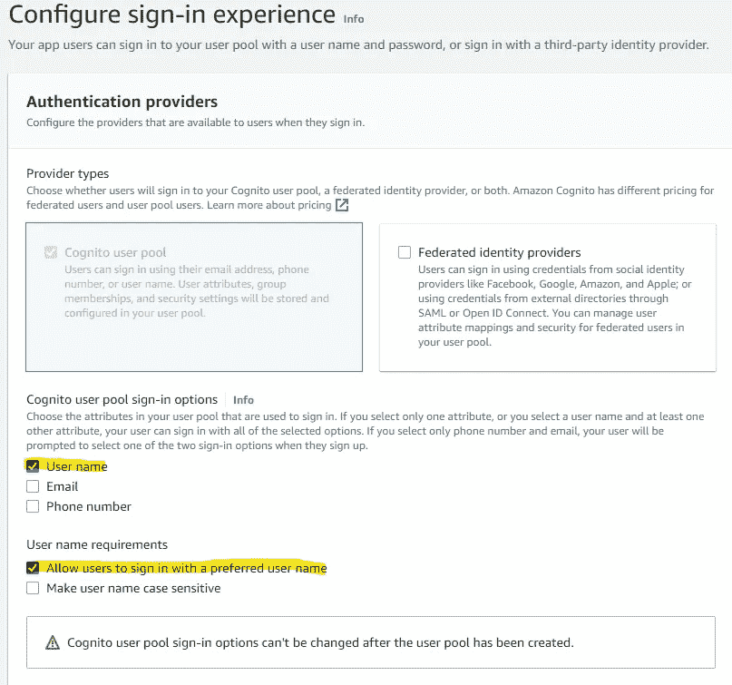

认知登录体验

勾选**用户名**登录选项和**允许用户用首选用户名**登录。

这在认知上有点奇怪。与其他身份提供者一样，使用 Cognito 无法配置哪些属性(声明)是访问令牌的一部分。Cognito 中的一个访问令牌只包括用户名声明。

> 如果您在此屏幕上只选择了 Email，那么 Cognito 会为用户生成一个唯一的标识符(不可修改),该标识符也将成为用户名。

稍后，在 OutSystems 中，我们需要查询 Users 实体以找到匹配的 OutSystems 用户，因此我们需要 username 声明中的值与 Users 实体记录中的值相匹配。(我们将使用电子邮件地址)

通过检查**用户名**和**允许用户使用首选用户名**登录，我们可以直接配置用户名值，我们只需在那里输入电子邮件地址。这仍然允许用户使用他们的电子邮件地址登录。

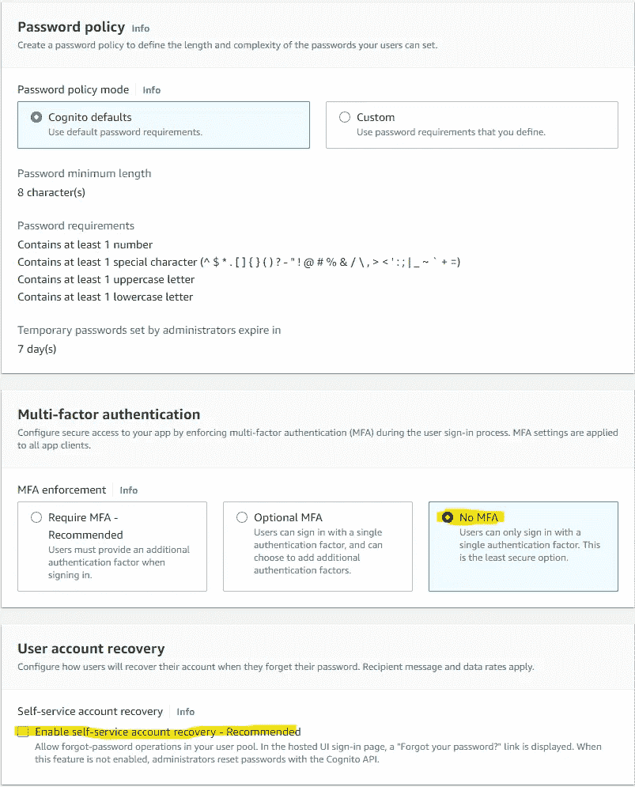

认知密码策略

在多因素身份验证中，通过选择**无 MFA** 选项禁用 MFA 要求。取消选择**启用自助账户恢复**。点击**下一个**。

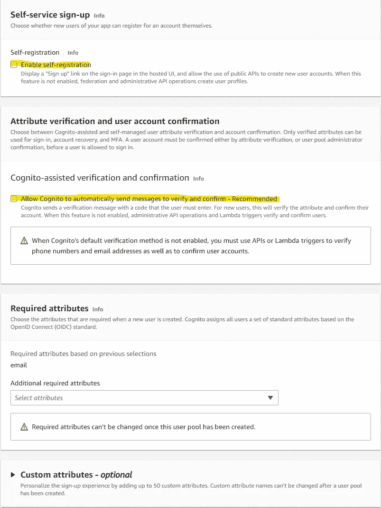

认知自助服务

取消选择**启用自注册**和**允许 Cognito 自动发送消息进行验证和确认**。对于这篇文章，我们将不允许一个未知的用户注册一个帐户。相反，我们将自行提供和确认用户帐户。点击**下一步**。

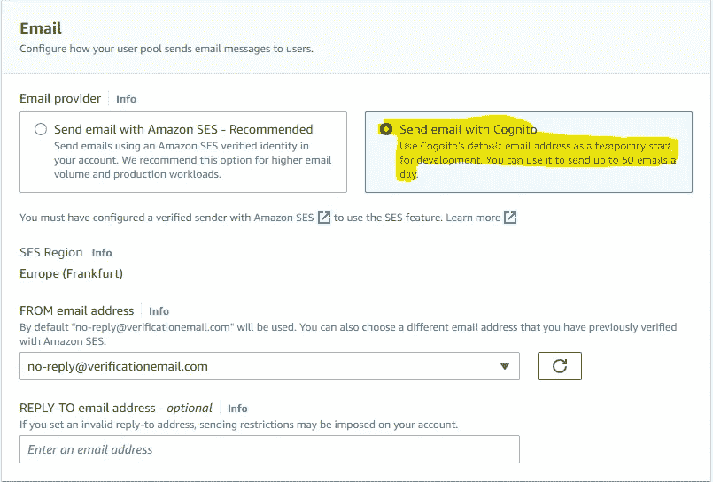

认知电子邮件通知

选择**用 Cognito** 发送电子邮件(虽然我们不会发送任何电子邮件，但必须在此进行配置)。点击**下一个**。

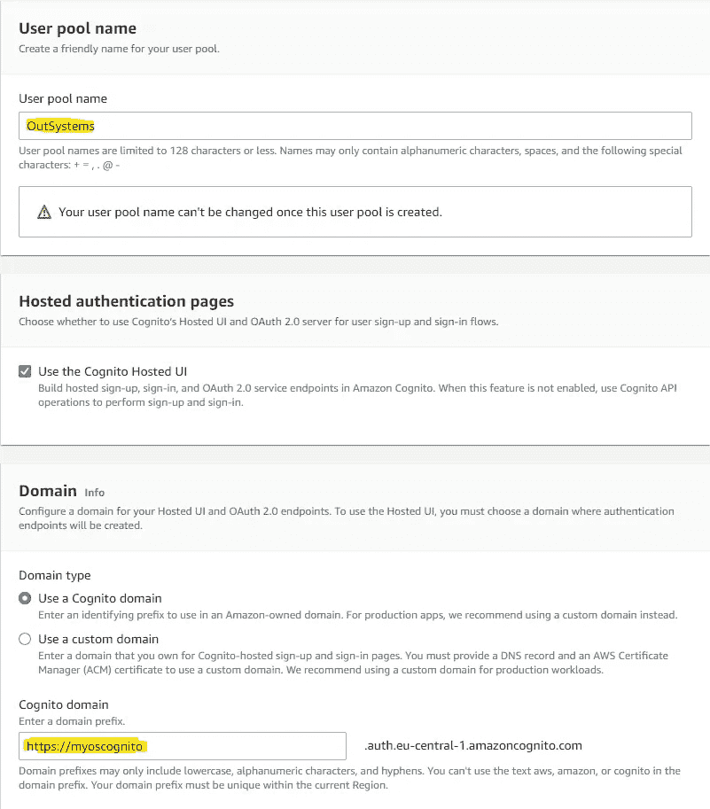

认知用户池配置

输入您选择的**用户池名称**和**认知域**前缀。

这里的助手要求我们也创建一个客户机应用程序注册(我们的 Postman 客户机)。

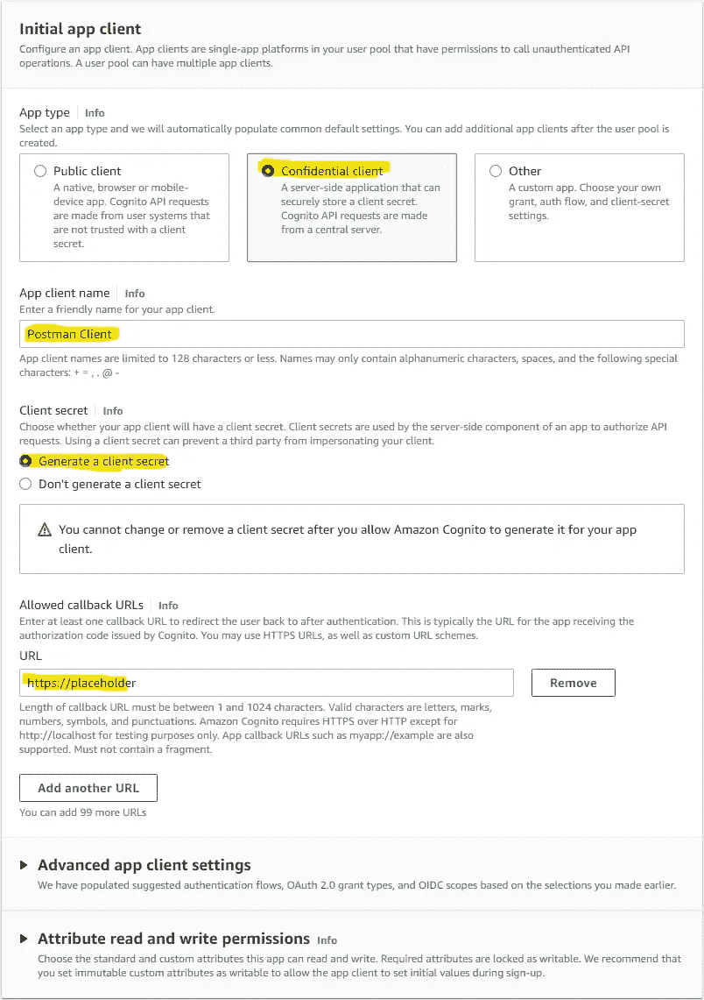

Cognito 客户端应用程序

选择**保密客户端**，输入 **App 客户端**名称。确保选择了**生成客户端密码**。

我们还必须在这里添加一个**回调 URL** 。身份验证成功后，用户被重定向回应用程序。身份提供者检查请求的 URL 是否在配置的列表中，然后才执行重定向。

Postman 为我们提供了一个重定向 URL，但是现在只需输入[**https://placeholder**](https://placeholder)(我们稍后在配置 Postman 时会更改它)，然后单击**下一个**。

在**查看和创建**页面查看您的选择，然后点击**创建用户池**。

# AWS Cognito —创建用户

在用户池概览中，单击您创建的用户池。

在**用户**选项卡中点击**创建用户**按钮。

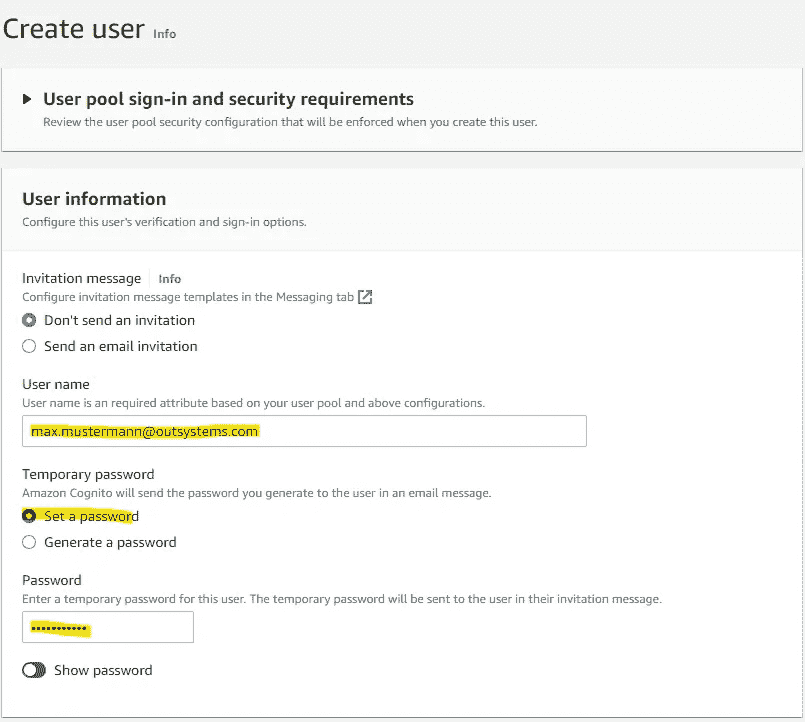

认知创建用户

输入您的用户的**电子邮件地址**作为**用户名**。稍后，我们将使用该地址在 OutSystems 用户提供者中查找相应的用户，因此要确保您在这里输入的地址**在 OutSystems 中已经存在**。

**设置临时密码**。这只是初始密码。当用户第一次登录时，必须更改密码。

点击**创建用户**。

# AWS cogni to-Postman 应用程序客户端信息

选择**应用集成**选项卡，向下滚动至**应用客户端和分析**。单击我们在创建用户池时添加的 Postman 客户端条目。

在 **App 客户端信息下**切换**显示客户端秘密**。让页面保持打开状态，因为在配置 Postman 时，我们很快会需要 **ClientID** 和**客户端机密**。

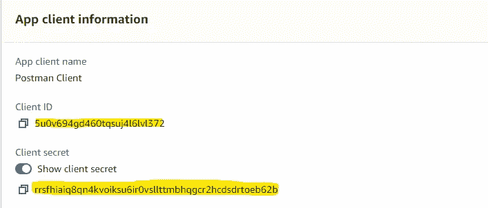

认知客户端应用程序信息

# 邮递员—创建收藏

打开 Postman，在**收藏**选项卡中点击**新建- >收藏**。为该系列输入您选择的**名称**。

在集合视图中，首先转到变量选项卡，添加两个变量

*   **ClientID** —将 AWS Cognito 的 **App 客户端信息**中的**客户端 ID** 值复制到**初始值**
*   **ClientSecret** —将 AWS Cognito 的 **App 客户端信息**中的**客户端秘密**值复制到**初始值**

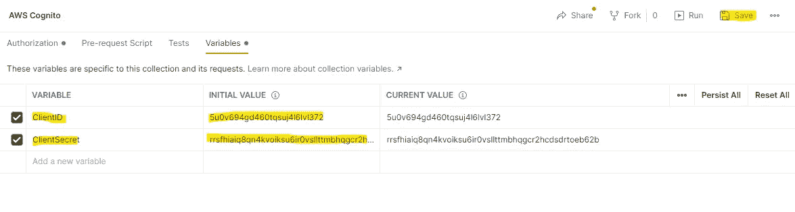

邮递员集合变量

点击**保存**按钮，切换到**授权**页签。

在**授权**选项卡中，从**类型**下拉列表中选择 **OAuth 2.0** 。

在配置选项中

*   为令牌输入一个**名称**。可以是任何东西。
*   确保**授权码**被选为**授权类型**。
*   在**客户端 ID** 中输入您创建的变量 **{{ClientID}}**
*   在**客户端密码**中输入您创建的变量 **{{ClientSecret}}**
*   在**验证 URL** 中，输入您的认知域，然后输入 **/oauth2/authorize**
*   在**访问令牌 URL** 中，输入您的认知域，后跟**/oauth 2/令牌**

你会在**域**下**用户池**的**应用集成**标签中找到你的 Cognito 域。

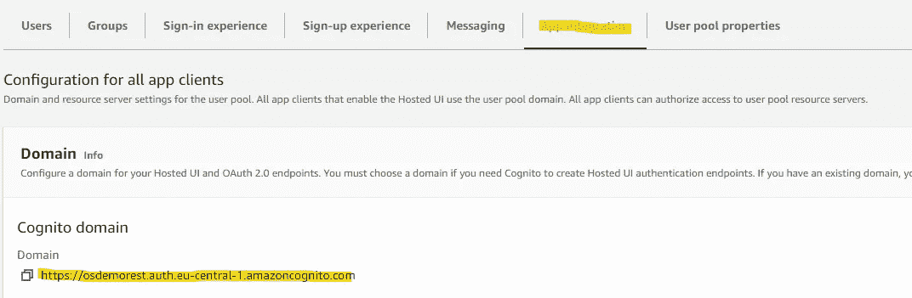

认知域信息

它遵循以下命名约定

```
https://<your subdomain>.<your region>.amazoncognito.com
```

上面的示例截图翻译过来就是

*   **认证网址**—https://osdemorest . Auth . eu-central-1 . Amazon cognito . com/oauth 2/authorize
*   **访问令牌 URL**—https://osdemorest . auth . eu-central-1 . amazoncognito . com/oauth 2/Token
*   选中复选框**使用浏览器授权**
*   复制**回调 URL** 的值

回到我们的 AWS Cognito Postman 客户端应用程序配置，单击**托管 UI 部分**中的**编辑**按钮。

用复制的值覆盖**允许的回调 URL**下的 [https://placeholder](https://placeholder) 。然后点击**保存更改**。

您在 Postman 中的授权配置现在应该是这样的。

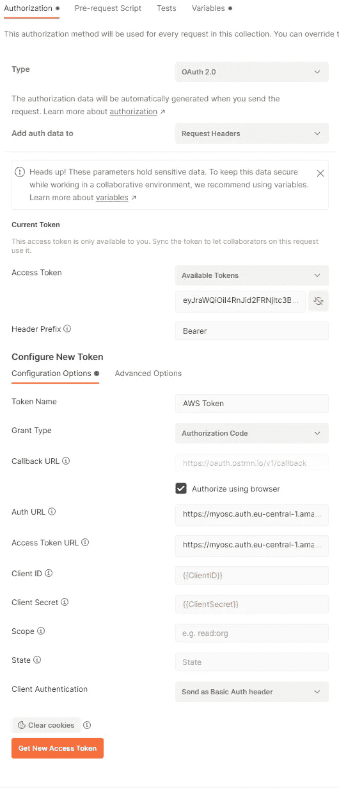

邮递员集合授权配置

**保存**收藏。

点击**获取新的访问令牌**按钮。Postman 会打开一个浏览器窗口，您会被重定向到默认的 AWS Cognito 登录页面。使用您之前创建的用户登录。最后，你会被要求打开邮递员。邮递员将显示检索到的令牌。点击**使用令牌按钮**保存。

将令牌存储在 Postman 中，并用于与此集合关联的所有 REST 调用。默认情况下，将始终使用最后检索到的令牌。

# 外部系统—服务配置示例

如果您还没有从 OutSystems Forge 下载示例服务，请现在就下载。在我们尝试之前，你必须配置模块的一些站点属性。这些是

*   IDPIssuer —该场地拥有 URI。它用于验证访问令牌的颁发者(iss)声明。
*   **IDPJWKS** —可以检索签名验证的公钥的端点。

您将需要您的 AWS 用户池 ID 来构建 URIs。这可以在您的用户池的概览页面中找到。

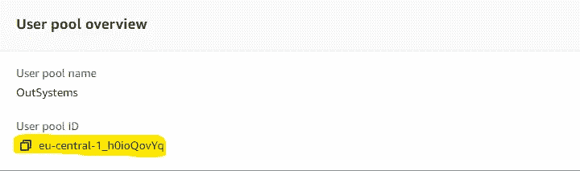

用户池概述

在 **OutSystems 服务中心**中，打开示例服务的模块 **OpenIDRESTAPI** 并配置两个站点属性。

```
IDPIssuer
https://cognito-idp.**<region>**.amazonaws.com/**<user pool id>**IDPJWKS
https://cognito-idp.**<region>**.amazonaws.com/**<user pool id>**/.well-known/jwks.json
```

# 邮递员-查询示例服务

在 Postman 中添加一个新的**请求**到你的收藏中，并给它一个名字，例如**获取我的个人资料**。

检查**方法**是否设置为**获取**。

作为端点 URL 输入

```
https://<your OutSystems environment>/OpenIDRESTAPI/rest/Profile/Me
```

点击**保存**按钮。

尝试使用**发送**按钮查询服务。如果您在我们配置集合**授权**时请求的令牌仍然有效，您应该会看到以下响应

```
{
  "Name": <Name of the user as stored in OutSystems User Provider>,
  "Email": <Email address of user as stored in OutSystems User Provider>
}
```

如果出现错误，首先从集合的**授权**选项卡请求一个新令牌，然后重试。

# 外部系统—示例服务演练

示例服务公开了一个端点( **Me** )。在这里，使用设置为 **GetUserId()** 函数的过滤器查询 **Users** 实体。

服务本身设置为**自定义**认证。在**on 认证**流程中，完成以下工作。

*   我们使用来自 **HTTPRequestHandler** 模块的 **GetRequestHeader** 动作来检索授权头。
*   报头包含值**载体**，后跟实际令牌。我们使用 **String_Split** 从 **Text** 模块中分离出单词 Bearer 和令牌。

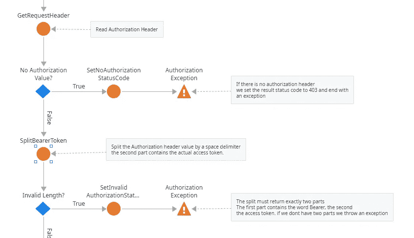

自定义身份验证

*   使用来自 JWT 模块的**ReadTokenWithoutValidation**我们解码令牌。这是必要的，这样我们就可以获得 AWS Cognito 使用哪个私钥对令牌有效负载进行签名的信息。
*   我们使用提取的密钥 Id 查询 JWKS 端点，以使用来自 JWT 模块的 **GetJwkFromJwksEndpoint** 服务器操作检索公钥。
*   然后我们使用来自 JWT 模块的 **ReadAndValidateToken** 服务器动作来验证令牌，包括令牌的**到期**、发布者**和签名**。****

**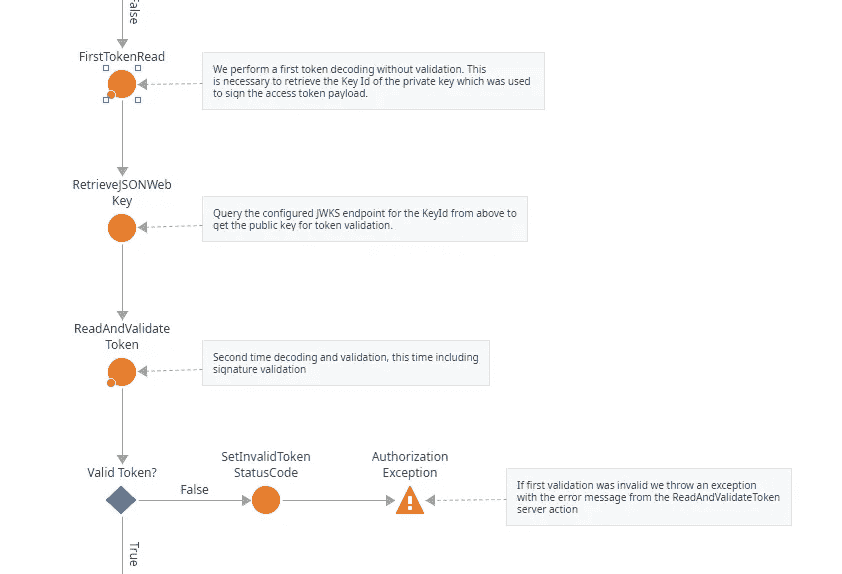**

**自定义身份验证**

*   **最后，我们使用 **ListFilter** 服务器动作过滤**用户名**声明的访问令牌声明。我们尝试使用聚合来查找现有的 OutSystems 用户，如果找到，我们使用来自**系统**模块的**登录**服务器动作来执行用户 id 的**非持久**登录。**

**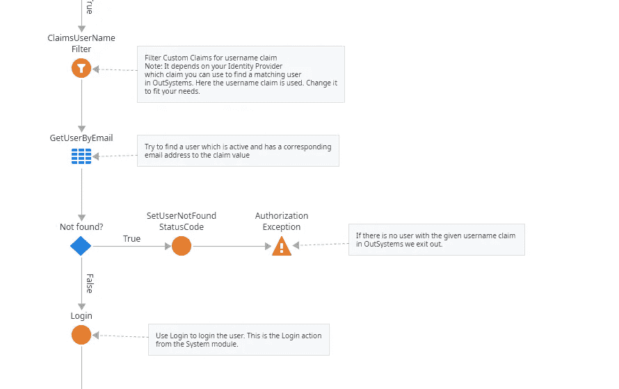**

**自定义身份验证**

> **每当出现错误或验证失败时，我们设置结果状态代码 403(禁止)，并通过引发异常退出。**

**仅此而已。概括来说，自定义身份验证流程中的步骤包括:**

*   **从授权头中检索访问令牌**
*   **解码令牌以获取公钥 id**
*   **从 JWKS 端点下载公钥**
*   **验证令牌**
*   **查找 OutSystems 用户并执行登录**

# **笔记**

**正如您自己可能已经发现的那样，这个流程并没有优化。我试图用最简单的方式展示相关的步骤。虽然已经够复杂了。尤其是如果你以前没有使用过 OAuth2 / OpenID Connect。**

**按照计划同步 JWKS 端点签名公钥并使用缓存的值进行令牌验证是有意义的。这稍微减少了延迟。**

**此外，令牌缓存也很有意义，您可以在实体中存储令牌签名、其到期时间和相应的 OutSystems 用户 id。每当您检索一个令牌时，您都会查找缓存的条目来比较签名并直接登录用户。这也减少了一点流量。**

**此示例显示了如何使用来自您信任的颁发者的公钥仅在后端验证令牌。这对于大多数用例来说已经足够了。还有另一种称为**令牌自省**的方法，您将令牌发送给身份提供者进行验证。这支持其他用例，如令牌撤销。如果您有这样的需求，您需要一个更成熟的身份提供者，因为 AWS Cognito 还没有实现令牌自省 OAuth2 规范。**

**当然还有更多…**

**感谢您的阅读。我希望你喜欢它，并且我已经很好地解释了重要的部分。如果没有，请告诉我😊**

**如果您在启动和运行时遇到困难，请使用 [OutSystems 论坛](https://www.outsystems.com/forums)获得帮助。非常欢迎对如何改进这篇文章提出建议。通过我的 [OutSystems 档案](https://www.outsystems.com/profile/0qginuc0j5/overview)给我发消息，或者直接在 medium 上回复。**

**如果你喜欢我的文章，请留下一些掌声。关注我并订阅，以便在我发布新文章时收到通知。低编码快乐！**