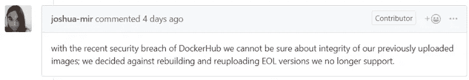
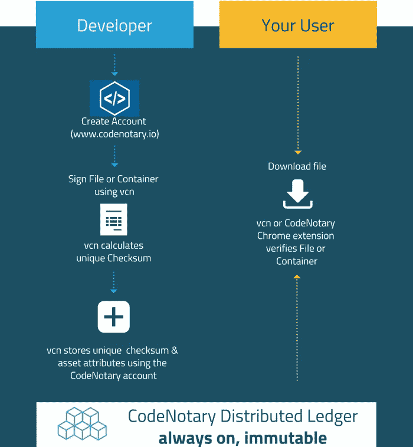
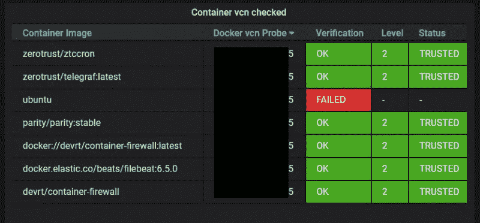
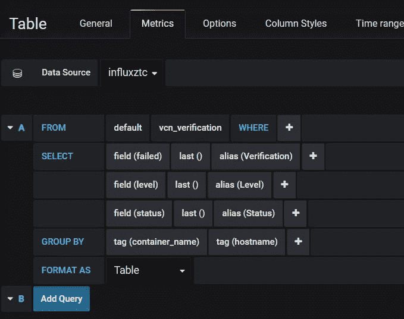
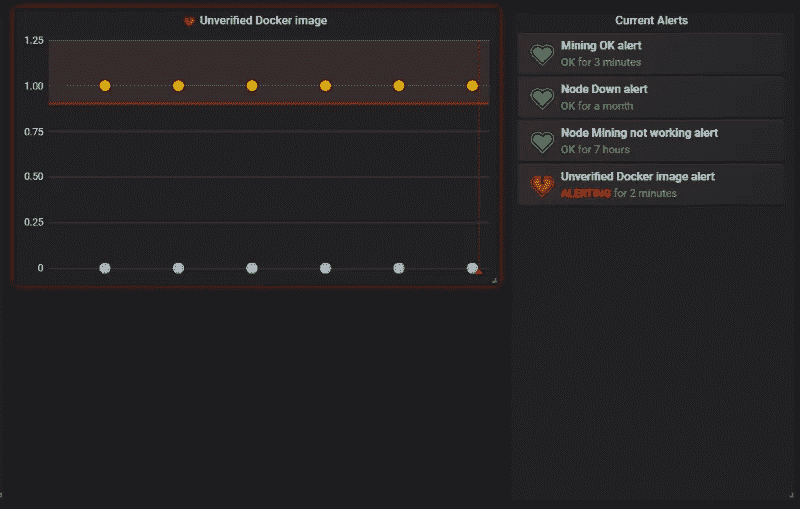

# 使用性能分析器和代码公证保护您的 docker 环境

> 原文：<https://itnext.io/protect-your-docker-environment-using-performance-analyzer-and-codenotary-edef3f780b5?source=collection_archive---------6----------------------->

无数的 IT 基础设施运行 docker 容器进行测试、生产或研究。

大多数 docker 容器都基于从 Docker Hub 下载的图像。这个决定包含了很大一部分信任，即 Docker Hub 上的形象是好的。

大约一周前，随着 dockerhub.com 事件的发生，情况突然发生了变化。尽管与总用户群相比，只有少数帐户(按百分比)受到影响，但这让人对您自己的数据中心正在运行的内容产生了不好的感觉。

由于我们想要保护我们自己的开发环境以及我们的一些客户的环境(例如零信任联盟)，我们找到了一个体面的解决方案来一劳永逸地解决这个问题。

这篇博文将涵盖以下内容，以保护您的 docker 环境:

*   以不变的方式标记你的 docker 图片
*   检查您正在运行的 docker 容器是否基于您支持的容器映像
*   使用性能分析器跟踪和监控容器

# 背景

我们的( [Opvizor](https://www.opvizor.com) )客户[零信任财团](https://www.zerotrustconsortium.org)，他经营着一个软件行业的区块链财团，基于平价以太坊。您最不希望发生在区块链上的事情是，您运行的节点基于软件的操纵版本。想象一下，您会因为 docker 容器映像的更改而失去多数，并且所有块内容都会因为变得不可信而消失。

奇偶校验团队非常清楚这一点，并在得知 dockerhub.com 的违规事件后删除了 Docker Hub 图像。



[https://github.com/paritytech/parity-ethereum/issues/10627](https://github.com/paritytech/parity-ethereum/issues/10627)

奇偶校验只是该用例的一个例子。事实上，有数不清集装箱在疯狂运行，你需要保护你的码头环境。

因此，我们 Opvizor 公司决定创建一个解决方案来保护 ZTC 节点。我们对结果感到非常自豪，最棒的是，该解决方案可以通用。

需要什么:

1.  标记和验证客户允许运行的 docker 图像的可靠方法(类似于白名单)
2.  连续监控和验证运行中的容器
3.  结果的数据转发器
4.  包括警报的可视化

让我们一步一步开始。

# 标记和验证客户允许运行的 docker 图像的可靠方法(类似于白名单)

运行在 ZTC 区块链之上的软件公司 code 公证人(code 公证人)几周前发布了一个 docker 容器支持(T3)。

这样，我们可以确保所有我们想要使用的图像都在使用中。docker 的一个大问题是有自己的版本标签。虽然在部署过程中非常方便(尤其是最新的或稳定的)，但是很难确定在整个环境中是否所有容器都运行相同的版本。

在 ZTC，节点分布在全球各地，由完全独立的公司维护。尽管版本被用作标签，但他们绝对需要确保 docker 图像的完整性。最佳解决方案是在无缝集成的同时持续检查。

由于 ZTC 已经有了一个公证帐户，他们签署了所有码头集装箱图像，他们肯定是真实的和良好的。

vcn 命令会发生这种情况(每个人都可以[下载或构建](https://github.com/vchain-us/vcn)他们命令):

**vcn 标志 docker://parity/parity:ztc**

虽然该命令看起来很简单，但实际情况是计算容器映像的唯一校验和，并将其写入包含签名者信息的区块链。

这样，没有人可以像 dockerhub.com 一样通过入侵网页来改变校验和。

当然，您可以在事后直接验证容器映像:

**vcn 验证 docker://parity/parity:ztc**

如果您想了解有关该流程的更多信息，请查看下图:



让我们继续添加监控和验证部分。

# 连续监控和验证运行中的容器

为了能够持续监控运行中的 docker 容器和构建它们的 docker 容器映像，我们需要一个对 docker 主机具有读权限的 sidecar 容器。

code 公证人开发团队帮了大忙，因为他们维护了一个新的 Github 项目，在一个容器中构建并运行一个 vcn 看门狗: [vcn-watchdog](https://github.com/vchain-us/vcn-watchdog)

# 结果的数据转发器

构建非常简单:

1.  克隆回购
2.  构建容器
3.  根据您的需要更改验证脚本
4.  运行容器

```
git clone [https://github.com/vchain-us/vcn-watchdog.git](https://github.com/vchain-us/vcn-watchdog.git) 
docker-compose build 
docker-compose up -d
```

我们使用了一个稍加修改的构建，它将在几天后发布，产生-json 输出。如果你今天已经想使用它，请使用不稳定版本。

否则，您需要稍微修改一下验证脚本，或者只使用 err 函数。

我们更改了验证脚本，将结果转发到我们的 InfluxDB:

```
#!/bin/bash
export CHECK_INTERVAL="60"
node=$(echo "${NODENAME}")function ok() {
    name=$(jq -r ".artifact.name" <<< ${2})
    level=$(jq -r ".verification.level" <<< ${2})
    status=$(jq -r ".verification.status" <<< ${2})
    publisher=$(jq -r ".artifact.publisher" <<< ${2})
    echo "Container ${1} (${name}) check successful (publisher: ${publisher}, level: ${level}, status: ${status})"
    curl -i -XPOST '[http://influx:8086/write?db=mydb'](http://influx:8086/write?db=mydb') \ 
 --data-binary "vcn_verification,hostname=$node,container_name=${3},container_id=${1},status=${status},level=${level} failed=0,status=${status},level=${level}" \
 > /dev/null 2>&1
   }function err() {
    echo "Container ${1} (${2}) verification failed" >&2
    curl -i -XPOST '[http://influx:8086/write?db=mydb'](http://influx:8086/write?db=mydb') --data-binary \
 "vcn_verification,hostname=$node,container_name=${2},container_id=${1} failed=1" \
 > /dev/null 2>&1
   }while true; do
    docker ps -q | grep -v ${HOSTNAME} | while read id; do
        image=$(docker inspect "${id}" | jq '.[0].Config.Image' | sed 's/"//g')
        json=$(vcn v -o=json "docker://${image}" 2> /dev/null)
        if [ $? -eq 0 ] ; then
            ok "${id}" "${json}" "${image}"
        else
            err "${id}" "${image}"
        fi
    done
    sleep "${CHECK_INTERVAL}"
done
```

一旦容器启动，它就使用 vcn verify 验证所有正在运行的容器，并将结果发送到 [InfluxDB](https://influxdata.com) TimeSeries 数据库，这样我们就可以对其进行可视化或警告。

# 包括警报的可视化

ZTC 操作仪表板包含几个面板，以查明问题，在我们的情况下，验证失败。这样，ZTC 成员就不会在运营团队不知情的情况下意外获取错误的图像。

这张图片展示了我们测试阶段的小部件。



如果您不想使用 Performance Analyzer，要创建 metrics 视图，您可以配置指向 InfluxDB 的面板，如下所示:



如果您想在指标上发出警报，请确保使用图表，因为 Grafana 只允许在那里发出警报:



# 后续步骤

读完这篇博客后，我们确信你也想保护你的 docker 环境。

作为[性能分析器](https://www.opvizor.com)的客户，你可以在[公证处](https://www.codenotary.io)注册，使用我们的 vcn 边车容器报告脚本。

如果您还不是[性能分析器](https://www.opvizor.com)的客户，现在是开始免费试用的好时机，涵盖容器性能和完整性！

你也可以期待一个 Kubernetes-ready 版本即将推出。

*原载于 2019 年 5 月 8 日*[*https://www.opvizor.com*](https://www.opvizor.com/protect-your-docker-environment-using-performance-analyzer-and-codenotary)*。*