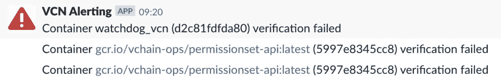
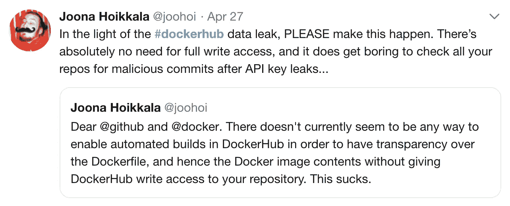

# 保护自己免受最近的 dockerhub.com 袭击

> 原文：<https://itnext.io/protect-yourself-from-the-recent-dockerhub-com-attack-f881b8e84694?source=collection_archive---------5----------------------->


上周的[**dockerhub.com 攻击**](https://news.ycombinator.com/item?id=19763413) 影响了数十万个账户，并将其容器暴露给恶意代码。在[code 公证人](https://www.codenotary.io)，我们也发布开源软件，并希望确保我们的容器图像不受影响。

它是这样工作的:

# 验证集装箱的真实性和完整性

1.  在[**code 公证人. io**](https://www.codenotary.io/?utm_source=vchain&utm_medium=blog&utm_campaign=protect.yourself.from.the.recent.dockerhub.com.attack) 上创建一个**免费**账号，保护文件的完整性和原始性
2.  签署你的 Docker 容器映像的本地副本你知道它是好的
    **vcn 签署 docker://hello-world**
3.  在另一个(推荐:蜜罐或隔离)系统
    **上从[dockerhub.com](http://dockerhub.com/)下载容器镜像**
4.  确保您从[dockerhub.com](http://dockerhub.com/)提取的容器图像已经用 code 公证人签名:
    **vcn 验证 docker://hello-world**

你可以在这里找到完整的命令行演示来保护 golang 容器图像:[https://asciinema.org/a/243863](https://asciinema.org/a/243863)

如果输出显示可信的以及您期望的资产信息，您可以确定容器图像是原始的:

```
vcn v docker://zerotrust/parity 
Asset: docker://7d2d42157acdabf4ae46a4815af9037179c871a3b20df628c997af5d452bd7ff 
Hash: 7d2d42157acdabf4ae46a4815af9037179c871a3b20df628c997af5d452bd7ff Date: 2019–05–01 14:00:35 +0000 UTC 
Key: 0x2a4d3071a9d12e3886d43890d0dbaa8be60febec 
Name: docker://7d2d42157acdabf4ae46a4815af9037179c871a3b20df628c997af5d452bd7ff 
Size: 270 MB 
Company: vChain, Inc. 
Website: https://www.vchain.us 
Level: 2 — SOCIAL_VERIFIED 
Status: TRUSTED
```

# 这是怎么回事？

当运行 vcn 命令来签署任何文件、容器图像或文档时，除了文件和身份信息之外，还会生成唯一的散列，并存储在由独立财团( [ZTC](https://www.zerotrustconsortium.org) )运行的分布式分类账上。

当散列出现在分布式分类账上时，没有人能够再改变该信息，每个人都可以验证其完整性。

您可以作为所有者或用户对文件或容器图像进行签名。作为一个**所有者(开发者或发行者)**保护你的用户免受所谓的恶意克隆或者作为一个比普通校验和(MD5，SHA-1，SHA-256 aso)先进得多的解决方案是有意义的。).作为**用户(团队或公司)**，您可以确保只有软件或映像可以运行，它们是可验证的并且已经过您的签名。这样，您几乎消除了运行不需要的软件的风险。

与用于签署文件的数字证书不同，code 公证人方法根本不改变文件，并且不与文件本身一起传播。这样，每个人都可以从世界各地验证文件，只需运行 vcn verify 或使用[code 公证人 Chrome 浏览器扩展](https://chrome.google.com/webstore/detail/vchain-codenotary-downloa/mnloemedehacppeggbipipjlphdjpjcb?hl=en)。

**作为发布者或用户，您可以简单地取消对您的文件、图像、软件等的信任或更新。任何人都可以随时验证和检查状态变化。几乎是你能找到的最灵活和最好的保护。**

回到 docker 容器映像的话题，当你签署你信任的本地版本时，dockerhub.com 发生了什么以及它是否被黑客攻击都无关紧要。现在，世界上的每个人都可以在 Docker Hub 上下载容器图像，并根据 code 公证人服务进行验证。如果不能验证提取的容器映像，就不要运行它。

# 使用 vcn-watchdog 实现连续的容器完整性监控

为了实现近乎防弹的保护，您可以在您的 docker 主机上运行我们的 sidecar 方法，以确保您在无法验证的容器运行或图像被提取时得到警报。由于您可以对所有想要运行的容器映像进行签名，因此您可以完全保护自己，并使用 code 公证人作为服务将容器列入白名单。

我们在 GitHub 上作为开源项目发布的 sidecar **vcn-watchdog** ，不断保护不受不需要的、受感染的 Docker 容器映像的攻击。

与 Docker 集成，看门狗不断检查其已知的， [**公证**](https://www.codenotary.io) 【签名图像】容器的完整性。如果一个容器没有通过验证检查，就会发送一个警报，在我们的例子中，就是我们的 Slack 通道。

这是您快速启用容器连续完整性监控的方法:

1.  用 your 公证人签名您本地存储的容器:
    **vcn 签名 docker://ImageId**
2.  在你的服务器上检查一下 https://github.com/vchain-us/vcn-watchdog。该工具不断验证你的容器的完整性:
    **git 克隆**[**https://github.com/vchain-us/vcn-watchdog.git**](https://github.com/vchain-us/vcn-watchdog.git)
3.  编辑`verify`文件并设置您正在使用的警报/监控工具(参见以下说明)
4.  确保 **/var/run/docker.sock** 可以访问，这样边车集装箱就可以访问集装箱图像进行验证
5.  在您的服务器上使用以下命令启动容器
    **docker-compose build&&docker-compose up**

要修改`verify`文件，将您的警报工具连接到 err()函数。如果您像我们一样使用 Slack，请执行以下操作:

1.  创建一个 Slack Bot(Slack documentation[**此处**](https://get.slack.help/hc/en-us/articles/115005265703-Create-a-bot-for-your-workspace) )
2.  使用以下代码:

```
function err() { echo "Container ${1} (${2}) verification failed" >&2 curl -q -X POST \ 
-H 'Content-type: application/json' \ 
- data "{\"text\":\"Container ${1} (${2}) verification failed\"}" \
"[https://hooks.slack.com/services/$TOKEN/$KEY](https://hooks.slack.com/services/$TOKEN/$KEY)" > /dev/null 2>&1}
```

设置完成后，如果验证失败，您将在 Slack Bot 通知中看到以下消息:



**如果您没有看到警告消息，您的容器已经过验证，是安全的。**

如果你喜欢让你的生活变得复杂，并且每次怀疑自己被黑客攻击时都要执行 13 个耗时的手动步骤，那么 [**Madhuakula**](https://blog.madhuakula.com/some-tips-to-review-docker-hub-hack-of-190k-accounts-addcd602aade) 为喜欢这条路线的程序员概述了一个分步指南。然而，正如 Joona Hoikkala 最近在推特上说的那样，大多数人并不这么认为。



立即开始使用 vcn-watchdog，创建您的**免费** [**公证**](https://www.codenotary.io/?utm_source=vchain&utm_medium=blog&utm_campaign=protect.yourself.from.the.recent.dockerhub.com.attack) 账户:

*原载于 2019 年 5 月 1 日*[*https://www . vchain . us*](https://www.vchain.us/protect-yourself-from-the-recent-dockerhub-com-attack/)*。*