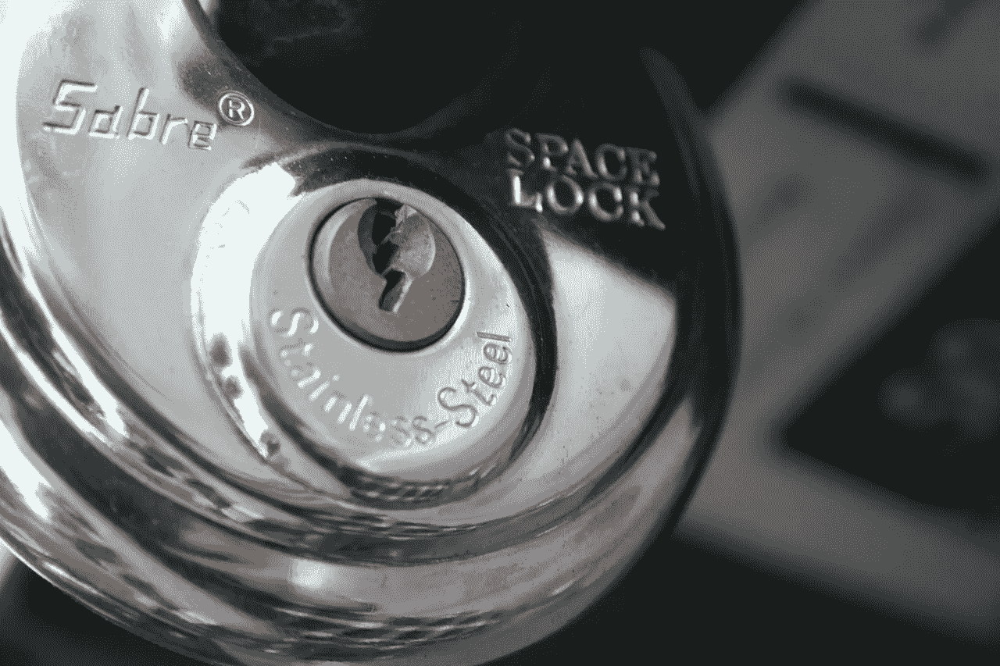

# 受保护的只读 Postgres 模式

> 原文：<https://itnext.io/protected-view-only-postgres-schemas-60635e4fe01d?source=collection_archive---------10----------------------->



军刀钟

希望你在这场健康危机中一切都好。记得保持安全，如果可能的话呆在家里。

您是否曾经需要给*一些*对数据库的访问权限，比如说*选择*对某些表的访问权限，但是还要记录用户执行了哪些查询？
我们不久前就有这个要求。前两个部分很容易实现:

1.  ***一些权限*** :创建一个新的使用角色，同时只有选择权限。
2.  ***访问部分表格*** :创建所需表格的视图

记录执行的查询并不那么简单，因为在一个 *SELECT* 查询上没有触发器。

# 肮脏的把戏

所以我们需要记录执行了哪些查询。我们可能需要一个新表，可能在另一个模式上，还需要一个 *Postgres* 函数在日志表上插入一条记录。

## 桌子

经典结构:

*   ***id*** :序列号，主键
*   ***用户*** : varchar，执行查询的数据库用户
*   ***sql*** :文本，查询本身
*   ***ip*** : varchar，用户连接的 ip
*   ***executed_at*** :时间戳，查询执行的完整日期。

顺便说一下，在创建数据库对象时，一个好主意是包含一些关于每个列用途的注释(如果是表的话)。可能会有一些额外的工作，但每个人都会感谢。

```
CREATE TABLE public.query_log (
  id serial NOT NULL,
  "user" varchar(150) NULL,
  "sql" text NULL,
  ip varchar(25) NULL,
  executed_at timestamp NULL DEFAULT NOW(),
  CONSTRAINT query_log_pkey PRIMARY KEY (id)
);
```

表 *query_log* 将在 *public* 模式上创建，您可能希望也可能不希望更改，这取决于您自己的需要。

## 该功能

它基本上是一个简单的插入，但是你需要它作为一个函数，这样你就可以完成这个任务。

```
-- DROP FUNCTION public.log_query_information;
CREATE OR REPLACE FUNCTION public.log_query_information(quser character varying, qsql text, qip character varying)
 RETURNS boolean
 LANGUAGE plpgsql
AS $function$
BEGIN  
 INSERT INTO public.query_log
  ("user", "sql", ip)
  VALUES(quser, qsql, qip) ON CONFLICT DO NOTHING;
 RETURN TRUE;
END;
$function$
;
```

对*下拉*进行注释，以防您稍后需要删除该功能。

这里有两件重要的事情。首先*返回 true，*因为这个函数必须返回一些东西 *(* 记住*，这个窍门)。*其次*在冲突上什么都不做，*这是为了避免*【休斯顿我们有问题】*的实例*。*

我建议在生产环境中尝试之前，在您机器上的 *Postgres* 安装上或者在 *docker* 上运行的 *Postgres* 服务器上进行本地测试。就我个人而言*避免复制&粘贴任务*我有意跳过重要的部分，以确保你阅读并理解整篇文章。

如您所见，表和函数都是在*公共*模式上创建的。它可能是另一个模式，但是我建议使用一个与您将要为视图创建的新模式不同的模式，视图模式是用于视图的。

## 模式和角色

新的模式必须包含您希望授予视图访问权限的表的所有视图。
跳过一些其他的额外功能，新的用户角色必须拥有对表的 *SELECT* 特权(在视图模式之外)和对 *query_log* 表的 *INSERT* 特权。

```
-- Create the new schema, grant authorization to 
-- postgres user (change if needed)
CREATE SCHEMA "restricted_schema" AUTHORIZATION postgres;-- Create new role
CREATE ROLE restricted_user NOSUPERUSER NOCREATEDB NOCREATEROLE NOINHERIT LOGIN PASSWORD 'restricted_USER_passsword';-- Grant SELECT access to original tables on internal schema
-- Will use schema: internal and table: company_users as example
GRANT SELECT ON TABLE internal.company_users TO restricted_user;-- Grant INSERT on query_log and allow operations on sequence
GRANT INSERT ON TABLE public.query_log TO restricted_user;
GRANT ON SEQUENCE public.query_log_id
GRANT USAGE, SELECT ON SEQUENCE public.query_log_id_seq TO restricted_user;-- Allows the user to access the restricted schema
GRANT USAGE ON SCHEMA restricted_schema TO restricted_user;-- Removes all other permissions to the restricted user
REVOKE ALL ON ALL TABLES IN SCHEMA  pg_catalog FROM restricted_user;   
REVOKE ALL PRIVILEGES ON TABLE pg_catalog.pg_proc FROM restricted_user;
REVOKE ALL PRIVILEGES ON TABLE pg_views FROM restricted_user;
REVOKE SELECT ON TABLE pg_proc FROM restricted_user;
REVOKE SELECT ON TABLE pg_views FROM restricted_user;-- Allow the execution of the function
GRANT EXECUTE ON FUNCTION public.log_query_information("varchar","text","varchar") TO restricted_user;
```

## 景色

这里有一个技巧，您将像往常一样创建一个视图，但是从您的"*视图选择*的最后一列将调用*public . log _ query _ information*函数(这就是我们需要*返回 true* for 的原因)。

```
-- DROP VIEW restricted_schema.company_users;
CREATE OR REPLACE VIEW restricted_schema.company_users
AS SELECT 
    pp.id,
    pp.code,
    pp.name,
    pp.last_name,
    pp.soc_sec_number,
    pp.created_at,
    pp.updated_at,
    pp.deleted_at,
    pp.company_id
from (SELECT p.id,
    p.code,
    p.name,
    p.last_name,
    p.soc_sec_number,
    p.created_at,
    p.updated_at,
    p.deleted_at,
    p.company_id,
    public.log_query_information(current_user::varchar, current_query(), inet_server_addr()::varchar) 
   FROM internal.company_users p
     LEFT JOIN internal.company cc ON cc.id = p.company_id AND cc.id = 123) AS pp;
```

因此，我们的视图只对带有 *company_id=123* 的记录进行选择。您还应该注意到一个别名为 *pp* 的子查询，这只是为了保持视图中的 *SELECT ** 干净，没有奇怪的*函数*到处调用。

***诀窍*** :视图返回所有请求的信息，但是在每条记录上，它还会在我们的 *public.query_log 表*上插入一条新记录。继续，试一试…

看到这里的问题了吗？再看一遍…这还没有结束。假设你有 50000 名公司用户。由于*视图*内的*选择*会对每条记录执行*功能*，您的*插入*也会被执行那么多次。一个**单个**查询的 *query_log* 记录太多。不好…

***如何解决这个*** :还记得*上冲突什么都不做*吗？这就是我说的休斯顿。
一些你如何需要确保每个查询只插入一个日志查询记录。为此，我们得到了一些独特的指标*。
只需在所有*列上创建一个新的*索引*当任何*选择*而不是*视图*被执行时，你看到的*就会重复。*

*那就是:*

```
*CREATE UNIQUE INDEX query_log_unique_records ON public.query_log ("user","sql",ip,executed_at);*
```

*这应该适用于大多数情况，因为对于单个查询， ***用户*** 、 ***sql*** 查询、连接 ***ip*** 和 ***executed_at*** 时间戳应该是相同的。*

*和往常一样，您的收获可能会有所不同，但是这应该会让您对如何使用查询日志创建一个仅查看模式有一个很好的想法。如果您需要某种“*选择触发器*”解决方法，它也可以帮助您。*