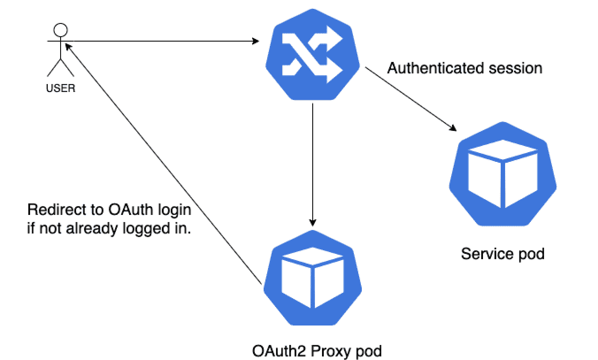
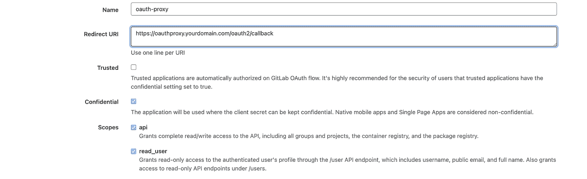
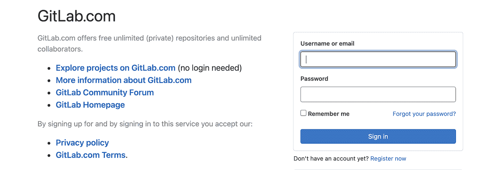

# 用 Gitlab 和 OAauth2 代理保护 Kubernetes 不安全的端点。

> 原文：<https://itnext.io/protecting-kubernetes-insecure-endpoints-with-gitlab-and-oaauth2-proxy-64c1b73996ef?source=collection_archive---------3----------------------->


最近，我一直致力于 OAuth 流的实现。我有点惊讶/恼火，这样一个相对简单的任务怎么能轻易地花去一整天。有相当模糊的文档和一些 OAauth 2 代理的 docker 图像“不工作”。不应该这么费时间。这就是为什么，对于可能面临同样情况的人，我将提供一个明确的实现指南。我会尽量缩短它。:)

警告！不要用这个例子[https://kubernetes . github . io/ingress-nginx/examples/auth/oauth-external-auth/](https://kubernetes.github.io/ingress-nginx/examples/auth/oauth-external-auth/)。

该流描述了一个服务使用两个入口对象。我们不需要这个。

这种方法只会将您绑定到一个服务。同时，我们希望为任何服务构建一个集中部署。

我们有什么？

*   K8s 默认情况下不支持 oauth 的不安全端点。(在我的情况下，kibana 的 k8s 入口)
*   Gitlab 作为 oauth 提供者
*   oauth 2-代理 https://github.com/oauth2-proxy/oauth2-proxy(一个反向代理和静态文件服务器，为众多提供者提供身份验证)

**流量:**



**第一步。)为 oauth 代理创建 Gitlab 应用程序**

在 Gitlab 中创建应用程序。(管理部分— ->应用程序)



Gitlab 将为您提供 ClientID 和一个我们稍后会用到的秘密。

生成 cookie 密码:

> python -c '导入 os，base64' print base64 . b 64 encode(OS . urandom(16))'

**第二步。)配置舵图。**

```
**Step 3.) Deploy**helm repo add oauth2-proxy https://oauth2-proxy.github.io/manifestshelm repo updatehelm install oauth2-proxy oauth2-proxy/oauth2-proxy -f oauth2-values.yaml 
```

**第四步。)保护您的服务。**

kibana-ingress.yaml:

```
kubectl create -f kibana-ingress.yaml
```

**第五步。享受吧。**

尝试在浏览器中输入 kibana.yourdomain.com。你应该看到 Gitlab 认证页面。



**警告:**

有时，您会得到一个与 OAuth2 代理无法创建或加载 cookie 会话相关的错误。不要惊慌。只需尝试另一个 quay.io/oauth2-proxy/oauth2-proxy"图像标签。那是一个内部错误。有一个 golang 补丁修复了这个东西，但这是一个不同的仙女尾巴:)