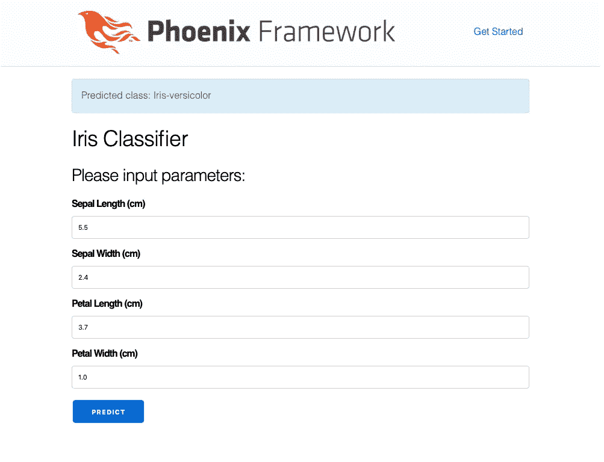

# 在 Elixir/Phoenix 和 Python 之间传递数据的协议缓冲区

> 原文：<https://itnext.io/protocol-buffers-to-pass-data-between-elixir-phoenix-and-python-89191abe84e1?source=collection_archive---------1----------------------->

这篇文章是我之前的一篇文章的扩展，标题是“使用来自 Phoenix (Elixir)应用程序 的经过 Python 训练的机器学习模型”。在我的上一篇文章中，我展示了如何使用 [ErlPort](http://erlport.org) 从 Elixir 应用程序中使用 python 训练的机器学习模型。然而，从 Phoenix (Elixir)应用程序传递的使用 Python 代码进行预测的模型参数是一个简单的列表数据类型，并且它受 ErlPort 的内置数据类型映射的支持。

然而，对于复杂的数据，我们需要一些机制来序列化/反序列化数据。在本文中，我将扩展我以前的项目，使用“**协议缓冲区**”来完成数据序列化/反序列化。

# 什么是协议缓冲区？

由 Google 发明—“*协议缓冲区是 Google 的语言中立、平台中立、可扩展的机制，用于序列化结构化数据—想想 XML，但是更小、更快、更简单。您只需定义一次数据的结构化方式，然后就可以使用专门生成的源代码，使用各种语言轻松地将结构化数据写入各种数据流或从中读取数据*。(src:[https://developers.google.com/protocol-buffers/](https://developers.google.com/protocol-buffers/)

Google 在其网站上为协议缓冲区提供了可扩展的文档，在这里可以找到支持的语言的开发人员指南和代码示例以及教程—[*https://developers . Google . com/protocol-buffers/docs/overview*](https://developers.google.com/protocol-buffers/docs/overview)

# 它是如何工作的？

协议缓冲区的工作方式非常简单。我们需要写一个**。定义消息格式的 proto** 文件。这个。协议编译器(**protocol**)编译 proto 文件，生成所需语言的代码。

> 。proto→proto 编译器→生成的语言代码

在本文中，我们将把数据从 Elixir 代码传递给 Python。所以我们需要使用**协议**编译器为 Elixir 和 Python 生成代码。Python 支持已经内置于编译器中。但是对于药剂部分，我们将使用**protobuf-Elixir**([](https://github.com/tony612/protobuf-elixir)*)这是协议缓冲区的纯药剂实现。*

# *安装 Protobuf*

*首先我们需要安装协议缓冲编译器。我们可以在 Mac 上使用自制软件([*https://formulae.brew.sh/formula/protobuf*](https://formulae.brew.sh/formula/protobuf))通过下面的命令来完成这个任务*

> *brew 安装 protobuf*

# *凤凰(仙丹)部分*

## *修改 mix.exs 并添加依赖项:*

```
*defp deps do
    [
      {:phoenix, "~> 1.4.0"},
      {:phoenix_pubsub, "~> 1.1"},
      {:phoenix_html, "~> 2.11"},
      {:phoenix_live_reload, "~> 1.2", only: :dev},
      {:gettext, "~> 0.11"},
      {:jason, "~> 1.0"},
      {:plug_cowboy, "~> 2.0"},
      {:erlport, "~> 0.10.0"},
      **{:protobuf, "~> 0.5.3"},
      # Only for files generated from Google's protos.
      # Can be ignored if you don't use Google's protos.
      {:google_protos, "~> 0.1"}**
    ]
  end*
```

*我们需要在 mix.exs 文件中添加粗体部分，并使用以下命令更新依赖关系—*

> *混合 deps.get*

## ***安装协议插件:***

*我们需要使用下面的命令为药剂安装协议插件**协议-生成-药剂***

> *mix escript.install hex protobuf*

## *注意:`protoc-gen-elixir` 需要在 PATH 中。*

## ***定义消息(。原型文件):***

*我们放置了我们的**。在***lib/phoenix _ ml/proto buf***文件夹下的 proto** 文件和生成的代码。我们的消息定义文件 **iris.proto** 如下所示*

```
*syntax = "proto3";

package PhoenixMl;

message IrisParams {
    float sepal_length = 1;
    float sepal_width = 2;
    float petal_length = 3;
    float petal_width = 4;
}*
```

*我们将使用 **proto3** 语法，这里详细介绍—*[*https://developers.google.com/protocol-buffers/docs/proto3*](https://developers.google.com/protocol-buffers/docs/proto3)**

**基本上，我们的消息格式很简单，包含四个用于模型参数的浮点值— **sepal_length，sepal_width，petal_length，petal_width** 。**

## ****编译。原型文件并生成药剂代码:****

**我们将使用下面的命令从上面的**生成仙丹代码。原型**文件—**

> **protocol-elixir _ out =。iris.proto(从 lib/phoenix_ml/protobuf 文件夹中运行)**

**这将生成 **iris.pb.ex** 文件。**

## ****更新源代码:****

**接下来，我们将使用以下代码更新 **page_controller.ex** 文件(已编辑)—**

```
****alias PhoenixMl.IrisParams, as: Iris**......with {sepal_length, _} <- Float.parse(sepal_length),
         {sepal_width, _} <- Float.parse(sepal_width),
         {petal_length, _} <- Float.parse(petal_length),
         {petal_width, _} <- Float.parse(petal_width) do
      **iris_params = %Iris{
        sepal_length: sepal_length,
        sepal_width: sepal_width,
        petal_length: petal_length,
        petal_width: petal_width
      }**

class = ML.predict([**Iris.encode(iris_params)**])**
```

**粗体部分是必要的代码更改。这里我们—**

*   **导入的 **PohenixMl。虹膜参数**模块为**虹膜****
*   **用参数定义了 **%Iris{}** 结构**
*   **调用 **Iris.encode** 生成序列化数据**

# **Python 部分**

## **编译。原型文件并生成 Python 代码:**

**我们将使用下面的命令从上面生成 Python 代码。原型文件—**

> **protocol-python _ out =。iris.proto(从 lib/phoenix_ml/protobuf 文件夹中运行)**

**这将生成 **iris_pb2.py** 文件。**

## **更新源代码:**

**接下来，我们将用下面的代码更新**分类器. py** 文件(已编辑)—**

```
**import os
from sklearn.externals import joblib 
**import sys
sys.path.insert(0, 'lib/phoenix_ml/protobuf')** 
**import iris_pb2**

def load_model():
    path = os.path.abspath('lib/phoenix_ml/model/classifier.pkl')
    return joblib.load(path)  

def predict_model(args):
   ** iris_params = iris_pb2.IrisParams()
    iris_params.ParseFromString(args)
    model_params = [[iris_params.sepal_length, iris_params.sepal_width, iris_params.petal_length, iris_params.petal_width]]**

    iris_classifier = load_model()
    return iris_classifier.predict(**model_params**)[0]**
```

**粗体部分是必要的代码更改。这里我们—**

*   **导入生成的 **iris_pb2** 模块**
*   **反序列化我们从 Elixir app 收到的**args**—**ParseFromString(args)**并定义一个二维数组 **model_params****
*   **用**模型参数**进行预测**

**在这个阶段，我们的更改已经完成，我们应该能够像之前一样进行预测，如下图所示——**

****

# **源代码**

**早期项目的源代码可以在这里找到——[*https://github . com/imeraj/Phoenix _ Playground/tree/master/1.4/Phoenix _ ml*](https://github.com/imeraj/Phoenix_Playground/tree/master/1.4/phoenix_ml)(***master branch***)**

**使用协议缓冲区的更新源代码可以在这里找到—[*https://github . com/imeraj/Phoenix _ Playground/tree/proto buf _ file/1.4/Phoenix _ ml*](https://github.com/imeraj/Phoenix_Playground/tree/protobuf_file/1.4/phoenix_ml)(***proto buf _ file branch***)**

# **参考**

1.  **[https://developers.google.com/protocol-buffers/](https://developers.google.com/protocol-buffers/)**
2.  **[https://it next . io/using-machine-learning-models-python-from-phoenix-elixir-applications-CD 028 E4 e 5 f 01](/using-machine-learning-models-python-from-phoenix-elixir-applications-cd028e4e5f01)**

**3.[https://github.com/tony612/protobuf-elixir](https://github.com/tony612/protobuf-elixir)**

**我希望这篇文章能够帮助一些读者理解如何使用协议缓冲区来序列化和反序列化数据，并在 Elixir 和 Python 之间传递以构建有用的应用程序。**

***更多详细和深入的未来技术帖子，请关注我这里或上*[*Twitter*](https://twitter.com/meraj_enigma)*。***