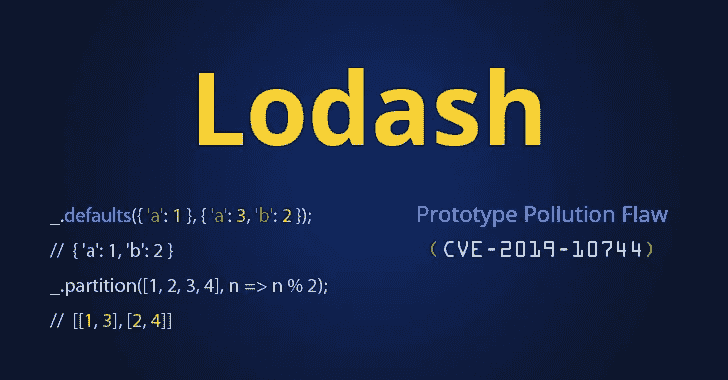
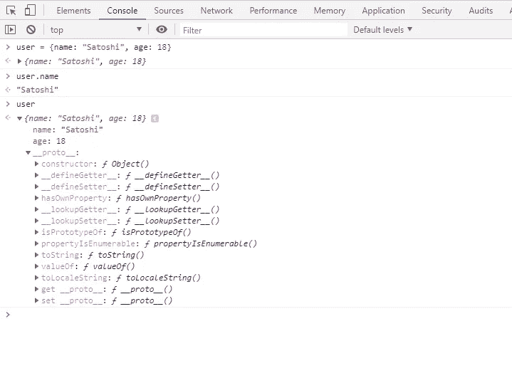

# 对 NodeJS 应用程序的原型污染攻击

> 原文：<https://itnext.io/prototype-pollution-attack-on-nodejs-applications-94a8582373e7?source=collection_archive---------0----------------------->

## 原型污染攻击是 Javascript 中对对象原型的一种攻击形式，会导致逻辑错误，有时会导致在系统上执行片段任意代码。



资料来源:https://thehackernews.com

原型污染攻击(Prototype Pollution attack)(顾名思义部分)是 Javascript 中对对象原型的一种攻击形式(添加/修改/删除属性)，导致逻辑错误，有时会导致在系统上执行片段任意代码(远程代码执行——RCE)。自 2018 年以来，在一些流行的 JavaScript 库 JQuery 中发现了该漏洞，最近在流行库之一的 Lodash 库中发现了该漏洞。让我们看看这种形式的攻击。

# Javascript 中的对象

首先，我们需要了解 javascript 中的`Object`。对象只是键和值对的集合，通常称为对象的属性。例如:



使用{}有助于我们声明一个新对象，并为它分配相应的名称和年龄属性。声明完成后，我们可以像往常一样访问这些属性。然而，用户对象的内部不仅有我们已经分配的属性，还有许多其他信息，如上所述。那么这些属性从何而来呢？

在 Javascript 中，`Object`是一个基本对象，是所有新建对象的模板。通过将`null`传递给`Object.create`，可以创建一个空对象。但是，新创建的对象也将具有与传递的参数相对应的类型，并继承所有基本属性。

```
console.log(Object.create(null)); // prints an empty object
```

# Javascript 中的函数/类

在 javascript 中，类和函数的概念是相互关联的(函数本身充当类的构造函数，实际的性质在 Javascript 中没有“类”的概念)。让我们看下面的例子:

在上面的例子中，我们定义了一个名为`person`的函数，并初始化了两个名为`person1`和`person2`的对象。如果我们查看新创建的对象的属性，我们可能会注意到两件事:

*   创建函数时，javascript 引擎在函数中包含了`prototype`属性。`prototype`一个对象是否有一个构造函数属性指向包含它的函数？
*   当创建对象时，javascript 引擎向新创建的对象添加一个`__proto__`属性，该属性引用构造函数的原型对象。简而言之，`object.__proto__`指向`function.prototype`。

# **建造师**

`Constructor`是一个特殊属性，它返回用于创建该对象的函数。对象`prototype`有一个指向该函数的构造函数，而构造函数的构造函数将是全局构造函数。例如:

# JavaScript 中的原型

需要注意的一点是，在执行代码时，可以更改/修改/删除原型属性。例如:

上面，我们改变了函数的原型，增加了一个新的属性`details`。我们可以通过使用对象来做同样的事情:

你看到什么奇怪的东西了吗？我们改变了`person1`，但它也影响了`person2`。原因是在前面的例子中，我们改变了`person.prototype`来添加一个新的属性，但是在第二个例子中，我们改变了一个对象。因为构造函数会返回用来创建对象的函数，`person1.constructor`会引用函数`person`，`person1.constructor.prototype`现在是`person.prototype`。

# 原型污染

比如`obj[a][b] = value`。如果攻击者可以控制`a`和`value`的值，那么他只需要将`a`的值调整为`__proto__`(在 javascript 中，`obj["__proto__"]`和`obj.__proto__`是完全等价的)那么应用程序中所有现有对象的属性`b`都会被赋给`value`。

然而，攻击并不像上一个那么简单，根据[论文](https://github.com/HoLyVieR/prototype-pollution-nsec18/blob/master/paper/JavaScript_prototype_pollution_attack_in_NodeJS.pdf)，我们只有在满足以下三个条件之一时才能攻击:

*   执行递归合并
*   按路径定义属性
*   克隆对象

让我们来看看一些错误:

# CVE-2019–11358:通过 jQuery $进行原型污染攻击。扩展

$ .如果处理不当，extend 会改变对象`prototype`(应用程序中对象的模板)的属性。该属性将出现在所有对象上。注意，只有$的“深度”版本(即 g)。extened 受到影响。

程序员经常使用这个函数来复制一个对象或者从一个默认对象中填充新的属性。例如:

我们可以想象`myObject`是来自用户的输入字段，并被序列化到 DB 中)

在这段代码中，我们经常想，在运行时会把属性`isAdmin`赋给新创建的对象。但本质上是直接分配给`{}`然后`{}.isAdmin`会是`true`。如果在这段代码之后，我们执行以下检查:

```
If (user.isAdmin === true) {
    // do something for admin
}
```

如果用户尚未存在(`undefined`)，将在属性`isAdmin`的父对象中搜索该属性，父对象是上面添加了值`true` 的对象`isAdmin`。

在 JQuery 3.3.1 上执行的另一个例子是:

```
$.extend(true, {}, JSON.parse('{"__proto__": {"devMode": true}}'))
console.log({}.devMode); // true
```

这些错误会影响很多 Javascript 项目，尤其是 NodeJS 项目，最实际的例子就是 2018 年 12 月帮助操作 MongoDB 的 JS 库 Mongoose 中的错误。

# CVE-2018–3721，CVE-2019–10744:通过洛达什的原型污染攻击

[Lodash](https://www.npmjs.com/package/lodash) 也是一个知名的库，它提供了很多不同的功能，帮助我们更方便、更整洁地编写代码，每周下载量超过 1900 万次。它遇到了和 JQuery 一样的问题。

**CVE-2018–3721**

**CVE-2019–10744**

这个 bug 影响 Lodash 的所有版本，已经在 4.17.11 版本中修复。

# 我能做些什么来预防？

*   用 Object.freeze (Object.prototype)冻结属性
*   根据应用程序的模式对 JSON 输入执行验证
*   避免以不安全的方式使用递归合并函数
*   使用没有原型属性的对象，例如`Object.create(null)`，以避免影响原型链
*   使用`Map`代替`Object`
*   定期更新库的新补丁