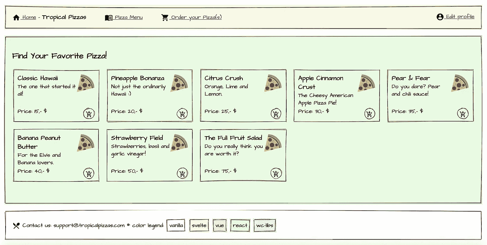

# 简单的微前端

> 原文：<https://itnext.io/prototyping-micro-frontends-d03397c5f770?source=collection_archive---------1----------------------->

> 带有 React、Vue、Svelte 和 Web 组件的原型



几年前第一次读到微前端时，我认为这是一个有趣的概念，但不是很实用。即使这个想法很好，建议的实现看起来也很蹩脚。但是也许有办法让它工作？这个原型以一种可行的方式探索了这样做的一些想法:

*   原型 app:【https://microfrontends.kjartanm.vercel.app/ 
*   回购:【https://github.com/kjartanm/microfrontends 

## 警告

*   这是一个原型，所以没有漂亮的抽象或优化。
*   它使用模块的动态导入，这还不能在 Edge 中工作——但是正在实现中。它在其他地方应该很管用。
*   我也没有试图让手机变得友好，因为这不是实验的一部分。但是没有理由不让它在小屏幕上工作得很好。
*   该应用程序只是一个创建不同路线和视图的愚蠢借口，因此在创建良好的用户流方面几乎没有努力。

# 背景

我不会在这里说太多关于微前端的事情，我会假设对这个概念有一些熟悉。martinfowler.com 的微前端是一个很好的介绍。对我来说，微前端的主要特点是它们与微服务相关，并且:

> [微服务]是一种将单个应用程序开发为一套小型服务的方法，每个应用程序都在自己的进程中运行，并通过轻量级机制(通常是 HTTP 资源 API)进行通信。这些服务是围绕业务功能构建的，可由全自动部署机器独立部署。这些服务可以用不同的编程语言编写，并使用不同的数据存储技术，只有最低限度的集中管理。[https://martinfowler.com/articles/microservices.html](https://martinfowler.com/articles/microservices.html)

微前端是一种在前端做同样事情的策略。围绕业务功能或领域安排的分离模块。微前端的优点和缺点与微服务的优点和缺点重叠。但是微前端有一个额外的硬约束，因为它们是面向消费者的，因此，移动到微前端不会对 UX 产生负面影响。

关于在前端混合不同框架的想法已经说了很多，但这本身并不是使用微前端的目的。由于系统内模块硬解耦的限制，使用不同的技术是可能的，模块通过轻量级协议进行通信，与所选择的应用技术无关。要点是，即使服务是用相同的技术制作的，您也不应该简化模块之间的解耦和通信的约束。但是，当然，还有其他原因不能混合到许多技术中。

# 方法

原型被组织为一组前端模块，这些模块通过充当网关/引导应用的家庭应用来启动和呈现。目前，原型加载了由[苗条](https://svelte.dev)、[反应](https://reactjs.org/)、 [Vue](https://vuejs.org) 制成的模块和一个由非常小的 web 组件库( [lighterhtml](https://github.com/WebReflection/lighterhtml) 、[闹鬼](https://github.com/matthewp/haunted))制成的模块。UI 是在 [wiredjs](https://wiredjs.com/) 的帮助下制作的。不同的框架在原型中用不同的颜色背景标记，以突出不同的框架。页脚有一个颜色图例。

这个 home-app 非常轻量级，基于简单的框架 html，一些普通的 js，和一个小的路由器库([https://vaadin.github.io/vaadin-router/vaadin-router/](https://vaadin.github.io/vaadin-router/vaadin-router/))。home-app 还负责提供全球风格和资产。

每个前端模块遵循相同的模式，独立于所讨论的框架:

*   使用 Rollup 将该模块捆绑为一个 ES 模块。这是 Vue 模块的内容:

```
export default {
    input: 'src/index.js',
    output: {
        file: 'public/order.app.js',
        format: 'esm'
    },
    plugins: [
        stopDynamicImport (),
        replace({
            "process.env.NODE_ENV": "'production'"
        }),
        resolve({
            alias: {
                'vue$': 'vue/dist/vue.esm.js',
                'vuex$': 'vuex/dist/vuex.esm.js'
            },
            extensions: ['*', '.js', '.vue', '.json']
        }),
        vue(),
        commonjs(),
        terser(),
    ]
}
```

*   它导出一个通用的渲染器函数，作为不同框架 DOM-renderer/bootstrapping 函数的简化接口。对于 React 模块，它看起来像这样:

```
export const ReactApp = (el) => ReactDOM.render(App(), el);
```

*   对于苗条模块，它看起来像这样:

```
export const SvelteApp = (el) => new App({ target: el });
```

*   Vue 模块:

```
export const VueApp = (el) => {
    const App = new Vue({
        template: '<OrderPizza/>',
        components: { OrderPizza },
        store
    })
    App.$mount(el);
}
```

*   通过动态或静态导入，模块作为自定义元素定义的一部分被导入到 home 应用程序中。动态地这样做可以让模块在定制元素被添加到 DOM 时被延迟加载。可以添加一些 intersectionobserver-handling 来使延迟加载更加智能。下面是动态加载的 React 模块:

```
class PizzaMenu extends HTMLElement {
   connectedCallback() {
       const root = document.createElement('section');
       root.classList.add('react-module');
       this.appendChild(root);
       import('./modules/pizzamenu')
            .then((module) => {
                module.ReactApp(root);
            });
    }
}
customElements.define('x-pizzamenu', PizzaMenu);
```

*   静态加载标题模块(细长前端的一部分):

```
import { SvelteHeader } from './modules/header';
class HeaderModule extends HTMLElement {
    connectedCallback() {
        const root = document.createElement('div');
        root.classList.add('svelte-module');
        this.appendChild(root);
        SvelteHeader(root);
    }
}
customElements.define('x-header', HeaderModule);
```

*   当自定义元素被添加到 DOM 中时，它会加载并在屏幕上呈现模块。
*   在原型中，加载模块的定制元素，除了来自头部的，都由路由器添加到 DOM 中。一些路线受到保护:

```
const mainOutlet = document.querySelector('main');
const router = new Router(mainOutlet);
let hascustomerid = null;
const paths = {
    '/pizzamenu': 'x-pizzamenu',
    '/orderpizza': 'x-orderpizza',
    '/profile': 'x-profile',
}const guardPath = (context, commands) => {
    if (hascustomerid !== null) {
        return commands.component(paths[context.path]);
    }else{
        return commands.redirect('/')
    }
};router.setRoutes([
    { path: '/', component: 'x-login' },
    { path: '/pizzamenu', action: guardPath },
    { path: '/orderpizza', action: guardPath },
    { path: '/profile', action: guardPath }
]);onKernelKey('change:customerid', customerid => {
    if (customerid != null) {
        hascustomerid = customerid;
        Router.go('/pizzamenu');
    }
});
```

*   这些模块使用一个*内核*(一个从领域驱动设计中借用的概念)进行通信并共享一些状态，这也是一个可以动态加载的模块。

> “[共享内核]指定两个团队同意共享的领域模型的某个子集。当然，除了模型的这个子集，这还包括与模型的那个部分相关联的代码或数据库设计的子集。这种明确共享的东西具有特殊的地位，不应该在没有与其他团队协商的情况下进行更改。”(Evans，领域驱动设计:解决软件核心的复杂性，[第 354 页](https://books.google.no/books?id=hHBf4YxMnWMC&pg=PA354&lpg=PA354&dq=Designate+some+subset+of+the+domain+model+that+the+two+teams+agree+to+share.&source=bl&ots=4AWKMTnD-i&sig=ACfU3U3o1KL_xZovlxLdmjbWukrr9ke3bQ&hl=no&sa=X&ved=2ahUKEwiXmozBmrjlAhVhwIsKHTfQD0wQ6AEwAXoECAkQAQ#v=onepage&q=Designate%20some%20subset%20of%20the%20domain%20model%20that%20the%20two%20teams%20agree%20to%20share.&f=false))

*   内核由不同的模块加载，并与框架特定的状态管理挂钩。在 React-module 中，这是在作为上下文提供程序一部分的 useEffect-hook 中完成的:

```
useEffect(() => {
    import('./kernel')
        .then((module) => {
            module.onKernelKey('change:customerid', _customerid => {
                setCustomerid(_customerid);
            });
            const _customerid = module.getSharedKernel('customerid');
            if (_customerid != null) {
                setCustomerid(_customerid);
            }
            module.onKernelKey('change:cart', _cart => {
                    setCart(_cart);
            });
            const _cart = module.getSharedKernel('cart');
            if (_cart != null) {
                setCart(module.getSharedKernel('cart'));
            }
        });
}, []);
```

# 微前端和 monorepo

整个原型应用程序被安排为一个 monorepo，带有 home-app 和每个前端模块的子 repos。原型是使用 Zeit Now 部署的，它处理构建管道和路由。以下是配置:

```
{
    "name": "Easy Micro-frontends",
    "version": 2,
    "builds": [
        {
            "src": "packages/home/index.html",
            "use": "[@now/static](http://twitter.com/now/static)"
        },
        {
            "src": "packages/home/static/**/*.*",
            "use": "[@now/static](http://twitter.com/now/static)"
        },
        {
            "src": "packages/pizzamenu/package.json",
            "use": "[@now/static-build](http://twitter.com/now/static-build)"
        },
        {
            "src": "packages/kernel/package.json",
            "use": "[@now/static-build](http://twitter.com/now/static-build)"
        },
        {
            "src": "packages/login/package.json",
            "use": "[@now/static-build](http://twitter.com/now/static-build)"
        },
        {
            "src": "packages/order/package.json",
            "use": "[@now/static-build](http://twitter.com/now/static-build)"
        },
        {
            "src": "packages/customer/package.json",
            "use": "[@now/static-build](http://twitter.com/now/static-build)"
        }
    ],
    "routes": [
        { "src": "/modules/pizzamenu", "dest": "/packages/pizzamenu/pizzamenu.app.js" },
        { "src": "/modules/kernel", "dest": "/packages/kernel/kernel.js" },
        { "src": "/modules/login", "dest": "/packages/login/login.app.js" },
        { "src": "/modules/order", "dest": "/packages/order/order.app.js" },
        { "src": "/modules/profile", "dest": "/packages/customer/profile.app.js" },
        { "src": "/modules/header", "dest": "/packages/customer/header.app.js" },
        { "src": "/static/(.*)", "dest": "/packages/home/static/$1", "headers": { "Access-Control-Allow-Origin": "*", "cache-control": "s-maxage=60000"} },
        { "src": "/pizzamenu", "dest": "/packages/home/index.html" },
        { "src": "/orderpizza", "dest": "/packages/home/index.html" },
        { "src": "/profile", "dest": "/packages/home/index.html" },
        { "src": "/", "dest": "/packages/home/index.html" }
    ]
}
```

# 结果

最终的原型是一个简单的 web 应用程序，其中不同的路线使用不同的框架模块呈现，从各个子仓库部署。它展示了内核如何让不同的模块共享一个最小状态:Login sets customerid，其他模块用它来与假的后端交互。shoppingcart 也是共享的，因此对它的更改会反映在不同的前端模块中。

当然，在这样的原型中，模块是非常轻量级的，但是它的加载和运行比预期的要好。一个 webpagetest 在 4G 上大多给**一个**([https://www . web page test . org/result/191030 _ 4N _ d 0 DC 1 ECD 62 ef 03 A 71233 ea 777164 a8d/](https://www.webpagetest.org/result/191030_4N_d0dc1ecdd62ef03a71233ea777164a8d/))，总 JS-load 在 136Kb 左右 gzipped，wiredjs 包含在内。

原型展示了我认为可以成为模块化、实现和组织的平衡策略。并且它显示了团队自治性和不负面影响用户体验的约束之间可能可接受的平衡。这意味着原型假设微前端之间有一些共同的问题，这似乎与微前端更纯粹的实现相反。这些共同的关切是:

## 共享用户界面组件

Wiredjs 真的很酷，但它也是(大多数情况下)框架无关的 ui 组件库的一个例子，因为它是基于 web 组件的。这意味着它可以由彼此独立的不同框架使用。

微前端需要在用户体验和设计上保持一致。如果支离破碎，它会造成混乱的用户体验。至少应该有一个风格指南，记录设计，风格，用户体验模式等。但是维护组件的不同实现将是昂贵的，甚至组件行为中微小的差异——自动化测试无法检测——也会损害体验。此外，它还会显著增加组合 js 负载。

使用一个与框架无关的 ui 组件库会有所帮助，这是我认为定制元素/web 组件有意义的地方。将可视层从框架特定的业务逻辑组件中分离出来在模式上是有意义的，并且减少了技术上的束缚。

但是仍然有必要在微前端之间实施设计模式和其他宏观用户体验的共同使用。这应该足够了。

## 其他共享资产

原型作为家庭应用程序的一部分提供一些共享资产。我认为这也是有道理的。不一定是所有资产，因为在微前端回购中维护特定于模块的资产非常有意义。但是为来自不同来源的相同资产提供服务会降低缓存的好处，并且在某个时候会导致碎片和 QA 问题。

## 单一报告

我认为 Monorepo 对微前端真的有意义。维护不同的管道增加了复杂性，却没有带来多少回报。此外，它将有助于建立 e2e 测试和其他东西，这将是反生产维持不同的设置和版本。共享资产、测试和 ui 组件都可以作为子回购在 monorepo 中维护，从而减少集成开销。

# 我们应该这样做吗？

我认为这个原型展示了 UX(用户体验)、DX(开发者体验)和 TX(团队体验)之间合理平衡。共享的关注点或依赖关系或多或少地取代了单独的依赖关系。所以对 TX 伤害没那么大。但是没有这些权衡会严重伤害 UX，很可能还有 DX。

但是仍然有一个 bundlesizes 的问题。即使 React 和 Vue 的开销比原型中预期的要少，我还是希望现实生活中的版本会有三倍于原型的包。如果您添加了不止一个 React 和/或 Vue 模块，您可能会有重复运行时代码的负担。有些人认为这是应该的，因为共享运行时代码——这是完全可能的——会在微前端之间引入耦合。我认为重复的运行时代码是不可接受的，这可能是使用 monorepo 的一个原因，以便让部署管道同步不同包中的依赖关系。

但是当你开始做这些事情的时候，微前端的好处就减少了。另一方面，通过使用更多的最小框架，这肯定不会是什么问题。因此，我认为这些实验的主要结果是，原型证明了使用微前端，可能有使用主流框架的替代方案，对于企业应用程序也是如此。

如果没有大型运行时环境的开销，加载和执行基于 Svelte、Preact 或类似轻量级库/框架的独立模块的开销与在 react 或 Vue 之类的框架中进行加载和执行的开销不会有什么不同。也许总开销更少。在这种情况下，使用微前端的好处可能会超过坏处。

## 领域团队？

由于微服务和微前端的业务能力是相同的，或者至少是一致的，微前端和微服务的组合为基于领域/面向领域的团队打开了大门，他们从后到前对业务领域承担全部责任。

> 过期:项目团队
> 
> 累:产品团队
> 
> 连线:领域团队？

因此，微前端结合非常轻量级的框架、一些胶合工具、monorepos、共享 ui 库和有效的 CI 管道，绝对是值得进一步探索的东西。