# 通过 AWS AppConfig 和 CloudFormation 提供自由配置

> 原文：<https://itnext.io/provisioning-freeform-configuration-via-aws-appconfig-cloudformation-faed56b9e9f4?source=collection_archive---------0----------------------->

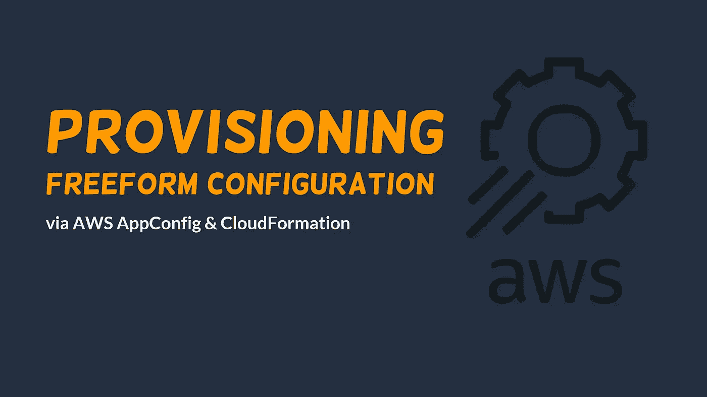

自由形式配置是为运行时需要动态行为切换的应用程序定义[特性切换](https://medium.com/@ac052790/an-introduction-to-feature-toggles-aws-appconfig-aa6351872fd6)的另一种方式。与显式特征标志定义相比，自由形式配置提供了一种更灵活、更具表现力的方式来定义流行文件格式中的配置，如`text/plain`、`application/json`、`text/yaml`，这使得开发运维工程师更容易定义配置。

在本文中，我们将探索一种自动配置自由形式配置的方法，应用程序可以使用这种方法来动态切换机器学习例程。

我们将使用 CloudFormation 作为表达 AppConfig 资源的媒介。请注意，CloudFormation 只是自动提供 AWS AppConfig 资源的几种方法之一。我们将在本文中提供的任何资源也可以通过使用其他工具来提供，如 Terraform、AWS CDK、AWS SDK、AWS CLI 等。

# 目的计算机

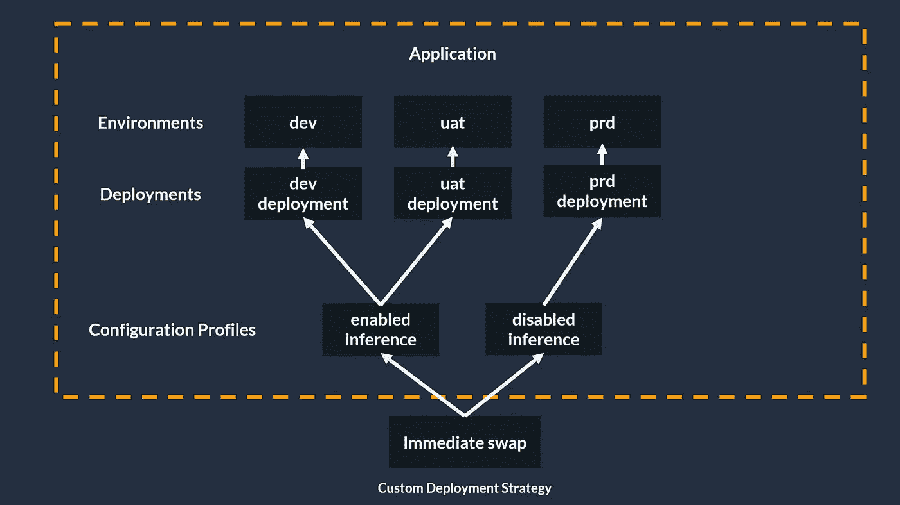

本供应教程的最终目标是产生一个表示上图的配置支架。基本上，我们的目标是创建一个包含三种环境(dev、uat 和 prd)的 AppConfig 应用程序资源。每一个都有自己的自由形式的配置文件，其中将用于切换机器学习推理例程。

# 应用

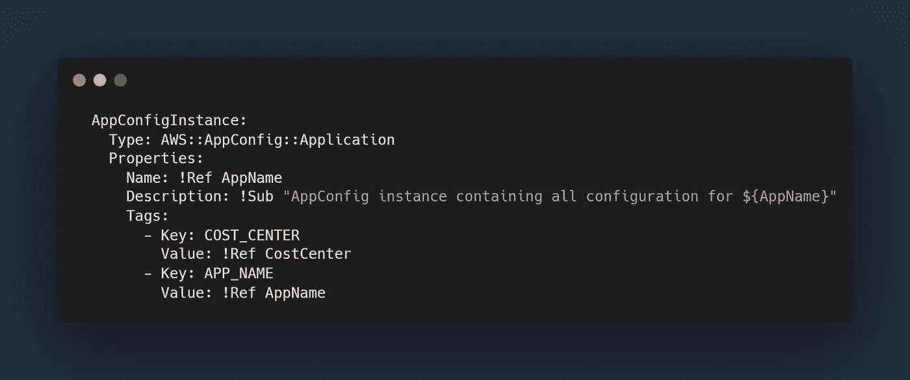

AWS AppConfig 应用程序是一种组织结构，它将几个相关的设置和环境组合在一起，这些设置和环境可以与一个有限的上下文、微服务或整个应用程序相关联。

# 环境

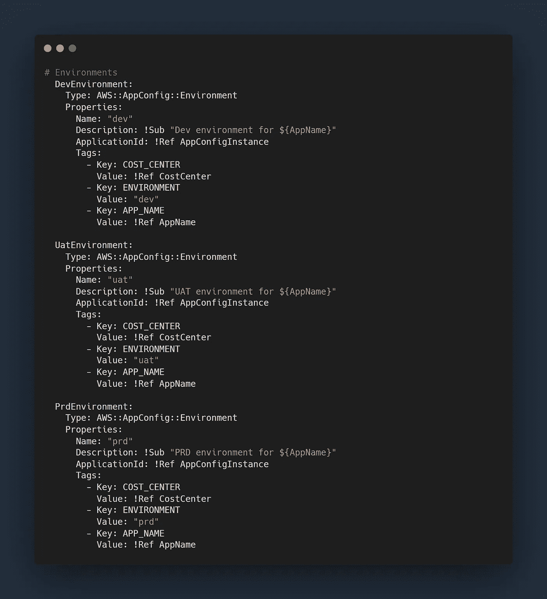

在 AWS AppConfig 的上下文中，环境构造表示单个部署环境的相关配置的逻辑分组。在我们的项目中，我们将创建三个 AppConfig 环境，它们代表我们的业务应用程序的 dev、uat 和 prd 环境。它们都通过 ApplicationId 属性链接到父 AppConfig 应用程序。

# 配置描述文件

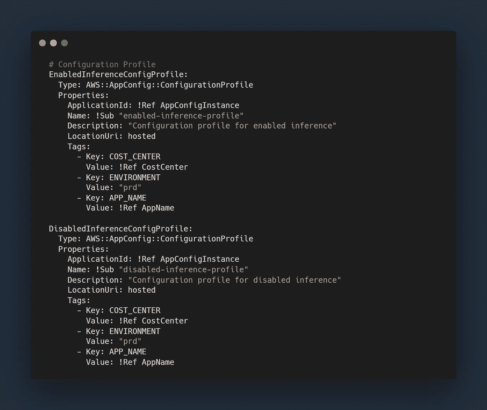

配置概要文件是 AWS AppConfig 用来标识配置数据位置的构造。在我们的例子中，我们通知 AppConfig，我们的配置数据在 AppConfig 本身内部。

在这个例子中，我们还有两个配置概要文件，分别代表 ML 推理功能的`enabled` & `disabled`模式。

# 托管配置版本

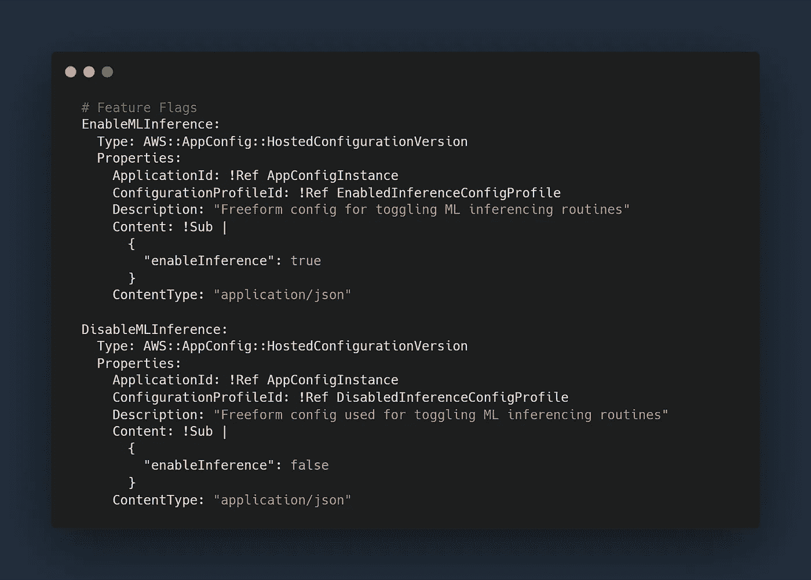

托管配置版本是用于定义 AppConfig 托管自由形式配置数据的构造。在我们的例子中，我们使用的是`application/json`格式，但是应该注意也可以使用`text/plain` & `text/yaml`格式。

自由形式配置的更高级变体可能包含更多元数据，如版本、类型、算法、超参数值等。

# 定制部署策略

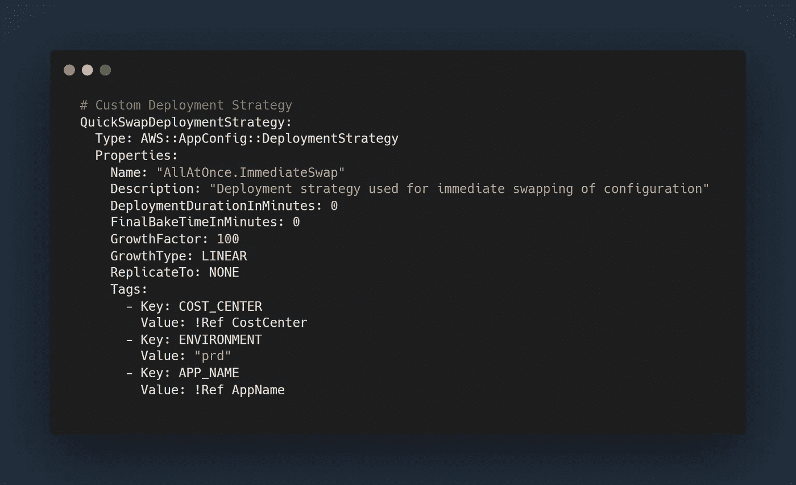

部署策略构造用于定义配置部署策略的属性，如类型、增长因素、总部署时间、烘烤时间。我们将创建一个定制的，立即传播自由形式的配置，而不使用烘焙时间，以保持事情更简单。

# AppConfig 部署

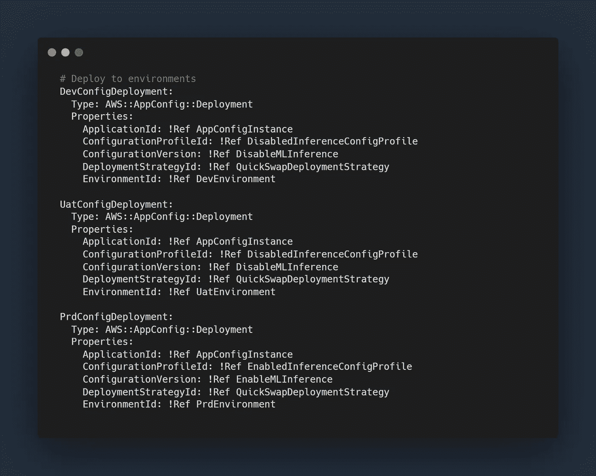

我们的供应模板中包含的最后一个构造是 AWS AppConfig 部署`(AWS::AppConfig::Deployment)`。这个构造基本上缝合了我们模板中定义的先前资源(应用程序、环境、配置文件、配置版本和部署策略)。)这个构造负责调用发布到目标环境的配置。

# 全云形成模板

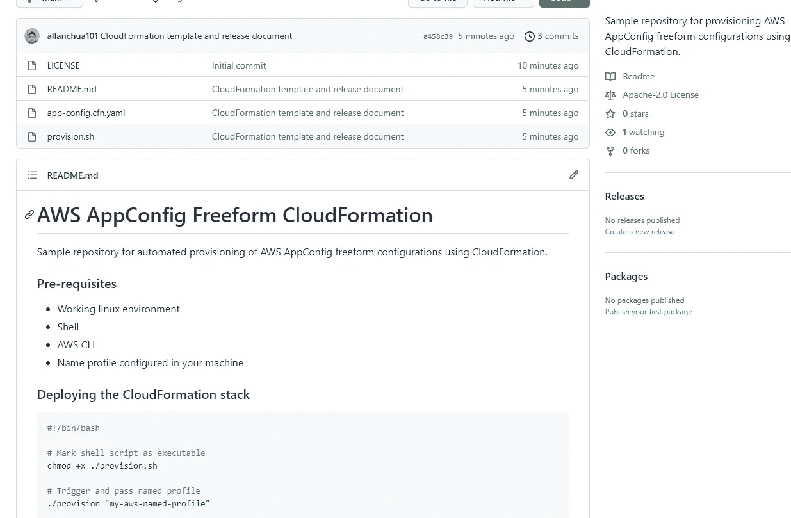

完整的 CloudFormation 模板可以在这个 [Github 库](https://github.com/allanchua101/aws-appconfig-freeform-cloudformation)上找到，它包含了关于如何在自己的 AWS 帐户上部署 CloudFormation 堆栈的附加信息。

# 部署云架构堆栈

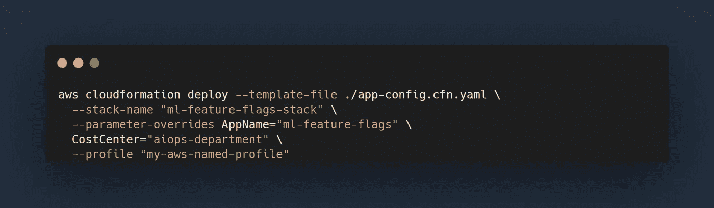

为了部署您的 CloudFormation 堆栈，请使用上面的 shell 脚本，并根据您的个人目标替换参数。

# 决赛成绩

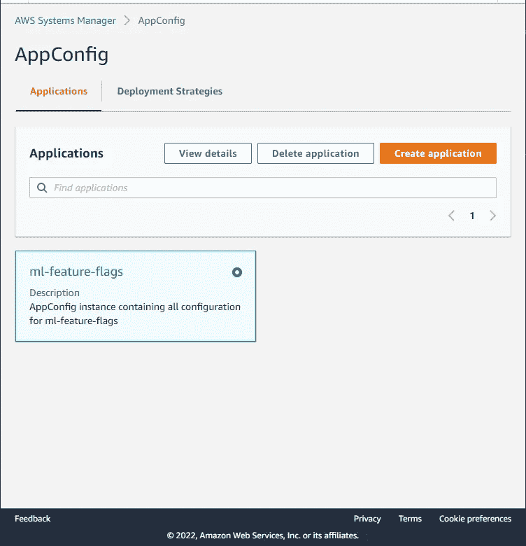

结果，根据我们定义的 CloudFormation 模板创建了一个 AWS AppConfig 应用程序。

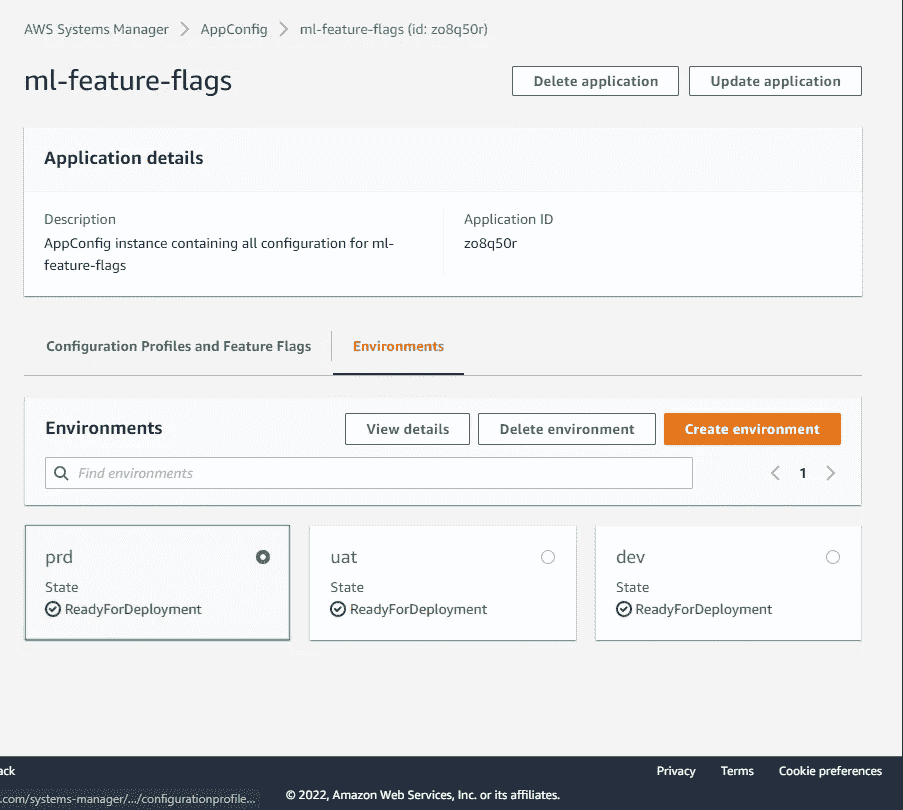

该应用程序下还提供了三种环境。每一个都代表了我们每个测试环境的配置的逻辑分组。

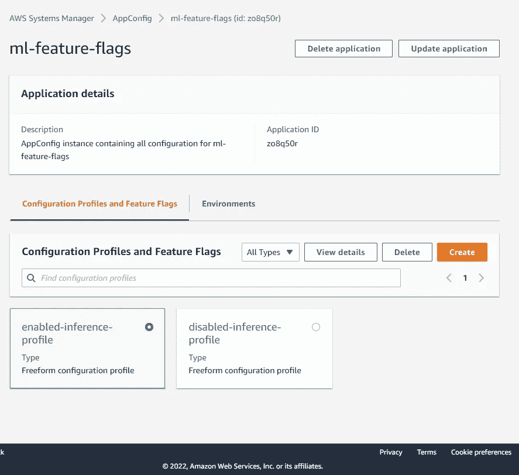

还有两种不同的配置文件用于切换消费应用程序的 ML 推理功能。

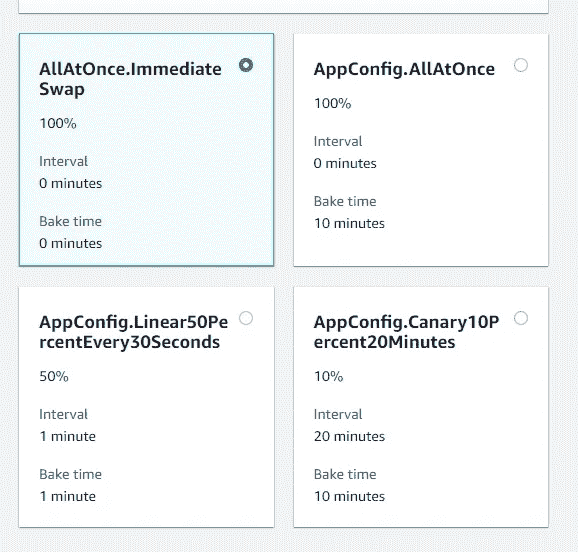

我们还设法在 AWS 提供的预配置策略的基础上创建了一个定制的部署策略。

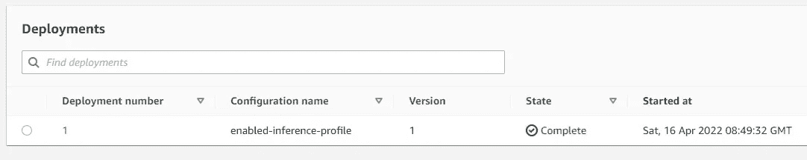

最终结果是，我们的每个环境现在都支持通过自由配置进行功能切换。它可以在运行时改变我们的 ML 推理能力，而不需要额外的部署工作。

# 对应用程序管理的影响

使用基于自由形式配置的功能切换，工程团队现在可以:

*   在不中断现有应用流程的情况下，抢先部署机器学习功能。
*   在运行时动态改变机器学习推理功能，而无需努力重构代码和运行另一组部署。
*   通过禁用损坏的模块，降低与应用程序停机或错误部署相关的风险。

# 下一步是什么

既然我们有了一种自动提供自由形式的基于配置的特性切换的方法，我们就可以开始在 NodeJS 和 Python 环境中使用这种配置了。

# 结论

使用 CloudFormation，可以在 AWS AppConfig 上自动提供自由形式的配置。使用这种方法的动态特性切换使工程团队受益匪浅，这在以前是很难实现的，因为需要管理应用程序。