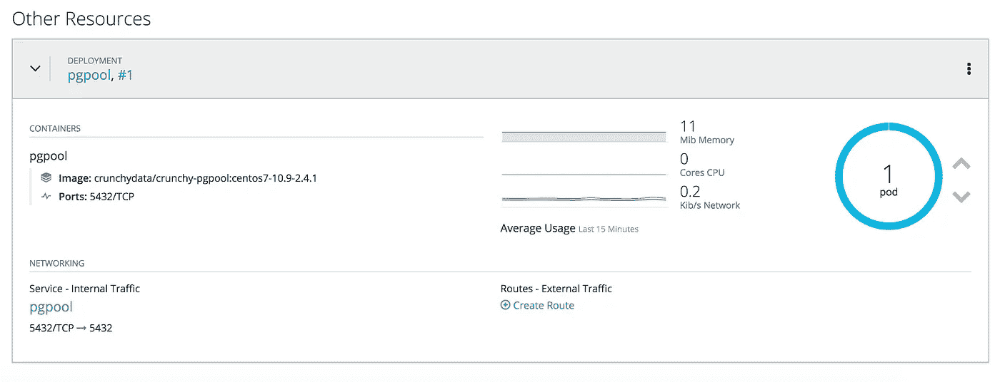

# 利用 PGPool 在 OpenShift 上代理 Amazon PostgreSQL

> 原文：<https://itnext.io/proxying-amazon-postgresql-on-openshift-with-pgpool-fb3a9be03583?source=collection_archive---------6----------------------->


安娜在 [Unsplash](https://unsplash.com?utm_source=medium&utm_medium=referral) 上的照片

因此，您已经构建了一个使用 [PostgreSQL](https://www.postgresql.org/) 数据库的生产应用程序。在开发阶段，您可能一直在使用计算机上的本地数据库，或者使用 [Docker](https://hub.docker.com/_/postgres) 实例，或者可能使用[端口转发](https://docs.openshift.com/container-platform/4.1/nodes/containers/nodes-containers-port-forwarding.html)将数据库从您的[小型班](https://www.okd.io/minishift/)或开发 [OpenShift](https://www.openshift.com/) 集群转储。然而，进入生产部署阶段后，您不再部署 *PostgreSQL* pod，而是使用远程数据库，就像 [Amazon 远程数据库服务(RDS)对 PostgreSQL](https://aws.amazon.com/rds/postgresql/) 那样。在生产环境中，最佳做法是将对数据库的网络访问限制为仅从[虚拟私有云(VPC)](https://aws.amazon.com/vpc/) 内部进行。此外，您还可以合并一个 [SSL 证书](https://docs.aws.amazon.com/AmazonRDS/latest/UserGuide/UsingWithRDS.SSL.html)，以进一步确保数据库连接的安全，从而避免“流氓”连接。


[约翰·萨尔维诺](https://unsplash.com/@jsalvino?utm_source=medium&utm_medium=referral)在 [Unsplash](https://unsplash.com?utm_source=medium&utm_medium=referral) 上的照片

每隔一段时间，您只能调试特定数据集的客户问题。然而，在这种封闭的环境中，选择有限:

*   增加日志记录，希望捕捉相关数据。
*   尝试通过反复试验生成有效数据集。
*   创建一个副本数据库或 [pg_dump](https://www.postgresql.org/docs/10/app-pgdump.html) 的数据进行重新创建。

前两个选项需要时间，可能不会带来太大的成功。第三种选择也很耗时，存在安全风险，而且成本很高，尤其是在多租户数据库环境中。在开发调试场景中，开发人员只需使用 *OpenShift* 的端口转发功能直接连接到 *PostgreSQL* pod，并使用调试器或使用 [psql](https://www.postgresql.org/docs/9.3/app-psql.html) 检查 SQL 语句来单步调试应用程序逻辑。想象一下，如果您可以像开发场景那样与远程数据库进行交互，但又不放弃您已经设置的所有安全限制，这将是多么了不起的进步。


奥斯曼·拉纳在 [Unsplash](https://unsplash.com?utm_source=medium&utm_medium=referral) 上拍摄的照片

# 代理 PostgreSQL

[Pgpool-II](https://www.pgpool.net/mediawiki/index.php/Main_Page) 有助于使上述生产调试成为可能。“Pgpool-II 是一个在 PostgreSQL 服务器和 PostgreSQL 数据库客户端之间工作的中间件”。Pgpool-II 提供了几个功能，包括:连接池、复制、负载平衡、限制超出连接、看门狗和内存查询缓存。但是，我们将重点关注它作为生产数据库代理的能力。接下来，让我们看看如何将一个 *Pgpool-II* 容器部署到我们的 *OpenShift* 环境中来支持这个交互流。

# 在 OpenShift 上运行 Pgpool-II

[Crunchy Data](https://www.crunchydata.com/) ，这是一家企业 *PostgreSQL* 解决方案公司，提供了几个[基于容器的部署](https://crunchydata.github.io/crunchy-containers/stable/)，其中 *Pgpool-II* 包括在内。 [crunchy-containers](https://github.com/CrunchyData/crunchy-containers) 存储库示例为 *Docker* 、 [Helm](https://helm.sh/) 和[Kubernetes](https://kubernetes.io/)/*open shift*提供部署。假设 *PostgreSQL* 数据库的主机名、用户名、密码和 SSL 证书存储在 *OpenShift* secret 中，我们将逐步完成部署到 *OpenShift* 的必要步骤。

[](https://github.com/chambridge/openshift-pgpool) [## chambridge/openshift-pgpool

### 将 Crunchy Data pgpool 部署到 OpenShift 的部署步骤，以及用于生成配置数据的脚本。…

github.com](https://github.com/chambridge/openshift-pgpool) 

上面的存储库提供了部署步骤和脚本，这些步骤和脚本构建在部署到 *OpenShift* 的*易碎数据*示例之上。

```
git clone git@github.com:chambridge/openshift-pgpool.git
```

从这里开始，您需要设置在使用提供的`example.env.sh`部署 *crunchy-containers* 时将使用的环境，您可以将其复制到`env.sh`和 source，在这里您至少需要更新以下变量。

```
CCPROOT=/home/user/code/crunchy-containers  # The base of the crunchy-containers clone GitHub repositoryCCP_NAMESPACE=myproject # Change this to the OpenShift project name
```

下一步是登录到您的 *OpenShift* 集群和包含 *PostgreSQL* 主机名、用户名、密码和 SSL 证书秘密的项目。

```
oc login
oc project myproject
```

现在，您可以使用存储库中包含的 shell 脚本创建部署 pgpool 所需的几个配置文件。

```
# Create pgpool.conf file with create_pgpool_conf.sh script:./create_pool_passwd.sh SECRET_NAME HOSTNAME_KEY USERNAME_KEY PASSWORD_KEY # Create pool_passwd file with create_pool_passwd.sh script:./create_pool_passwd.sh SECRET_NAME USERNAME_KEY PASSWORD_KEY # Create server.pem file with create_server_pemfile.sh script:./create_server_pemfile.sh SECRET_NAME CACERT_KEY
```

所有这些文件都将存储在`kube/pgpool/configs/`中，这样它们就可以被复制到一个克隆的 *crunchy-containers* 仓库中。

```
cd ..
git clone https://github.com/CrunchyData/crunchy-containers.git
cd crunchy-containers/examples/
```

现在您复制上面创建的安装文件并部署 pgpool:

```
cp -rf ../../openshift-pgpool/kube/ kube/
cd kube/pgpool/
./run_sslcacert.sh
```



部署的 pgpool pod

# 使用部署的 pgpool

您现在可以连接到部署的`pgpool` pod，它实际上将代理 *PostgreSQL* 数据库。使用`oc port-forward`连接到数据库。

按照以下步骤与部署的代理交互:

1.  找到已部署`pgpool`的 pod 名称。

```
oc get pods -l name=pgpool -o name 
```

2.使用端口转发连接到远程数据库。

```
oc port-forward [pod] 5432:5432 >/dev/null 2>&1 &
```

现在，您可以使用本地应用程序或`psql`连接到远程数据库。

```
psql --password --host=127.0.0.1 --port=5432 --username=dbuser --dbname=mydbselect * from mytable;
```

对端口转发的访问仅限于那些对 *OpenShift* 项目拥有`edit`或更大权限的用户，并且在提取秘密数据以限制访问后，pod 可以扩展到零和/或部署到任何项目。

# 摘要

在这个故事中，我们强调了一种访问我们的网络隔离远程生产数据库的机制。我们了解了 *Pgpool-II* 及其功能，包括充当 PostgreSQL 数据库的代理。接下来，我们完成了创建适当的 *Pgpool-II* 配置的设置步骤，以便使用 SSL 证书连接到远程数据库。最后，我们看到了如何将`pgpool` pod 部署到 *OpenShift* 中，并使用端口转发为开发人员获得与本地开发相同的生产体验。