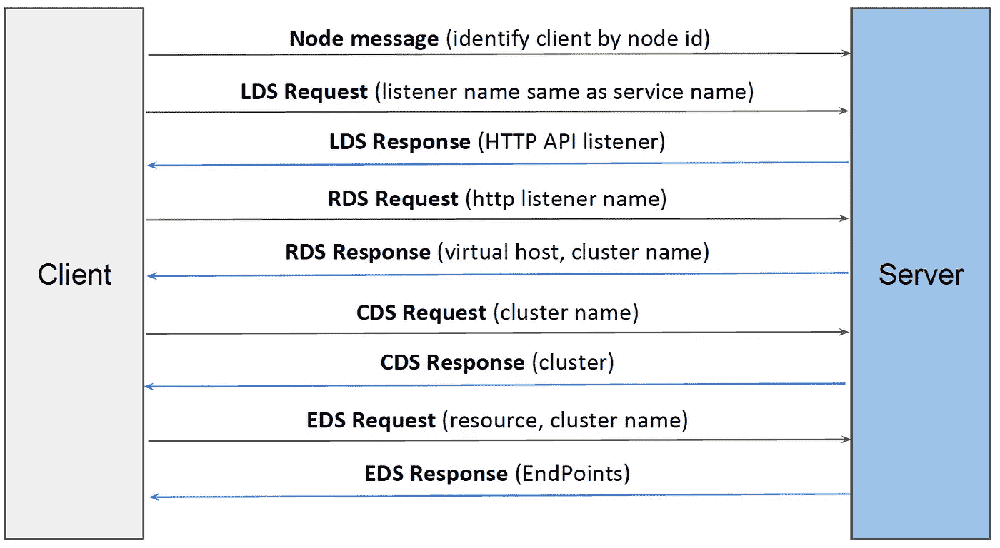
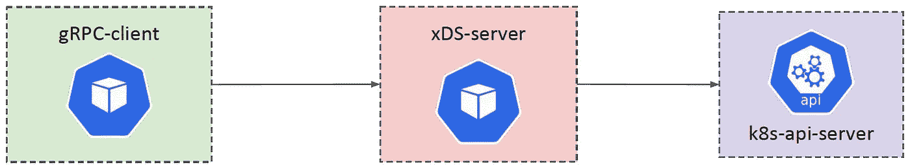
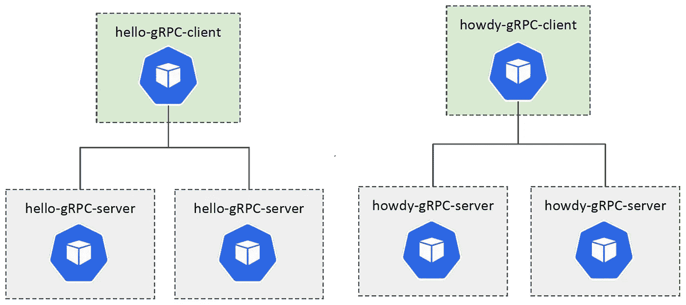
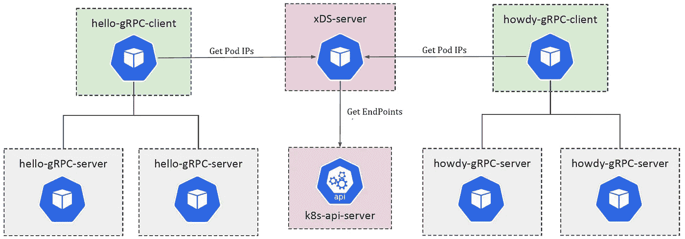
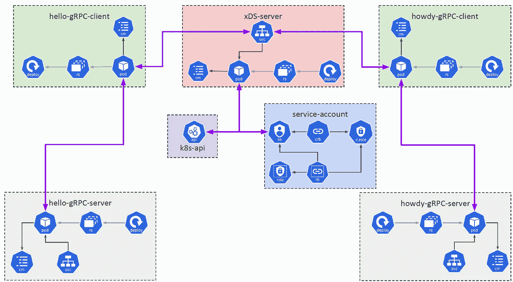

# Kubernetes 中的无代理 gRPC 负载平衡

> 原文：<https://itnext.io/proxyless-grpc-load-balancing-in-kubernetes-ca1a4797b742?source=collection_archive---------0----------------------->

在本文中，我将展示如何使用新的 xDS 负载平衡为 gRPC 服务构建无代理负载平衡。

您可以在

[](https://github.com/asishrs/proxyless-grpc-lb/) [## asishrs/无代理-grpc-lb

### 在 kubernetes 集群中演示用于 Go gRPC 客户端的 xDS 负载平衡器的示例存储库。如果你是…

github.com](https://github.com/asishrs/proxyless-grpc-lb/) 

# 为什么 gRPC 中的负载均衡很难？

如果您正在构建基于 gRPC 的应用程序，您可能已经知道了 HTTP2 在 gRPC 中的用法。如果您对此不熟悉，请阅读下面的内容

*   [https://grpc.io/blog/grpc-load-balancing/](https://grpc.io/blog/grpc-load-balancing/)
*   [https://kubernetes . io/blog/2018/11/07/grpc-load-balancing-on-kubernetes-without-tears/](https://kubernetes.io/blog/2018/11/07/grpc-load-balancing-on-kubernetes-without-tears/)

在高层次上，我想让你明白两点。

1.  gRPC 构建在 HTTP/2 之上，而 HTTP/2 被设计成拥有一个单一的长期 TCP 连接。
2.  为了实现 gRPC 负载均衡，我们需要从连接均衡转移到*请求*均衡。

# 有哪些选择？

在 Kubernetes 集群中，曾经有两种方法可以对 gRPC 请求进行负载平衡

*   无头服务
*   使用代理(例如 Envoy、Istio、Linkerd)

最近，gRPC 宣布支持基于 [*xDS 的负载平衡*](https://github.com/grpc/proposal/blob/master/A27-xds-global-load-balancing.md) ，到目前为止，gRPC 团队增加了对 *C-core、Java 和 Go* 语言的支持。这是一个重要的特性，因为这将为 gRPC 中的负载平衡提供第三种选择，我将展示如何在 Kubernetes 集群中实现这一点。gRPC 将从原来的 *grpclb 协议*迁移到新的 *xDS 协议。*

# xDS API

[xDS API](https://www.envoyproxy.io/docs/envoy/latest/api-docs/xds_protocol) 是一套流行的 API，并逐渐发展成为用于配置各种数据平面软件的标准。

在 xDS API 流中，客户端使用以下主要 API:

*   **监听器发现服务(LDS)** :返回[监听器](https://github.com/envoyproxy/envoy/blob/9e83625b16851cdc7e4b0a4483b0ce07c33ba76b/api/envoy/api/v2/listener.proto#L27)资源。基本上用作 gRPC 客户端配置的方便根目录。指向路由配置。
*   **路由发现服务(RDS)** :返回[路由配置](https://github.com/envoyproxy/envoy/blob/9e83625b16851cdc7e4b0a4483b0ce07c33ba76b/api/envoy/api/v2/route.proto#L24)资源。提供用于填充 gRPC [服务配置](https://github.com/grpc/grpc/blob/master/doc/service_config.md)的数据。指向集群。
*   **集群发现服务(CDS)** :返回[集群](https://github.com/envoyproxy/envoy/blob/9e83625b16851cdc7e4b0a4483b0ce07c33ba76b/api/envoy/api/v2/cluster.proto#L34)资源。配置负载平衡策略和负载报告等内容。指向 ClusterLoadAssignment。
*   **端点发现服务(EDS)** :返回 [ClusterLoadAssignment](https://github.com/envoyproxy/envoy/blob/9e83625b16851cdc7e4b0a4483b0ce07c33ba76b/api/envoy/api/v2/endpoint.proto#L33) 资源。配置一组端点(后端服务器)以实现负载平衡，并可以告诉客户端丢弃请求。

# 使用 xDS API 的 gRPC 负载平衡

为了利用 xDS 负载平衡，gRPC 客户端需要连接到 xDS 服务器。客户端需要在用于创建 gRPC 通道的目标 URI 中使用 xds resolver。

下图显示了 API 调用的顺序。



xDS API 调用

xDS 服务器负责发现 gRPC 服务器的端点，并将其传达给客户端。然后，客户端会定期请求更新。

# Kubernetes 集群中的 xDS 端点发现

在这个例子中，我使用 k8s *client-go* 来发现端点，并使用 Envoy [go-control-plane](https://github.com/envoyproxy/go-control-plane) 作为 xDS 服务器。在我的实现中，xDS 服务器[每分钟轮询 Kubernetes 端点](https://github.com/asishrs/proxyless-grpc-lb/blob/master/xds-server/internal/app/resources.go#L51)，并使用 gRPC 服务器 IP 地址和端口更新 xDS 快照。由于我使用分钟间隔进行轮询，客户端可能需要一分钟来反映端点更新。



***注意:*** *特使 go-control-plane 不支持多个 gRPC 客户端请求。我正在使用一个分叉的版本* [*，并修复了这个*](https://github.com/asishrs/go-control-plane/blob/master/pkg/cache/v2/simple.go#L165) *。我有一个* [*的问题要打开*](https://github.com/envoyproxy/go-control-plane/issues/349) *与特使团队讨论。*

# 示例应用程序

在这个示例应用程序中，我使用了两个 gRPC 服务(hello 和 howdy)和以负载平衡方式连接到这些服务的客户端。下图显示了设置。



# 查看所有活动

为了快速测试存储库，我将通过 [*Go Task*](https://github.com/go-task/task) 运行所有命令。您可以查看 *Taskfile.yml* (或 *Taskfile-*)中的所有命令。yml* 文件。

## **部署组件**

**可选步骤——验证所有组件**

检查所有组件是否正在运行。

运行*ku bectl get deployments . apps*来检查所有部署。您必须在列表中看到五个部署。

运行 *kubectl get svc* 检查所有服务。您必须在列表中看到四种服务。

运行*ku bectl get pod*检查所有 pod。您必须在列表上看到七个 pod。pod 后缀(在最后一个-之后)每次都会不同。

# 验证无代理(xDS)负载平衡

服务器通过添加服务器主机 IP 来响应代码中的 **gRPC** 请求。我们可以用它来识别响应客户机请求的目标服务器。

让我们通过运行*ku bectl logs-f deployment/hello-client*来检查来自 *hello client* 的日志

日志中有两件重要的事情。

**xDS 来电**

您可以看到启动与 xDS 服务器的连接并获得服务器的 xDS 协议响应的日志。这是客户端负载平衡器挑选可用连接的地方。

示例响应

**gRPC 服务器响应**

您可以看到 **gRPC** 服务器正在响应客户端请求。使用 gRPC 响应中的 IP 地址，您可以看到该响应来自 *hello-grpc-server* 应用程序的两个副本。

示例响应

同样，您可以检查 *howdy-client* 日志*ku bectl logs-f deployment/howdy-client*

注意命令！

[](https://asciinema.org/a/358829) [## 澳大利亚广播公司:358829

### 由记录器记录 54

asciinema.org](https://asciinema.org/a/358829) 

**最终图**

这是代表整个设置的图表。



# 后续步骤

如何扩展部署？你可以(向上和向下)扩展 **gRPC 服务器**(包括 *hello* 和 *howdy* )部署，看看 xDS 负载平衡会如何表现。客户端可能需要一分钟的时间来获取更改。

```
# Scale hello-server to 5 replicas
kubectl scale — replicas=5 deployments.apps/hello-server# Scale howdy-server to 5 replicas
kubectl scale — replicas=5 deployments.apps/howdy-server
```

# 奖金图表

这是这个实验中每个调用的图表。



# 参考

*   [https://www . envoy proxy . io/docs/envoy/latest/API-docs/xds _ protocol](https://www.envoyproxy.io/docs/envoy/latest/api-docs/xds_protocol)
*   [https://github . com/grpc/proposal/blob/master/A27-xds-global-load-balancing . MD](https://github.com/grpc/proposal/blob/master/A27-xds-global-load-balancing.md)
*   [https://github . com/envoy proxy/data-plane-API/tree/master/envoy/API/v2](https://github.com/envoyproxy/data-plane-api/tree/master/envoy/api/v2)
*   [https://github . com/grpc/grpc-go/blob/master/examples/features/xds/readme . MD](https://github.com/grpc/grpc-go/blob/master/examples/features/xds/README.md)
*   [https://github.com/envoyproxy/go-control-plane/issues/349](https://github.com/envoyproxy/go-control-plane/issues/349)
*   [https://medium . com/@ Salma an . Rashid/grpc-xds-load balancing-a 05 F8 BD 754 b 8](https://medium.com/@salmaan.rashid/grpc-xds-loadbalancing-a05f8bd754b8)