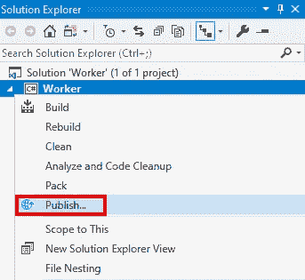
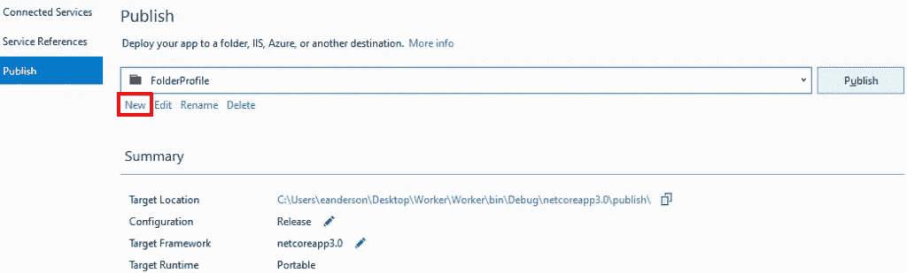
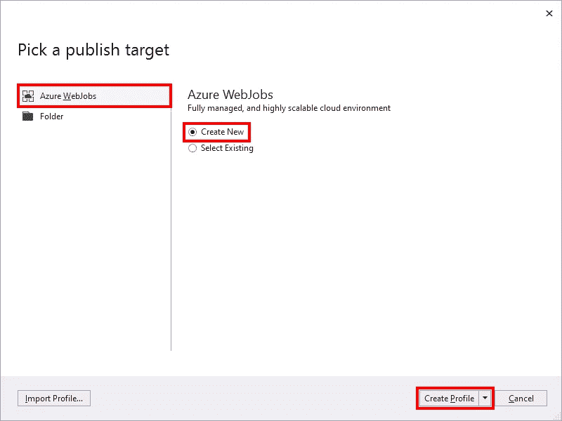
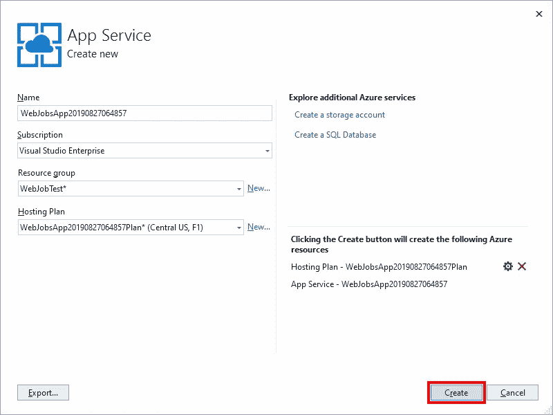
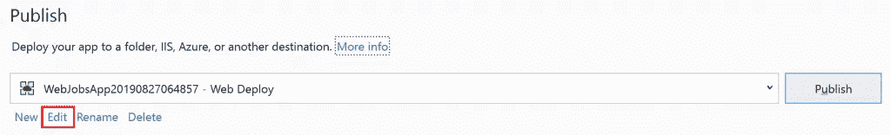
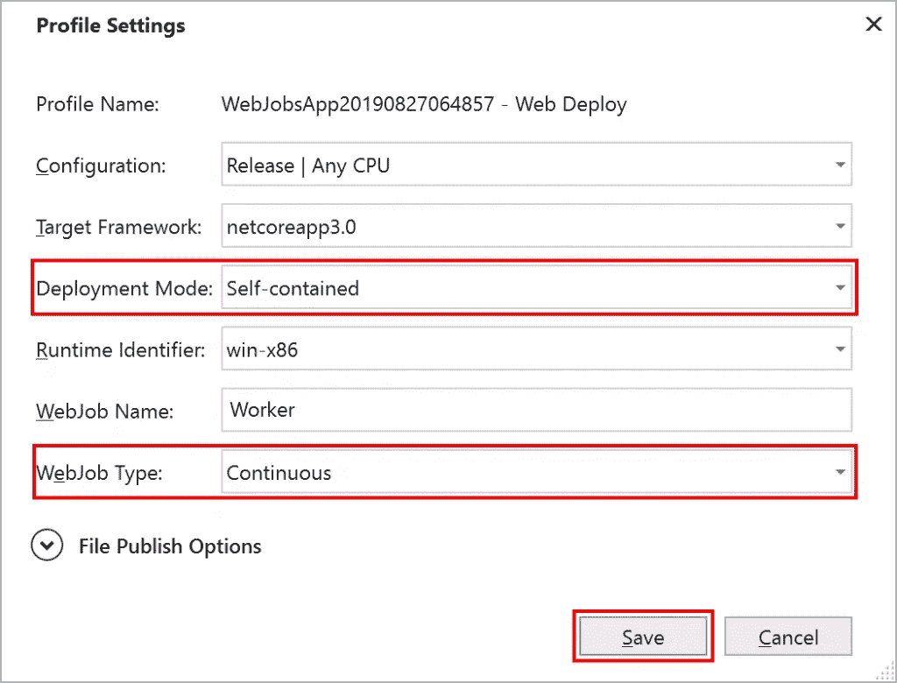
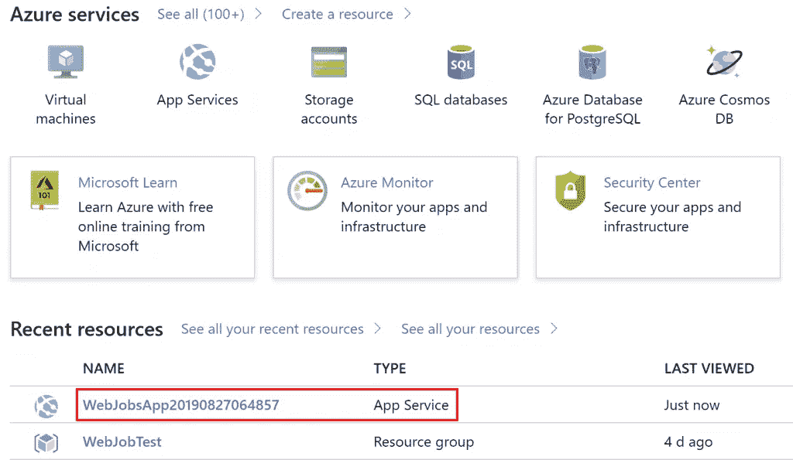
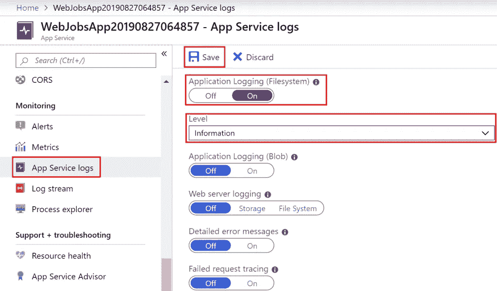
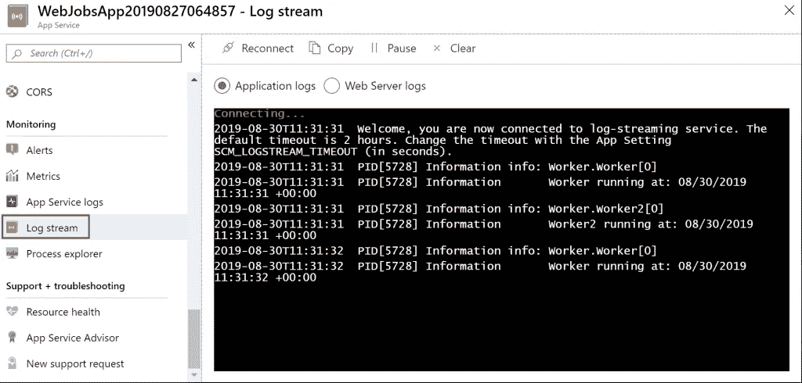

# 将. NET 核心工作服务发布到 Azure

> 原文：<https://itnext.io/publish-a-net-core-worker-service-to-azure-26059a75abd2?source=collection_archive---------8----------------------->

在上周的帖子里，[。NET 核心工作者服务](https://elanderson.net/2019/09/net-core-worker-service/)，我们创建了一个. NET 核心工作者服务，然后展示了如何将它作为一个 Windows 服务来托管。本周我们将把上周文章中创建的应用程序发布到 Azure。如果你还没有读上周的帖子，我建议你至少读完应用程序创建部分。请随意跳过让应用程序作为 Windows 服务运行的部分，因为我们将在 Azure 上发布这篇文章。

## 发布到 Azure

这篇文章假设你已经有一个有效的 Azure 账户。如果没有，你可以注册一个[免费 Azure 账户](https://azure.microsoft.com/en-us/free/)。这篇文章还将使用 [Visual Studio 2019 预览版](https://visualstudio.microsoft.com/vs/preview/)进行发布。

在 Visual Studio 中右键单击项目，然后单击**发布**。

因为这个项目已经有了一个文件夹发布设置，所以我的截图可能和你的不一样。点击**新建**链接。

这将启动发布配置文件对话框。我们将使用**创建新的**选项发布到 **Azure WebJobs** 。验证设置正确后，点击**创建配置文件**。

下一个屏幕显示将要创建的应用服务的详细信息。我做了一个新的资源组，而不是使用默认的资源组和一个新的托管计划，这样我就可以利用免费层，但这两个更改都是可选的。当你设置好一切后，点击**创建**按钮。

单击 create 后，需要几分钟来部署应用程序。这第一次部署对我们来说将是一次性的。我们需要调整一些设置，让应用程序按照我们想要的方式运行。初始部署完成后，我们将返回到配置文件详细信息屏幕。点击**编辑**链接。

将显示“发布配置文件设置”对话框。因为这是在。NET Core 3 仍在预览中，我正在使用**部署模式**的**独立**选项。如果您是在最终版本发布后进行的，那么您可以跳过这一步。我要更改的第二件事是 **WebJob 类型**，我将它设置为**连续**。这是因为我们的服务正在控制自己的工作时间表，而不是被其他事情触发。点击**保存**提交更改并返回发布对话框。

现在按下**发布**按钮将应用程序推送到 Azure。

## 使用 Azure Portal 验证应用程序正在工作

既然我们的应用程序已经在 Azure 中运行，我们如何验证它实际上是按照我们的预期执行的呢？因为示例应用程序唯一做的事情是输出一些日志，所以我们必须找到一种方法来显示日志的输出。开始前往[蔚蓝门户](https://portal.azure.com)。由于我们刚刚发布了应用程序，我们感兴趣的资源应该会显示在 Azure 门户主页的**最近资源**部分。正如您在截图中看到的，我们感兴趣的是第一个选项，它与我们在 Visual Studio 中看到的名称相匹配。单击资源。

从菜单部分向下滚动到**监控**部分，并点击**应用服务日志**。现在打开上的**选项，用于**应用程序日志(文件系统)**和**级别**选项，选择**信息**，因为这是我们的示例应用程序正在输出的日志级别。然后点击**保存**。**

回到同一个**监控菜单中的**组选择**日志流**。

## 包扎

在 Azure 中运行一个工人变得非常简单。并不是说我对微软倾向于让他们的所有产品都能很好地与 Azure 兼容感到惊讶。我相信你会找到一个比我们在这个例子中更有用的方法。

*原载于* [*埃里克·安德森*](https://elanderson.net/2019/10/publish-a-net-core-worker-service-to-azure/) *。*