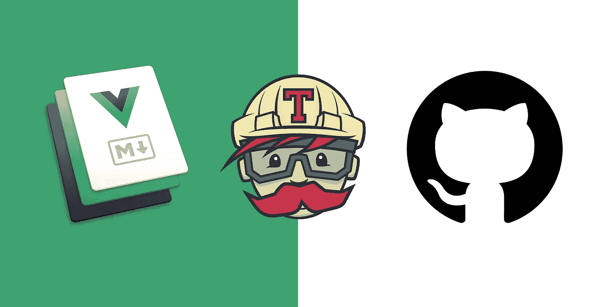
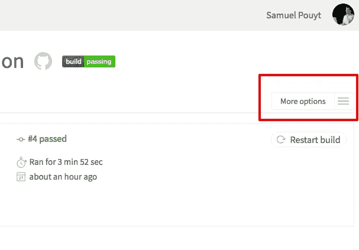
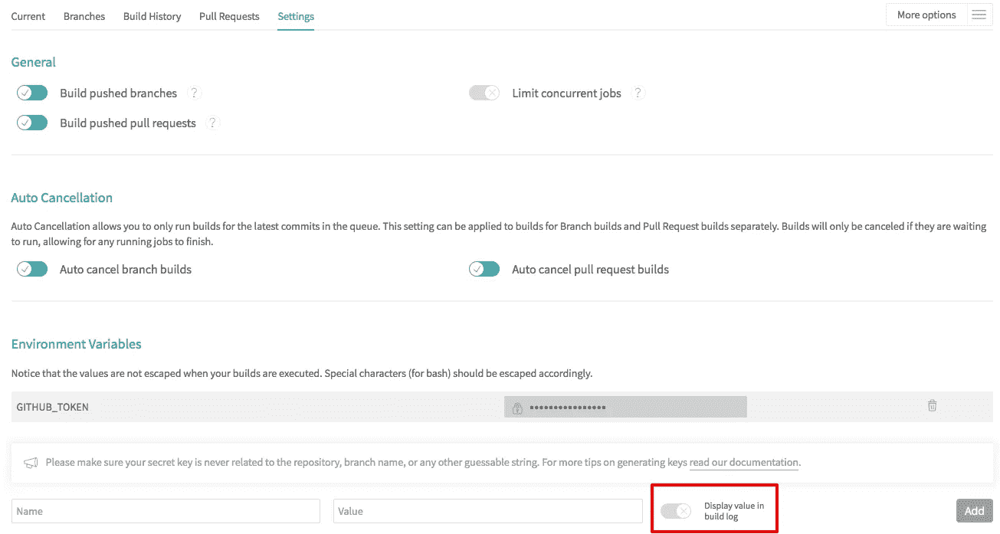
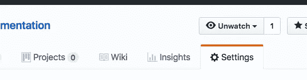
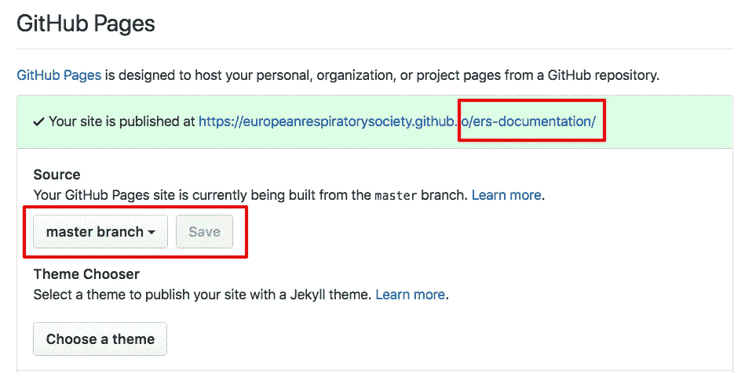

# 与 Travis 一起在 GitHub 页面上发布 Vuepress 网站

> 原文：<https://itnext.io/publish-a-vuepress-site-on-github-pages-with-travis-82036243bf36?source=collection_archive---------2----------------------->



```
published on August 3, 2018
vuepress version: 0.13.1
```

[Vuepress](https://vuepress.vuejs.org/) 是由 [Vuejs](https://vuejs.org/) 的创造者尤雨溪创造的一个奇妙的静态站点生成器。Vuepress 的理念与 Vuejs 相同，可以用一个词概括:简单。

就目前而言，Vuepress 非常适合生成文档网站，像往常一样，在 Vuejs 生态系统中，文档是您开始工作时唯一需要的东西。

由于我必须弄清楚如何使用特拉维斯连接点，我决定分享，以加快其他冒险家的进程。

Vuepress 生成简单 html 和 js 的静态网站。它们可以部署在任何静态网站主机、廉价的互助服务器上，也可以部署在 GitHub 上。Vue press 是一个非常好的团队协作生成文档的选择。将它与`git`和 GitHub 配对使得协作和跟踪修订变得容易。与 Travis 相关联的 GitHub 将允许团队不用担心如何发布，而只需添加文档、推送文档，剩下的就交给他们(我们)处理了。

此外，GitHub 可以作为文档的(基本)CMS，因为可以在那里创建和编辑文件。这对于快速更新或者不希望安装`git`并在他们的计算机上安装代码编辑器的不太懂技术的用户来说非常有用。

Vuepress 根据 Markdown 文件的内容生成页面和导航。Markdown 很容易学，事实上，我所在公司的所有内容编辑都使用 Markdown 在网上发布内容。大概需要 15 分钟训练他们，交接和小抄。

对于这个设置，我建议有一个 repo 来处理文档，并且 Travis 将在每次主分支上有推送时自动发布站点。

要进行该设置，您需要:

1.  一个[特拉维斯](https://travis-ci.org/)的账户
2.  一个 [GitHub](https://github.com/) 账户
3.  Vuepress 的[工作安装](https://vuepress.vuejs.org/guide/getting-started.html#global-installation)

所有其他配置都是可选的，允许你添加侧栏、顶部导航、项目标题等。

`<publication-repo-name>`是`github.com/<username || organisation name>/`之后的路径。它将用于 GitHub 页面的工作。所以，是的…创建两个存储库:

1.  工作存储库
2.  出版物存储库

在你的电脑上创建一个文件夹来存放你的项目，打开它并初始化一个 git 项目，我们将创建一个最小的`package.json`文件，`.travis.yml`来保存 Travis 配置，一个`.gitignore`和一个`docs`文件夹将包含我们的 Vuepress 配置和内容。然后通过添加正确的远程源将其链接到您的工作存储库。

```
$ mkdir <folder name>
$ cd <folder name>
$ git init
$ touch package.json .travis.yml .gitignore
$ mkdir -p docs/.vuepress
$ cd docs/.vuepress
```

产生的文件夹结构是:

```
└── <folder name>
  ├── docs
  |   └──.vuepress
  |       └── config.js
  ├── .gitignore
  ├── .travis.yml
  ├── package.json
  └── README.md //optional
```

Vuepress 易于安装，它的所有配置都放在一个`.vuepress`文件夹中。该项目运行所需的唯一配置是在该文件夹的根目录下创建一个`config.js`文件，该文件导出一个包含以下内容的模块以及您希望用于项目的任何附加配置。

```
module.exports = {
    base: ‘/<publication-repo-name>/’, 
    // ...
};
```

`package.json`将保持:

```
{
    "scripts": {
        "docs:dev": "vuepress dev docs",
        "docs:build": "vuepress build docs"
    }
}
```

在您处理文档时，将从项目的根位置`<folder name>`使用`docs:dev`命令来查看文档站点。它是热重装的，所以当你保存时，你可以立即看到你的改变

我们的 Travis 脚本将使用第二个命令来生成静态站点。我们现在将对其进行配置。

打开`.travis.yml`文件，复制以下内容:

```
language: node_js
node_js:
    - "10"
env:
    - CXX=g++-4.8addons:
    apt:
        sources:
            - ubuntu-toolchain-r-test
        packages:
            - g++-4.8
install:
    - npm install -g vuepress
script:
    - npm run docs:build
cache:
    directories:
        - "node_modules"
notifications:
    email: false
deploy:
    provider: pages
    skip-cleanup: true
    local_dir: docs/.vuepress/dist
    github-token: $GITHUB_TOKEN  # Set in the settings page of your repository, as a secure variable
    repo: <username || or org name>/<publication repo name>
    keep-history: true
    target-branch: master
    on:
        branch: master
```

我们首先安装 nodejs 10 默认情况下 Travis 安装的是旧版本，与要求 nodejs ≥ 8 的 vuepress 不兼容。然后 Vuepress 被全局安装，我们运行之前配置的构建脚本。我们像这样缓存`node_modules`，下一次构建会更快。我不想收到每个版本的邮件，所以我在这里关闭了它。如果你想收到电子邮件，删除它。

然后我们部署构建的结果。注意，我们只获取了`dist`文件夹中生成的内容。为了发布到 repo，我们需要一个 git 令牌。我们接下来会这样做，但这是我们将在 Travis 中使用的变量名。

然后我们设置`repo`要发布到哪个分支上。`keep-history`属性非常重要。没有它，你将没有任何东西可以发布，因为 Travis 已经删除了这些文件。所以，是的，保留这些文件，以便我们可以把它推到某个地方；)

对于 GitHub 令牌，转到您的设置(屏幕右上角您的头像的下拉菜单)，在左侧菜单中点击`Developer Settings`，然后点击`Personal Access Tokens`。创建一个新的。你只能看到一次…所以复制它，我们现在将设置特拉维斯。如果你没有得到我，有一个由 GitHub 出版的[逐步指南](https://help.github.com/articles/creating-a-personal-access-token-for-the-command-line/)

现在，关于您的 Travis 帐户，我们需要:

1.  连接您的 Github 帐户
2.  激活您的工作库

完成后，转到您的项目设置:



你可以在`More options`下拉列表中找到这个。您将看到以下屏幕:



您可以在这里创建新的环境变量。创建一个值为`GITHUB_TOKEN`的新令牌，没有`$`符号，并在该值中添加您新创建的 GitHub 令牌的值。确保切换设置为红色框中的状态。这将隐藏构建日志中的变量值。这很重要。如果没有，你会给谁访问你的仓库。

最后一步，我们需要配置 GitHub 页面。转到出版物存储库的设置:



向下滚动到 GitHub 页面配置并设置:



请注意源是`master branch`，您是否看到路径的最后一段以红色突出显示？这是您的存储库的名称，也是我们在`config.js`文件中配置的`base`属性。

正常情况下，一切都应该正常。是的通常情况下。通过在你的`docs`文件夹中添加一些 Markdown 文件来创建一些内容，然后推送你的更改，坐下来，享受自动化的数字世界为你工作。