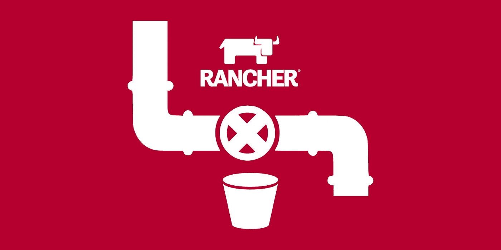
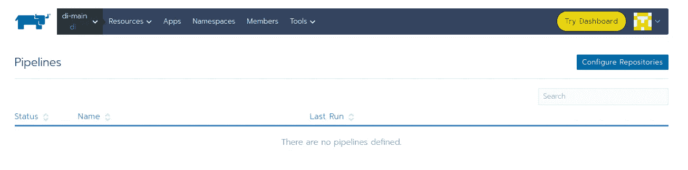
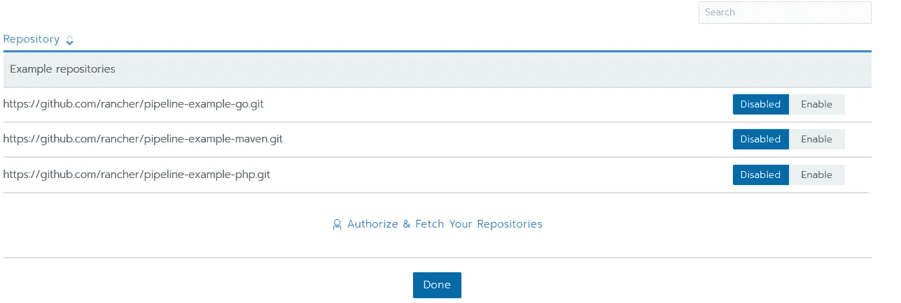
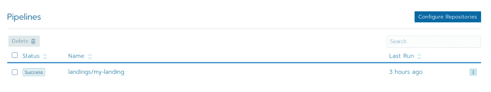
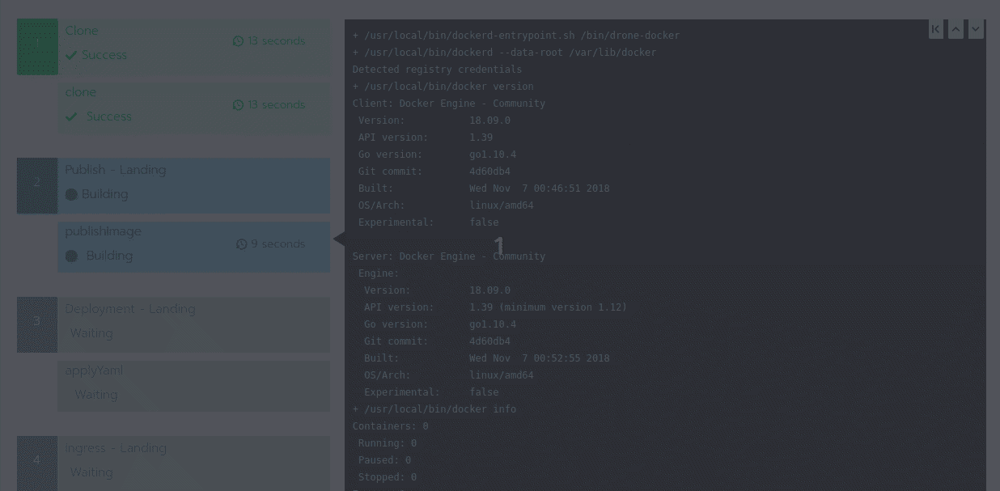

# 使用 Rancher 管道自动发布网页

> 原文：<https://itnext.io/publish-web-pages-automatically-with-rancher-pipelines-3db906b7bbb7?source=collection_archive---------1----------------------->

**TL；**博士:构建一个静态的 web 容器，推入你的容器注册中心，部署它，只需一个“git push”就可以获得免费的 SSL 证书。



牧场主管道由詹金斯提供动力

# 介绍

在互联网上发布和消费静态网页内容有很多选择。从 AWS S3 静态网站到一个简单的 github.io 网站。

此方法使用牧场主管道功能。Rancher 管道相当于 GitHub 操作或 Bitbucket 管道。这是一种执行 CI/CD 任务或任何您想要自动执行的任务的方式。

管道配置好之后，只需要做一个“git push”就可以保持静态内容的更新。

# 先决条件

当然，您需要一个带有牧场主管理的 K8S 集群。

[](https://jmrobles.medium.com/how-to-create-a-kubernetes-cluster-with-rancher-on-hetzner-3b2f7f0c037a) [## 如何创建一个库伯内特集群与赫茨纳牧场主

### TL；DR:15 分钟内，你就可以有一个实验室集群准备好测试或部署你的项目，既便宜又容易。

jmrobles.medium.com](https://jmrobles.medium.com/how-to-create-a-kubernetes-cluster-with-rancher-on-hetzner-3b2f7f0c037a) 

如果您想在 docker 注册表中注册静态容器，而您还没有，那么您可以按照下面的方法操作。

[](https://jmrobles.medium.com/your-own-docker-registry-with-kubernetes-and-rancher-a71c9ecb6797) [## 你自己的码头登记处

### TL；DR:只需 5 分钟即可部署一个私有 docker 注册表！

jmrobles.medium.com](https://jmrobles.medium.com/your-own-docker-registry-with-kubernetes-and-rancher-a71c9ecb6797) 

最后，您需要配置 cert-manager 来请求让我们加密免费证书。

[](https://jmrobles.medium.com/free-ssl-certificate-for-your-kubernetes-cluster-with-rancher-2cf6559adeba) [## 您的 Kubernetes 集群与 Rancher 的免费 SSL 证书

### 由于 Let's encrypt，我们可以为我们的 HTTPS 或 TLS 服务创建 SSL 证书..免费！

jmrobles.medium.com](https://jmrobles.medium.com/free-ssl-certificate-for-your-kubernetes-cluster-with-rancher-2cf6559adeba) 

# 管道

Rancher 管道是通过文件配置的。rancher-pipelines.yaml”。这个文件放在 GIT 存储库的根目录下。

这是一个 YAML 文件，您可以在其中指定步骤/阶段及其操作。它非常类似于其他供应商的格式，如 Bitbucket、GitHub 或 Jenkins CI/CD。

我们的渠道如下。

我们定义了 3 个步骤:

1.  **容器构建和推入注册表**:我们使用“Dockerfile”构建容器映像，标记并将其推入外部 docker 注册表。
2.  **部署**:管道应用 K8S 部署和服务 YAML 清单。
3.  最后，你只需要应用入口清单。

让我们看看货单和文件。

# Dockerfile 和 Kubernetes 清单

Dockerfile 文件非常简单。我们只是使用一个稳定的 nginx 基础映像，并将我们的内容复制到默认的 nginx 服务路径中。

这里是`deployment.yaml`

这非常简单。首先，我们定义一个使用外部 docker 注册中心的部署。该容器在 80 端口监听。我们定义了资源限制(最终它只是静态内容)。

最引人注目的是`${CICD_EXECUTION_SEQUENCE}`的使用。它是一个由管道序列号替代的牧场主管道特定变量。

还有那个`ingress.yaml`

也很简单。唯一特别的是注解`cert-manager.io/cluster-issuer`。这向“cert-manager”操作者表明，我们需要一个免费的 SSL，让我们使用集群发行者“letencrypt-prod”来加密证书。

# 启用管道

在没有启用管道的情况下，一切准备就绪。

我们进入我们的 Rancher Admin UI，选择项目并转到“ **Resources →Pipelines** ”。我们点击“**配置存储库**”。



现在点击“**授权&获取您的存储库**”链接。



此时，您需要将您最喜欢的 Git 提供者与您的集群链接起来。

如今 Rancher 只支持 GitLab、Bitbucket 和 GitHub。

按照[的说明链接您的 Git 提供者](https://rancher.com/docs/rancher/v2.x/en/pipelines/#1-configure-version-control-providers)。

链接建立之后，您需要启用存储库。


点击进入**完成**。我们准备好运行管道了！



# 跑管道！

你准备好第一次执行管道了吗？

只要输入“神奇的单词”

```
% git push
```

我们的管道开始了



魔法开始了

如果管道执行成功，您的静态内容现在可以在 Internet 上访问了。

# 结论

我知道在互联网上发布静态内容有很多选择。但我喜欢这样，因为一旦定义了管道，将新的更新应用到网站或静态内容中非常简单。也没有供应商锁定。

如果您想了解更多关于#devops、#kubernetes 或#go 的内容，请关注我。