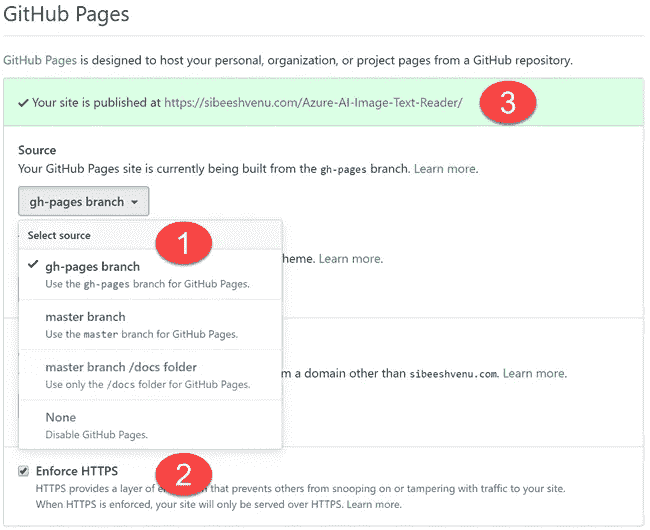

# 将您的 Angular GitHub 存储库发布为 GitHub 页面

> 原文：<https://itnext.io/publish-your-angular-github-repository-as-a-github-page-346a55d87a3?source=collection_archive---------6----------------------->



GitHub 页面设置

# 介绍

在本文中，我们将看到如何将 GitHub 存储库之一发布为 GitHub 页面。我们将讨论我在这样做时遇到的问题，并提供截图。如果您准备好了，让我们继续创建页面。

# 背景

我确信互联网上有许多相关的文章，但其中一些只是解释了实现这一点的步骤，而不是所面临的问题，所以我想我可以写下我在为我的 GitHub 库创建页面时所面临的问题。

# 先决条件

1.  用户/组织 GitHub 帐户
2.  棱角分明的仓库

# 发布 GitHub 页面

# 选择存储库

在此阶段，您可以选择您的配置文件中的任何角度存储库。我将选择我的存储库[Azure-AI-Image-Text-Reader](https://github.com/SibeeshVenu/Azure-AI-Image-Text-Reader)。

# 创建 GitHub 页面

现在让我们构建我们的存储库。请确保更改您的 index.html 文件的基本 href 属性。通常 base href 的值是"/"，现在我们将在构建命令中使用参数
*–base-href*来改变它。

```
ng build --prod --base-href "https://sibeeshvenu.com/Azure-AI-Image-Text-Reader/"
```

我已经为我的用户帐户使用了 GitHub 页面，我也启用了相同的自定义域，这就是我在基础 href 中给出自定义 URL 的原因。在您的情况下，您应该以 https:// <username>.github.io/ <repositoryname>/的形式提供 URL</repositoryname></username>

> *请不要删除 URL 末尾的斜线(/)，并且记住存储库名称区分大小写。*
> 
> *区分大小写的存储库 URL*

上述命令将创建一个新文件夹。如果您使用 angular cli 6 或更高版本，文件夹名称将是 angular.json 文件中指定的项目名称。

```
{
  "$schema": "./node_modules/@angular/cli/lib/config/schema.json",
  "version": 1,
  "newProjectRoot": "projects",
  "projects": {
    "azure-ai-image-text-reader": {
      "root": "",
      "sourceRoot": "src",
      "projectType": "application",
      "prefix": "app",
      "schematics": {
        "@schematics/angular:component": {
          "styleext": "scss"
        }
      }
}
```

在 npm 包 angular-cli-ghpages 的帮助下，我们可以轻松地将构建内容上传到我们的存储库中。

```
npm i angular-cli-ghpages --save-dev
```

然后使用下面的命令。

```
npx ngh --dir=dist/Azure-AI-Image-Text-Reader
```

如果你不确定 npm 和 npx 的区别，推荐你在这里看我的文章[。](https://medium.com/@sibeeshvenu/npm-vs-npx-f737dea2fb4)

这里–dir 属性用于指定生成构建内容的文件夹。请注意，默认情况下，目录名为 dist，因此如果您的 angular cli 版本低于 6，您不需要指定文件夹名。

如果您在运行 ngh 命令时遇到上述错误，请确保您已经安装了软件包

```
PS C:\Users\SibeeshVenu\source\repos\Azure-AI-Image-Text-Reader> npx ngh --dir='dist/azure-ai-image-text-reader' --branch=page
npx: installed 87 in 8.588s
Path must be a string. Received undefined
(node:16984) [DEP0022] DeprecationWarning: os.tmpDir() is deprecated. Use os.tmpdir() instead.
```

一旦任务完成，我们就可以转到我们的存储库设置，并为我们的存储库激活 GitHub 页面。点击设置，进入 GitHub 页面部分。


GitHub 页面设置

现在，您可以转到页面 URL 并检查您的 angular 应用程序是否正确加载。在我的情况下，我可以去网址
[https://sibeeshvenu.github.io/Azure-AI-Image-Text-Reader/](https://sibeeshvenu.github.io/Azure-AI-Image-Text-Reader/)或
[https://sibeeshvenu.com/Azure-AI-Image-Text-Reader/](https://sibeeshvenu.github.io/Azure-AI-Image-Text-Reader/)

# 结论

哇！。现在我们已经知道了，如何发布我们的 GitHub 库的 GitHub 页面。我们还讨论了可能出现的小错误及其补救措施。

你可以在我的博客[这里](https://sibeeshpassion.com/publish-your-angular-github-repository-as-a-github-page/)阅读这篇文章。

# 轮到你了。你怎么想呢?

非常感谢你的阅读。我错过了你认为这篇文章需要的东西吗？你觉得这篇文章有用吗？请不要忘记与我分享您的反馈。

最亲切的问候