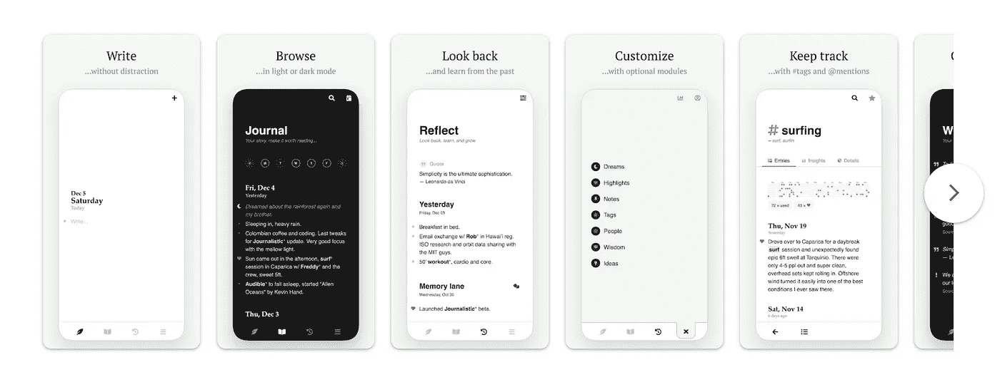
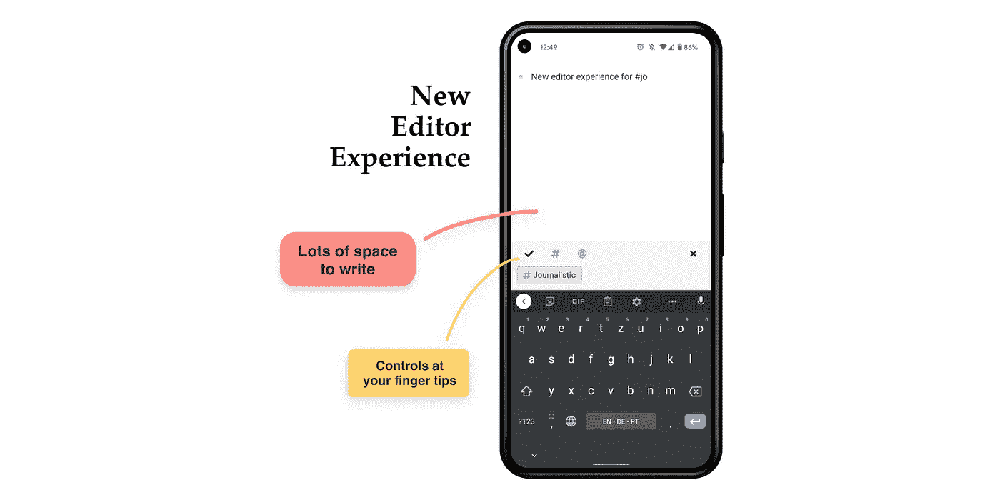

# 在 PlayStore 中发布渐进式网络应用程序(PWA)——什么可行，什么不可行(2021 年)

> 原文：<https://itnext.io/publishing-a-progressive-web-app-pwa-on-the-playstore-what-works-and-what-doesnt-in-2021-c4cfea5a7601?source=collection_archive---------1----------------------->

在过去的一年里，我一直在开发一款微日志应用程序(PWA ),我以为只要有一点点缺陷，用户就会习惯于直接从他们的浏览器安装应用程序，但是，呃……

事实证明他们没有。还没有。

所以当我意识到通过谷歌的[可信网络活动(TWA)](https://developer.chrome.com/docs/android/trusted-web-activity/overview/) 你可以在 PlayStore 上发布一个 PWA 时，我很兴奋。

结果实际上非常棒，你可以在这里查看:[Google Play 上的新闻应用](https://play.google.com/store/apps/details?id=com.journalisticapp.twa)。它像鸭子一样嘎嘎叫，主要是…

新闻 TWA 截图:文本输入，列表，图表，菜单

新闻纸后面的栈是 [Django](https://www.djangoproject.com/) 和 [Nuxt](https://nuxtjs.org/) 。 [nuxt/pwa](https://pwa.nuxtjs.org/) 模块负责 app 端与 pwa 相关的一切:清单、服务人员等。很简单。

如果你使用 [bubblewrap](https://github.com/GoogleChromeLabs/bubblewrap) 的话，生成 app 包也差不多是简单明了的。这个应用程序的签名诡计有一些陷阱，但几个小时后，我设法有了一个工作包，它直接进入了 PlayStore 的审查过程。

事实证明，周六是值得的，现在超过 80%的新注册来自 PlayStore，没有任何美元或分钟用于推广上市(除了谷歌开发者账户的 25€一次性费用)。

要让 web 应用程序真正表现得像本地应用程序一样，需要相当多的黑客攻击，特别是在 CSS 方面，但这可以更好地完成。由于已经有很多关于这个话题的帖子，我就不在这里赘述了。让我们来看看(目前)哪些地方做得不好。

# 扫兴的人

## 导航栏颜色

您可以在应用程序清单中自定义导航栏颜色，但只能是静态的。对于许多应用程序来说，这可能已经足够了，但如果你有一个黑暗模式，并希望用户能够通过应用程序中的设置手动打开/关闭它，你就有问题了。我已经向 bubblewrap 开发者提出了这个问题，这个问题显然是 Chrome 方面缺乏支持。

我已经在一定程度上解决了这个问题，方法是检测并使用默认的系统主题(你可以为亮暗模式指定颜色)。在用户决定手动选择一个主题之前，这样做很有效。如果设备处于黑暗模式，选择的主题是“光”，事情没有那么糟糕，你在底部得到一个黑条，不理想，但也不太坏。但如果设备处于亮模式，用户选择了暗主题，他们会得到一个底部有白条的暗应用，这真的不酷。

## 状态栏颜色

你也可以自定义状态栏的颜色，甚至动态地，直到再次，黑暗模式。当设备处于黑暗模式时，它总是使用奇怪的深灰色作为状态栏的背景，这就产生了一个问题:“为什么？！!"。同样的问题，局限在 Chrome 这边。

## 表演

Javascript 是单线程的。您可以使用 web workers 实现多线程，但是对于大多数用例来说，它们不会带来任何好处，对于其他人来说，实现起来相当棘手。因此，与原生应用程序相比，TWA 会感觉笨拙，反应较慢。尤其是滚动动画、图表渲染、aso。可以引进相当一些滞后和妥协的 UX。

## 文本输入

文本输入通常是移动设备上的一个大问题，如果你在浏览器中，这个问题会变得更糟。虽然你对原生应用中的输入元素有一些控制，但处理`<textarea/>`简直是一场噩梦。最重要的是，你无法控制甚至不知道软键盘在做什么。最终你将不得不调整(并且可能妥协)你的设计来应对这种怪异。

啊，对了，如果你在底部有一个导航条，那你就完蛋了。

使用控件进行文本输入的新闻 UX 示例

## 货币铸造

[谷歌目前正在 Chrome (88 和 89)](https://developer.chrome.com/docs/android/trusted-web-activity/play-billing/) 进行测试，通过[支付请求](https://developers.google.com/web/fundamentals/payments)和[数字商品](https://github.com/WICG/digital-goods/blob/master/explainer.md)API 整合播放计费。这无疑是朝着正确方向迈出的一大步，但在得到完全支持之前，可能还需要一点时间。

如果你想让你的应用程序赚钱，这可能是交易的破坏者，即使 Play Billing 最终完全可用，你仍然必须承担整合两个不同支付系统的负担，谷歌的一个和你用于网络应用程序的一个( [Stripe](https://stripe.com/) 或其他)。

## 数据存储

你当然可以使用本地存储，就像在浏览器中一样，但如果用户删除了他们的 Chrome 存储，也会删除你应用程序的数据，这是大多数用户肯定不会想到的。到目前为止，我还没有找到一种方法来解决这个问题，但 tbh 也没有寻找很多。

## 恼人的“在 Chrome 中运行”横幅

当第一次打开应用程序时，TWA 将显示一个横幅，通知用户它正在哪个浏览器中运行。这在我看来完全没有必要，也很烦人。它只是混淆了用户，给人一种“假”应用的印象。更好的选择是，如果应用程序安装的浏览器不是默认浏览器，则只显示横幅。

## 设备 API

Chrome 已经支持了很多设备 API(例如，远远超过 Safari ),但是仍然缺少一些重要的 API，而且有些 API 的 UX 非常糟糕。例如，如果你想通过 BLE 接入蓝牙，Chrome 会在配对过程中弹出一个难看的浏览器菜单。

# 总而言之

总而言之，根据您的使用情况，您已经可以获得非常接近本地的体验。大多数悬而未决的问题都很烦人，但都是小问题，在 Chrome 上很容易解决。可悲的是，这里的进展相当缓慢。

从长远来看，我认为上述性能问题是 pwa 相对于其本地同行的最大限制，问题是 web 技术和框架方面的进步是否能够缩小差距。

# 白日梦

## 谷歌浏览器

我希望在未来 Chrome 将支持状态的动态主题化——以及通过 meta 标签(文本和背景颜色)的导航栏，并摆脱黑暗模式中的怪异行为。

移除“在 Chrome 中运行”的横幅或者为它引入一个更加用户友好的 UX 也将是令人惊叹的。

我不确定这是否可能，但是给 TWAs 他们自己的本地存储和 cookies，独立于 Chrome，将是完全病态的。

## 支付

难道就不能有一个你可以集成的 API，当有人买东西时，它自动计算出谁得到他们的那份？💭