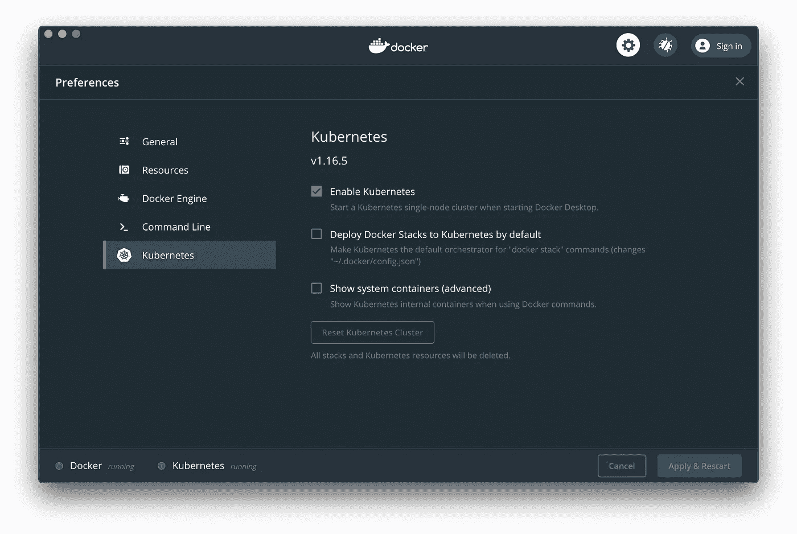
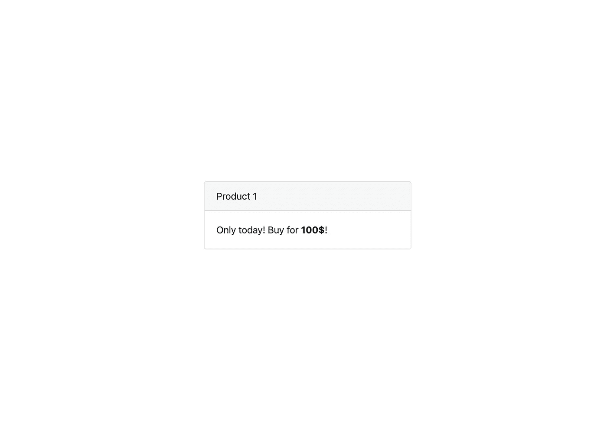

# 让我们将 Symfony 项目迁移到 Kubernetes！第 2 部分:用 Helm 发布应用程序。

> 原文：<https://itnext.io/publishing-symfony-application-with-helm-ecb525b34289?source=collection_archive---------0----------------------->

# 关于这个系列

在这个系列中，我们将讨论现有 Symfony 项目到 Kubernetes (K8s)的迁移。无论您当前在何处以及如何发布您的应用程序:裸机、VM 或容器编排平台，通过遵循本指南，您将能够将其部署到 K8s 集群。

这些 **how to** 文章的目标读者是那些已经了解 Kubernetes、Docker 和持续集成(CI)的一些基础知识、想要学习新技巧或者只想完成工作的人。

本系列的每一部分都致力于一个特定的主题:[构建 Docker 环境](/containerizing-symfony-application-a2a5a3bd5edc)，[在不同的级别上测试应用程序](https://medium.com/@babenko.i.a/testing-symfony-application-d02317d4018a)，使用 Helm 将应用程序部署到 Kubernetes，[构建 CI 管道](https://medium.com/@babenko.i.a/building-continuous-delivery-pipeline-2cc05e213935)。

# 关于第 2 部分

Kubernetes 提供了许多对象来管理您的应用程序:部署、服务、入口、CronJob 等。由于每个对象都必须在一个 YAML 文件中描述，所以在一个大项目中管理配置文件可能会让人不知所措。您最终可能会对相同的资源类型进行大量的复制粘贴。这可能会导致一种感觉，事情不再受控制。维护成为一项艰巨的任务。

就这样，直到赫尔姆出现。它提供了图表，有助于定义您的应用程序并将其发布到 Kubernetes。

在本文中，我们将创建一个 Helm 图表，利用 Helm 模板的强大功能，并讨论不同环境下的应用程序配置。

# 关于虚拟项目

我为这个系列准备了一个简单的 Symfony 4 应用程序。它需要 PHP-FPM，Nginx 和 MySQL 来运行。更多详情，请参考[第 1 部分](/containerizing-symfony-application-a2a5a3bd5edc)。

# 创建舵图

您可以将 Chart 视为一个包，而 Helm 本身则是一个包管理器。每个图表描述了相关的 Kubernetes 资源，其结构如下:

让我们从在虚拟项目的根目录中创建 **helm** 文件夹并在 **Chart.yaml** 文件中描述我们的包开始:

我们可以使用**。helmignore** 文件通知 Helm，我们不想处理某些特定的文件:

在集群中运行我们的项目所需的 Kubernetes 资源在 **templates** 文件夹中描述。在我们的例子中，我们只需要 3 种类型的对象:

*   **部署**描述了要在集群中创建的 pod。尽管每个 pod 可能由几个容器组成，但更常见的方法是每个 pod 有一个容器。这就是为什么在本教程中，您可以将 pod 视为一个容器。
*   **服务**实现吊舱之间的通信。
*   **入口**向外部客户端公开服务。

# 模板

而不是分别描述每个资源(即 Nginx 部署、PHP-FPM 部署等。)，我们将为每种对象类型创建可配置的模板，然后将它们应用于相关服务:Nginx、PHP-FPM、MySQL。

## **部署模板**

让我们从部署模板开始，因为它是我们的应用程序中最重要的对象。通过遵循最佳实践，我创建了包含以下内容的 **deployment.tpl** 文件:

每个模板都包裹在**定义**块中:

实际模板以对象类型和名称开始:

注意，我们在这里和那里使用变量: **.service.name** ， **.service.replicas** 等等。在 YAML 文件中包含模板时，可以向 include 命令传递字典。**、**的点字符，即前缀**、**的变量名是对该字典的引用。

在上一节中，我们指示集群用容器形成一个 pod，这些容器标有服务名，并定义所需的副本数量。

在**模板**部分，我们定义了如何创建和标记容器。让我们仔细看看容器的定义:

我们为每个容器提供名称、要使用的图像和从注册表中提取图像的条件。在 **resources** 部分中，如果配置的资源可用，我们指示集群启动容器，如果容器超出 CPU 和内存限制，则指示集群终止容器。至于环境变量，我们有两个可能的配置选项:使用普通值，使用 Kubernetes secrets。

完成模板后，我们可以为我们的服务创建部署 YAML 文件:

*   **PHP-fpm . deployment . YAML**:

*   mysql.deployment.yaml :

*   **nginx.deployment.yaml** :

## 服务模板

既然我们创建了 pod，下一步就是实现它们之间的通信。但是在我们实际定义服务之前，让我们在 **service.tpl** 文件中创建一个新模板:

它与我们已经在部署模板中看到的非常相似:资源类型和元数据。在 **spec** 部分，我们为一个 pod 分配了一个内部集群 IP 地址，该地址标有服务名，并公开了它的一个端口。

事不宜迟，让我们来定义应用服务:

*   **php-fpm.service.yaml** :

*   **mysql.service.yaml** :

*   nginx.service.yaml :

## 入口模板

因为我们的应用程序必须可以从外部访问，所以我们需要创建一个入口对象。下面是 **ingress.tpl** 文件内容:

根据路径，每个入口规则将主机映射到一个或多个服务。在我们的例子中，我们将所有请求转发给一个服务。

让我们通过在 **nginx.ingress.yaml** 文件中创建一个 Ingress 资源来使 Nginx 服务从外部可用:

## 配置

你可能会想，那些是什么**。值**变量，我们在 YAML 文件中使用的那个？嗯，**点字符**是主图表字典，**值**是配置，在 **values.yaml** 文件中定义:

我相信这个配置是不言自明的，但是如果你非常细心，你可能已经注意到，我们在模板中使用的一些变量(例如 **nginx.host** 和 **imageTag** )并没有出现在 **values.yaml** 文件中。我们希望某些配置是动态的，因为它可能因环境而异。这些动态值可以直接传递给 Helm upgrade 命令，我们将使用它来发布图表。

# 发布图表

我们完成了图表，并准备将其发布到 K8s 集群。如果您尚未在 Docker Desktop 中启用 Kubernetes，请转到**首选项- > Kubernetes** 并标记**启用 Kubernetes** 选项。

如果您使用的是 Mac OS，可以使用 Homebrew 安装 Kubernetes CLI (kubectl)和 Helm:

现在，让我们通过为我们的项目创建一个新的名称空间来配置集群:

添加数据库机密:

启动入口控制器，如这里所述:

在我们最终发布图表之前，我想提一下，我们在本系列的[前一部分](/containerizing-symfony-application-a2a5a3bd5edc)中构建的图像已经用最后一个提交散列进行了标记，并被推送到 Docker Hub。记住这一点，让我们安装图表:

注意，我们在 Helm 命令中指定了一些环境变量、主机名和图像标签。当您想要在多个集群上安装具有不同配置的相同图表时(例如，转移和生产)，这很有用。

要访问本地机器上的应用程序，我们需要将域记录添加到 **hosts** 文件中:

现在，您可以在浏览器中打开 http://symfony-dummy-project.io/products/1 的[并查看产品页面:](http://symfony-dummy-project.io/products/1)

# 下一步是什么？

我们已经成功地将虚拟项目部署到 K8s 集群，并准备好处理持续集成(CI)主题。但是在我们开始建造管道之前，[让我们在下一部分](https://medium.com/@babenko.i.a/testing-symfony-application-d02317d4018a)谈论测试。

感谢您的阅读，下次再见！