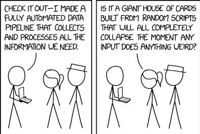
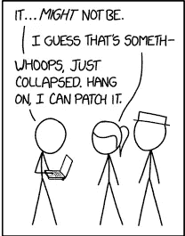
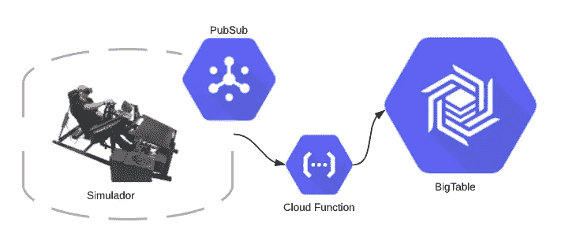
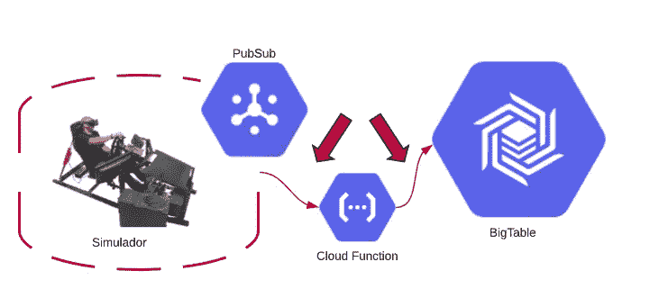
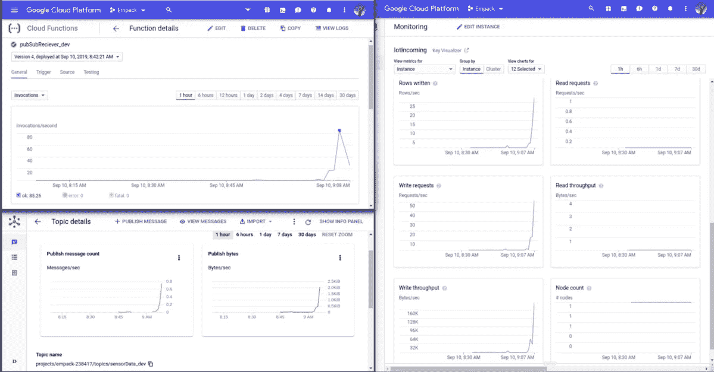
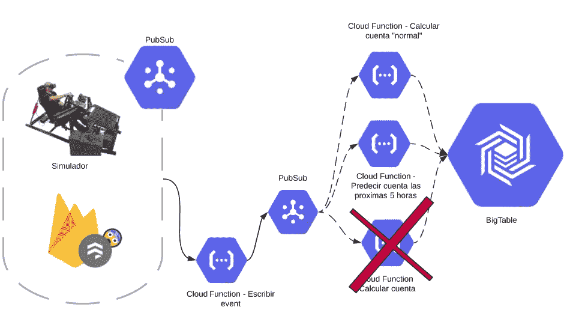

# 从 PubSub 到 BigTable——通过 GCP 云函数将数据流管道化

> 原文：<https://itnext.io/pubsub-to-bigtable-piping-your-data-stream-in-via-gcp-cloud-functions-a2ef785935b5?source=collection_archive---------3----------------------->

今天，阅读、编写、发布实现无服务器 ETL 所需的代码。



你的老板刚刚宣布，你将在所有东西上安装物联网传感器……我指的是所有东西。现在，您已经收集了所有数据并将其写入数据库。与此同时，前端团队告诉您他们需要亚秒级的响应时间。高管们不断抛出“无服务器”和“NoSQL”这样的时髦词汇……如果你不抓紧时间，他们会开始要求“机器学习”和“区块链”

下面是一个简单的、可扩展的、无服务器的数据移动解决方案。它不像 Dataflow 那样做所有的技巧和翻转，但它实现起来更快，易于团队合作，并且不需要您学习 Apache Beam。



TL；GitHub repo 博士在[这里](https://krapes.github.io/pubsub_bigtable/)可用。

# 设置

## 物联网— PubSub — CloudFunction — BigTable



## 定义

***—服务***

1.  **PubSub**

PubSub 是由 GCP 提供的发布者-订阅者消息服务。把它想象成 AWS 世界的 SNS 或者开源社区的 Kafka。完全托管的服务可以在拉或推设置中使用。在拉取场景中，系统充当各种队列，应用程序在其中拉取消息并确认它们被成功处理。在 push 情况下，PubSub 自动将消息推送到订阅端点(在我们的例子中是云函数)，并在函数终止时收到确认(不管它是以“ok”还是“crash”终止)。

2.**云函数**

云函数是无服务器的计算包，允许开发人员在事件触发时运行一些无状态代码(想想 AWS Lambda)。

3. **BigTable**

BigTable 是一个托管 NoSQL 数据库。它使用单个密钥存储库，允许请求延迟低于 10ms。

4.**无服务器框架**

无服务器框架是一个用于无服务器应用程序的开源部署框架。对于这个项目，我们将使用它来创建和部署 GCP 资源。在实践中，这个框架允许可靠的测试，因为相同的资源和配置可以应用于所有的开发、测试和生产环境。

***—连接***



1.  **物联网(模拟器)——PubSub**

这个演示中的物联网是基于谷歌公开的 *NYC Taxi* 数据集的模拟设备。 *mock_sensorData.py* 脚本将通读 CSV 文件，并以事件最初发生时的速度发布事件(如时间戳所示),也可以将事件更改为该速度的一个因素。例如，如果我们希望看到一系列事件更快地展开，我们可以将 *—速度因子*参数更改为 60，表示 1 分钟内将处理 1 小时的数据。事件作为 PubSub 消息发布在 *sensorData_STAGE* 主题上，稍后将由云函数获取。

2. **PubSub — CloudFunction**

对于这个项目，我们将使用一个订阅 PubSub 主题的云函数和一个在消息发布时启动该函数的自动触发器。

3. **CloudFunction — BigTable**

为了执行 ETL 和存储数据，云函数将事件消息的内容写入文件。该事件将与一个主键一起存储，该主键是专门为最常见的访问模式提供最佳响应时间而构建的。有关构造分区键的更多信息，请查看 Google 的 [*模式设计*](https://cloud.google.com/bigtable/docs/schema-design) 页面。

# 履行

## [无服务器框架服务](https://serverless.com/framework/docs/providers/google/guide/installation/)

***—安装包***

从零开始构建服务，首先安装带有 npm 的 [*无服务器框架*](https://serverless.com/framework/docs/providers/google/guide/installation/) 。

```
$npm install -g serverless
```

***—创建服务***

接下来，使用“create”命令创建一个基本的 python 服务。

```
$sls create --template google-python --path my-service
```

***—基础解剖学***

这将生成包含 serverless.yml 和 main.py 文件的样板文件包。

*   *Serverless.yml*

YML 文件是提供设置和部署服务所需的任何和所有信息的基础。在文件内部，定义了名称、区域、提供者以及函数、API 端点、触发器和基础设施等内容。

*   *GCP 插件*

无服务器框架通过调用 Google 的 API 端点进行基础设施建设来运行。为了正常工作，必须安装 GCP 插件。

```
$npm install --save serverless-google-cloudfunctions
```

*   *访问键*

现在你需要向 Google 证明你是一个真正的开发者，而不是一个试图用一些疯狂的 ETL 函数统治世界的黑客。在 IAM 控制台中创建自己的凭证，将秘密令牌 JSON 文件保存在安全的位置，并将文件路径粘贴到 severless.yml 的凭证部分。yml 被设置为在您的主目录中查找与您的项目同名的 JSON)

```
**serverless.yml**
credentials: ~/${self:provider.project}.json
```

## 云函数

***—编写处理程序***

*server less-Google-cloud functions*插件通过一个名为 *main.py* 的 python 文件引导所有流量。虽然这对于小项目来说可能没什么问题，但我发现当我试图管理*开发、测试、生产*环境时，它的装备很差。到目前为止，我发现的最佳解决方案是通过 *main.py* 文件将事件流定向到单独的 **_handler.py* 文件。

```
## main.py ##import pubSubReciever_handler
import mock_sensorData_handlerdef pubSubReciever_dev(event, context):
  return pubSubReciever_handler.main(event, context)
def pubSubReciever_test(event, context):
   return pubSubReciever_handler.main(event, context)
def pubSubReciever_prod(event, context):
   return pubSubReciever_handler.main(event, context)def mock_sensorData_dev(event):
   return mock_sensorData_handler.main(event)
def mock_sensorData_test(event):
   return mock_sensorData_handler.main(event)
def mock_sensorData_prod(event):
   return mock_sensorData_handler.main(event)
```

***—读取来电信息***

一旦您的函数设置好了，它需要做的第一件事就是读取 Pubsub 消息。从解码出 *base64 开始。*。

```
data = base64.b64decode(event['data']).decode('utf-8')
print("DATA: {}".format(data))
```

***—写入 BigTable***

有了数据之后，函数可能会做一些非常酷的转换，然后需要将结果写入 BigTable。

```
def writeToBigTable(table, data): timestamp = data['event']['date']
    rts = reverseTimestamp(timestamp)
    row_key = '{}'.format(rts).encode()
    row = table.row(row_key)
    for colFamily in data.keys():
        for key in data[colFamily].keys():
            row.set_cell(colFamily,
                         key,
                         data[colFamily][key],
                         timestamp=timestamp)
    table.mutate_rows([row])
    return data
```

## 公共订阅

***—将物联网事件写成题目***

这个项目的目标是通过管道将数据流导入 BigTable。因此，要开始整个事情，你需要将你的物联网数据发布到 Pubsub。就像云功能中的消息解码一样，所有的数据在发布之前都需要进行编码。

```
def publish(publisher, topic, events):
   numobs = len(events)
   if numobs > 0:
       logging.info('Publishing {0} events from {1}'.format(numobs, get_timestamp(events[0])))
       for event_data in events:
         publisher.publish(topic,event_data)
```

# 齐心协力

***—创建话题***

零零碎碎的东西做好之后，就该把整个东西组装起来了。首先在 serverless.yml 的资源部分创建一个主题

```
- name: mock_SensorData_${self:provider.stage}
  type: gcp-types/pubsub-v1:projects.topics
  properties:
    topic: sensorData_${self:provider.stage}
```

***—订阅功能***

接下来，在 functions 部分创建云函数，并为其订阅主题。

```
pubSubReciever:
    handler: pubSubReciever_${self:provider.stage}
    events:
      - event:
          eventType: providers/cloud.pubsub/eventTypes/topic.publish
          resource:       projects/${self:provider.project}/topics/sensorData_${self:provider.stage}
```

***——***创建表格

最后，回到参考资料，声明 BigTable 集群并定义它的列。

```
- type: gcp-types/bigtableadmin-v2:projects.instances
      name: projects/${self:provider.project}/instances/iotincoming
      properties:
        parent: projects/${self:provider.project}
        instanceId: iotincoming
        clusters:
          iotcluster:
            defaultStorageType: HDD
            location: projects/${self:provider.project}/locations/${self:provider.region}
        instance:
          displayName: IotIncoming
          type: DEVELOPMENT
    - type: gcp-types/bigtableadmin-v2:projects.instances.tables
      name: incomingraw_${self:provider.stage}
      properties:
        parent: projects/${self:provider.project}/instances/iotincoming
        tableId: incomingraw_${self:provider.stage}
        table:
          granularity: MILLIS
          columnFamilies:
            event:
              gcRule:
                maxNumVersions: 2
```

***—部署和执行***

现在已经准备好实现你老板所有的 ETL 梦想了。要部署，运行一个快速的 *sls deploy* ，然后通过发布到 Pubsub 主题开始流式传输您的数据。

```
$sls deploy --project PROJECTNAME$curl --header "Content-Type: application/json" \
  --request POST \
  --data '{"limit": NUMER_OF_EVENTS, "speedFactor": VELOCITY_OF_SIMULATION, "project": PROJECT_NAME}' \
  https://REGION-PROJECT_NAME.cloudfunctions.net/FUNCTION_NAME_STAGE_NAME
```

# 收集你的劳动成果

***—从表中读取***

当一切都结束并且尘埃落定之后，您将可以访问 BigTable 中的数据。Google 的 BigTable 白皮书中列出了一些不同的选项，但我们发现最有用的方法是将数据流式传输到字典中。

```
from google.cloud import bigtable
from google.cloud.bigtable import column_family
from google.cloud.bigtable import row_filters

client = bigtable.Client(project=project_id, admin=True)
instance = client.instance(instance_id)
table = instance.table(table_id)

def streamToDict(partial):
    def dc(byte):
        return byte.decode("utf-8")
    newDict = {}
    for row in partial:
        newDict[dc(row.row_key)] = {}
        for col in row.cells.keys():
            newDict[dc(row.row_key)][col] = {}
            for key in row.cells[col].keys():
                newDict[dc(row.row_key)][col][dc(key)] = dc(row.cells[col][key][0].value)
    return newDict

partial = table.read_rows(limit=3)
response = streamToDict(partial)
for key in response.keys():
    print(response[key])
    print()
```

# 结论

要查看完整的实现*，请参见 [GitHub 页面](https://krapes.github.io/pubsub_bigtable/)。*



***—性能***

这项服务能够以亚秒级的速度接收、处理和存储所有数据。我们注意到的唯一缺点是 PubSub 不保证消息按顺序传递。这意味着，有时，如果我们读的速度和写的速度一样快，我们会看到数据点 A 和 C，然后在下一次读取时，我们会看到 A、B 和 C。在我们的例子中，BigTable 键被设计为创建日期时间顺序，我们不需要在数据点被写入 PubSub 后几毫秒读取数据点，所以这没什么大不了的。然而，这是需要记住的事情。

***—展望***

展望未来，这个 ETL 为扇出架构提供了一个很好的基础。为特定任务构建更多函数并将 PubSub 主题链接在一起的能力使得顺序和并行处理成为可能。而云功能的隔离性质使得该服务非常适合与团队合作，并且在其中一个流程失败时也很健壮。

