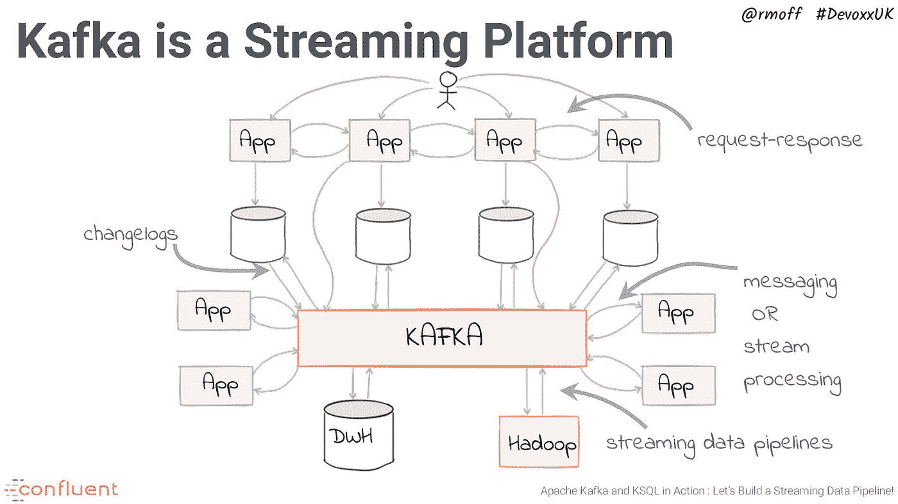
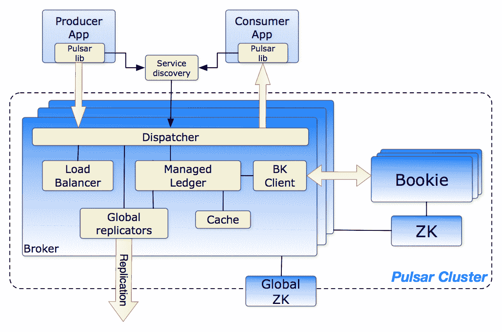
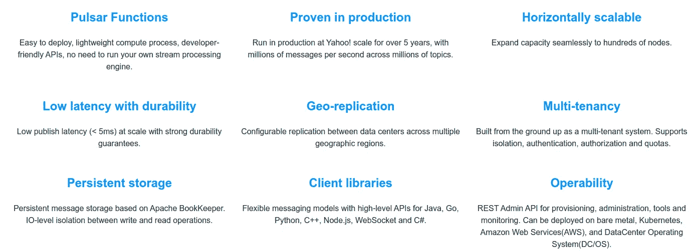
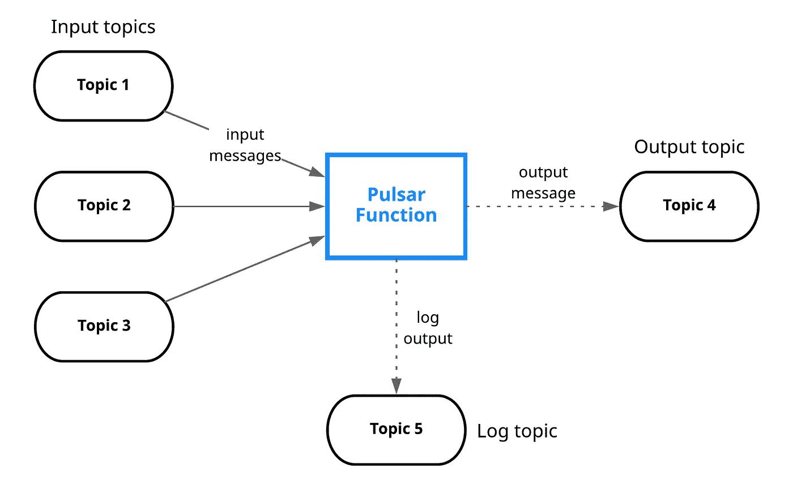
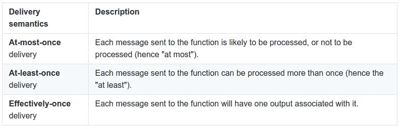

# 脉冲星优于卡夫卡

> 原文：<https://itnext.io/pulsar-advantages-over-kafka-7e0c2affe2d6?source=collection_archive---------0----------------------->


迈克尔·克里斯滕森在 [Unsplash](https://unsplash.com?utm_source=medium&utm_medium=referral) 上的照片

# 介绍

最近，我一直在看 [**脉冲星**](https://pulsar.apache.org/) 以及它与 [**卡夫卡**](https://kafka.apache.org/) **的对比。**快速搜索一下，你会发现两个最著名的开源消息系统之间正在进行一场*战争*。

作为一名 Kafka 用户，我确实为 Kafka 的一些问题感到困惑，我对 Pulsar 非常感兴趣。所以最后，我设法有一些时间来玩它，我做了相当多的研究。在这篇文章中，我将重点关注**脉冲星的优势**，并给你一些你应该考虑它而不是卡夫卡的理由。但是让我们明确一下，在生产使用、支持、社区、文档等方面；Kafka 明显优于 Pulsar，只有当本文中讨论的大多数优势符合您的用例时，我才会考虑 Pulsar。让我们开始吧！

# 《果壳中的卡夫卡》

卡夫卡是信息系统之王。它由 LinkedIn 于 2011 年创建，由于得到了 [**Confluent**](https://www.confluent.io/) 的支持而得以广泛传播，后者向开源社区发布了许多新功能和附加组件，如用于模式进化的**模式注册表**、用于从数据库等其他数据源轻松传输到 Kafka 的 **Kafka Connect** 、用于分布式流处理的 **Kafka Streams** 以及最近用于执行 SQL 的 **KSQL** 它也有许多到许多系统的连接器，检查[汇合**平台**](https://de.confluent.io/product/confluent-platform/platform-ecosystem/) 了解更多细节。

**Kafka 速度快，易于设置，非常受欢迎**，可用于广泛的范围或用例。虽然从开发人员的角度来看，Apache Kafka 一直很友好，但它在操作上却是一个大杂烩。所以，让我们回顾一下卡夫卡的一些痛点。



卡夫卡的例子。来源:[https://talks.rmoff.net/pZC6Za/slides](https://talks.rmoff.net/pZC6Za/slides)

## 卡夫卡的痛点

*   **扩展 Kafka 很棘手，**这是由于耦合架构，其中代理也存储数据。剥离另一个代理意味着它必须复制主题分区和副本，这非常耗时。
*   没有租户完全隔离的本机多租户。
*   存储可能会变得非常昂贵，尽管您可以长时间存储数据，但由于成本问题，很少使用它。
*   如果副本不同步，可能会丢失消息。
*   你必须提前计划和计算代理、主题、分区和副本的数量(适应计划的未来使用增长)以避免扩展问题，**这是极其困难的。**
*   如果您只需要一个消息传递系统，那么使用偏移量可能会很复杂。
*   集群再平衡可以影响连接的生产者和消费者的性能。
*   [**MirrorMaker**](https://cwiki.apache.org/confluence/pages/viewpage.action?pageId=27846330) Geo 复制机制有问题。像优步这样的公司已经创造了他们自己的解决方案来克服这些问题。

如你所见，大多数问题都与**操作方面**有关。虽然 Kafka 的设置相对容易，但它很难管理和调整。此外，它并不像它应该的那样灵活和有弹性。

# 一言以蔽之，脉冲星

**Pulsar** 由**雅虎**于 2013 年创建，并于 2016 年捐赠给阿帕奇基金会。Pulsar 现在是 Apache 的顶级项目。雅虎、威瑞森、推特以及其他公司在生产中使用它来处理数百万条信息。它有许多功能，而且非常灵活。它声称比卡夫卡更快，因此运行起来更便宜。它旨在解决 Kafka 的大部分痛点，使其更容易扩展。

脉冲星非常灵活；它可以像**卡夫卡**一样充当分布式日志，也可以像 [**RabbitMQ**](https://www.rabbitmq.com/) 一样充当纯消息传递系统。它有多种类型的订阅、多种交付保证、保留策略和多种处理模式演变的方法。它还有一大堆功能…



Pulsar 架构:[https://pulsar . Apache . org/docs/en/concepts-architecture-overview/](https://pulsar.apache.org/docs/en/concepts-architecture-overview/)

## [脉冲星特征](https://pulsar.apache.org/docs/en/concepts-overview/)

*   **多租户**内置，不同的团队可以使用同一个集群，并被隔离。这解决了许多管理难题。它支持隔离、认证、授权和配额。
*   **多层架构** : Pulsar 将所有主题数据存储在由[**Apache BookKeeper**](https://bookkeeper.apache.org/)**提供支持的专门数据层中，作为数据分类账。存储和消息传递的分离解决了扩展、重新平衡和维护集群的许多问题。它还提高了可靠性，使数据几乎不可能丢失。此外，在读取数据时，您可以直接连接到 **Bookeeper** 而不影响实时接收。例如，您可以使用 **Presto** 对您的主题执行 SQL 查询，类似于 KSQL，但是不会影响实时数据处理。**
*   ****虚拟话题**。由于 n 层架构，主题数量没有限制，主题与其存储解耦。您还可以创建非持久性主题。**
*   ****N 层存储**。卡夫卡的一个问题是，存储会变得昂贵。因此它很少用于存储“冷”数据，消息经常被删除。Apache Pulsar 通过分层存储，可以自动将较旧的数据移动到亚马逊 S3，或者其他任何深度存储系统；并且仍然向客户端呈现透明的视图；客户端可以从头开始读取，就好像所有消息都出现在日志中一样。**
*   **[**脉冲星功能**](https://pulsar.apache.org/docs/en/functions-overview) **。易于部署、轻量级计算流程、开发人员友好的 API，无需像 Kafka 那样运行自己的流处理引擎。****
*   **安全:它有一个内置的代理，多租户安全，可插入的认证等等。**
*   ****快速重平衡**。分区被分割成易于重新平衡的段。**
*   ****服务器端去重和死字**。无需在客户端执行此操作，也可以在压缩期间执行重复数据消除。**
*   ****内置于模式注册表**。支持多种策略，非常容易使用。**
*   ****地理复制和内置发现。**将集群复制到多个区域非常容易。**
*   ****集成负载平衡器和普罗米修斯指标**。**
*   ****多重整合**:卡夫卡，RabbitMQ 等等。**
*   **[**加密**](https://pulsar.apache.org/docs/en/security-encryption/) 支持。**
*   **支持许多编程语言，如 GoLang，Java，Scala，Node，Python…**
*   **客户端不需要知道碎片和数据分区，这是在服务器端透明完成的。**

****

**功能列表:[https://pulsar.apache.org/](https://pulsar.apache.org/)**

**如你所见，**脉冲星有很多有趣的特征。****

# **脉冲星手动操作**

**Pulsar 的[入门](https://pulsar.apache.org/docs/en/standalone/)相当容易。确保你已经安装了 **JDK** ！**

1.  **下载 Pulsar 并解压:**

```
$ wget https://archive.apache.org/dist/pulsar/pulsar-2.6.1/apache-pulsar-2.6.1-bin.tar.gz
```

**2.下载连接器(可选):**

```
$ wget https://archive.apache.org/dist/pulsar/pulsar-2.6.1/connectors/{connector}-2.6.1.nar
```

**3.下载 nar 文件后，将文件复制到 pulsar 目录中的`connectors`目录**

**4.启动脉冲星！**

```
$ bin/pulsar standalone
```

**Pulsar 提供了一个名为`[**pulsar-client**](https://pulsar.apache.org/docs/en/reference-cli-tools#pulsar-client)`的 CLI 工具，我们可以用它来与集群交互。**

**要生成消息:**

```
$ bin/pulsar-client produce my-topic --messages "hello-pulsar"
```

**要阅读邮件:**

```
$ bin/pulsar-client consume my-topic -s "first-subscription"
```

## **Akka 流示例**

**作为客户端示例，让我们使用 [**Pulsar4s**](https://github.com/sksamuel/pulsar4s#akka-streams) 和 [**Akka**](https://akka.io/) ！**

**首先，我们需要创建一个**源**来消费数据流，所需要的只是一个函数，它将按需创建一个消费者和要寻找的消息 id:**

```
val topic = Topic("persistent://standalone/mytopic")
val consumerFn = () => client.consumer(ConsumerConfig(topic, subscription))
```

**然后，我们通过`consumerFn` 函数来创建源:**

```
import com.sksamuel.pulsar4s.akka.streams._
val pulsarSource = source(consumerFn, Some(MessageId.earliest))
```

**Akka 源的物化值是一个`Control`的实例，该对象提供了一个方法“ *close* ”，该方法可用于停止使用消息。现在，我们可以像往常一样用 [**Akka Streams**](https://doc.akka.io/docs/akka/current/stream/index.html) 处理数据。**

**要创建**水槽**:**

```
val topic = Topic("persistent://standalone/mytopic")
val producerFn = () => client.producer(ProducerConfig(topic))import com.sksamuel.pulsar4s.akka.streams._
val pulsarSink = sink(producerFn)
```

**完整示例摘自 [**Pulsar4s**](https://github.com/sksamuel/pulsar4s/blob/master/pulsar4s-akka-streams/src/test/scala/com/sksamuel/pulsar4s/akka/streams/Example.scala) :**

## **脉冲星函数示例**

**Pulsar 函数处理来自一个或多个主题的消息，对其进行转换，并将结果输出到不同的主题:**

****

**脉冲星功能。来源:https://pulsar.apache.org/docs/en/functions-overview/**

**您可以在两个接口之间选择来编写您的函数:**

*   ****语言本地接口**:不需要特定于 Pulsar 的库或特殊依赖。您无法访问上下文。仅支持 **Java** 和 **Python** 。**
*   ****Pulsar 函数 SDK** :可用于 Java/Python/Go，提供更多功能，包括访问上下文对象。**

**使用语言的本地接口非常容易，你只需编写一个简单的函数来转换消息:**

```
def process(input):
    return "{}!".format(input)
```

**这个用 **Python** 编写的简单函数只是给所有传入的字符串添加一个感叹号，并将结果字符串发布到一个主题。**

**要使用 SDK，您需要导入依赖项，例如在 **Go** 中，我们将编写:**

```
package main

import (
    "context"
    "fmt"

    "github.com/apache/pulsar/pulsar-function-go/pf"
)

func HandleRequest(ctx context.Context, in []byte) error{
    fmt.Println(string(in) + "!")
    return nil
}

func main() {
    pf.Start(HandleRequest)
}
```

**为了发布无服务器功能并将其部署到集群，我们使用 *pulsar-admin* CLI，对于 Python，我们将使用:**

```
$ bin/pulsar-admin functions create \   
--py ~/router.py \   
--classname router.RoutingFunction \   
--tenant public \   
--namespace default \   
--name route-fruit-veg \   
--inputs persistent://public/default/basket-items
```

**Pulsar 函数的一个很大的特点就是可以在发布函数的时候设置交付保证:**

```
$ bin/pulsar-admin functions create \   
--name my-effectively-once-function \   
--processing-guarantees EFFECTIVELY_ONCE 
```

**您有以下选择:**

****

**Pulsar 函数在 Pulsar 集群上运行，因此您不必像 Kafka Streams 应用程序那样管理它们的部署。**

# **脉冲星的优势**

**让我们回顾一下相对于卡夫卡的主要优势:**

*   ****更多功能** : Pulsar 功能、多租户、模式注册、n 层存储、多消费模式、持久化模式等。**
*   ****更灵活** : 3 种订阅类型(独占、共享、故障转移)，一次订阅可以听多个话题。持久性选项:非持久(快速)、持久、压缩(每条消息只有最后一个密钥)。你可以选择送货担保，它有服务器端的重复数据删除和死字。许多保留策略和 TTL。**
*   ****无需提前定义您的扩展需求。****
*   **支持**排队和分流**。所以它可以像 RabbitMQ 或者卡夫卡一样。**
*   **因为存储与代理分离，所以它的伸缩性更好。再平衡更快更可靠。**
*   ****更容易** [**操作**](https://pulsar.apache.org/docs/en/admin-api-overview/) :得益于 de 耦合和 n 层存储。另外，admin REST API 也很棒。**
*   ****SQL 与 Presto** 集成，直接查询存储而不影响代理。**
*   ****更便宜的存储**得益于 n 层自动化存储选项。**
*   ****更快**:许多[性能指标评测](https://medium.com/swlh/performance-comparison-between-apache-pulsar-and-kafka-latency-79fb0367f407)显示出在各种场景下都有更好的性能。Pulsar 声称具有更低的延迟和更好的扩展能力。然而，这正受到[汇流](https://www.kai-waehner.de/blog/2020/06/09/apache-kafka-versus-apache-pulsar-event-streaming-comparison-features-myths-explored/)的挑战，所以对此持保留态度，做你自己的基准。**
*   ****Pulsar 功能**为您的信息平台带来无服务器计算。无需管理部署。**
*   **集成的**模式注册中心**支持简单的模式进化**
*   **集成负载平衡器和普罗米修斯指标。**
*   **[**加密**](https://pulsar.apache.org/docs/en/security-encryption/) 支持。**
*   ****地理复制**效果更好，也更容易设置。脉冲星也有内在的发现能力。**
*   **您可以创建的主题数量没有限制。**
*   **兼容卡夫卡，易于集成。**

## **脉冲星星座**

**脉冲星并不完美，卡夫卡受欢迎是有原因的，它做一件事，而且做得很好。Pulsar 试图解决太多的领域，但没有一个领域能超越。让我们总结一下脉冲星的一些问题:**

*   ****人气**:脉冲星没那么受欢迎。它缺乏支持、文档和真实世界的使用。这是大组织的一个主要问题。**
*   **因为 n 层架构，它需要更多的组件: [**记账员**](https://bookkeeper.apache.org/) **。****
*   **平台内没有对流式应用程序的适当支持。Pulsar 函数与 Kafka 流不同，它们要简单得多，不适合实时流处理。您不能进行有状态处理。**
*   **与卡夫卡相比，插件和客户端更少。此外，掌握 Pulsar 技能的人越来越少，需要在内部学习。**
*   **它在云中的支持**较少**。汇合有托管[云](https://confluent.cloud/login)祭品。**

****汇合**，已经把脉冲星和卡夫卡的[](https://www.confluent.io/kafka-vs-pulsar/)**进行了比较，在这里你可以更详细地了解。这篇 [**博客**](https://www.kai-waehner.de/blog/2020/06/09/apache-kafka-versus-apache-pulsar-event-streaming-comparison-features-myths-explored/) 也回答了一些关于卡夫卡和脉冲星的问题，但是要注意他们可能有偏见。****

# ****Pulsar 用例****

****Pulsar 可用于广泛的用例:****

*   ****发布/订阅队列消息传递****
*   ****分布式日志****
*   ****永久事件存储的事件源壁架****
*   ****微服务****
*   ****SQL 分析****
*   ****无服务器功能****

## ****什么时候应该考虑脉冲星****

*   ****你既需要 RabbitMQ 这样的队列，也需要 Kafka 这样的流处理。****
*   ****你需要简单的地理复制。****
*   ****多租户是必须具备的，您希望确保每个团队的访问安全。****
*   ****您需要长时间保存所有消息，并且您不想将它们卸载到另一个存储中。****
*   ****性能对您至关重要，您的基准测试表明 Pulsar 提供了更低的延迟和更高的吞吐量。****
*   ****您在本地运行，没有设置 Kafka 的经验，但有 Hadoop 经验。****

****注意**如果你在云中，考虑基于云的解决方案**。云提供商有不同的服务，涵盖了一些使用案例。例如，对于队列消息，云提供商提供许多类似[**Google pub/sub**](https://cloud.google.com/)的服务。对于分布式日志，你有**汇合**云或者 [**AWS Kinesis**](https://aws.amazon.com/kinesis/) 。云提供商也提供了非常好的安全性。Pulsar 的优势在于它在一个平台上提供了许多功能。一些团队可能将它用作微服务的消息传递系统，而其他团队则将其用作数据处理的分布式日志。****

# ****结论****

****我是卡夫卡的忠实粉丝，这就是我对脉冲星如此感兴趣的原因。竞争是好事，它推动创新。****

****Kafka 是一个成熟的、有弹性的、经过战斗考验的产品，在世界各地都获得了巨大的成功。我无法想象没有它的公司。然而，我确实认为 **Kafka 是其自身成功的受害者**，巨大的增长减缓了功能开发，因为他们需要支持如此多的大玩家。像解除对 T2 动物园管理员 T3 的依赖这样的重要功能耗时太长。这为 Pulsar 等工具的蓬勃发展创造了空间；修正了 Kafka 的一些问题，并增加了更多的功能。****

****然而， **Pulsar 仍然很不成熟**，我会在投入生产之前小心谨慎。在将 Pulsar 整合到您的组织之前，执行分析、进行基准测试、研究并撰写概念证明。从小处着手，在从 Kafka 迁移之前进行概念验证，并在决定执行完整迁移之前衡量影响。****

*****记得来* ***拍拍*** *如果你喜欢这篇文章还有* [***关注*** ***我***](https://javier-ramos.medium.com/subscribe) *或者* [***订阅***](https://javier-ramos.medium.com/membership) *获取更多更新！*****

****[**订阅**](https://javier-ramos.medium.com/subscribe) 在我发表文章时获得**通知**和 [**加入 Medium.com**](https://javier-ramos.medium.com/membership)访问百万或文章！****