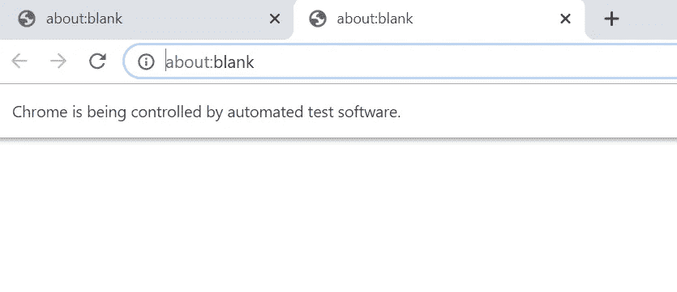
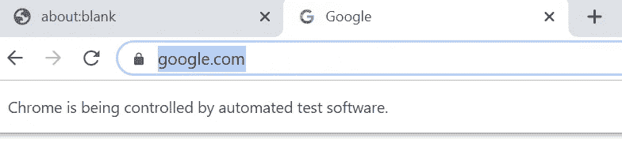
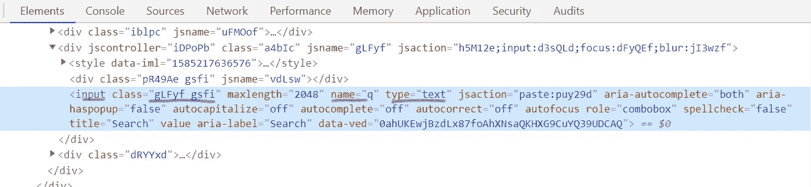
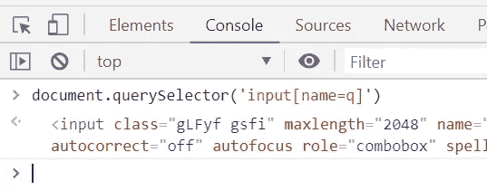
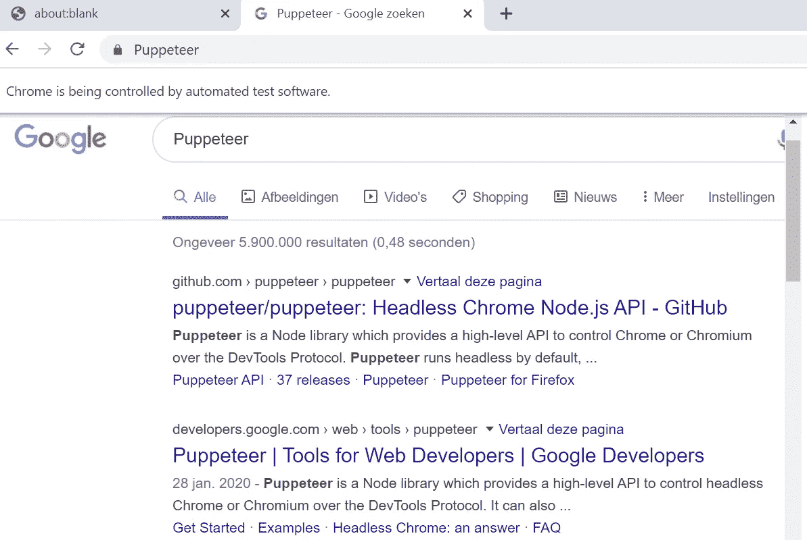

# 木偶师或:我如何学会不再担心并爱上自动化

> 原文：<https://itnext.io/puppeteer-or-how-i-learned-to-stop-worrying-and-love-the-automation-92e96f4901e7?source=collection_archive---------2----------------------->

木偶戏初学者入门指南


如果你一直手动操作，木偶师就失去了意义！

## 什么是木偶师？

> Puppeteer 是一个节点库，它提供了一个高级 API 来通过 [DevTools 协议](https://chromedevtools.github.io/devtools-protocol/)控制 Chrome 或 Chrome。默认情况下，木偶师运行无头的[，但可以配置为运行全(无头)铬或铬。https://github.com/puppeteer/puppeteer
> ——](https://developers.google.com/web/updates/2017/04/headless-chrome)

使用 Puppeteer，自动执行您偶尔在 web 浏览器中执行的日常工作。在 Puppeteer 中，你可以控制浏览器中的一切，从简单的导航到使用 [Lighthouse](https://developers.google.com/web/tools/lighthouse) 来审核你的网站。

在开始之前，先看看下面的木偶脚本示例:


[使用木偶师](https://github.com/0x414c49/memrise-upload)导入带音频的闪存卡

我正在上一门有很多单词和对话的荷兰语课程。制作一张抽认卡并手动输入大量的单词和声音并不是一件容易的事情。现在，再一次看看自动化脚本完成工作的速度，比零失败几率的人类更快。

编写木偶剧本很简单，你只需要知道一些基本规则。

## 规则一

木偶戏中的所有方法都是[异步的](https://developer.mozilla.org/en-US/docs/Web/JavaScript/Reference/Statements/async_function)，不要忘记等待它们。

## 规则二

在脚本中，在大多数情况下，你应该让木偶师等待一些东西，比如请求、响应、元素或片刻。

## 规则三

理性写剧本。假设你想写一个脚本来搜索某个东西。你是怎么做到的？

1.  你打开一个新标签
2.  你导航到 Google.com
3.  你关注搜索框
4.  你输入一些东西
5.  你点击搜索按钮

木偶师有多个 API 用于页面，键盘，鼠标。以上步骤很容易在木偶戏中模仿。

## 规则四

您不能单击不可见的元素！想象一个有一些项目的菜单。首先，你需要打开列表；然后，您可以点击子项目。

## 规则五

有些网页有自己的代码或事件(如 jQuery 事件)。你需要评估一些 JS 来使它们工作。

## 规则六

如果你不熟悉 [CSS 选择器，](https://developer.mozilla.org/en-US/docs/Web/CSS/CSS_Selectors)请去学习一下。

## 规则 7

当你导航到像[https://example.com/users](https://example.com/users)/这样的页面时，不要忘了尾部`/`。

我们讨论了初学者的规则，现在让我们做点真正的事情。

## 预热

*   安装 [NodeJS](https://nodejs.org/en/download/) 10.x 或更高版本
*   安装[纱线卷装管理器](https://classic.yarnpkg.com/en/docs/install)

在终端中，执行以下命令:

```
mkdir hello_puppeteer
cd hello_puppeteer
yarn inityarn add puppeteer
```

最后一个命令需要一段时间；它会在所有依赖项旁边安装木偶师(比如 [Chromium](https://www.chromium.org/) )。

创建一个新的`js`文件，并将其命名为`google.js`，然后用以下代码填充它:

```
const puppeteer = require("puppeteer");(async () => {
  // lanuch the browser
  const browser = await puppeteer.launch({
    headless: false,
    // devtools: false,
    // args: ["--start-maximized"]
  });// create a new tab
  const page = await browser.newPage();
})();
```

*   `The puppeteer.laucnh`启动 [Chromium](https://www.chromium.org/) 浏览器的一个新实例。如果你看代码，你会发现我写了`headless: false`。我想看看引擎盖下发生了什么。
*   `The browser.newPage`在浏览器中创建一个新标签。
*   我将整个代码包装在一个异步函数中，因为所有的木偶师方法都是`async`。

您可以在终端内通过`node google.js`运行该脚本，您应该会看到:



脚本的结果

现在我们想导航到 Google.com。为此，在`const page = ...`行旁边添加以下代码。

```
// navigates to google.comawait page.goto('https://google.com');
```



现在我们想搜索一些关于 Google.com 的东西。首先，用 Web Developer 工具检查搜索输入(右键单击搜索输入，然后单击 inspect element)。



检查 Web 开发人员工具中的元素

您需要为元素找到一个静态 CSS 选择器，以便在 Puppeteer 中使用它们。这个输入元素有几个属性，但是我选择了两个:

*   同学们:不幸的是，它是动态的，我们不能依赖它
*   name:`name`属性的值在整个页面上是唯一的。是合适的人选！

尝试使用 web developer tools-console 选项卡中的 CSS 选择器。使用 **document.querySelector** 或**document . query selector all**可以测试它们。



我的 CSS 选择器是`input[name=q]`，它工作得很好。现在该打东西了。

```
await page.focus('input[name=q]');/* or you can: first find the element, then focus it

  const searchInput = await page.$('input[name=q]');
  await searchInput.focus();
*/
```

💡*在页面 API 中，* `*$*` *等于*`*documnet.querySelector*`*`*$$*`*等于* `*document.querySelectorAll*` *。**

*为了让 Puppeeter 在输入中输入，我们需要关注它。有两个 API 可以做到这一点。它们的结果是一样的，但是这取决于你使用什么 API。*

*使用`keyboard` API 在网页内输入很容易。*

```
*await page.keyboard.type('Puppeteer');*
```

**

*行动中的类型*

*现在，如何获得搜索结果？*

*人们通常按回车或点击谷歌搜索按钮。要模仿它们，您可以:*

```
*// press the keyboard Enter button
  await page.keyboard.press("Enter");// or you can first, focus on search button, then click it
// const searchButton = await page.$('input[name=btnK]');
// await searchButton.click();*
```

**

*我们学了基础知识，但是你还需要知道更多的东西。*

## *让木偶师等些东西*

*考虑这些场景:*

*   *点击按钮后的 Ajax 请求*

*[文件输入](https://developer.mozilla.org/en-US/docs/Web/HTML/Element/input/file)上传文件示例:*

```
*const fileInput= await page.$('input[type=file]');
const uploadButton = await page.$('#upload-btn');await fileInput.uploadFile("d:/image.jpg");
await uploadButton.click();// now wait for upload response
await page.waitForResponse('https://example.com/services/upload/');// find dynamic generated link after ajax upload
const fileUrlElement = await page.$('a.file-url');*
```

*   *等待几秒钟*

```
*await page.waitFor(1000); // in mili seconds*
```

*   *等待页面导航*

```
*await page.waitForNavigation();*
```

*   *等待呈现特定的 CSS 选择器*

```
*await page.waitForSelector('css selector');*
```

## *在浏览器中评估脚本*

*我遇到过这样一种情况，用 **uploadFile** 方法上传文件后，页面不会执行 Ajax 上传过程。对于这个场景，我需要生成一个 jQuery 代码来完成这项工作。*

```
*const input = await page.$('input[type=file]');
await input.uploadFile(fileToUpload);await page.evaluate(
 element => $(element).trigger("custom_event"),
 input
);*
```

*在这个例子中，`$(element).trigger("...")`是 JS 代码，它将在浏览器内部执行(而不是在木偶脚本内部)。*

## *你还能做什么？*

*在第一个例子中，我使用了`headless: false`来看看在引擎盖下发生了什么。通常情况下，在无头模式下使用会更好，因为它在后台运行脚本和浏览器，不会用任何打开的窗口打断你。*

*但是如果你用 headless 模式运行它，你怎么能看到结果呢？截图怎么样！*

```
*await page.screenshot({path: 'my-result.png', fullPage: true})*
```

*一开始，我演示了一个运行我最近制作的“导入脚本”的 gif。请在 https://github.com/0x414c49/memrise-upload[找到代码](https://github.com/0x414c49/memrise-upload)*

## *更多演示*

*如果你想了解更多关于木偶师的能力，我推荐你去看看我的同事[恩德·塞伊兰](https://medium.com/u/9093637f275f?source=post_page-----92e96f4901e7--------------------------------)的[木偶师演示库](https://github.com/onderceylan/puppeteer-demos)。甚至他很酷的 [pwa 资产生成器](https://github.com/onderceylan/pwa-asset-generator)也是用木偶师创造的。*