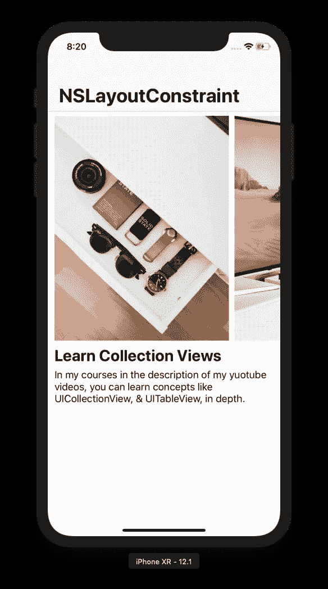
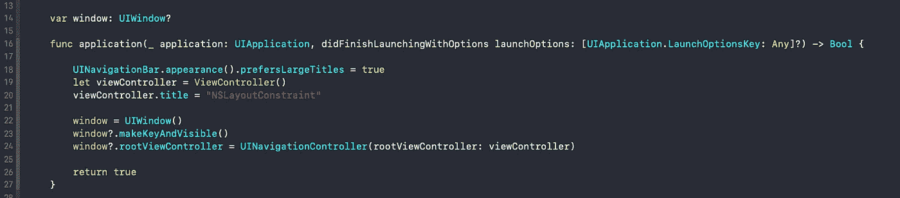
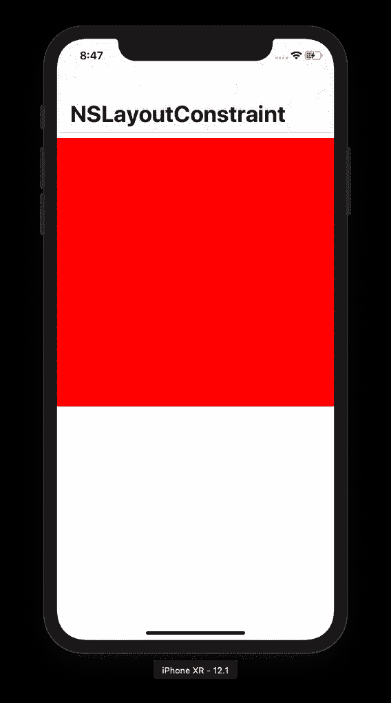
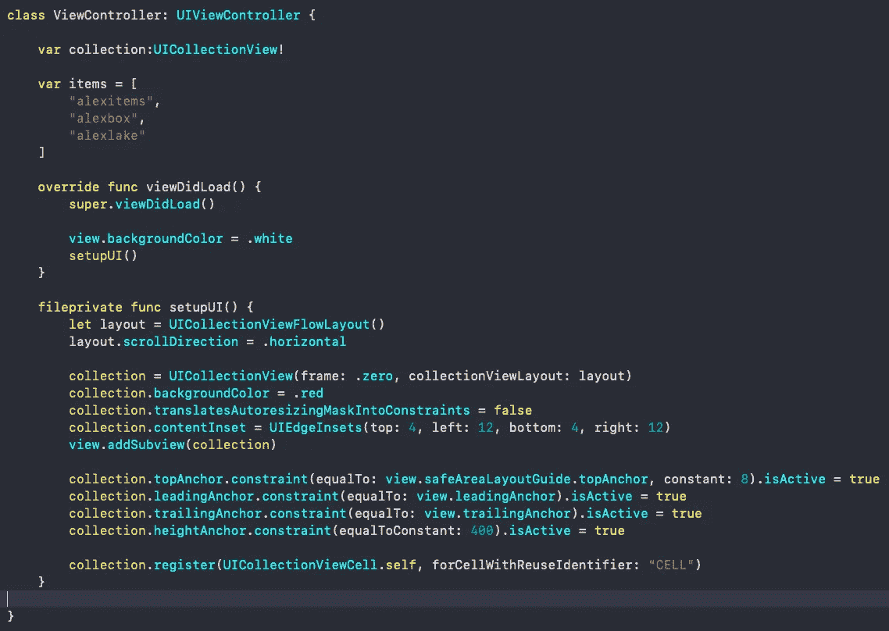
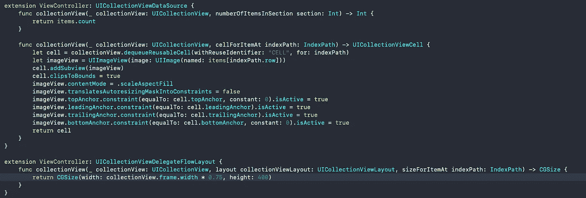
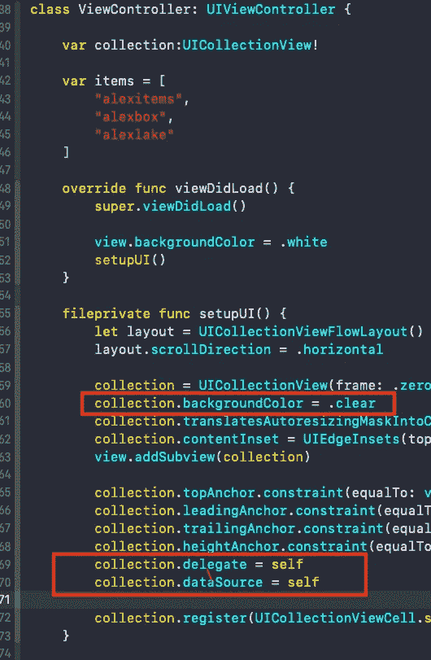
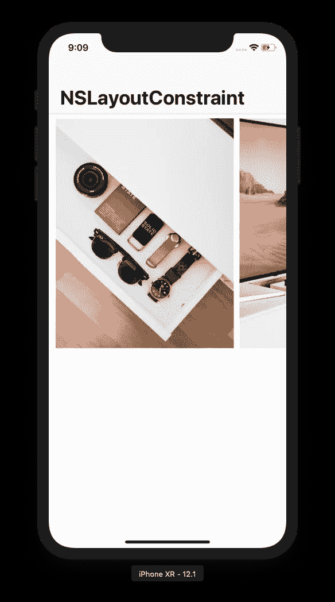
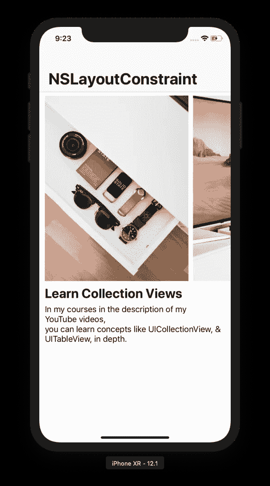
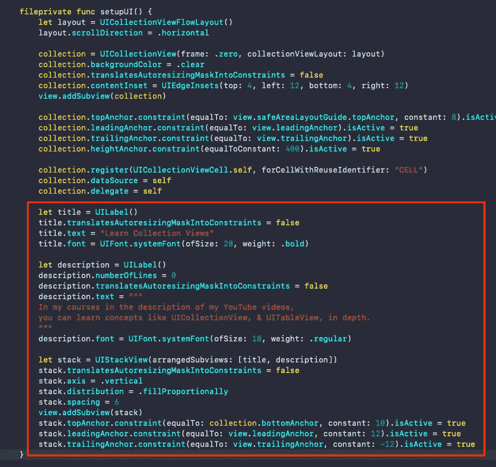

# 使用 NSLayoutConstraint & UICollectionView & UIStackView 的纯代码编程自动布局

> 原文：<https://itnext.io/pure-code-programmatic-auto-layout-with-nslayoutconstraint-uicollectionview-uistackview-763009c7c14c?source=collection_archive---------2----------------------->

照片由 Alexandru Acea 提供

如果你厌倦了故事板和框架，你来对地方了。

# 资源

[**给我密码**](https://github.com/Maxnelson997/ProgrammaticAutoLayoutwithNSLayoutConstraintYouTubeVideo)

通过 maxcodes YouTube 频道观看这篇文章的视频。

# 左边的这个是我们正在建造的。用纯代码。

纯代码，就像，只有代码。没有故事板，没有框架，没有废话。

所以请阅读下面的内容&让我们开始行动吧！。

# 步骤 1-应用程序设置✅

从一个空的单视图应用程序开始。

这段代码将覆盖故事板，现在我们已经以编程方式设置了我们的应用程序。将此放入 appDelegate.swift 文件中。

# 步骤 2-在子视图层次结构✅中用 NSLayoutConstraint 约束集合视图

在本文中我不会过多解释集合视图。如果您想了解更多关于集合视图的信息，请阅读这篇文章。

然而，我想解释一下这些限制。这就是你如何在没有故事板的情况下做自动布局，这就是你如何用纯代码做自动布局！

## 说明

要让它工作，您必须添加 UIView，在本例中，是将 UICollectionView 添加到一组子视图中。如果您在将视图添加到视图层次结构之前尝试并激活约束，应用程序将会崩溃，因为如果它不在屏幕上，您就不能约束它。

## 暗喻

换一种说法:你不能把你的手放在别人的手上，除非他们和你一起在房间里。房间是 UIView 子视图层次结构，我们的手是顶部、底部、前导或尾随 NSLayoutConstraint。

## 约束

现在，我们有了一个高度为 400 磅的受约束 UICollectionView，以及将其附加到 UINavigationController 头底部和 viewController 视图侧面的约束。

将集合视图添加到我们的视图控制器的主视图子视图层次结构中，并激活这些约束。

# 步骤 3-集合视图委托和数据源方法✅

我不会解释这些方法，因为这不是本文的重点。然而，我会在我的 YouTube 频道上的视频中解释它。无论哪种方式，只需将下面代码放入您的项目中。

## 在集合视图单元格中约束 UIImageView 的实例。

您还可以看到，在创建 imageView 之后，我们将它约束到单元格中。这里唯一需要记住的关键事情是。

1.  **将 translatesautoresizigmaksintoconstraints 设置为 false。**
2.  **在激活约束之前，将受约束的视图添加到子视图层次结构中。**
3.  **给你的项目添加图片。如果你愿意。** [**我这里的**](https://unsplash.com/@alexacea) **是从**[**Alexandru Acea**](https://medium.com/u/6819467be7b0?source=post_page-----763009c7c14c--------------------------------)**免费得到的。**

集合视图方法和 UIImageView 自动布局约束

# 很快的。第 3 步继续。✅

1.  **改变我们的集合视图的背景颜色以清除**
2.  **将 collection.dataSource 和 collection.delegate 设置为 self，这样这些方法将为我们的 UICollectionView 运行。**

## ***这是你在模拟器里应该看到的。***

清理& cv 数据源/委托方法激活

# 步骤 4-向 UIStackView ✅添加标签

堆栈视图在每个项目中都很方便，尤其是如果你正在构建一个只有代码的全功能应用程序。这可以说是创建 iOS 应用程序的最佳方式。

将此代码添加到您的 ViewController.swift 的 setupUI 函数中，位于您的所有 collectionView 约束的正下方。

ViewController.swift 中的 setupUI 函数

所以，还是老样子

1.  **将 translatesAutoresizingMaskIntoConstraints 设置为 false**
2.  **添加到子视图层次**
3.  **创建约束并激活它们**

# 应用程序完成✅

你现在知道如何；

*   **从 appDelegate 而不是 storyboards/info.plist 设置应用**
*   **以编程方式使用自动布局约束。**
*   **子视图层次内的约束视图**
*   **使用 UICollectionView、UICollectionViewDataSource 和 UICollectionViewDelegateFlowLayout 方法。✅**

# 更多资源—高级指南。✅ ✅ ✅ ✅

如果你想第一个听说有限的免费课程优惠券(每月 10 英镑)，请随时订阅我的 [**每周开发内容电子邮件列表。**](https://www.maxcodes.io)

查看我的课程，了解更多信息！我刚刚发布了一个高级 Swift/iOS 课程！这里有 50 张优惠券，专门给我的中等读者！:)

# 非常感谢您的阅读！

如果你喜欢这篇文章，请留下掌声，在我的社交账户上关注我。每条推文、youtube 订阅、medium clap 和 Instagram 评论都有助于我进一步帮助你完成这些文章和视频。

## [**YouTube**](http://youtube.com/maxcodes)

## [**碎碎念**](http://twitter.com/maxcodes1)

## [课程](https://www.udemy.com/tableviews/?couponCode=MEDIUMNINE)