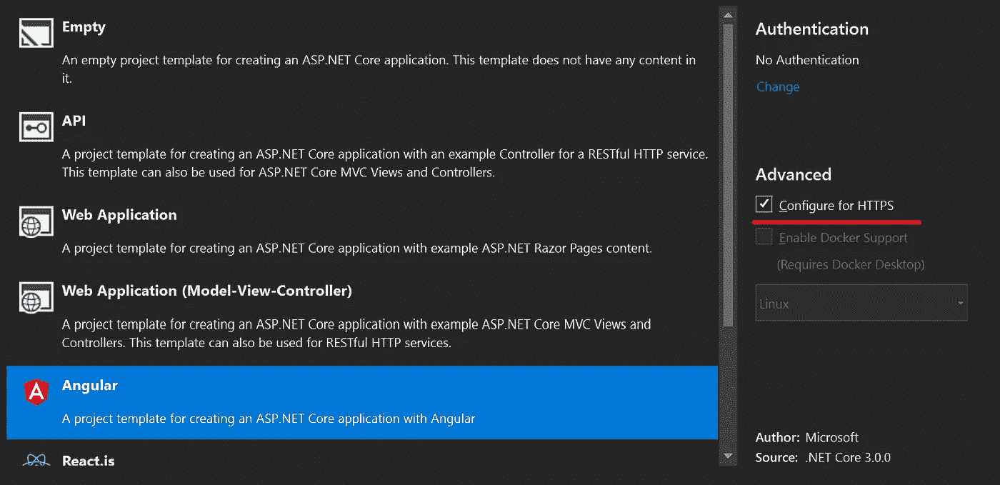
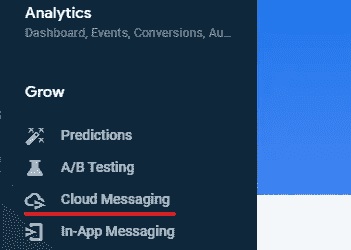
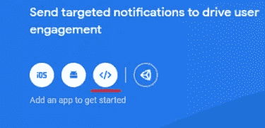
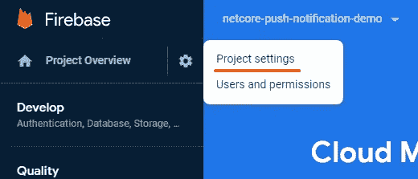
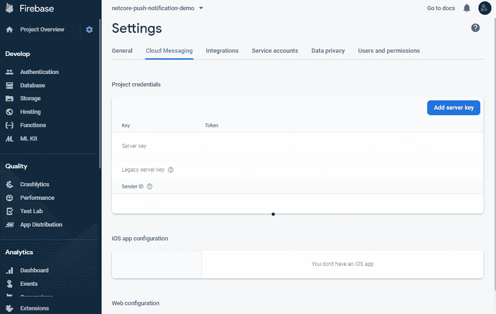
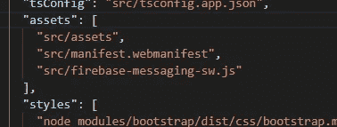
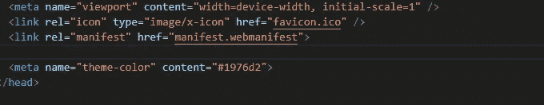
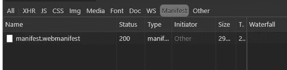
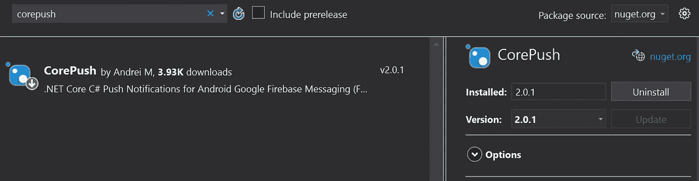

# 用角度&推送通知。使用 Firebase 的网络核心

> 原文：<https://itnext.io/push-notification-with-angular-net-core-a2280d18eda1?source=collection_archive---------1----------------------->

所以，你想在发生某些事情时引起用户的注意，或者你想提醒他们你的应用程序中有新的东西。下面是我使用 Angular &遵循的方法。Net Core 通过 FCM (Firebase Cloud Messaging)实现推送通知。

我在 Visual Studio 2019 中创建了一个空白的解决方案，并使用最新的角度模板添加了一个 ASP.NET 项目。Net 核心版(3.0)。



**注意:**确保您选择了“为 HTTPS 配置”以便能够在本地测试推送通知。

该模板将处理 rest，并用 Angular 8 初始化一个 ASP.Net 应用程序。如果您是非 windows 用户，可以使用 Dotnet-CLI 来使用相同的模板。

`dotnet new angular`

**注意:**如果要使用 CLI，需要手动配置 https。要做到这一点，只需运行下面的代码。*可以多读读* [*斯科特·汉瑟曼*](https://www.hanselman.com/blog/DevelopingLocallyWithASPNETCoreUnderHTTPSSSLAndSelfSignedCerts.aspx) *。*

`dotnet dev-certs https — trust`

在将屏幕切换到 IDE 之前，我们需要初始化我们的 web 推送提供程序。

# 步骤 1:为 Web 推送配置 FCM

转到 [firebase 控制台](https://console.firebase.google.com)并使用您的 Google 帐户登录。点击**“创建新项目”**按钮，并按照说明进行操作。

创建项目后，您将看到一个仪表板。点击左侧的菜单**‘云消息’**。



点击`</>`图标。这将向您的 firebase 项目添加一个 web 应用程序。



该网站将要求您为您的应用程序命名，然后要求您将一个脚本添加到您的网站 SDK。跳过这个。

然后，回到仪表板，按照左上角的菜单进入项目设置。



项目设置菜单

**我们需要的信息**在*云消息*页面。我们将在发送和接收通知时使用这些信息。



# 第二步:角度

接收消息和将它们显示为本机通知是两码事。推送 API 将给我们捕捉消息的能力。并且，**通知 API** 会负责通知的显示。而是因为我们用 FCM 它将为我们处理这些问题。*(当站点不活动时将触发本机通知，当站点活动时将触发应用程序代码)*

首先，我们需要一个**服务人员**。

> 服务人员是您的浏览器在后台运行的脚本，独立于网页，为不需要网页或用户交互的功能打开了大门。[继续阅读关于服务人员的文章](https://developers.google.com/web/fundamentals/primers/service-workers#what_is_a_service_worker)。

为什么？因为当你的客户端应用不活跃时，服务人员会在那里处理你的推送消息。

服务人员基本上是一个 js 文件。在 angular 应用程序的 src 文件夹中创建一个名为`firebase-messaging-sw.js`的 js 文件。然后，把这几行放进去:

firebase-messaging-sw.js

然后创建一个名为`manifest.webmanifest`的文件，将您的 messagingSenderId 放入其中，如下所示:

清单. web 清单

**注意**说明其他属性可以给你 PWA 能力，不如保留。如果您想了解更多关于 PWA 的信息，我推荐您访问这篇伟大的文章:[Onder cey LAN——用 Angular 和 Firebase 构建一个生产就绪的 PWA](/build-a-production-ready-pwa-with-angular-and-firebase-8f2a69824fcc)

现在我们需要将`firebase-messaging-sw.js`和`manifest.webmanifest`注册到 angular。

*   angular.json



*   index.html



*我们没有向 angular 注册 service-worker，因为当我们调用 service 来获取令牌时，它会自动加载。*

我们有必要的组件来捕捉推送消息。当您构建并运行您的应用程序时，您应该能够看到您的文件被正确加载，您的服务人员被正确注册。



Chrome 开发工具—网络选项卡

要注册到 FCM 推送服务并创建通知，我们需要安装这两个软件包:

```
npm install firebase @angular/fire --save
```

去`app.module.ts`注册这些模块

应用程序模块

你可以在 firebase 控制台的 Firebase 项目设置中找到 **apiKey、projectId、**等东西(项目设置> General 选项卡> Your apps 部分)。

然后，创建一个名为`push-notification.service.ts`的服务，并在这里导入和解析`AngularFireMessaging`。

推送通知. service.ts

我们需要做的第一件事是初始化消息传递部分。在构造函数中，我们告诉 AngularFireMessaging 如何处理 push 消息何时到来以及 FCM 何时撤销我们的令牌。

`requestPermission`请求 FCM 给我们一个令牌。这也将触发浏览器要求用户自动允许推送通知。当您获得令牌时，应该将其保存到数据库中以备后用。这样您就可以发送特定于用户的通知。最佳做法是，要求用户在网站上停留一段时间后，首先允许推送通知。否则，他们会阻止它。

`receiveMessage`当您的应用标签为*未激活* **时，将返回可观察到的消息。**因此，您不会看到自动创建的系统通知，而是会看到一个推送消息对象，并决定要做什么。您可以播放自己的应用内声音，这样干扰会更小，或者您可以像这样触发自己的系统通知:

```
new Notification(message.notification.title, {
            body: message.notification.body
});
```

*您可以在此* *处更多了解* [*通知。*](https://www.w3.org/TR/notifications/)

**您**应该知道您的*推送信息的安全性*没有保证。您可以加密/解密消息，也可以使用 push 作为触发器来调用您的 API 以获取完整的消息。

# 第 3 步:DotNet Core

在最后一步，我们将呼叫 FCM，让我们的用户发送我们的信息。Firebase 提供了一个 API，您可以开发自己的实现，但是我使用了一个名为`CorePush`的库。使用包管理器浏览并安装:



或运行以下命令:

```
install-package corepush
```

安装软件包后，您需要的唯一代码是下面的代码。

注意第 3 到 9 行。这是有效载荷的结构。你需要留着它。此外，在通知对象中，您应该将名称保留为`title`和`body`(区分大小写)。否则，前端将无法正确读取，因此您将无法显示正确的通知。

而且，我建议将`serverKey`保留在`appsettings.json`中。为每个用户保存令牌也很重要。(请记住，用户可以拥有多台设备)。然后，您可以发送用户特定的通知。

这是我用来实现推送通知的堆栈，它已经运行了很长时间。我创建了一个 GitHub 存储库来查看全局。如果文章或代码有问题，请随意指出。我希望它能帮助你解决问题。

您可以看到 n [GitHub](https://github.com/mehmetural/push-notification-demo) 的一个基本实现[。](https://github.com/mehmetural/push-notification-demo)