# 在 Flutter 上使用 Firebase 推送通知

> 原文：<https://itnext.io/push-notifications-with-firebase-on-flutter-df68cc830c89?source=collection_archive---------1----------------------->

## Flutter 上的 Firebase 云消息传递

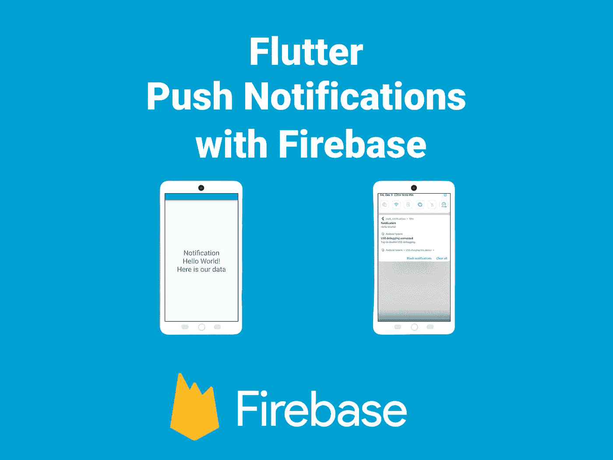

推送通知是移动开发的一个重要方面。我们可以使用弹出消息媒介，提醒应用程序用户应用程序中正在发生的事情。它们也是增强用户参与你的应用的重要方式。例如，用户一旦安装了应用程序，就会忘记它。然后，您可以使用推送通知作为一种机制来重新获得并保持他们的兴趣。推送通知也有助于增加你的应用流量。今天，我将向您展示如何使用 firebase cloud messaging 通过`firebase_messaging`包在 Flutter 中推送通知。

[](https://pub.dev/packages/firebase_messaging) [## firebase_messaging | Flutter 包

### 一个使用 Firebase 云消息 API 的 Flutter 插件。要了解有关 Firebase 云消息传递的更多信息，请访问…

公共开发](https://pub.dev/packages/firebase_messaging) 

# 开始

*   首先，我们需要将`firebase_core`包添加到`pubspec.yaml`

```
dependencies:
  ...
  firebase_core: ^1.10.0
```

*   然后，我们把`firebase_messaging`包加到`pubspec.yaml`里

```
dependencies:
  ...
  firebase_core: ^1.10.0
  firebase_messaging: ^11.1.0
```

有了这个，我们不需要添加任何包，所以现在我们可以设置我们的 firebase 项目。让我们从 Android 实现开始。

## Android 实现

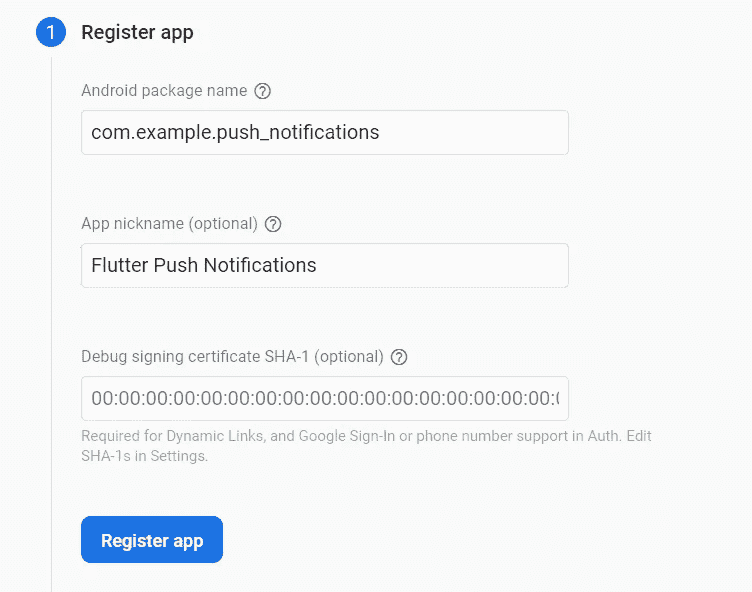

*   你可以在 applicationId 下找到你的 Android 包名`android/app/build.gradle`。你可以给任何你想给 app 起的昵称。目前，您不需要添加 SHA-1 证书。

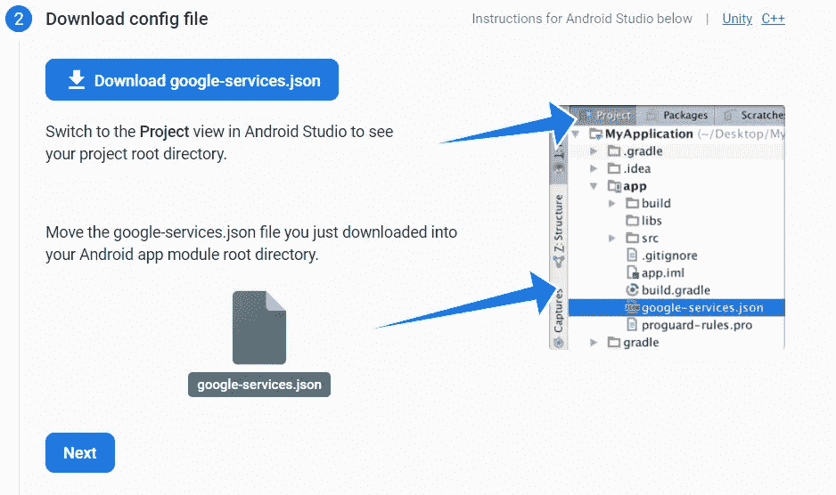

*   下载`google-services.json`并将其放入我们的项目 `/android/app`
*   现在我们需要将 firebase SDK 添加到我们的项目中。在`android/build.gradle`中添加以下一行。

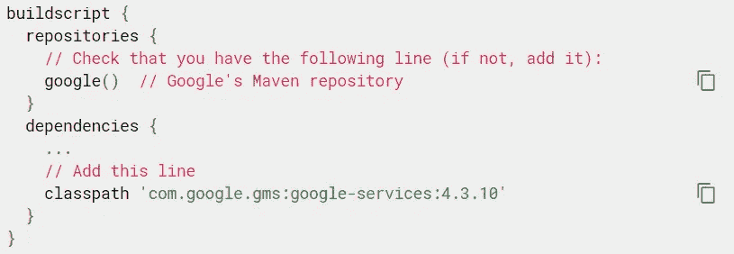

*   然后在`android/app/build.gradle`中添加以下几行。

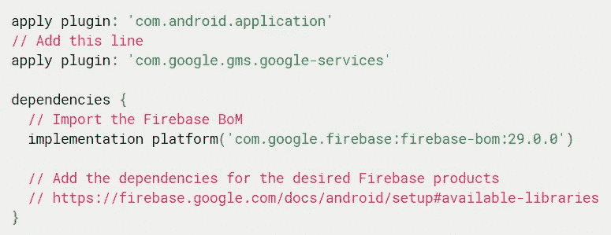

*   然后从该网站查看最新版本的云消息。

[](https://firebase.google.com/support/release-notes/android#latest_sdk_versions) [## Firebase Android 发行说明| Firebase 文档

### 要查看 Firebase 控制台和其他 Firebase 平台以及相关 SDK 的发行说明，请参考…

firebase.google.com](https://firebase.google.com/support/release-notes/android#latest_sdk_versions) 

*   像这样增加依赖性。

```
implementation 'com.google.firebase:firebase-messaging:23.0.0'
```

*   这是可选的，但是我强烈建议如果您想在用户点击通知时得到通知，将这一行添加到您的`android/app/src/main/AndroidManifest.xml`的`<activity>`标签内的`AndroidManifest.xml`中。

```
<intent-filter>
   <action android:name="FLUTTER_NOTIFICATION_CLICK" />
   <category android:name="android.intent.category.DEFAULT" />
</intent-filter>
```

就是这样。我们在项目中成功实现了 Firebase for Android。

## IOS 实施

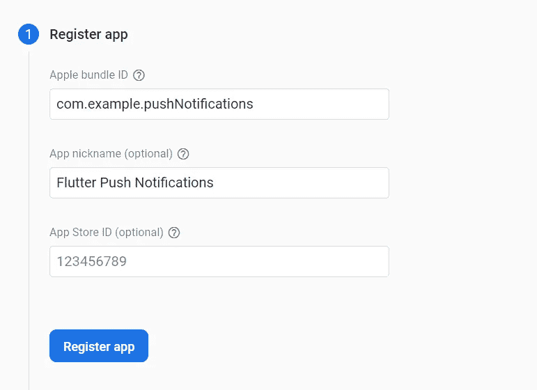

*   您可以通过搜索`“PRODUCT_BUNDLE_IDENTIFIER.”`找到`ios/Runner.xcodeproj/project.pbxproj`中的包 ID

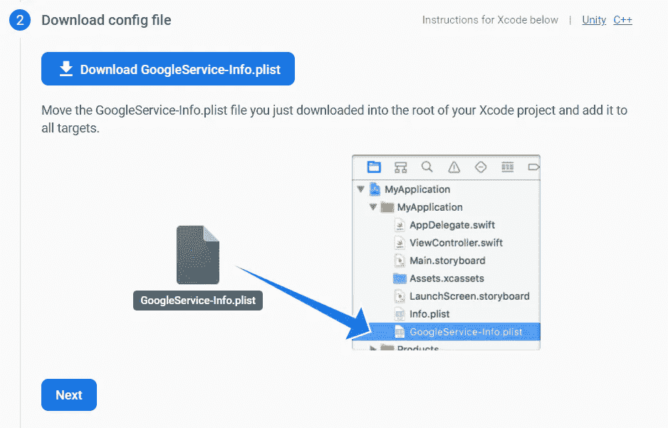

*   在 Xcode 中打开项目目录的`ios`文件夹。将下载的文件拖放到`Runner`子文件夹中。当出现对话框时，确保勾选了`Destination`属性的**复制项目(如果需要的话)**，并且在**添加到目标**框中选择了**流道**。然后，点击**完成**。

就是这样。在我们的项目中，我们成功地实现了 Firebase for IOS。

## 使用

*   让我们创建`notification.dart`并在那里处理消息传递操作。

*   然后让我们在我们的应用程序中显示它，这样我们就可以看到变化。

*   现在，我们已经准备好为我们的应用程序发送第一个通知。让我们看看 Firebase 控制台和云消息传递。

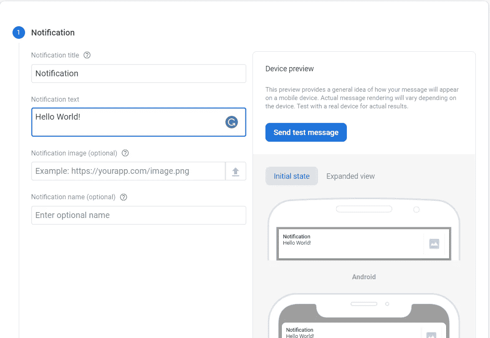

*   让我们点击发送测试消息，这样我们就只能在我们的手机上使用它。
*   然后运行我们的手机，这样我们就可以为我们的手机获取一个特定的令牌。
*   获得令牌后，让我们添加令牌并单击 test。

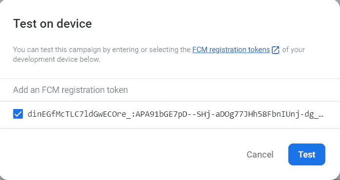

*   这是我们想要的通知显示在屏幕上。

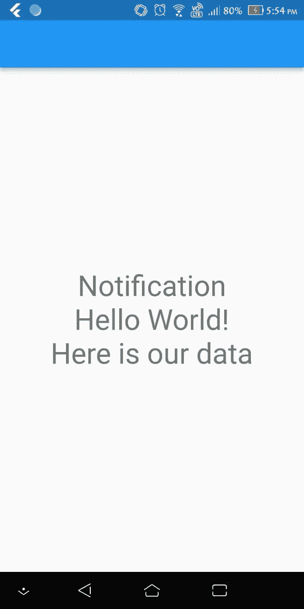

*   然后让我们在后台测试它，这样我们也可以看到我们的通知。让我们把应用程序放在后台。并再次发送测试消息。

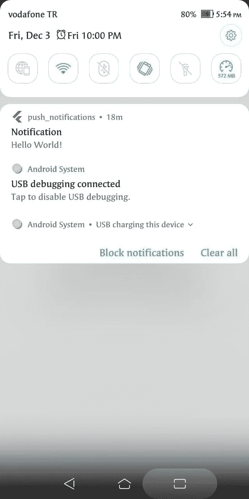

*   如您所见，我们可以毫无问题地看到我们的通知。🎉🎉

## 奖金

*   您可以将图像添加到通知中。在 IOS 上，您需要做一些事情。你可以在这里找到如何做👇👇

[](https://firebase.flutter.dev/docs/messaging/apple-integration/#advanced-optional-allowing-notification-images) [## 通过 APNs 集成的| FlutterFire

### 本指南适用于 iOS 和 macOS Flutter 应用程序，针对您需要的平台重复每个步骤。例如，如果你…

firebase.flutter.dev](https://firebase.flutter.dev/docs/messaging/apple-integration/#advanced-optional-allowing-notification-images) 

*   您可以向某些主题发送通知。要订阅一个主题，你需要做的就是添加这一行。

```
*await* FirebaseMessaging.instance.subscribeToTopic('weather');
```

*   然后在目标步骤上发送通知时，添加到您想要发送通知的主题中。

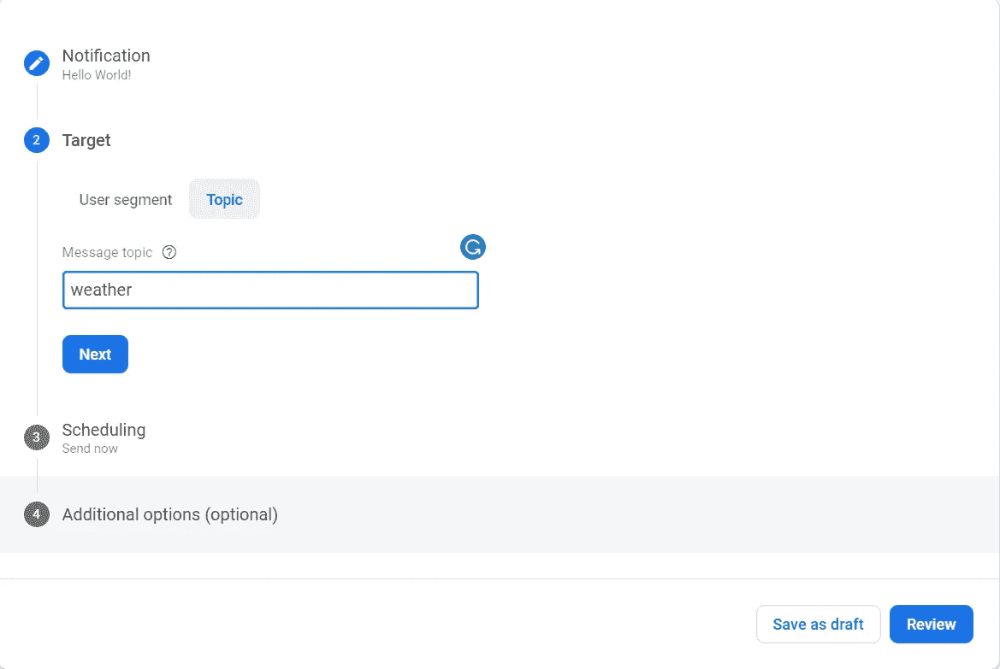

*   要取消订阅某个主题，您只需添加这一行。

```
*await* FirebaseMessaging.instance.unsubscribeFromTopic('weather');
```

*   您还可以在通知中发送键值变量。

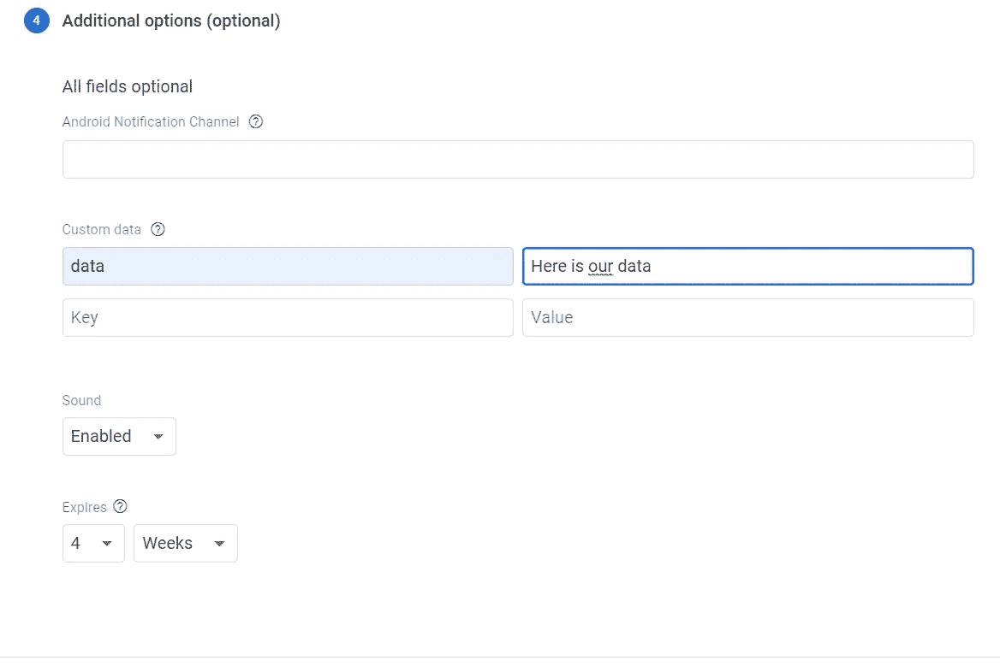

本文到此为止。感谢您的阅读。

如果你有任何问题，请随时评论。👏👏👏