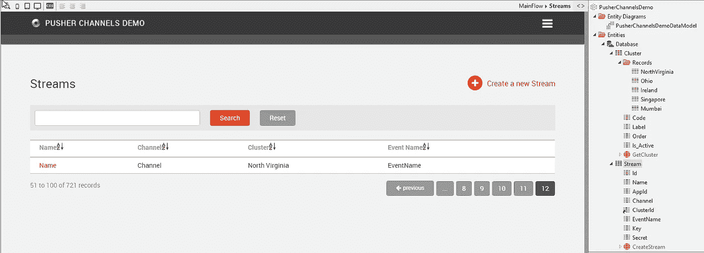
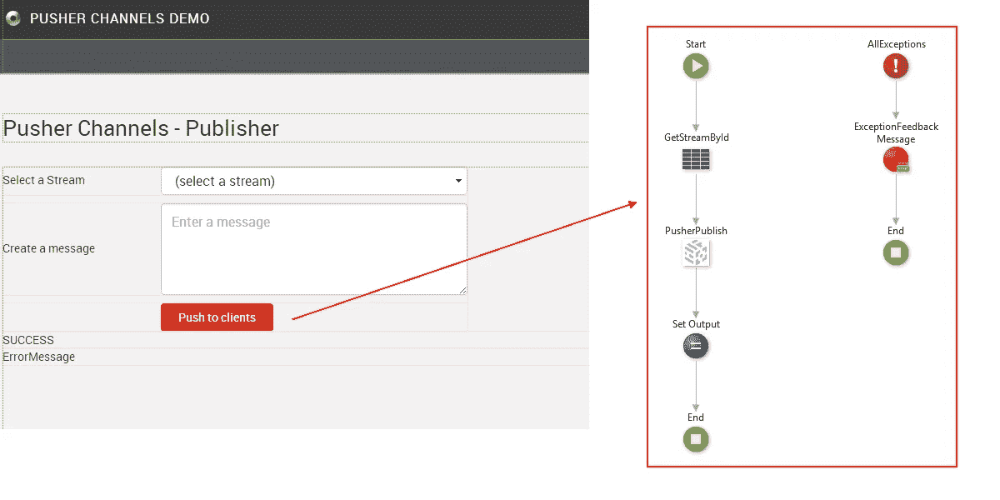
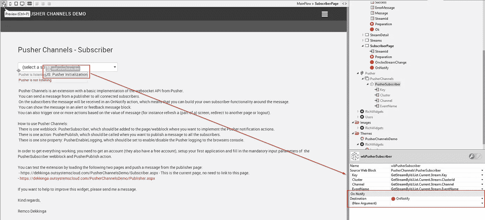

# 将系统推到极限

> 原文：<https://itnext.io/push-outsystems-to-the-limit-797a0af2033b?source=collection_archive---------3----------------------->

这是一个关于[外系统平台](https://www.outsystems.com/)中[推送通道](https://pusher.com/channels)实现的教程。

你会问为什么？好吧，当你需要**可扩展的应用内通知、聊天、实时图表、地理跟踪**或其他**网络&移动应用中的反应**解决方案时，你需要用消息 API 扩展[外部系统平台](https://www.outsystems.com/)。[Pusher.com](https://pusher.com/)是拥有[发布/订阅消息 API](https://en.wikipedia.org/wiki/Publish%E2%80%93subscribe_pattern) 的主要公司之一，也被称为**发布/订阅**。

我假设您已经听说过 OutSystems，并且知道如何构建一个应用程序。如果没有，你可以从这里开始阅读，[下载](https://www.outsystems.com/home/downloads) OutSystems ServiceStudio 并跟随[教程](https://www.outsystems.com/learn/paths/)。

当你想用 Pusher 建立一个集成时，你必须首先考虑架构。我将描述发布/订阅消息 API 的基本架构。

发布订阅模式(图片来源: [MSDN 博客](https://msdn.microsoft.com/en-us/library/ff649664.aspx))

**发布者**不知道**订阅者**，订阅者也不知道发布者，这意味着他们通过**事件总线**或**消息代理**松散耦合。

这在普通英语中是什么意思？这里有一个例子。你(**发布者**)想要邀请人们参加你举办的派对。你没有给所有的朋友打电话，而是创建了一条主题为“Party”的消息。你喜欢派对的朋友(**订阅者**)订阅了所有主题为“派对”的帖子。这样你就可以联系到所有喜欢聚会的朋友，而不用直接联系他们，也不知道他们是谁。

派对迷因(图片鸣谢:[黄章鱼](https://blog.yellowoctopus.com.au/party-meme/))

我已经听到你在问“我如何实现你的这个 Pusher [组件](https://www.outsystems.com/forge/component/1493/pusher-websockets/)”。请继续读下去，因为我将在接下来的章节中一步一步地解释这一点。

# 设置发布者(web)

创建一个后台办公室，在那里你可以管理你的流。您需要一个实体来存储您的流(AppId、Channel、Cluster、Event、Key 和 Secret)。在我的例子中，我还为目前可用的不同集群添加了一个静态实体。

创建另一个后台页面，您可以在其中向流编写和发送消息。这些消息将被发布到您在流中选择的推送集群，并且消息将被推送至正在收听您的流的订阅者。PusherPublish 动作可以在 Pusher.com 的[API](https://www.outsystems.com/forge/component/1493/pusher-com-apis/)组件中找到。

# 设置订户(web)

创建一个前台办公室，您可以在那里接收/处理收到的消息。您需要从 Pusher.com API 组件[中获取 PusherSubscriber webblock 依赖项，并选择要在特定页面上监听哪个流。当您需要在所有页面上收听某个频道时，请将该 webblock 放入在所有页面上使用的其他 web block 中，如布局、菜单或页脚。](https://www.outsystems.com/forge/component/1493/pusher-com-apis/)

放置 webblock 后，您需要创建一个 OnNotify 操作，在这里您可以定义一收到消息就发生什么。该消息可能只是一个文本，将在聊天窗口中显示为反馈消息或回复。但是当您将消息定义为 JSON 文件时，它有几个值。你可以做更酷的事情，比如显示实时更新的图表或地理跟踪，每当 GPS 设备改变位置时，就会发送一条消息，并更新带有实际位置和历史路线的地图。

# 还有别的吗？

查看[推杆渠道演示](https://www.outsystems.com/forge/component/4339/pusher-channels-demo/)锻造组件，了解如何开始整合您自己的推杆渠道的详细信息。

对于移动设备上推送器的集成，可以使用类似的方法。唯一的区别是你必须使用[Pusher.com 移动 API](https://www.outsystems.com/forge/component/3972/pusher-com-mobile-apis/)Forge 组件。有关移动实施的更多详情，请查看[推送通道移动演示](https://www.outsystems.com/forge/component/4340/pusher-channels-mobile-demo/)。