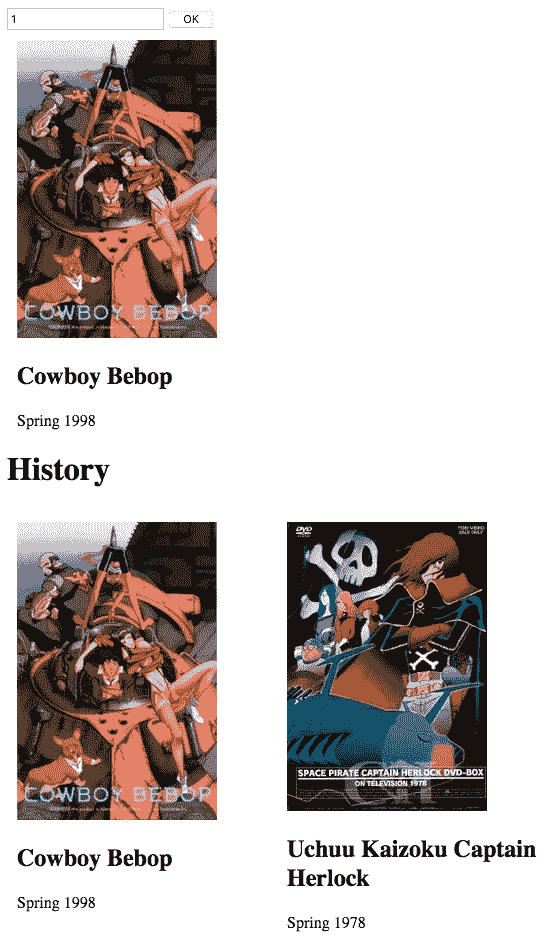
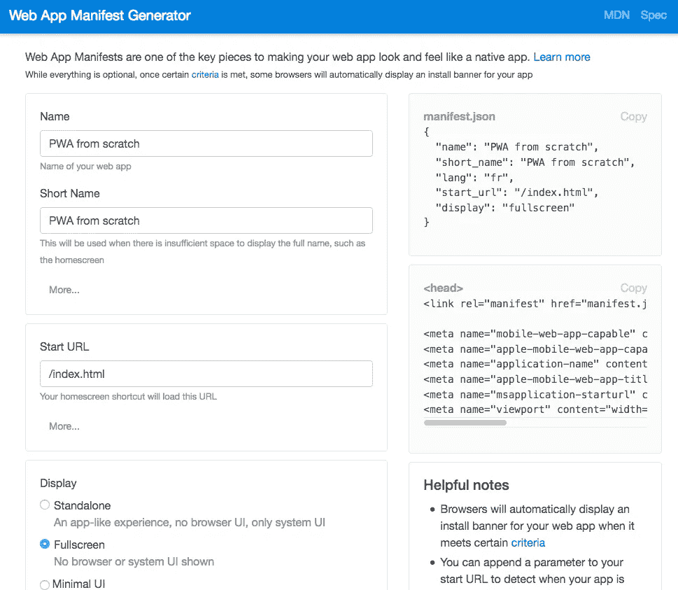
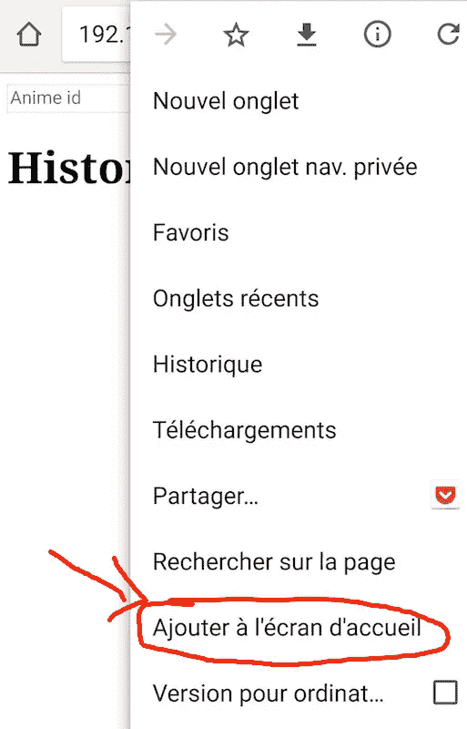
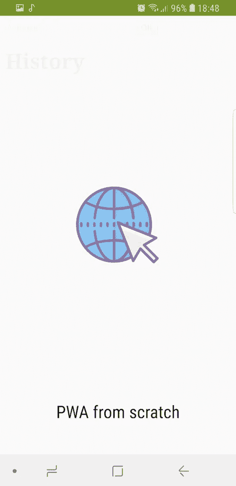
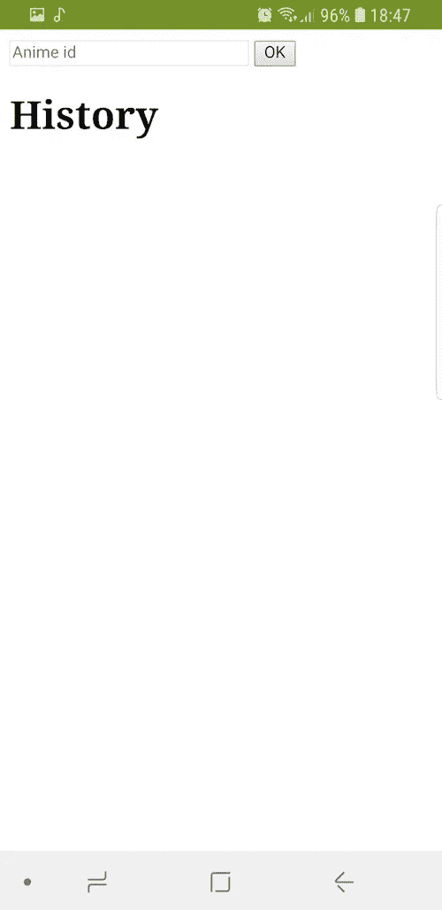
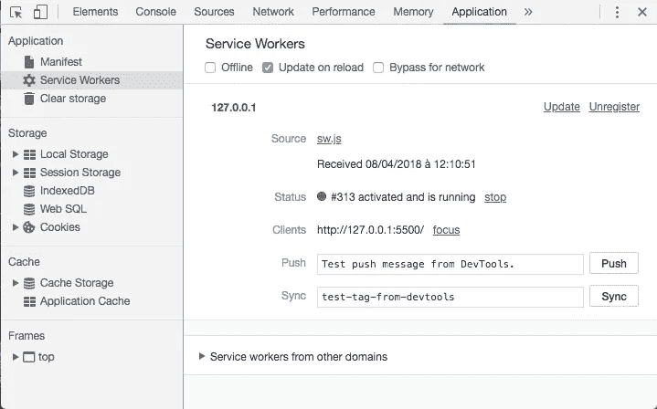
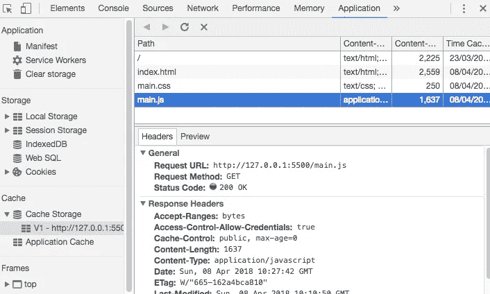
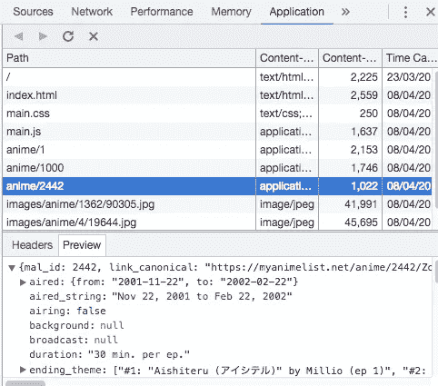
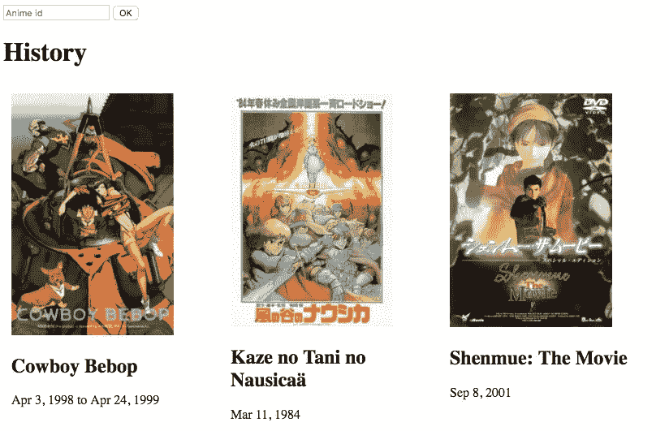

# PWA 从头开始指南(又一个)

> 原文：<https://itnext.io/pwa-from-scratch-guide-yet-another-one-bdfa438b50aa?source=collection_archive---------1----------------------->

欢迎阅读我的指南，从头开始创建 PWA(渐进式网络应用)。我希望它能帮助你了解更多的服务人员、Web 应用程序清单和缓存。享受🎓。

# 介绍

在接下来的部分中，我们将从零开始构建一个非常简单的 PWA。目标是熟悉最重要的 PWA 概念；清单和服务人员。我们不会使用任何特定的框架，将保持代码非常简洁。为了简单起见，我们将在 javascript 中使用一些 ES6 特性。

以下是本指南的主要步骤。每一个都将在不同的章节中讨论:

*   准备应用程序外壳
*   添加清单
*   实施服务人员
*   贮藏

我希望这份指南能让你一瞥采纳 PWA 想法的好处。但是在进入代码之前，让我们用必要的元素准备我们的工作站。

# 要求

我们将使用 Visual Studio Code IDE 以及这些语言:HTML 5、CSS3 和 EcmaScript 6。以下是我为本教程推荐的设置:

*   [Visual studio 代码或 VS 代码](https://code.visualstudio.com/)
*   [Live server](https://marketplace.visualstudio.com/items?itemName=ritwickdey.LiveServer) :点击一个按钮就可以在本地服务器上运行当前的工作空间。
*   可选地， [JavaScript Snippet Pack](https://marketplace.visualstudio.com/items?itemName=akamud.vscode-javascript-snippet-pack) 或任何其他您更喜欢用于 web 项目的扩展。
*   一个随时可用的 JSON API。希望有一个 GitHub 存储库对一些公共 API 进行分类。在本指南中，我们将使用 [Jikan API](https://jikan.docs.apiary.io/#reference)
*   Chrome 的最新版本，因为我们将使用它强大的 PWA 开发工具

一旦一切就绪，我们就可以初始化第一行代码了。

# 项目描述和初始化

我们要建立的 PWA 是一个简单的动漫搜索应用程序。它允许显示一个给定了 id**的动画。UI 提供了一个输入域和一个按钮，用于输入动画 id 并进行验证。除此之外，还会显示搜索结果的历史记录。**

该指南分为不同的步骤。第一步是构建应用程序外壳。接下来，我们将添加一个允许将 PWA 添加到主屏幕的清单。之后，将添加一个服务工作者来缓存之前的搜索响应。这将允许显示一些结果，即使在离线模式。第四步是缓存历史记录，而不依赖于服务人员。

我们将创建项目的第一批文件和第一行代码。这允许有一些代码运行，也可以在进入主菜之前验证我们的设置🍕。

请按照以下步骤获得一个最小网站:

*   创建一个包含我们项目的空文件夹
*   启动 VSCode 并打开该文件夹
*   创建新的 HTML 文件
*   用 html 代码段初始化文件(CTRL+SHIFT+P ->键入代码段->选择 HTML)
*   添加一个 **main.js** 文件和 **main.css 文件**，我们稍后会用到

html 文件应该类似于以下内容:

让我们在使用[实时服务器](https://marketplace.visualstudio.com/items?itemName=ritwickdey.LiveServer)创建的本地服务器上运行这个网站。只需点击工具栏上的**上线**按钮。你的默认浏览器应该将你的**index.html**呈现为一个空白页。

严重的事情现在开始✌️与应用外壳善良。

# 应用程序外壳

app shell 由 [Addy Osmani](https://developers.google.com/web/fundamentals/architecture/app-shell) 定义为:

> *支持用户界面和离线缓存所需的最少 HTML、CSS 和 JavaScript 可确保用户在重复访问时获得即时、可靠的良好性能*

在这里，我试图给出一个综合的定义(如果我错了，请原谅😃):

*应用程序“外壳”是一个 PWA 的 HTML、CSS 和 JS 以及媒体内容:*

*   足以在线或离线浏览
*   最小的
*   常数

让我解释一下这几点:

*   足以在线或离线浏览:应用程序外壳应该设计成这样，用户可以在线或离线浏览网站的所有内容。对我来说，这是一个 app shell 最重要的特性。
*   最小:应用程序外壳是我们打开 PWA 时首先加载的内容。拥有一个小而优化的应用程序外壳意味着更快的加载时间和更小的缓存。
*   常量:由于我们要离线使用 PWA，我们需要缓存一些 html、css、js 和媒体文件来加载应用程序。拥有随时间变化的基本内容使得管理离线模式变得非常复杂。因此，我认为一个好的应用程序外壳应该是不变的。

根据这种解释，应用程序外壳将有一个单一的 HTML 页面，没有任何硬编码的动画内容。后者将从互联网或缓存中加载。外壳还将包含 javascript 代码，允许从网络上加载动画信息并维护搜索历史。我们的小应用程序外壳的最后一部分是 css 文件和静态资产。

我们的应用程序外壳将非常小，恒定(或静态)并允许我们利用我们的 PWA 的所有功能，无论是离线还是在线。

让我们回到 VS 代码，将这些内容添加到 html 页面:

*   一个按钮和一个输入框。
*   两个空位。一个用于显示搜索动漫的结果(用`id="main_anime"`)，另一个用于显示历史(用`id="history"`)。

html 文件应该是这样的。我们不应该很快改变，这使它成为一个很好的应用程序外壳组件。

很好，让我们也用一些 css 来得到一些**响应** UI，感谢`flex-wrap: wrap;`属性。

我们的应用程序外壳的 JavaScript 部分将在整个教程中不断发展。但是现在让我们做最基本的事情。

首先，定义将从单个动画对象生成 html 标签的常量和函数。

`animeHistory`数组允许存储搜索到的动漫的历史。

你可以在这里看到一个由 Jikan API[https://api.jikan.me/anime/1000](https://api.jikan.me/anime/1000)提供的动画对象示例。你可以改变网址末尾的数字来获得不同的动漫。当心一些 id 可能返回 404。下面是一些成功的动漫 id:4524，5672，1，1000。

下面是当用户点击按钮时从网络获取动画的代码。当成功检索到响应时，会更新历史记录和 DOM。

在上面的代码片段中，我们使用`fetch` API 从服务器加载内容，然后显示在主 div 和历史 div 上。`fetch` API 是处理 Ajax 请求的一种简单方式。

如您所见，这里没有清单、服务人员和缓存。这是可以的，因为应用程序外壳还没有最终确定。

你现在就可以测试这个应用。它还不符合 PWA，但我们将在接下来的步骤中解决它😏。

# PWA 清单

我们在 PWA 世界中的第一步是添加一个清单文件。下面是它来自 [MDN](https://developer.mozilla.org/en-US/docs/Web/Manifest) 的定义:

> *web 应用程序清单在 JSON 文本文件中提供了关于应用程序的信息(如名称、作者、图标和描述)。*

添加 web 清单还有其他好处。以下是其中的一些:

*   它们允许用户在你的主屏幕或桌面上添加书签
*   它允许在应用程序加载时显示一个简单的闪屏

由于 web 清单是一个普通的 JSON 文件，我们可以手动编写它，也可以使用工具来生成它。我们将使用这个 [Web 应用清单生成器](https://tomitm.github.io/appmanifest/)。

使用该工具，尝试生成下面的`JSON`文件或类似的文件。

将 JSON 放在一个名为`manifest.json`的文件中，并将其放在你的网站的根目录下，与不同的图标放在一起。也许你可以在 [FLATICON](https://www.flaticon.com/) 中找到你的图标。

我们还将使用该工具生成的 html 来更新 HTML 头。当然最重要的标签是`<link rel="manifest" href="manifest.json">`。

我们试试在手机浏览器上打开 app。输入 url `MACHINE_IP:PORT`，点击浏览器的菜单按钮，并查找选项**添加到主屏幕。**

通过选择此选项，您将在主屏幕上显示您的 PWA 链接。

接下来，点击快捷方式。您将看到一个小的加载屏幕。可以使用`theme_color`和`icons`属性对其进行定制。

在那之后，由于清单中的`"display": "fullscreen"`选项，全屏 PWA 显示出它所有的荣耀。

啊啊。PWA 现在添加到了我的主屏幕上😍。但是，目前还没有缓存😒(尽量在平面模式下打开 app)。让我们在下一步处理这个问题🚀。

# 添加服务人员

在这一节中，我们将缓存静态文件以及用户先前获取的动画的响应。请注意，我们将在这一部分保留历史记录。

为了缓存浏览器请求的响应，我们需要实现一个代理来拦截它们。换句话说，我们将通过缓存响应并呈现缓存的内容而不是网络内容来定制`fetch`调用的行为。允许我们这样做的**代理**被称为**服务工作者**。它附带了一个允许缓存网络响应的 API，即 [**缓存 API**](https://developer.mozilla.org/fr/docs/Web/API/Cache) 。

服务工作器基本上是一些浏览器事件的一组事件处理程序，必须在一个单独的文件中实现，通常称为 **sw.js** 。为了使用它，我们需要首先将它注册到浏览器。通过调用`navigator.serviceWorker.register`完成注册。

将以下函数添加到 **main.js** 文件中，并将其添加到您的**index.html**页面的`onload`事件处理程序中。

当页面重新加载时，您应该在浏览器的控制台中看到以下日志行。

> *服务工作者已注册【对象服务工作者注册】*

这意味着`let serviceWorker = await navigator.serviceWorker.register('/sw.js')`中指定的文件 **sw.js** 已经成功注册为服务人员。你可以通过检查 Chrome 开发者工具的**应用**标签来确认。

*应用选项卡是调试 PWA 的一个非常有用的工具。我邀请你玩不同的菜单。*

开发维修工人时，建议勾选**重新加载时更新**复选框。它让 chrome 在每次注册后重新安装服务人员。否则，当您注册一个新的服务人员时，w 将不得不手动取消注册之前的服务人员。所以，请继续检查。

接下来，在根文件夹中创建一个名为 **sw.js** 的 javascript 文件(或者您为 register 方法指定的任何名称)。如上所述，服务工作器是一组事件处理程序，允许我们主要提供缓存行为。关于这一点，我们将实现两个事件处理程序: **install** 和 **fetch** 。

第一个事件是`install`。在成功的服务人员**注册**后调用一次。这是缓存应用程序外壳和所有静态内容的最佳位置。我们将使用服务工作者的缓存 API 来添加这些文件，如下所示。将以下代码添加到 sw.js 中。

使用缓存非常简单；我们先`open`它，然后`addAll`静态文件。

您可以点击左侧菜单上的**缓存**来检查文件是否已成功添加。

太好了，我之前添加的文件都在缓存中。然而，我们只完成了一半的工作，因为缓存没有被加载。为了确认这一点，点击维修工人菜单中的**离线**复选框。刷新页面并…😱web 应用程序无法加载。

总而言之，我们将文件添加到了缓存中，但是它们不是在离线模式下加载的。问题是我们没有通知浏览器在网络调用失败时使用它们。

剩下的难题是服务人员的`fetch`事件。另外，我们将要实现的`fetch`事件处理程序也将缓存 API 调用。这是可能的，因为事件是在浏览器发出任何网络请求之前调用的。当我们处理这个事件时，我们可以选择加载缓存的内容，伪造我们的响应对象或者只是获得网络响应。

请向服务人员添加以下内容。

请注意，代码的关键行是这一行`event.respondWith(getCustomResponsePromise())`。它允许我们用解析为`Response`实例的`Promise`或`async`函数来覆盖**浏览器响应。如果没有那个电话，服务人员将几乎毫无用处。**

基本上，这个事件处理程序从缓存中加载内容。如果内容不可用，我们从互联网上获取。这种行为被称为**缓存优先策略**。其他策略也是可行的，你甚至可以自己去抓猫😺策略。

重新加载页面，做一些动漫搜索，验证缓存存储。新元素应该会出现在那里。

接下来，勾选**离线**复选框，再次尝试打开页面。宏伟！页面被加载，我们甚至可以搜索以前搜索过的动漫。它的事件在我的手机上使用平面模式。这是魔法😍。

还有最后一件事要做，那就是缓存历史。因为它是一个数组，并且不是从网络响应中构建的，所以我们不能使用缓存 API 和服务工作器。本指南的下一部分将展示在服务人员之外进行缓存的方法。

# 缓存历史记录

本节将展示一种使用`localStorage`对象持久化`animeHhistory`数组的技术。这个对象提供函数来存储数据，并在关闭浏览窗口后页面重新加载**时进行检索。使用`localStorage.setItem(key, entry)`存储条目，使用`localStorage.getItem(key)`检索条目。**

这里需要注意的是，这种持久存储只能处理字符串值。因此，当分别存储/加载时，我们需要将数组序列化/反序列化为 JSON 字符串。这要归功于`JSON.stringify(array)`和`JSON.parse(string)`功能。

在 **main.js** 中，修改`updateHistory`功能如下。

进行最后的接触。当 DOM 准备好时，让`onLoadAsync`函数加载持久化的历史。

不要惊慌，我们只是添加了一个从本地存储加载动漫历史的函数，并在`onLoadAsync`事件处理程序中调用它。建议在那里做，因为我们想在前者准备好的时候用历史更新 DOM。

瞧，我们的小 PWA 显示了页面加载和更新的历史🎆。

# 结论和下一步

本指南是对大多数 PWA 概念的实用介绍。他们是:服务人员和货单。我们还学习了如何使用 Crome dev 工具来调试服务人员。我们只是触及了这些特性的表面，还有很多事情可以做。一些改进包括:

*   添加 HTTPS，这是 PWA 的必备项
*   实现不同的缓存策略。
*   添加服务器端渲染。

如果你想构建一个生产 PWA，我建议你使用支持 PWA 的框架或者 PWA 的插件，如果你使用 CMS 的话。一般来说，你不需要实现一个服务工作者，但是知道它是如何工作的是很有趣的。

GitHub 库可从[这里](https://github.com/yostane/pwa_from_scratch)获得。

快乐编码:)

# 链接

[在您的 Web 应用程序中添加服务人员并离线](https://developers.google.com/web/fundamentals/codelabs/offline/)

[应用外壳模型](https://developers.google.com/web/fundamentals/architecture/app-shell)

[渐进式 Web 应用程序教程—学习从零开始构建 PWA](https://www.youtube.com/watch?v=gcx-3qi7t7c)

[应用程序清单网站](https://developer.mozilla.org/fr/docs/Web/Manifest)

[网络应用清单](https://developers.google.com/web/fundamentals/web-app-manifest/)

[HTML5 网络存储](https://www.w3schools.com/html/html5_webstorage.asp)

如何在 localStorage 中存储数组？