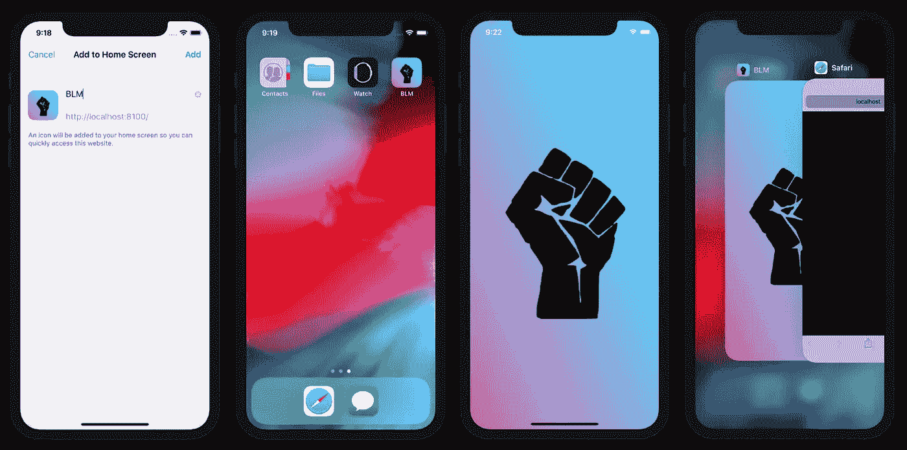
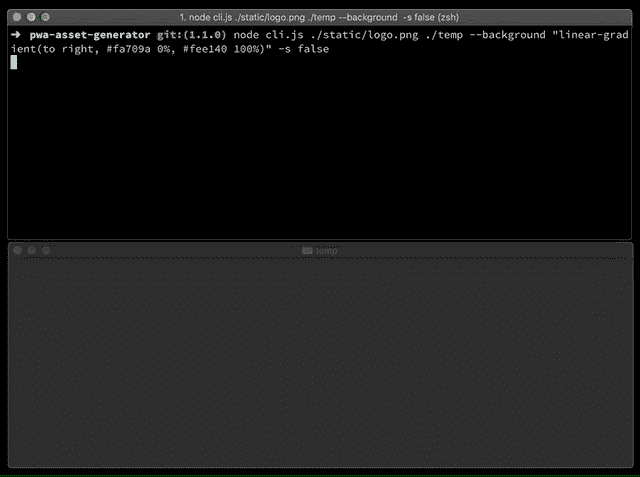
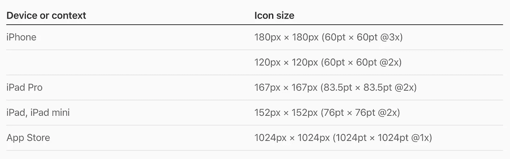
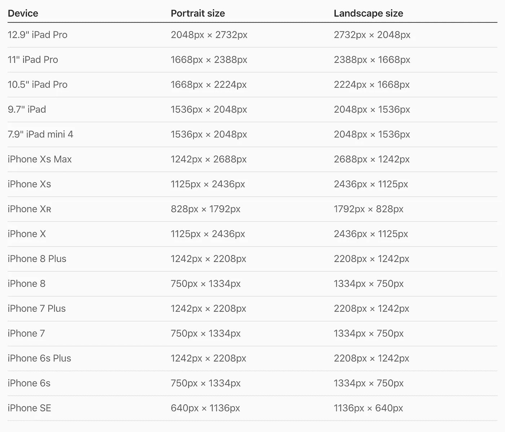
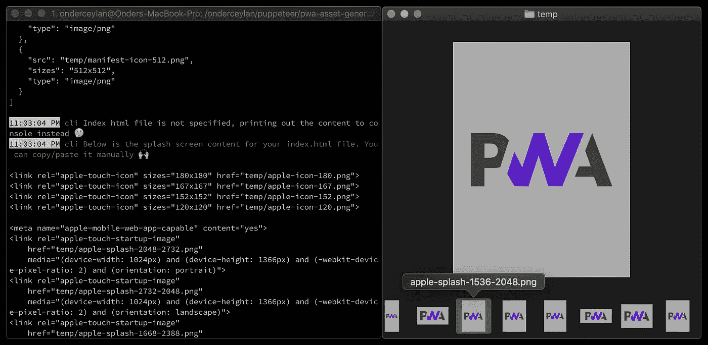
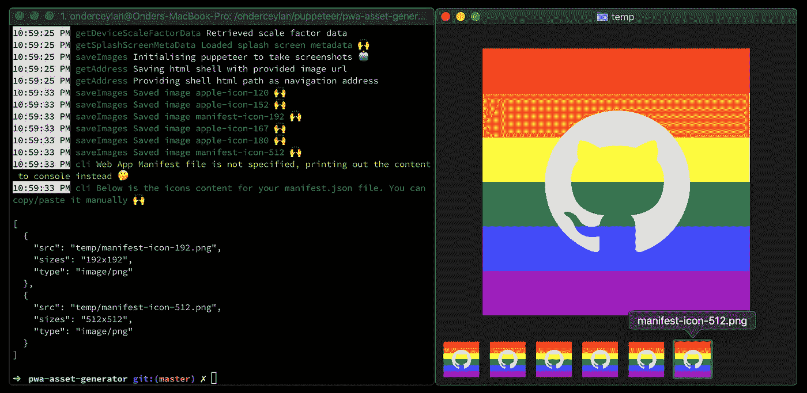
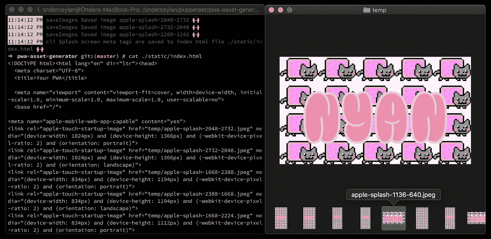

# PWA 闪屏和图标生成器

> 原文：<https://itnext.io/pwa-splash-screen-and-icon-generator-a74ebb8a130?source=collection_archive---------0----------------------->



演示由[**PWA-asset-generator**](https://github.com/onderceylan/pwa-asset-generator)生成的在 iOS 上带有闪屏和图标的 PWA

长话短说；在为我的下一次演讲试验关于 Puppeteer 的想法时，我发现自己正在构建一个开源的 CLI 工具—[**【pwa—资产—生成器**](https://github.com/onderceylan/pwa-asset-generator) **！:)**

它会自动为您的渐进式 Web 应用程序生成闪屏和图标图像，以便在多个平台上提供类似本机的用户体验。它还更新您的`index.html`和`manifest.json`文件，向您的 PWA 声明生成的资产。

在本文中，我将详细介绍我构建这样一个库的动机，以及一些高级的使用示例。



[**pwa-asset-generator**](https://github.com/onderceylan/pwa-asset-generator)的基本使用演示

[](https://www.npmjs.com/package/pwa-asset-generator) [## 资产生成器

### 基于木偶师的 PWA 资产生成器。根据 Web 应用程序清单自动生成图标和闪屏…

www.npmjs.com](https://www.npmjs.com/package/pwa-asset-generator) 

在接下来的章节中，我将解释为什么需要这样一个库，以及它与为您的 PWA 生成资产的其他现有选项相比如何。

> 请随意跳到文章的最后一章⏬查看该库的功能和高级用法示例。

# 我们为什么需要这样一个图书馆？

当您构建 PWA 的目标是在多个平台和商店上提供类似本机的用户体验时，您需要用您的 PWA 资产来满足那些平台和商店的标准；**图标**和**闪屏**。这些标准是:

*   **谷歌的 Android** 平台尊重 Web 应用清单 API 规范，它希望你在清单文件中至少提供**两种图标大小**—[https://developers . Google . com/Web/fundamentals/we b-App-Manifest/# icons](https://developers.google.com/web/fundamentals/web-app-manifest/#icons)
*   正如 Microsoft docs 中所指出的，您的 PWA 必须满足 Web 应用程序清单中声明的特定图像标准，才能自动打包用于**Microsoft Store**—[https://docs . Microsoft . com/en-us/Microsoft-edge/progressive-we B- apps/get-started # we B- App-Manifest](https://docs.microsoft.com/en-us/microsoft-edge/progressive-web-apps/get-started#web-app-manifest)

> 一旦您使用所需大小的图标作为 Web 应用程序清单 API 的一部分，您就不需要为上述平台提供额外的闪屏图像。它们是自动为您生成的。

## 监督办的标准

复杂。目前，iOS 不支持 Web App Manifest API 规范，尽管该规范正在开发中——点击此处跟踪进展[。目前还不清楚苹果是否会在标准实施期间改变显示闪屏的方式，因为*闪屏不是 Web 应用清单规范*的一部分。到目前为止，在 iOS 上为你的 PWA 设置图标和闪屏的唯一方法是，添加特殊的 HTML 标签。](https://webkit.org/status/#specification-web-app-manifest)

当 PWA 被添加到用户的主屏幕时，需要一个带有 rel `apple-touch-icon`的特殊 HTML 链接标签来为它提供图标。在[苹果图标指南](https://developer.apple.com/design/human-interface-guidelines/ios/icons-and-images/app-icon/)和 [Safari 网络内容指南](https://developer.apple.com/library/archive/documentation/AppleApplications/Reference/SafariWebContent/ConfiguringWebApplications/ConfiguringWebApplications.html)上阅读更多相关内容。



来自[苹果图标指南](https://developer.apple.com/design/human-interface-guidelines/ios/icons-and-images/app-icon/)的图标规格示例

如果您还想为 PWA 提供闪屏，则需要另一个带有 rel `apple-touch-startup-image`的特殊 HTML 链接标签。当你的 PWA 在后台打开时，iOS 会显示这些屏幕。到目前为止一切顺利！

但是，这里有一个陷阱:你需要为[苹果的启动屏幕指南](https://developer.apple.com/design/human-interface-guidelines/ios/icons-and-images/launch-screen/#static-launch-screen-images-not-recommended)上的**每个分辨率**创建一个闪屏图像，并为每个设备分辨率和方向添加一个带有媒体属性的 HTML 标签🙀！不幸的是，这一要求在 Safari Web 内容指南中没有得到充分的记录。

**仅一个**分辨率&方位对的链接标签示例；

```
<link rel="apple-touch-startup-image" href="temp/apple-splash-2048-2732.png" media="(device-width: 1024px) and (device-height: 1366px) and (-webkit-device-pixel-ratio: 2) and (orientation: portrait)">
```



苹果发布屏幕指南中的闪屏规格示例

> 💡为所有平台创建图标和闪屏图像，维护所有平台的大小和质量，并为每个图像添加 HTML 标签，这些工作可能会让人不知所措。那么，为什么不自动化呢？🤖

# 现有解决方案的缺点

当我决定构建这样一个 CLI 库时，已经有几个选项可以为 pwa 和与它们相关联的元生成资产。它们可能很适合你的需要，但是我认为在决定使用什么的时候了解它们的缺点是明智的。

我在使用时注意到的*的一些缺点是*；**

## 运行时依赖性

生成和使用 PWA 资产的一个选项是使用 [PWACompat](https://github.com/GoogleChromeLabs/pwacompat) 。我认为跨平台保持标准的闪屏外观是一个不错的选择。但是，它使用一种方法在运行时(iOS)生成 PWA 图像，并将它们存储在浏览器的会话存储中。请记住，这种方法不仅会影响 PWA 的初始化性能，还会接管您的 *manifest.json* 文件和资产的所有权。

## 带来维护成本

生成和使用 PWA 资产的一些其他选项是在线工具，如 [AppScope 闪屏生成器](https://appsco.pe/developer/splash-screens)或 [PWABuilder](https://www.pwabuilder.com/generate) 。这些工具分别生成图标*或*闪屏，没有任何在线工具可以生成这两种资产类型。它们还伴随着维护成本，例如:

*   解压缩内容并重新定位资产
*   手动更新 *manifest.json* 或*index.html*文件
*   关注标准和指南，确保您的 PWA 兼容所有设备类型和平台

并且，一遍又一遍的做这种手工。

## **难以自动化**

使用在线工具的另一个缺点是它们很难自动化。让您的 PWA 资产保持最新并以自动化方式兼容所有平台的理想场景是将[**PWA-asset-generator**](https://github.com/onderceylan/pwa-asset-generator)集成到您最喜欢的 CI 的构建步骤中。它可以生成所有的资产，并根据最新的平台规范更新您的*index.html*和 *manifest.json* 文件以及相关的元数据。

## 缺乏对内容的灵活性和所有权

你无法控制你的资产是如何产生的。现有的解决方案都不能完全控制资产是如何生成的。PWACompat 根本不提供任何控件，它自动生成所有闪屏都是同一种形式。此外，当您生成资产时，在线工具提供有限的定制选项。[**pwa-asset-generator**](https://github.com/onderceylan/pwa-asset-generator)通过 HTML 输入让你完全控制你的资产。我将在下一章详细描述这一点。

# 库的功能和用法

PWA 资产生成器以创造性的方式自动生成图像。以[木偶师](https://pptr.dev)为核心可以实现很多可能性。

—生成带有可选`--icon-only` `--splash-only` `--landscape-only`和`--portrait-only`标志✨的图标和闪屏

—自动更新您的 *manifest.json* 和*index.html*文件，用于声明生成的图像资产🙌

—通过木偶师从苹果人机界面指南网站抓取最新规格，使您的 PWA 为所有/最新的 iOS 设备做好准备🤖

*   支持离线模式，并在抓取出错时使用静态规范数据📴
*   每次发布前自动更新静态规格数据，并且[每天监控规格变化](https://github.com/onderceylan/pwa-asset-generator/actions?query=workflow%3A%22Sanity+Check%22)🔄

—使用 Chrome 浏览器，因为它是您最喜欢的图像编辑器的画布。它使用一个 shell HTML 文件作为画板，并在通过 Puppeteer 为每个分辨率截图之前将您的徽标居中🤖

—您可以以多种格式提供您的源；本地图像文件、本地 HTML 文件、远程图像或 HTML 文件🙌

*   当它是一个图像源时，它位于您提供的背景选项的中心🌅
*   当它是一个 HTML 源代码时，你可以随心所欲地发挥创造力；定位你的标志，使用 SVG 过滤器，使用可变字体，使用渐变背景，使用排版等。你的 HTML 文件在 Chrome 上呈现，然后对每个分辨率进行截图🎨

—它使用[木偶核心](https://github.com/GoogleChrome/puppeteer/blob/master/docs/api.md#puppeteer-vs-puppeteer-core)而不是木偶，并且只在系统上不存在 Chromium 时才安装它。为每个用户节省大约 110-150 MB 的磁盘空间和许多秒钟🌎️️⚡️

—支持 iOS 上的黑暗模式闪屏！所以，你可以提供两种光🌕和黑暗🌚基于用户偏好区分应用外观的闪屏图像🌙

## 例子

1.  本地 PNG 输入的基本用法，跳过抓取规格，生成闪屏和图标；

```
npx pwa-asset-generator ./img/logo.png --background "#ababab" --scrape false
```



2.远程 SVG 输入的高级用法，使用自定义渐变背景🏳️‍🌈，只生成图标；

```
npx pwa-asset-generator [https://animejs.com/documentation/assets/img/icons/icon-github.svg](https://animejs.com/documentation/assets/img/icons/icon-github.svg) ./temp -b "linear-gradient(180deg, #f00000, #f00000 16.67%, #ff8000 16.67%, #ff8000 33.33%, #ffff00 33.33%, #ffff00 50%, #007940 50%, #007940 66.67%, #4040ff 66.67%, #4040ff 83.33%, #a000c0 83.33%, #a000c0) fixed" --icon-only
```



> 💡人们可以在 CI 上引入构建步骤，以在特殊场合自动区分 PWA 的品牌。岂不是很牛逼？

3.先进的使用自定义 HTML 输入，使用背景瓷砖和自定义可变网络字体，只产生闪屏，输出 70%质量的 JPEG 文件类型，代码输出保存到您的 PWA 的 index.html 文件；

```
# The local nyan.html can be a remote url as well
# npx pwa-asset-generator [https://ny.an/nyan.html](https://ny.an/nyan.html)npx pwa-asset-generator nyan.html ./src/app/temp --splash-only --type=jpeg --quality=70 --index ./src/app/index.html
```



如果你好奇这样一个 HTML 是如何构建的，[这里是要点](https://gist.github.com/onderceylan/67f4d33f3317138905e1c7234cb70731)。

> 💡当使用 HTML 输入时，您可以完全控制您的资产👩‍💻您可以使用任何类型的 web 技术来呈现您的资产内容。有些可能包括但不限于 SVG 过滤器、css 媒体查询、可变字体、css 图像过滤器、渐变背景和图像拼贴👩‍🎨

4.生成 iOS 的亮暗模式闪屏，输出 80%质量的 JPEG 文件类型，代码输出保存到你的 PWA 的 index.html 文件；

```
npx pwa-asset-generator light-logo.svg ./assets --dark-mode --background dimgrey --splash-only --type jpeg --quality 80 --index ./src/app/index.htmlnpx pwa-asset-generator dark-logo.svg ./assets --background lightgray --splash-only --type jpeg --quality 80 --index ./src/app/index.html
```

iOS 上黑暗模式闪屏的视频演示

# 额外收获:引擎盖下

对于读到这里的好奇的读者，我想分享一个简单而强大的概念，这个概念是图书馆在幕后使用的。

正如我前面提到的，在引擎盖下使用木偶师打开了一扇可能性之门。[**pwa-asset-generator**](https://github.com/onderceylan/pwa-asset-generator)使用的木偶师的一个关键特性，就是它的[截图 API](https://pptr.dev/#?product=Puppeteer&version=v1.19.0&show=api-pagescreenshotoptions) 。

木偶戏允许保存截图在 PNG 和 JPEG 文件类型与可选的 JPEG 图像压缩的可能性。

每次你用[**pwa-asset-generator**](https://github.com/onderceylan/pwa-asset-generator)执行一个命令，库就会从 2 个来源抓取最新的 iOS 规范。然后，它打开新的选项卡，根据提供的 CLI 参数呈现 *shell HTML* 的内容。下面是 *shell HTML* 内容；

```
<!DOCTYPE html>
<html>
<head>
  <meta name="viewport" content="width=device-width, initial-scale=1">
  <style>
    body {
      margin: 0;
      background: --background;
      height: 100vh;
      padding: --padding;
      box-sizing: border-box;
    }
    img {
      width: 100%;
      height: 100%;
      margin: 0 auto;
      object-fit: contain;    
    }
  </style>
</head>
<body>

</body>
</html>
```

它打开一个新的浏览器选项卡，通过 Puppeteer 为每个图标和闪屏尺寸呈现 *shell HTML* 文件内容，最后保存每个图标和闪屏尺寸的截图。

```
// You can see the complete source here: [https://github.com/onderceylan/pwa-asset-generator/blob/master/src/helpers/puppets.ts](https://github.com/onderceylan/pwa-asset-generator/blob/master/src/helpers/puppets.ts)const saveImages = async (
  imageList: Image[],
  source: string,
  output: string,
  options: Options,
  browser: Browser,
): Promise<SavedImage[]> => {
  let address: string;
  let shellHtml: string;

  const logger = preLogger(saveImages.name, options);
  logger.log('Initialising puppeteer to take screenshots', '🤖');

  if (canNavigateTo(source)) {
    address = await url.getAddress(source, options);
  } else {
    shellHtml = await url.getShellHtml(source, options);
  }

  return Promise.all(
    imageList.map(async ({ name, width, height, scaleFactor, orientation }) => {
      const { type, quality } = options;
      const path = file.getImageSavePath(name, output, type);

      try {
        const page = await browser.newPage();
        await page.setViewport({ width, height });

        if (address) {
          await page.goto(address);
        } else {
          await page.setContent(shellHtml);
        }

        await page.screenshot({
          path,
          omitBackground: !options.opaque,
          type: options.type,
          ...(type !== 'png' ? { quality } : {}),
        });

        await page.close();

        logger.success(`Saved image ${name}`);

        return { name, width, height, scaleFactor, path, orientation };
      } catch (e) {
        logger.error(e.message);
        throw Error(`Failed to save image ${name}`);
      }
    }),
  );
};
```

我的灵感来自这篇博文最初是为了保存调整后的响应式网页的截图，感谢张秀坤的启发！

> ⚡️与木偶师不同，pwa-asset-generator 使用*系统浏览器优先*方法，使用 [chrome-launcher](https://github.com/GoogleChrome/chrome-launcher) 和[木偶师核心](https://github.com/GoogleChrome/puppeteer/blob/master/docs/api.md#puppeteer-vs-puppeteer-core)，并且它只在 chrome 没有安装在执行环境中时才安装 chrome。

由于库在无头模式下使用木偶师，你看不到幕后发生了什么。为了使它可见，这里有一个过程的演示，通过禁用[操纵木偶者启动选项](https://pptr.dev/#?product=Puppeteer&version=v1.19.0&show=api-puppeteerlaunchoptions)中的`headless`模式；

# 支持

如果你喜欢图书馆，我很欣赏你在 [GitHub](https://github.com/onderceylan/pwa-asset-generator) 上的星，以及你在 [Twitter](https://twitter.com/onderceylan/status/1162138795787071490?s=20) 上的赞/转发和反馈。如果你也是一个博客写手，那么在你的博客上看到一个关于艾滋病人的参考会很棒。

[](https://github.com/onderceylan/pwa-asset-generator) [## onderceylan/pwa-资产-生成器

### 基于木偶师的 PWA 资产生成器。根据 Web 应用程序清单自动生成图标和闪屏…

github.com](https://github.com/onderceylan/pwa-asset-generator) 

如果你喜欢我的文章，请在 Medium 和 [Twitter](https://twitter.com/onderceylan) 上关注我，订阅我未来的帖子和项目！干杯！