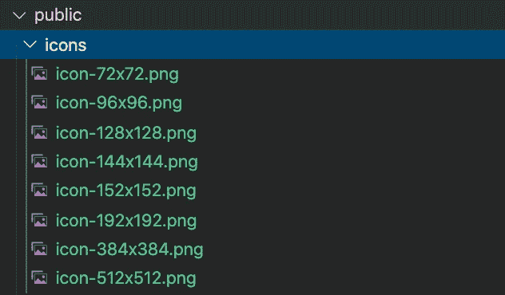
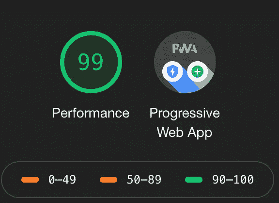
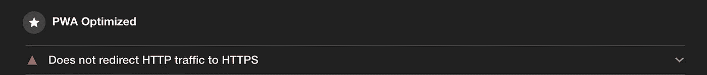
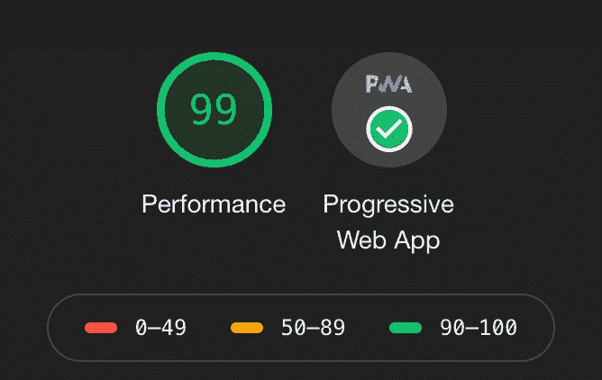

# 2020 年⚡️的 PWA 与 Next.js (create-next-app)

> 原文：<https://itnext.io/pwa-with-next-js-create-next-app-in-2020-%EF%B8%8F-9ee0e1a6313d?source=collection_archive---------0----------------------->

Next.js + PWA = ⚡️📱

让我们将一个`create-next-app`项目转换成一个渐进式 Web 应用程序(PWA)

# 1.设置

让我们通过运行以下命令，使用`create-next-app` (CNA)创建一个样板 Next.js 项目:

```
npx create-next-app
```

您可以在文本编辑器中打开项目文件夹。该步骤之后的所有终端命令都假定在项目目录中**执行。**

# 2.安装下一个-pwa

让我们将`next-pwa`包添加到我们的项目中。运行:

```
npm install next-pwa
```

或者:

```
yarn add next-pwa
```

# 3.创建`next.config.js`文件

你可以使用这个命令创建一个`next.config.js`文件。

```
touch next.config.js
```

现在，我们需要编辑这个文件并包含我们所有的`next-pwa`配置。这里有一个例子`next.config.js`可以帮助你开始:

注意，我们已经在`withPwa`中添加了`pwa`配置。在以前版本的 Next 中，为服务人员提供服务需要一个自定义服务器。但是从下一个 9+开始，这不是必需的。现在轻松多了！`next-pwa`将创建`sw.js`文件，该文件将从生产版本的`public`文件夹中提供。

# 4.创建 manifest.json 文件

您可以从这个在线工具创建一个 manifest.json 文件。确保你也从这个工具中生成图标。我们需要他们。

 [## 应用清单生成器

### Web 应用程序清单允许指定不同大小的图标。上传图标的 512x512 图像，我们将…

app-manifest.firebaseapp.com](https://app-manifest.firebaseapp.com/) 

您将获得一个`.zip`下载。拉开拉链。**将下载文件夹中的** `**manifest.json**` **复制到** `**/public**` **文件夹中。**

并将下载文件夹中`/images`的内容复制到项目的`/public`文件夹中。您将看到一个`icons`文件夹:



# 5.创建元标签

我们需要创建一组 meta 标签，并使用从`next/head`导入的`<Head>`组件将其添加到我们的页面中。我已经参考了这个 [repo](https://github.com/gokulkrishh/awesome-meta-and-manifest) 来获取所需的元标签:

 [## gokulkrishh/awesome-meta-and-manifest

### ⚡真棒集合元标签和清单属性。-gokulkrishh/awesome-meta-and-manifest

github.com](https://github.com/gokulkrishh/awesome-meta-and-manifest) 

以下是所需元标记的示例:

我已经编辑了`components/nav.js`来包含这个元标签。现在，我的`nav.js`长这样。为了避免混淆，我没有删除任何样板代码。

您可以使用这个[在线工具](https://www.favicon-generator.org/)生成**收藏夹图标**并将它们放在您的`/public`文件夹中:

 [## 图标和应用程序图标生成器

### 转换 PNG 到 ICO，JPG 到 ICO，GIF 到 ICO。创建 favicon.ico 和 iOS / Android 应用程序图标。编辑一个 favicon 以适合您的…

www.favicon-generator.org](https://www.favicon-generator.org/) 

# 6.考考你的 PWA！

现在，你的应用程序已经准备好了。我们只需要测试一下。当我们使用`next-pwa`时，服务人员仅在生产时启用。所以，我们应该用`npm run build`或者`yarn build`来构建我们的应用。你会看到这样的东西。


然后用`npm run start`或`yarn start`启动生产本地服务器。

转到`[http://localhost](http://localhost:):3000`。如果你在谷歌浏览器上，运行灯塔审计。您应该会看到类似这样的内容:



下面报告中标记为红色的一项是:



这是因为，PWAs 需要在 HTTPS 上运行。Localhost 是个例外。**将它部署到一个服务器，并通过 HTTPS** 提供服务，您将得到一个类似如下的审计:



成功！

开箱即用，你得到缓存，离线支持和“添加到主屏幕”的提示将出现在 Chrome(移动)。这使得用户可以像使用本地应用程序一样使用您的 PWA。享受你的进步网络应用！

本教程 Github Repo:

[](https://github.com/skolhustick/next-js-pwa-create-next-app/tree/master) [## skolhustick/next-js-pwa-create-next-app

### 带有 create-next-app 的 NextJS + PWA。为 skolhustick/next-js-pwa-create-next-app 开发做出贡献，创建一个…

github.com](https://github.com/skolhustick/next-js-pwa-create-next-app/tree/master)