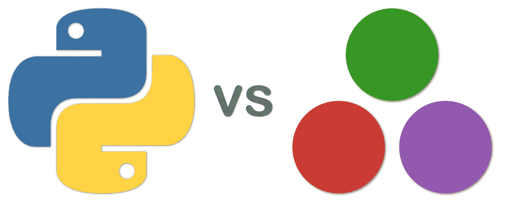
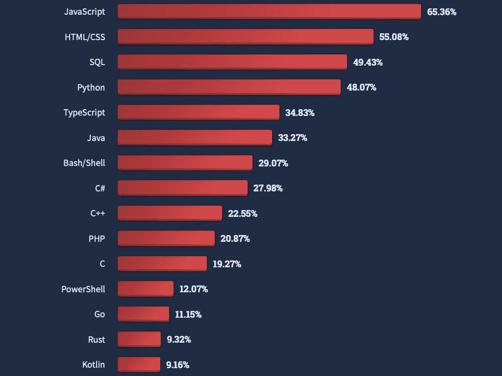
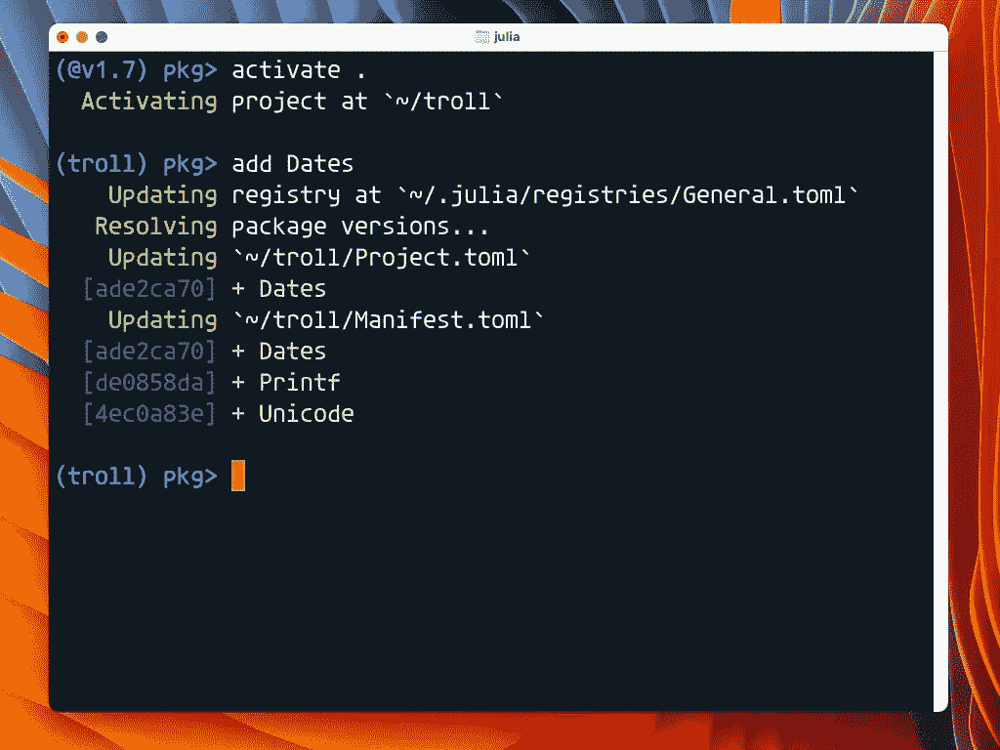
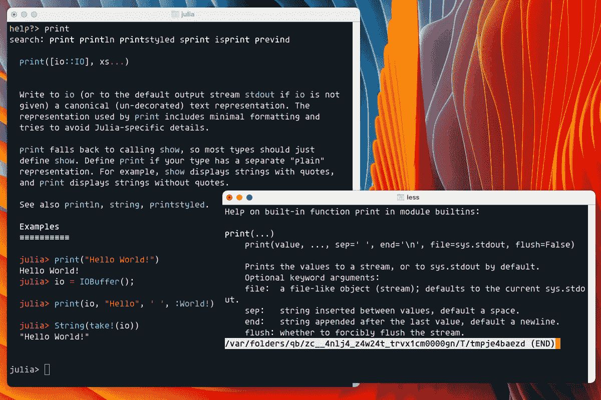
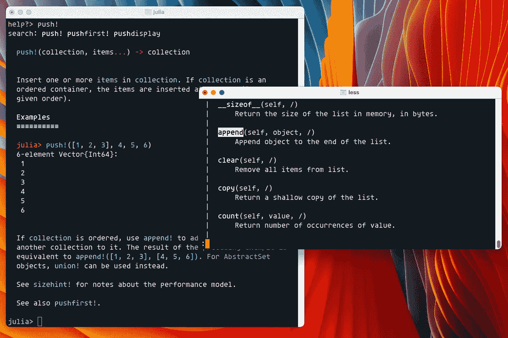
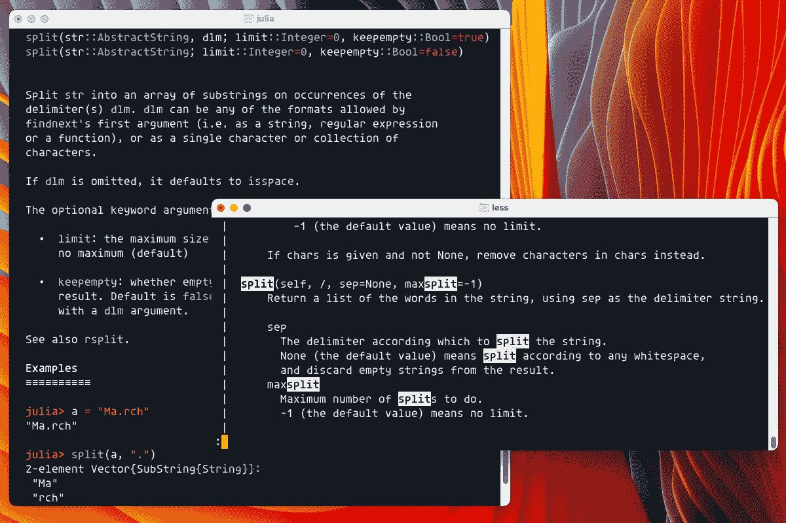
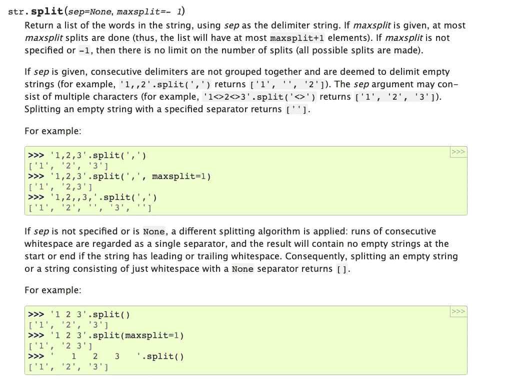

# 朱莉娅视角下的 Python 批评

> 原文：<https://itnext.io/python-criticism-from-a-julia-perspective-f6613dfdd2b1?source=collection_archive---------0----------------------->

## 一位 Julia 开发人员在反思今天使用 Python 3.10 的开箱即用体验



Julia 的开发者对 YTHON 的感觉异常熟悉。这不是意外。Python 是启发 Julia 创作的语言之一。来自朱莉娅的[创作者:](https://julialang.org/blog/2012/02/why-we-created-julia/)

> 我们是强大的 Matlab 用户。我们中的一些人是 Lisp 黑客。有些是 Pythonistas，有些是 ruby 爱好者，还有一些是 Perl 黑客。
> 
> —朱莉娅·创作者

这两种语言都可以用作交互式 REPL(读取-评估-打印-循环)环境的脚本语言，与许多其他编程语言和环境优雅地接口。

*注:这个故事是一个老故事的更新，是为* [*的读者准备的，Erik 探索了子堆栈上的*](https://erikexplores.substack.com/p/python-criticism-from-a-julia-perspective) *。不过，我也会在媒体上重新发布 Substack 材料。*

事实上，这种充当优雅粘合语言的能力是 Python 的主要卖点之一。20 多年前，当我开始作为一名专业开发人员工作时，Python 是我最先学会的用于文本处理和代码生成的语言之一。当时，Python 在编写解析和处理文本的干净程序方面没有对手。

Perl 的程序员当时可能会大声反对，但是今天的 Perl 在哪里呢？对清晰易读的代码的关注战胜了 Perl 几乎不惜任何代价追求的灵活性。Perl 最终成为只写语言。写代码很棒，但不是为了阅读。

```
# Excerpt from The 3rd Annual Obfuscated Perl Contest

undef $/;open(_,$0);/ \dx([\dA-F]*)/while(<_>);@&=split(//,$1);@/=@&;
$".=chr(hex(join("",splice(@&,0,2))))while(@&); eval$”;
```

当我开始使用 Python 时，感觉它比今天的 Julia 要晦涩得多。看看 Python 今天在哪里。Python 不再是角落里的古怪小孩，而是主宰机器学习、数据科学和 web 开发的 800 磅大猩猩。从 Stackoverflow 的 2022 年开发者调查来看，如今唯一比 Python 更受欢迎的通用编程语言是 JavaScript。



来自 Stackoverflow 调查 2022

但是我必须承认，2022 年的 Python 并没有像 2000 年的 Python 那样给我带来积极的影响。为什么？Python 的能力无疑呈指数级增长。但是我们对编程语言的期望也是如此。

PyCharm 等复杂的 ide 和 TensorFlow、Django 和 Pandas 等大型框架让 Python 开发人员做了很多事情。我不会考虑这一点，而是考虑语言本身的开箱即用体验。

# 现代 Python 的复杂性

今天的 Python 已经不是你爷爷辈的 Python 了。你遇到了 Python 2.x vs 3.x 的问题， [Anaconda vs PIP](https://www.anaconda.com/blog/understanding-conda-and-pip) ， [pipenv](https://pipenv.pypa.io/en/latest/) ，virtualenv， [venv](https://docs.python.org/3/library/venv.html) ，[JAX](https://github.com/google/jax)vs[PyPy](https://www.pypy.org)vs[Numba](https://numba.pydata.org)， [Cython](https://cython.org) 等等。足够多的人感受到了它的痛苦，以至于把它变成了一部连环漫画。


来自 XKCD(https://m.xkcd.com/1987)

我曾经接受过一个医生的咨询任务，他想开发一个应用程序来帮助她的诊断。她对编程有一些基本的经验，并跳进了今天对初学者来说最显而易见的路线:Python。

但是 Python 仍然是编程中易用性的黄金标准吗？我不这么认为。这位好医生来找我，因为她最终不得不放弃处理 Python 包系统和虚拟环境的复杂性。她偶然发现了朱莉娅，觉得这是一股新鲜空气。

## 用 Python 和 Julia 管理虚拟环境

为了处理 Python 2.x 和 3.x 的复杂性以及不同版本包的安装，我们需要一个虚拟环境。然而，Python 并不是为虚拟环境而生的。这是用螺栓固定的东西。因此，有许多方法来创建虚拟环境。我碰巧使用了一个名为 [VirtualFish](https://virtualfish.readthedocs.io/en/latest/) 的工具，它可以与我在终端应用程序中使用的[鱼壳](https://fishshell.com)配合使用。这里有一个问题:根据您使用的 Shell 环境，您需要不同的软件来管理您的虚拟环境。

Python 中的虚拟环境到底是什么？它包括为每个虚拟环境创建一个精心制作的 Python 目录结构，链接到不同库的具体版本和 Python 版本。这里有一个来自`VirtualFish`的例子。我使用`vf new`命令创建一个名为`rockets`的新虚拟环境。你可以看到它在`.virtualenvs/`目录下创建了无数的文件和文件夹。我们将为每个虚拟环境创建这样的结构。

```
❯ vf new rockets
Creating rockets via /usr/local/opt/python@3.8/bin/python3.8 …

~ via 🐍 v3.8.12 (rockets)
❯ tree -L 3 .virtualenvs/
.virtualenvs/
└── rockets
    ├── bin
    │   ├── activate
    │   ├── activate.csh
    │   ├── activate.fish
    │   ├── activate.ps1
    │   ├── activate.xsh
    │   ├── activate_this.py
    │   ├── easy_install
    │   ├── easy_install3
    │   ├── easy_install3.8
    │   ├── pip
    │   ├── pip3
    │   ├── pip3.8
    │   ├── python -> /usr/local/opt/python@3.8/bin/python3.8
    │   ├── python3 -> python
    │   ├── python3.8 -> python
    │   ├── wheel
    │   ├── wheel3
    │   └── wheel3.8
    ├── lib
    │   └── python3.8
    └── pyvenv.cfg
```

shell 中有一些钩子，可以确保您的整个系统都指向当前虚拟环境的目录结构。因此，安装虚拟环境管理器意味着向您的 shell 配置添加内容。我将以下文件添加到了我的 fish 启动配置中:

```
~
❯ cat .config/fish/conf.d/virtualfish-loader.fish
set -g VIRTUALFISH_VERSION 2.5.1
set -g VIRTUALFISH_PYTHON_EXEC /usr/local/opt/python@3.8/bin/python3.8
source /usr/local/lib/python3.8/site-packages/virtualfish/virtual.fish
emit virtualfish_did_setup_plugins⏎
```

这种创建虚拟环境的方式不是没有问题的。系统可能会因其他工具而崩溃。有各种各样的虚拟环境系统，你必须知道是否可以一起使用。打包和部署这类东西并不简单。

相比之下，在 Julia 中管理虚拟环境简直无聊透顶。环境只是一个包含两个文件的目录:

*   `Project.toml`——直接依赖
*   `Manifest.toml` -间接依赖关系

这意味着您可以在 Julia 中轻松地对环境进行版本控制。您只需要带两个文件就可以在任何地方重新创建那个环境。让我告诉你我们如何在 Julia 中创建一个环境来进行比较。我将创建一个名为`troll`的环境(为什么不呢？我是挪威人。我们用巨魔来命名一切事物)。

```
❯ mkdir troll

❯ cd troll

~/troll
❯ julia -q
julia>
```

我们已经启动了朱莉娅，我们在朱莉娅 REPL(阅读-评估-打印-循环)。当前处于 Julia 模式，提示为`julia>`。我们切换到包管理器模式，向环境添加依赖项。我们只是按下`]`键来切换模式。

```
julia> ]
(@v1.7) pkg> activate .
```

Julia 给了我们一些反馈，告诉我们如何以及在哪里获取依赖项。



我们不必真的退出朱莉娅·REPL。我们可以简单地点击分号`;`进入 shell 模式，并且我们可以使用常规的 Unix 实用程序如`cat`来查看刚刚被修改的`.toml`文件。`Project.toml`文件包含我们添加的单个依赖项:

```
shell> cat Project.toml
[deps]
Dates = "ade2ca70-3891-5945-98fb-dc099432e06a"

shell> cat Manifest.toml
# This file is machine-generated - editing it directly is not advised

julia_version = "1.7.2"
manifest_format = "2.0"

[[deps.Dates]]
deps = ["Printf"]
uuid = "ade2ca70-3891-5945-98fb-dc099432e06a"

[[deps.Printf]]
deps = ["Unicode"]
uuid = "de0858da-6303-5e67-8744-51eddeeeb8d7"

[[deps.Unicode]]
uuid = "4ec0a83e-493e-50e2-b9ac-8f72acf5a8f5"
```

当然，我们可以详细了解清单文件中所有这些不同内容的含义，但这不是本文的内容。我们正在尝试将当代 Python 与 Julia 进行比较。

从我们刚刚探索的两个系统中有几个重要的收获:

*   Python 要求选择一个与您使用的 shell 兼容的特定虚拟环境系统并安装它。
*   在 Python 中安装虚拟环境系统会修改您的 shell 的行为。

对于茱莉亚来说，没什么好装的。虚拟环境系统是 Julia 的一个组成部分，与包装系统交织在一起。你可以在朱莉娅·REPL 内部激活和修改虚拟环境系统。它根本不会修改或触及您的外壳。您不必担心添加虚拟环境系统会搞乱您可能已经完成的其他 shell 配置。

在 Julia 中，您可以轻松地将虚拟环境与您的项目一起携带，因为它们只是简单的文本文件，您可以将它们提交到您的版本控制系统，并保存在与您的项目相同的目录中。

对于 Python 来说，我看不到一种简单的方法来摆脱它在这个领域制造的混乱。过去的错误仍然存在，因为有大量的 Python 项目是在这些系统上构建的。添加一个新的更好的系统会产生一个所有软件开发人员都熟悉的众所周知的问题:


添加一个新的更好的虚拟环境系统会造成什么损害？[https://xkcd.com/927/](https://xkcd.com/927/)

# Python 文档的问题

对 Julia 最常见的抱怨之一是文档很糟糕，而 Python 因其丰富的优秀文档而受到称赞。我认为这是一种误解。

Julia 有一个非常完善的文档系统。朱莉娅·REPL 提供了一种帮助模式，你可以通过按`?`进入该模式。在帮助模式下，评估实际的 Julia 代码以选择相关的方法。例如，Julia 中的乘法符号可用于数字相乘或连接字符串。如果在帮助模式下将两个数相乘，我们会得到算术运算的文档。

```
help?> 2 * 4
  *(x, y...)

  Multiplication operator. x*y*z*... calls this function with all
  arguments, i.e. *(x, y, z, ...).

  Examples
  ≡≡≡≡≡≡≡≡≡≡

  julia> 2 * 7 * 8
  112

  julia> *(2, 7, 8)
  112
```

另一方面，如果我们提供文本字符串，我们得到的是字符串连接的文档:

```
help?> "hello" * "world"
  *(s::Union{AbstractString, AbstractChar}, t::Union{AbstractString, AbstractChar}...) -> AbstractString

  Concatenate strings and/or characters, producing a String. This is
  equivalent to calling the string function on the arguments.
  Concatenation of built-in string types always produces a value of type
  String but other string types may choose to return a string of a
  different type as appropriate.

  Examples
  ≡≡≡≡≡≡≡≡≡≡

  julia> "Hello " * "world"
  "Hello world"

  julia> 'j' * "ulia"
  "julia"
```

Python REPL 文档没有这种复杂程度。但是 Python 文档有更大的问题:

*   没有语法突出显示或格式
*   没有示例代码
*   极其稀疏

为了说明这个问题，我拍摄了一些屏幕截图，展示了在每个 REPL 环境中查找类似类型的函数/方法的帮助会产生什么结果，左边是 Julia，右边是 Python。

## 打印字符串

让我们先看看`print`文档。这是语言初学者最常用的函数。请注意 Julia 帮助如何给出有用的代码示例，以及如何格式化非字符串值的重要细节。Python 没有提到`print`将如何处理非字符串值。



用 Julia 和 Python 打印文档

## 推送和附加集合

对于初学者来说，另一个常见的功能是在集合的末尾添加一个元素。Julia 调用这个函数`push!`，而 Python 调用它`append`。同样，您可以看到 Python 文档是多么简单。它只是陈述最明显的，没有任何细节或代码示例。



用力！并为 Julia 和 Python 附加文档

我认为，帮助文档还说明了像 Julia 这样的函数式语言的另一个明显优势。帮助文档会立即让您看到这样一个事实:T2 是一个适用于许多集合类型的通用函数。您还会被告知它在不同集合中的行为可能会有所不同。Python 的 OOP 方法给了你一个更加孤立的世界。您无法立即判断该方法是否适用于许多不同的集合类型。朱莉娅帮助你用一般术语思考。你开始认为函数具有跨多种类型的相关行为。

## 拆分字符串

Python 和 Julia 都是处理文本的好语言。我经常使用的一个函数是`split`将一个字符串转换成一个元素数组。同样，Julia 变体有更丰富的文档和更多的例子来帮助开发人员。例如，Julia 文档详细说明了定界符`dlm`可以是什么。文档解释说它可以是字符串、正则表达式、函数、单个字符或字符集合。



Julia 和 Python 的分割字符串文档

Python 文档实际上并没有说明分隔符`sep`应该是哪种对象。

## 那么，为什么 Julia Documentation 的名声不好呢？

许多 Julia 项目是年轻的和不成熟的，这意味着文档是不完整的或缺乏的。相比之下，Python 有许多大型的成熟项目，随着时间的推移，这些项目已经建立了可靠的文档。

印象中的差异源于 Python 有各种各样的书籍、教程、指南和在线文档。Julia 社区的资源要少得多，而且没有为所有流行的项目创建合适的文档。但是有一些重要的事情 Julia 做对了，而 Python 做得不够:Julia 的内置文档系统显然更好。它理解 Markdown 语法，您可以添加代码示例，所有这些都可以通过文档生成工具提取出来。这意味着你在朱丽亚·REPL 身上看到的帮助和你在网上看到的会相匹配。

对于 Python 来说，这是两个独立的世界。在 Python REPL 中，`split`方法的帮助是非常简单的，但是在基于 web 的[在线帮助系统](https://docs.python.org/3/library/stdtypes.html#str)中要广泛得多。



网上的 Python 分裂函数文档

如果你为朱丽亚看同样的[文档(分割)](https://docs.julialang.org/en/v1/base/strings/#Base.split)，你会发现它与你在朱丽亚·REPL 中找到的完全相同。这是因为文档来源于同一个地方。

# 弱类型布尔表达式

许多语言中的一个常见操作是检查集合`xs`是否为空。许多语言都有类似于`empty`、`isempty`或`isEmpty`的功能。在朱丽亚，我会写:

```
julia> xs = [3, 4];

julia> isempty(xs)
false
```

我记得多年后第一次回到 Python 时，我已经忘记了如何检查集合是否为空，所以我尝试了各种具有所提到名称的方法调用。它们都不起作用，因为，惊讶吧，惊讶吧，在 Python 中检查集合`xs`是否为空时，您可以写:

```
if not xs:
  print "collection is empty"
```

这种奇怪之处的存在是因为 Python 世界有**真**和**假**的概念。在 Python 中，几乎所有不是 0、0.0、`false`或空集合的对象都被解释为`true`。在我看来，这是一个相当糟糕的设计选择。它为布尔表达式和控制流语句提供了非常弱的类型。弱类型意味着更多的错误会从缝隙中溜走。

也许这个设计选择更令人困惑的是，它完全违反了 Python 禅宗中最神圣的戒律之一:

> 显性比隐性好

这种语言设计选择意味着以下明显有问题的代码运行良好:

```
if 'B':
	print("expression is true")
```

在 Julia 中，如果您试图运行这个表达式，Julia 会抛出一个类型错误异常:

```
julia> if 'B'
           print("true expression")
       end
ERROR: TypeError: non-boolean (Char) used in boolean context
```

# 低功能可发现性

如果你已经编程多年，你会开始意识到应该存在什么样的功能。你知道应该可以向集合中添加条目，拆分字符串，搜索条目。在 Julia 中，开箱即用，如果我写`spli`并按 tab 键两次，我会得到以下显示的完成:

```
splice!    split       splitdir    splitdrive  splitext    splitpath
julia> spli
```

这是很多有用的信息。我被提醒，我可以将一个路径拆分成单独的部分，或者我可以拆分文件扩展名。

```
julia> splitext("foo.txt")
("foo", ".txt")
```

使用 Python，搜索功能更加复杂，因为它被划分到对象上的免费函数和方法中。为了发现`split`的功能，我必须首先创建一个字符串对象，然后尝试完成( [bpython REPL](https://bpython-interpreter.org) ):

```
>>> "abc".spli
┌──────────────────────────────────────────────────────────────┐
│ split      splitlines                                        │
└──────────────────────────────────────────────────────────────┘
```

分割路径的功能在哪里？您可以看到，使用 OOP 方法，我们不会接触到相关的功能。像处理路径这样的常见操作隐藏在一个单独的模块中，您必须导入该模块才能找到路径分割和文件扩展名分割。

```
>>> import os.path
>>> os.path.split
┌──────────────────────────────────────────────────────────────┐
│ split              splitdrive         splitext               │
└──────────────────────────────────────────────────────────────┘
```

拆分的反义词是连接:取几个元素，把它们组合成一个。我们可以在 Julia 中用制表符补全来做同样的事情，以发现连接事物的常见方式:

```
join     joinpath
julia> join
```

通过写一个括号`(`并再次按 tab 键，我可以进一步发现`join`可以操作什么类型的对象:

```
julia> join(

join(io::IO, iterator) in Base at strings/io.jl:342
join(io::IO, iterator, delim) in Base at strings/io.jl:342
join(io::IO, iterator, delim, last) in Base at strings/io.jl:326
join(iterator) in Base at strings/io.jl:352
join(iterator, delim) in Base at strings/io.jl:353
join(iterator, delim, last) in Base at strings/io.jl:354
```

这种完成给了我们一些有用的提示，我们不会立即假设，比如能够将输出从`join`推入 I/O 对象，比如文件、网络套接字或标准输出。

```
# Producing a string
julia> join('A':'F', ",")
"A,B,C,D,E,F"

# Sending result of join to stdout
julia> join(stdout, 'A':'F', ",")
A,B,C,D,E,F
```

对于 Python 来说，`join`并不是显而易见的地方。事实证明，Python 中考虑 join 的方式是在分隔符上调用`join`。这有多符合 Python 的禅？从概念上来说，被加入实际集合的东西不是吗？

```
>>> ":".join(["hello", "world"])
'hello:world'
```

我在使用 Python 时注意到的另一个问题是，Python 的功能比 Julia 中的功能更不通用。例如，我不能连接非字符串对象。为什么不呢？

```
>>> ":".join([3, 5, 5])
TypeError: sequence item 0: expected str instance, int found
```

在 Julia 中，其行为类似于打印。您使用每个对象的默认字符串表示。

```
julia> join([4, 5, 6], ":")
"4:5:6"
```

Julia 的`join`函数给了我们一个发现`joinpath`的简单方法，但是在 Python 中没有这样容易发现的`join`连接。Python 解决方案是:

```
>>> import os.path
>>> os.path.join("foo", "bar")
'foo/bar'
>>> os.path.join(["foo", "bar"])
TypeError: expected str, bytes or os.PathLike object, not list
```

最后一条语句再次证明了 Python 缺乏通用性。为什么连接列表中的元素不起作用？它在 Julia 身上完全没问题:

```
julia> joinpath("foo", "bar")
"foo/bar"

julia> joinpath(["foo", "bar"])
"foo/bar"
```

如果我们想扩展这个功能并创建一个从我们的主目录开始的路径呢？这是一个常见的编程任务，在 Julia 中很容易完成。

```
julia> joinpath(homedir(), "bar", "foo")
"/Users/erikengheim/bar/foo
```

使用 Python，我们必须进入完全不同的领域，使用完全不同的功能:

```
>>> os.path.expanduser("~/bar/foo")
'/Users/erikengheim/bar/foo'
```

我觉得这个函数的命名比较差。寻找主目录路径的人不会去寻找这种名字的函数。

我发誓我没有挑选这些例子。我只是选择我常用的功能。让我举另一个相关的例子。因为 Python 和 Julia 都用于脚本编写，所以很自然地会考虑处理文件的功能。假设我们想要删除一个文件。在 Julia 中，大多数文件函数反映了你在 Unix shell 中使用的名字，比如`cp`、`mv`和`rm`，这使得它们很容易被发现。因此，要在 Julia 中删除一个文件或目录，我可以写:

```
julia> rm("foo")                 # remove single file
julia> rm("foo", recursive=true) # remove all content of a directory
```

在 Python 中，`os`模块中没有`rm`、`delete`或`rmdir`函数。相反，我们必须看一个完全不同的模块，名为`shutil`，带有函数`rmtree`。这让我觉得前后矛盾。你必须在一个完全不同的库中寻找一个有着不直观名字的密切相关的函数。

# Python 有限的通用性

如果你所学的概念可以在许多组合中重复使用，语言在使用时会变得更加强大和灵活。这就是为什么好的软件设计倾向于强调正交特性的创建。如果你有清晰分离的特性，并且可以互相结合，那么软件会更容易使用。在绘图程序中，可以选择彼此独立的几何形状和颜色。想象一下，如果绘制红色方块是一个特定的工具，独立于绘制绿色圆圈的工具，该软件会有多复杂。

以下是如何在 Julia 中使用切片和范围的示例:

```
julia> xs = [2, 4, 8, 10];

julia> xs[1:3]
3-element Vector{Int64}:
 2
 4
 8

julia> r = 1:3
1:3

julia> xs[r]
3-element Vector{Int64}:
 2
 4
 8

julia> 2 in 1:3
true
```

在 Python 中，没有像在 Julia 中那样的通用范围操作符`:`。

```
>>> xs = [2, 4, 8, 10]
>>> xs[0:3]
[2, 4, 8]

>>> r = 0:3
    r = 0:3
         ^
SyntaxError: invalid syntax

>>> r = slice(0, 3)
>>> xs[r]
[2, 4, 8]

>>> 2 in slice(0, 3)
TypeError: argument of type 'slice' is not iterable

>>> 2 in range(0, 3)
True
```

有很多例子表明 Julia 概念自然地扩展到了各种不同的上下文中，但是 Python 却不是这样。我可以通过省略 Julia 中的函数名来创建一个匿名函数:

```
julia> f = function(x)
               x + 3
           end
#1 (generic function with 1 method)

julia> f(1)
4
```

在 Python 中不可能做到这一点。

```
>>> f = def(x):
    f = def(x):
        ^^^
SyntaxError: invalid syntax
```

事实上，Python 已经提出了大量处理匿名函数的解决方案。您有`lambda`函数或`with`语法结构。Julia 有不同的方法来创建匿名函数，但是每种方法都是完全可以互换的。例如，所有这些形式都表示相同的意思:

```
# Julia anonymous functions

open(function(io) readline(io) end, "foo.txt")

open(io->readline(io), "foo.txt")

open("foo.txt") do io
   readline(io)
end
```

在 Python 中，您必须专门使用`with`形式。不能使用 lambda 函数。

```
with openfile("foo.txt") as io:
  print(readline(io))
```

如果我们涵盖所有其他情况，这篇已经很长的文章会变得更长，但是当处理高阶函数如`map`、`filter`和`reduce`时，你会看到同样的问题出现。你在处理字典和理解的时候会看到它。

## 在 Julia 中通过对象发现方法

我想添加一个关于面向对象风格的方法发现的注释，因为来自 OOP 背景的人对 Julia 中的方法发现有很多抱怨。在 Julia 中，如果你想看到所有适用于参数`(stdout, 42)`的方法，你应该写(TAB 意味着 TAB 键):

```
julia> ?(stdout, 42) TAB
```

这可能会给出大量的完成，因此您可以通过指定要搜索的模块来缩小搜索范围。在这里，我们在`Base`模块中进行搜索(有太多的完成，为了清楚起见，我把它们编辑掉了)。

```
julia> Base.?(stdout, 42)
readuntil(s::IO, delim::T; keep) where T in Base at io.jl:823
summary(io::IO, x) in Base at show.jl:2790
summary(io::IO, x) in Base at show.jl:2790
...
```

这个完成选项是 Julia 1.8 附带的。

# 结论

实际上，我还有很多其他的话题要讨论，由于这篇文章太长了，我决定不再讨论这些话题。我们可以看看外壳集成、外部函数调用、多维数组等等。

最终，这将是打一匹死马，有什么意义呢？Julia 是一种更新的语言，它受益于编程语言设计的大量经验，这些经验是吉多·范·罗苏姆在设计 Python 时所没有的。事实上，Julia 本身在很大程度上归功于他在创建 Python 时所做的工作。引用艾萨克·牛顿的话:


Python 社区做出了许多创新，并有许多见解，这让后来的人受益匪浅。期望 Python 从第一天起就把一切都做好是不合理的。

那么像这样的文章有什么意义呢？它是关于在我们今天拥有的丰富的编程语言生态系统中存在的许多其他优秀选择的意识。最大、最著名的语言并不一定意味着最好的语言或主宰未来的语言。

20 年前，当我第一次涉足 Python 时，它还是个失败者。许多人会建议我坚持使用像 Perl 这样的语言，因为它有更大的开发社区和更多的工作机会。在我刚开始做开发的时候，Visual Basic 和 Pascal，尤其是通过 Borland 的 Delphi，在市场上占主导地位。

在大多数情况下，你将使用的语言是很久以前的选择。但是作为初学者用什么语言，还是一个很不一样的选择。作为一名新开发人员，我花了很多时间在 C/C++上。我认为那是个错误。作为初学者，你使用的具体语言远不如学习重要的概念重要，这些概念在所有语言中都很重要。

就我个人而言，我认为 Julia 是当今非常好的初学者语言。比 Python 强多了。它教给你将在未来几年主导软件行业的概念。现代 Python 对工具和配置造成了太多的干扰。这不应该是初学者的主要关注点。

旧语言自然会有更多的训练材料，但这也会对初学者不利。将会有大量与不再相关的版本和实践相关的过时材料。

简而言之，我认为 Python 将在未来几年继续在业界占据主导地位，但我认为它不再是初学者的最佳选择。时代变了。