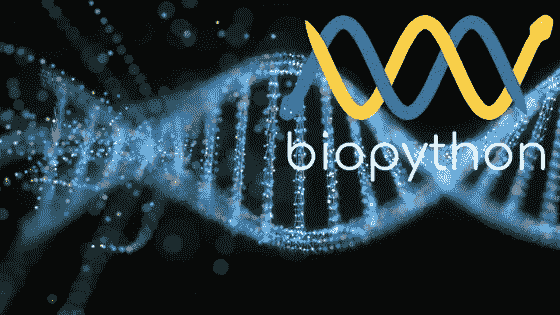

# 用于生物信息学的 Python:Python 序列分析入门

> 原文：<https://itnext.io/python-for-bioinformatics-getting-started-with-sequence-analysis-in-python-e18ce8c4be8?source=collection_archive---------2----------------------->

在这篇文章中，我将讨论 Python 在生物信息学领域的应用，以及如何用它来分析 DNA、RNA 和蛋白质的序列。是的，生物学家也在使用 Python。

在我进入编码之前，我想简单介绍一下生物信息学和相关的背景。

# 什么是生物信息学？

根据维基百科:

> 生物信息学是一个跨学科领域，开发理解生物数据的方法和软件工具。作为一门跨学科的科学，生物信息学结合了生物学、计算机科学、信息工程、数学和统计学来分析和解释生物数据。生物信息学已经被用于使用数学和统计技术对生物学查询进行计算机分析。

生物信息学是由两个主要领域组成的领域:生物数据(*蛋白质、DNA、RNA 等的序列和结构*)和信息学(*计算机科学、统计学、数学和工程学*)。这就是为什么它被称为一个*跨学科领域。生物信息学的常见用途包括识别基因和单核苷酸多态性。*

生物信息学的目标是:

*   序列比对。
*   基因发现。
*   药物发现和药物设计。
*   蛋白质结构排列和预测。等等。

如你所知，生物信息学是一个包含不同领域和相关操作的巨大领域。在这篇介绍性的文章中，我们将简要讨论序列分析。

# 什么是序列分析？

根据维基百科:

> 在生物信息学中，序列分析是对 DNA、RNA 或肽序列进行各种分析方法以了解其特征、功能、结构或进化的过程。

*测序*是寻找一级结构的过程，无论是 DNA，RNA。

DNA 测序就是确定核酸序列。有助于找出一条 DNA 中四个碱基的顺序:**腺嘌呤(A)** 、**鸟嘌呤(G)** 、**胞嘧啶**、**胸腺嘧啶(T)** 。

测序是在测序仪的帮助下完成的。一旦测序完成，数据就可用于进一步处理。DNA 序列的文本示例如下所示:

***DNA 测序*** 是确定 DNA 中核苷酸顺序的方法。

***RNA 测序*** 是找出生物样本中 RNA 数量的方法。

***蛋白质测序*** 是测定蛋白质或肽的全部或部分氨基酸序列的方法。

好了，理论到此为止，是时候进入代码了。

# Biopython 开发设置

我们将使用 [Biopython](https://biopython.org/) ，这个库用于处理生物计算和序列分析。如果您使用的是基于 Conda 的发行版，您可以使用`pip`或`conda`来安装它。

`pip install biopython`

您也可以检查版本:

**1.74** 写这篇文章的时候。

# FASTA 格式的读取序列

好了，我们要读取一个可用的 **FASTA** 格式的 DNA 序列。FASTA 是一种基于文本的格式，用于表示用单字母代码表示的不同序列。典型的 FASTA 格式如下所示:

分号后添加注释。每个序列由一个`>`符号分隔。上面给出的例子在单个 FASTA 文件中给出了 3 个序列。这只是一个样本，否则没有必要。

我们将读取一个样本 FASTA 文件，这里给出了，它是 [lady slipper 兰花](https://en.wikipedia.org/wiki/Cypripedioideae)的序列。

运行时，它会显示如下输出:

序列的第一行以 **id** 的形式出现。每个 **>** 之后的文本将按顺序显示。

FASTA 不是唯一可用的格式。还有另一种格式，叫做 GeneBank，文件扩展名为`.gbk`。

除了文件和文件类型，代码本身没有变化。API 的其余部分在文件格式上是相同的。如果我运行上面的程序，它会打印如下:

您也可以使用*字母*提及序列类型。默认为`SingleLetterAlphabet()`

我导入了`generic_dna`类型，用在了`parse()`方法中。运行时，它会打印以下输出:

`Seq('CGTAACAAGGTTTCCGTAGGTGGACCTCCGGGAGGATCATTGTTGAGATCACAT...GCA', DNAAlphabet())`

正如你所看到的`DNAAlphabet()`已经印好了。

# 计算 GC 含量

Biopython 提供了计算 ***GC 含量(鸟嘌呤-胞嘧啶含量)*** 的简便方法。

您从实用程序类中导入了`GC`方法，并在其中传递了实际的序列对象。在执行时，它打印数字百分比。

# 补码和反补码

两条反平行的链(+ve 或 5 '--> 3 ' &-ve 或 3 '--> 5 ')在 DNA 分子中是互补的。

核苷酸序列可以反向互补得到新的序列。类似地，互补序列可以被反向互补以获得原始序列。Biopython 提供了两种方法来实现这一功能。在 Biopython 中，很容易得到两个序列。

运行时，它会打印以下输出:

# 结论

这是对生物信息学和生物密码的简单介绍。远不止如此。你也可以将机器学习方法应用于[寻找一种拯救生命的新药](https://newatlas.com/medical/powerful-new-antibiotic-ai-discovery/)。希望我会写更多关于这个主题的东西，如果你喜欢的话🙂

*原载于 2020 年 2 月 28 日*[*http://blog . adnansiddiqi . me*](http://blog.adnansiddiqi.me/python-for-bioinformatics-getting-started-with-sequence-analysis-in-python/)*。*