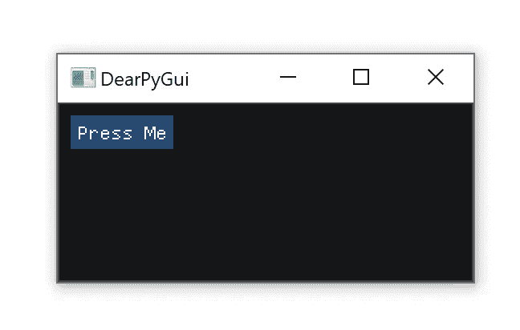
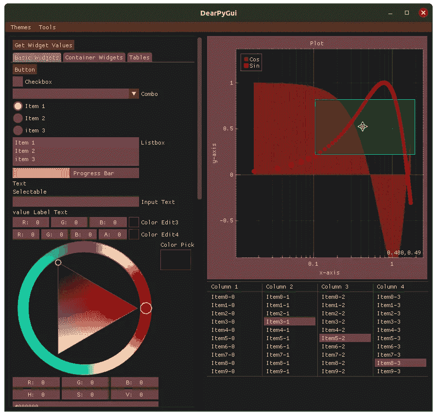
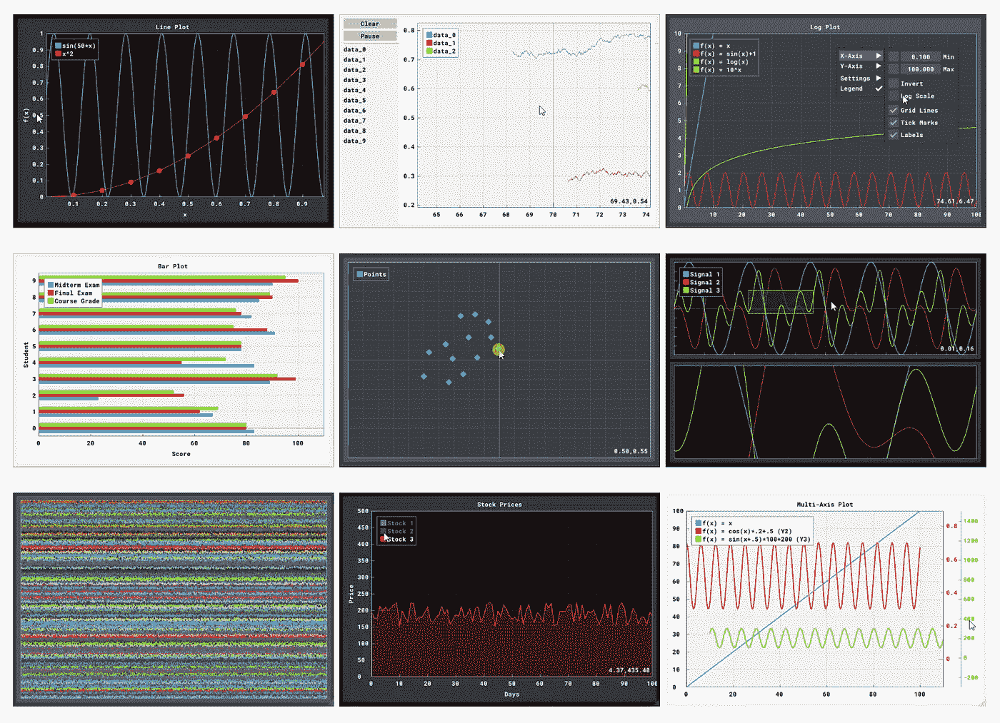
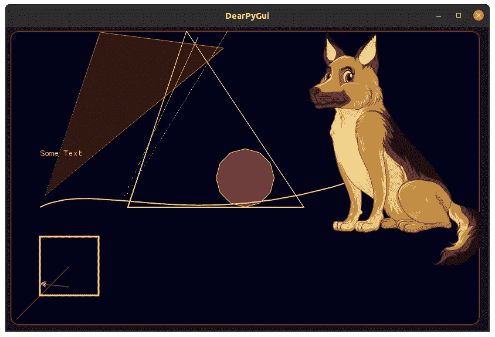
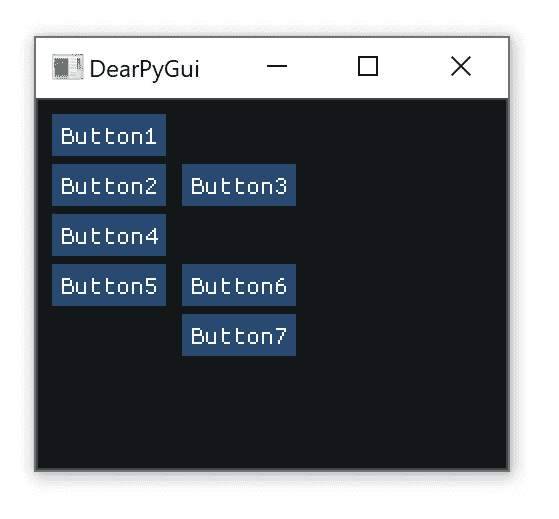

# 使用 DearPyGui 的 Python GUIs

> 原文：<https://itnext.io/python-guis-with-dearpygui-137f4a3360f2?source=collection_archive---------0----------------------->


为您的项目提供新的 GUI 外观和指南。

作为 Python 程序员，我们编写脚本。很多时候他们又快又脏；完成任务后，不要让别人甚至自己看到。然而，在某些情况下，脚本应该继续存在，也许会定期修改和共享。在这种情况下，我们经常想要为脚本创建一个 GUI。Python 有几个选项，包括 Tkinter、PyQT/PySide、wxPython、Kivy、PySimpleGui 等等。这些都是很棒的库，服务于它们各自的目的，但是在很多情况下，它们可能会矫枉过正，需要和它要包装的脚本一样多的代码和思想。这就是 DearPyGui 的闪光点。因此，首先，您需要获得 DearPyGui…

```
pip3 install dearpygui
```

# **你好世界**

```
from dearpygui.core import *
from dearpygui.simple import *def callback(sender, data):
    print(“Button Pressed”)with window("DearPyGui"):
    add_button("Press Me", callback=callback)start_dearpygui()
```



简单:添加小部件，然后调用 *start_dearpygui*

*亲爱的 PyGui* 很简单，掌握它应该不需要时间。但是仅仅因为它简单并不意味着它不强大，不能创建成熟的 GUI。

# **主文档**

[Home hoffstadt/DearPyGui Wiki(github.com)](https://github.com/hoffstadt/DearPyGui/wiki)

# **Widgets**

*亲爱的 PyGui* 有很多小部件，包括绘图、表格、画布等。你可以在下面看到一些:



# **与小工具互动**

大多数小部件都能够在它们的值改变时设置回调，类似于上面的 hello world 示例。您还可以使用 *get_value* 来检索一个小部件的相关值:

```
from dearpygui.core import *
from dearpygui.simple import *def button_callback(sender, data):
    print(get_value("Slider"))with window("DearPyGui"):
    add_slider_float("Slider")
    add_button("Get Value", callback=button_callback)

start_dearpygui()
```

# **布局**

亲爱的 PyGui 中的布局系统极其简单。添加小部件时，会按照添加的顺序垂直放置它们。然而，您可以使用 *add_same_line* 在同一行上放置一个小部件。您可以使用的另一个布局 GUI 的工具是组。您可以使用群组将小部件组合在一起，并为更复杂的布局创建层次结构。

```
from dearpygui.core import *
from dearpygui.simple import *with window("DearPyGui"):
    add_button("Button1")
    add_button("Button2")

    add_same_line()
    add_button("Button3")

    add_button("Button4")
    add_button("Button5")
    add_same_line() with group("Group1")
        add_button("Button6")
        add_button("Button7")

start_dearpygui()
```



# **主题&风格**

主题和风格是另一个大放异彩的领域。目前有 10 个内置主题，更多的在路上！还有一个用于创建你自己的主题的 API(这个系统在不久的将来会被重新设计，所以不会在这里讨论)。


# **剩菜**

我试图做一个简单的概述，但是还有很多不适合这里的内容，包括多线程、定制小部件、调试、动态数据绑定、运行时修改，等等。我可能会决定在另一篇文章中讨论这个问题。

# 结论

在我使用 *Dear PyGui* 的体验中，不仅从一个核心开发人员的角度，而且从我日常工作中的日常用户的角度来看，它都非常强大。它足够简单和开放，允许用户以自己的方式做事，并围绕它构建自己的系统。

如果你喜欢*亲爱的 PyGui* ，别忘了给回购一颗星:)

[](https://github.com/hoffstadt/DearPyGui) [## 霍夫施塔特/迪尔皮吉

### 亲爱的 PyGui 是一个简单易用(但功能强大)的 Python GUI…

github.com](https://github.com/hoffstadt/DearPyGui) 

感谢阅读。