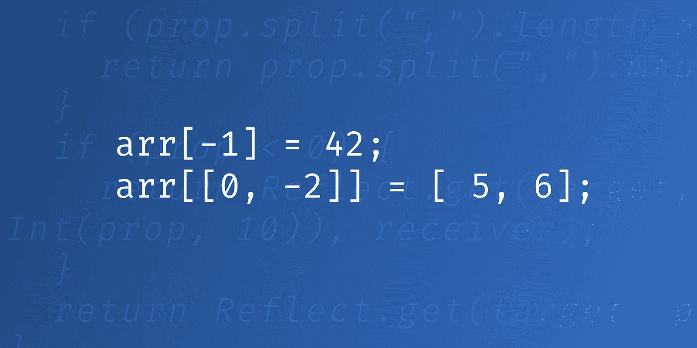

# JavaScript 中类似 Python 的列表/数组操作符

> 原文：<https://itnext.io/python-like-list-array-operator-in-javascript-1f17aea32ed2?source=collection_archive---------6----------------------->

当在不同语言之间切换时，我经常发现自己编写的代码在一种技术中可以工作，但在另一种技术中却不是有效的语法。当我试图访问 JavaScript 中数组的最后一个元素时，这种情况经常发生。我经常尝试引用`-1`索引，这在 Python 中很好，但在 JS 中并不实用。因为数组是在 JavaScript 中实现的，所以当你试图访问它时，它甚至不会警告你。事实上，以下内容在 JS 中是完全合法的:

因为 JavaScript array 在内部的行为就像一个 map，所以它并不关心索引是否是它所期望的——它只是为它创建一个 map 条目。有时这可能是有用的，但大多数情况下这是代码中有错误的迹象。

这让我想到——有没有可能破解 array `[]`操作符，使其行为类似于 Python 中的操作符(或者甚至更进一步，实现 numpy 数组的一些功能)。事实证明，利用代理人的力量是可能的！

# 接受负指数的 Getter

让我们从允许 JavaScript 获取提供负索引的元素开始。我们可以通过使用代理类很容易地做到这一点。它是元编程的 JavaScript 机制——改变语言的行为，而不是在应用程序层面上使用它。我们可以用代理包装任何 JavaScript 对象(甚至函数),并拦截它的方法调用。

我们使用的第二个本地对象是`Reflect`，它是不同类型对象的 getters 和 setters 的简单外观。有了它，我们可以对不同类型的对象使用相同的代码(想想数组和 ES6 映射的通用 API)。

代理接受两个参数——它扩展的目标对象和它覆盖的函数映射。在这个例子中，我们只通过提供一个自定义函数来覆盖 getter。Getter 有三个参数:

*   `target`这是一个原始阵列
*   `prop`这是我们正在访问的属性(转换为字符串)
*   哪个是代理类的实例

让我们分析一下代码:如果提供的属性小于 0，我们通过将我们的值加到数组的长度上来计算正确的索引。如果是正数，我们就使用 getter 而不改变参数。(使用`Reflect.get`，在这种情况下相当于直接调用`target[prop]`)。

# 接受范围

在 numPy 中，通过提供一个索引数组来一次访问多个元素是很常见的。如果 JavaScript 支持这一点，那就太酷了，不是吗？我们可以很容易地扩展我们的解决方案来为我们做这件事。

因为 JavaScript 自动将所有属性转换成字符串，所以数组`[1, -1]`将变成字符串`1,-1`。如果参数最初是一个数组，那么我们可以使用 split 进行逆向工程，如果是这样，我们可以单独调用每个元素的 getter。

# 作曲者

以类似于我们写 getter 函数的方式，我们可以扩展 setter。这将允许我们通过简单地调用`l[-1] = 5`来设置最后一个元素。唯一的区别是`set`函数带有一个额外的参数，这是我们试图设置的值。

# 范围设置器

我们可以更进一步，接受一组指数——就像 numPy 一样。然后我们可以一次为多个指标设置值:`l[[1, -1]] = 5`。请注意，我们可以组合我们的解决方案——我们也可以提供范围内的负指数。

类似于我们在 getter 中所做的，我们检查我们的`prop`是否包含分号，如果是，我们为每个单独的元素调用 getter。`reciever[p] = value`用新的`props`属性递归调用我们的 setter 函数。

# 具有析构的范围的设置器

前面的例子运行得很好，但是如果我们输入`l[[0, -1]] = [5, 6];`会发生什么呢？如果您一直在使用 numPy，那么您应该将 5 赋给第一个元素，将 6 赋给最后一个元素。在我们的代码中，它将嵌套这些数组:

我们可以通过检查我们的`values`属性是否是一个数组来容易地修复它，如果是，在我们的`forEach`中使用数组的元素而不是数组本身:

现在我们可以做出这样的东西:

# 编后记

代理还可以用于各种其他情况。您可以使用它们来调试您的对象、模拟无限集合、验证数据、自动修复用户输入。你必须记住，权力越大，责任越大——当你改变底层实现时，你可能会面临许多事情以不可预知的方式中断的风险——尤其是当你试图扩展本机对象时(这在 JavaScript 中很容易做到)。这就是为什么我们不直接修改`Array.prototype`而是允许用户显式创建新的`List`实例的原因之一。