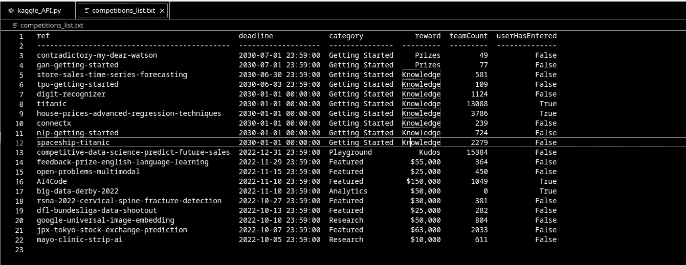
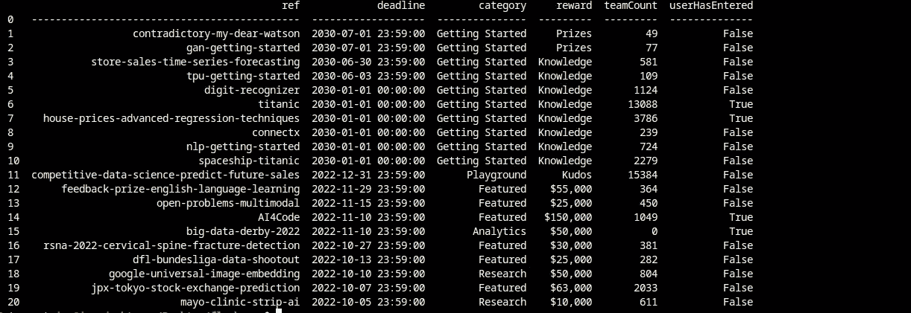
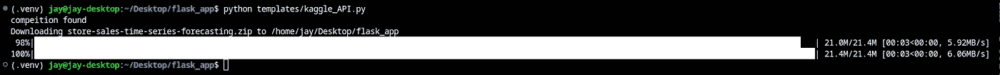

# Python:以编程方式下载 Kaggle 竞赛和数据集

> 原文：<https://itnext.io/python-programmatically-download-competition-datasets-from-kaggle-443d6cf5333e?source=collection_archive---------1----------------------->

下载比赛和数据集只需一个电话。


Andrew Ridley 在 [Unsplash](https://unsplash.com/s/photos/programming-wallpaper?utm_source=unsplash&utm_medium=referral&utm_content=creditCopyText) 上拍摄的照片

Kaggle 是一个著名的平台，来自不同背景的科学家、程序员和工程师聚集在一起，利用公开可用的数据集做出贡献、学习和解决具有挑战性的问题。

如果你在数据部门工作，你会遇到 Kaggle，并使用它来执行分析任务和数据科学。Kaggle 提供的许多有用功能之一是公共数据集以及免费下载和使用它们的能力。

Kaggle 提供了一个 [API](https://www.kaggle.com/docs/api) 来与平台交互。Kaggle API 提供的一些功能包括:列出比赛和数据集，下载和上传数据集，创建笔记本，向比赛提交您的作品，等等。

这篇文章旨在展示如何开发一个框架来列出和下载比赛数据集。用例不受限制，可以扩展到 Kaggle 提供的所有 API 特性。

## 进口:

API 调用是外壳命令。为了从 Python 执行命令，我们将使用 Python 的内置`subprocess`库。对于数据分析和解析，`pandas`库是最合适的。

```
import subprocess
import pandas as pd
```

**比赛名单:**

实现我们用例的第一步是检查所需竞争的可用性。

```
subprocess.call(["kaggle","competitions","list"])
```

我们可以从上面的`subprocess.call`方法调用竞争列表命令。

## 记录分析结果:

将结果捕获到文本文件中有助于我们解析数据，以完成我们的竞争可用性检查。这可以通过使用子过程库的`stdout`方法来实现。

```
f = open("competitions_list.txt","w")
subprocess.call(["kaggle","competitions","list"], stdout=f)
```



我们记录的文本文件是表格格式的。然而，使用`pd.read_tables()`类不会产生格式化的视图。因此，我们将使用 Pandas 固定宽度的文件类`pd.read_fwf()`

```
df = pd.read_fwf(“competitions_list.txt”)
```



Pandas data frame 系列提供数据切片，通过这种方式，我们可以达到我们的竞争可用性需求。

```
for x in df[‘ref’].str.contains(“store-sales-time-series-   forecasting”):
    comptetitions.append(x)
```

现在，我们有了一个竞争可用性列表，使用 if else 解析这个列表将给出我们想要的状态，一旦满足可用性条件，我们就可以下载竞争。

```
if any(comptetitions) is True:
    print(“compeition found”)
    subprocess.call([“kaggle”,”competitions”,”download”,”-c”,”competition_name”])
else:
    print(“competition not found”)
```

我们的 if-else 条件将记录状态并成功下载竞赛。

## 将所有东西包装成一个方法:

将所有步骤整合到一个方法中，以实现模块化和可重用性。该方法将所有表达式集合在一起，并维护一个可变列表，该列表位于方法范围内，用于解析竞争检查。

```
def check_competition_Status(competition_name):
    f = open("competitions_list.txt","w")
    subprocess.call(["kaggle","competitions","list"], stdout=f)
    df = pd.read_fwf("competitions_list.txt")
    for x in  df['ref'].str.contains("gan-getting-started"):
        self.comptetitions.append(x)
        if any(self.comptetitions) is True:
            print("compeition found")
            subprocess.call(["kaggle","competitions","download","-c",f"{competition_name}"])
        else:
        print("competition not found")
```

这种方法可以根据您的用例进行增强和重构，框架提供了扩展功能的灵活性。

## 完整代码:

```
import subprocess
import pandas as pdclass kaggle_download_competitions(object):
    def __init__(self):
        self.comptetitions = [] def check_competition_Status(self, competition_name):
        f = open("competitions_list.txt","w")
        subprocess.call(["kaggle","competitions","list"], stdout=f)
        df = pd.read_fwf("competitions_list.txt")
        for x in  df['ref'].str.contains("gan-getting-started"):
            self.comptetitions.append(x)
            if any(self.comptetitions) is True:
                print("compeition found")
                subprocess.call(["kaggle","competitions", \n
                "download","-c",f"{competition_name}"])
            else:
                print("competition not found")if __name__ == '__main__':
    kaggle = kaggle_download_competitions()
    kaggle.check_competition_Status('store-sales-time-series-forecasting')
```

## 输出:



## 结论:

与 API 交互是所有应用程序中最普通的任务。构建框架和使用选择的语言实现 API 调用是需要经验的。Kaggle 提供 API 命令来与平台交互和工作。

从框架中下载数据集将被证明是 API 的一个有用的提供。我希望这种方法向读者展示了如何构建和触发 API 调用来开发功能并在工作中实现这一点。

关注我的 LinkedIn 或 T2 的 Twitter，了解更多关于 DataOps 和 MLOps 的信息，如果你想学习或添加更多的特性，请联系我。

快乐编码。