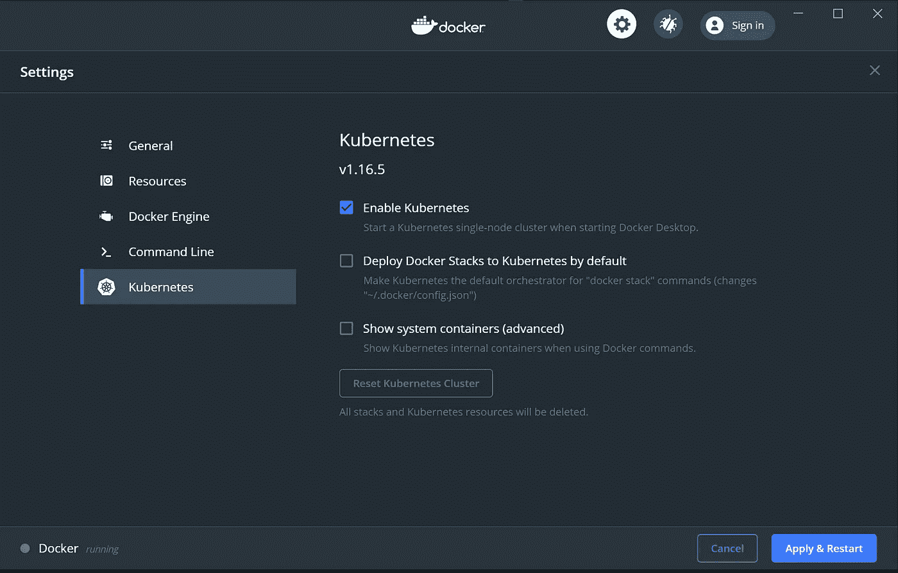

# qbec——多 kubernetes 环境的部署工具

> 原文：<https://itnext.io/qbec-the-deployment-tool-for-multiple-kubernetes-environments-c39b6bd7ea07?source=collection_archive---------3----------------------->

DevOps 工程师和 Kubernetes 管理员经常需要将他们的应用和服务部署到多个环境中。根据设置的不同，环境可能意味着一个 Kubernetes 集群或同一集群中的一个名称空间，或者跨集群的名称空间的组合。部署到不同的环境可能有多种动机。将测试环境与生产环境和多区域(包括多云)部署隔离开来是多环境设置的一些常见示例。

Kubernetes 生态系统有许多工具可以帮助开发人员部署应用程序。如果您通读 Kubernetes 文档，您将会看到可用于创建或更新 Kubernetes 对象的 YAML 文件的示例和片段。部署、服务、配置映射和秘密是最常用的 Kubernetes 对象。随着应用程序的增长，管理 YAML 文件会变得越来越复杂。 [Jsonnet](https://jsonnet.org/) 已经成为管理这种复杂性的一种优雅方式。使用 [qbec](https://qbec.io/) 时，整体工作流程进一步简化。

[qbec](https://qbec.io) —读作“魁北克”(加拿大省)是*一个在多种环境下配置和创建 Kubernetes 对象的工具。qbec 这个名字的由来有一些历史。根据 qbec 的创建者，[Krishnan Anantheswaran](https://github.com/gotwarlost)——“我厌倦了所有以`k`开头的 k8s 工具，它们妨碍了 tab 键的完成。此外，我想要一个城市名(qbec - >魁北克[城市])，因为我有另一个 OSS 工具(我不再维护它，但通过其他人继续使用)，叫做[伊斯坦布尔](https://github.com/gotwarlost/istanbul)，它非常成功。*


qbec 徽标(鸣谢:https://qbec.io)

qbec 是一个独立的客户端工具。它不需要在 Kubernetes 集群或其他地方运行任何补充的服务器组件。

在本系列中，我们将了解 qbec 的各种特性，以及如何将它用于各种用例，从部署、预部署工具到捕捉常见错误、垃圾收集和 CI/CD 工作流。

# 入门指南

qbec 可以通过从 [github](https://github.com/splunk/qbec/releases) 获取二进制文件来安装。

对于 Linux/WSL2，运行:

```
wget [https://github.com/splunk/qbec/releases/download/v0.12.1/qbec-linux-amd64.tar.gz](https://github.com/splunk/qbec/releases/download/v0.12.1/qbec-linux-amd64.tar.gz) # Change version to the latest released version
tar xf [qbec-linux-amd64.tar.gz](https://github.com/splunk/qbec/releases/download/v0.12.1/qbec-linux-amd64.tar.gz)
sudo mv ./qbec /usr/local/bin/
```

如果您使用自制软件，请运行以下命令

```
brew tap splunk/tap
brew install qbec
```

运行`qbec version`以确保您的设置成功。

# 初始化 qbec 应用程序

`qbec init`可用于初始化与 qbec 一起使用的应用。

我们将使用 qbec 设置一个示例应用程序，部署到运行在 docker-desktop 上的 Kubernetes 集群。也可以使用 minikube、kind 或任何其他 Kubernetes 集群。



在 Docker 桌面上启用 Kubernetes

运行以下命令为部署设置应用程序。

```
qbec init --with-example my-app
cd my-app
```

`my-app`文件夹包含部署应用程序所需的所有文件。

```
hsm@home67:~/my-app$ tree
.
├── components
│   └── hello.jsonnet
├── environments
│   ├── base.libsonnet
│   └── default.libsonnet
├── params.libsonnet
└── qbec.yaml
```

`qbec.yaml`包含 qbec 的配置。qbec 读取这个文件来了解不同的环境以及如何与相应的 Kubernetes 集群对话。

默认环境具有连接到 Kubernetes API 服务器的值，并且为部署指定了名称空间。这里可以添加多个环境。

`params.libsonnet`包含环境名到`environments/<env-name>.libsonnet`下相应文件的映射。

默认环境映射到 environments/default.libsonnet 中的配置

每个环境的共享配置在`environments/base.libsonnet`中设置，环境特定的覆盖可在相应的环境文件中设置。在上面的例子中，`default.libsonnet`文件覆盖了`default`环境的配置。

默认部署的索引数据和副本数被覆盖

`components`文件夹包含我们想要部署的所有组件。`components/hello.jsonnet`组件包含用于部署和配置映射的 Kubernetes 对象定义。

接下来，我们将使用 qbec 部署到`default`环境中。

# 使用 qbec 部署

使用 qbec 的部署非常简单，只需使用`qbec apply` 命令。

运行`qbec apply <env-name>`将应用程序部署到`<env-name>`指定的环境中。

```
hsm@home67:~/my-app$ qbec apply default # env-name is default
setting cluster to docker-desktop
setting context to docker-for-desktop
setting context to docker-desktop
cluster metadata load took 32ms
1 components evaluated in 5mswill synchronize 2 object(s)Do you want to continue [y/n]: y
1 components evaluated in 2ms
create configmaps demo-config -n default (source hello)
create deployments demo-deploy -n default (source hello)
waiting for deletion list to be returned
server objects load took 612ms
---
stats:
  created:
  - configmaps demo-config -n default (source hello)
  - deployments demo-deploy -n default (source hello)
```

就是这样！使用`kubectl`验证部署

```
hsm@home67:~/my-app$ kubectl get pods
NAME                          READY   STATUS    RESTARTS   AGE
demo-deploy-78fd78c96-cs8lw   1/1     Running   0          58s
demo-deploy-78fd78c96-n4phl   1/1     Running   0          58s
```

我们将在后续的文章中探索更多的 qbec 特性。默认情况下，qbec 启用了垃圾收集，并支持模拟运行。`qbec diff`可以准确显示哪些对象会改变以及如何改变。`qbec validate`可以对 jsonnet 文件中定义的 kubernetes 对象进行模式验证。还有更多！

敬请期待！

同时，你可以试试 qbec，在 [https://qbec.io](https://qbec.io) 了解更多。