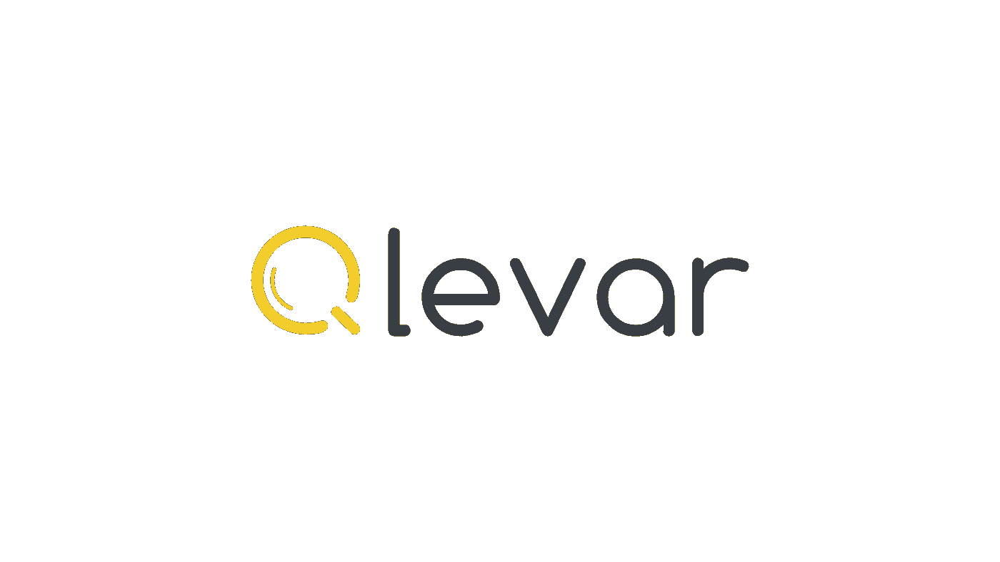
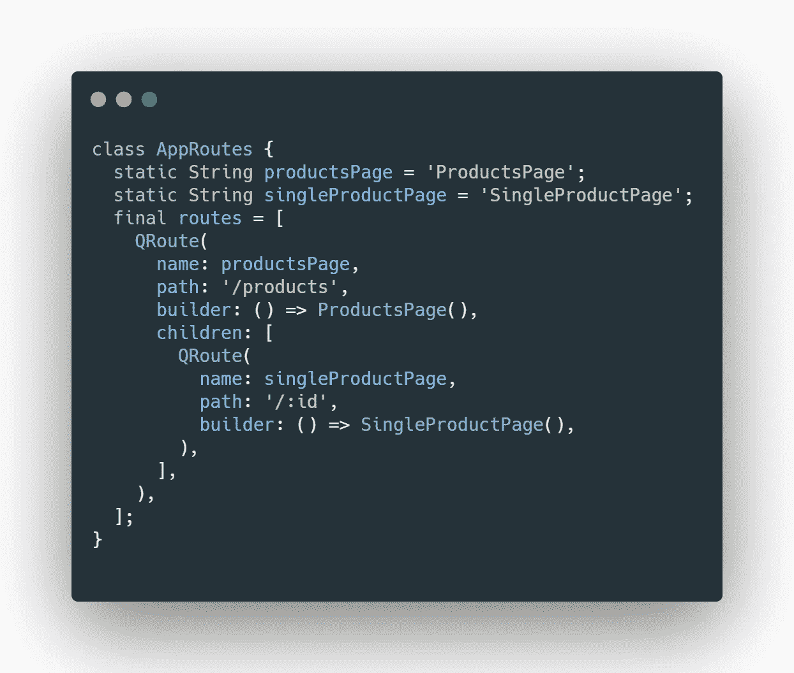
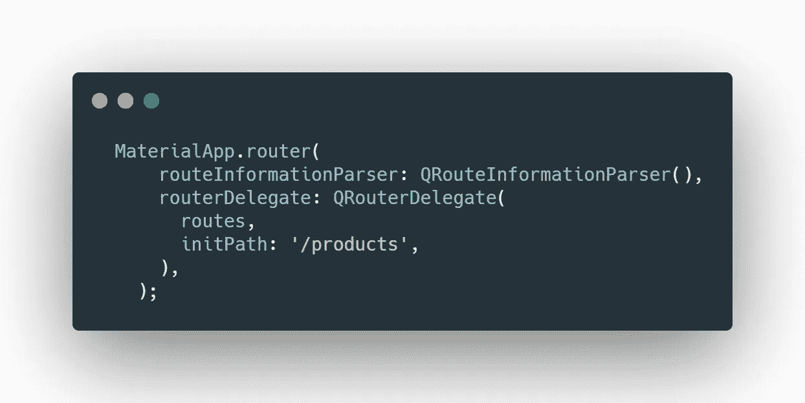
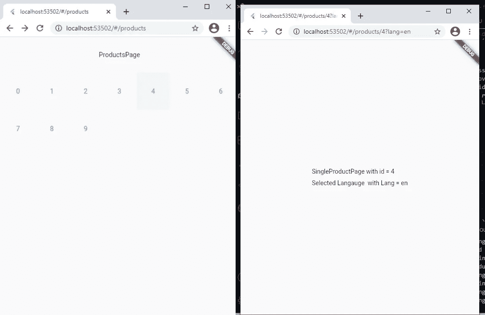
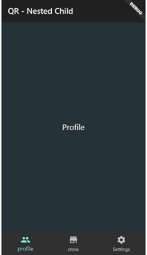
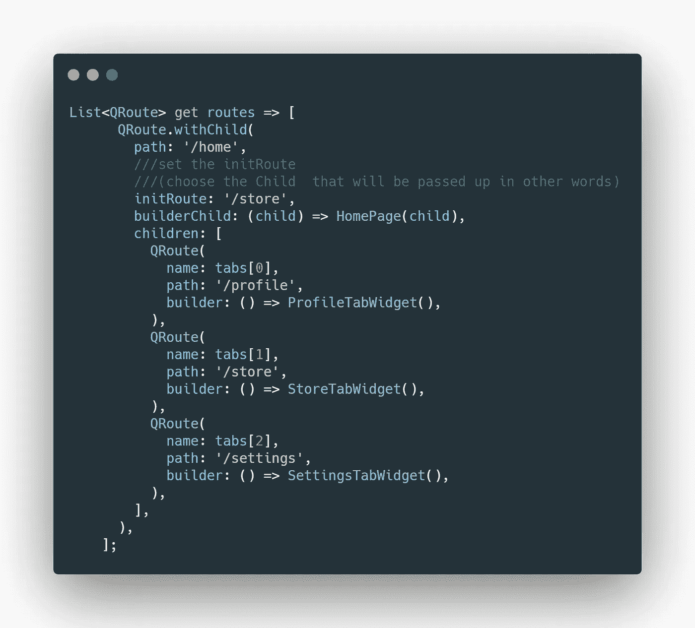
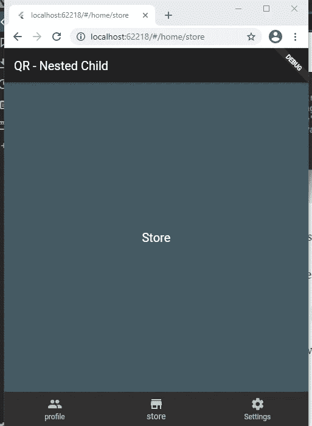
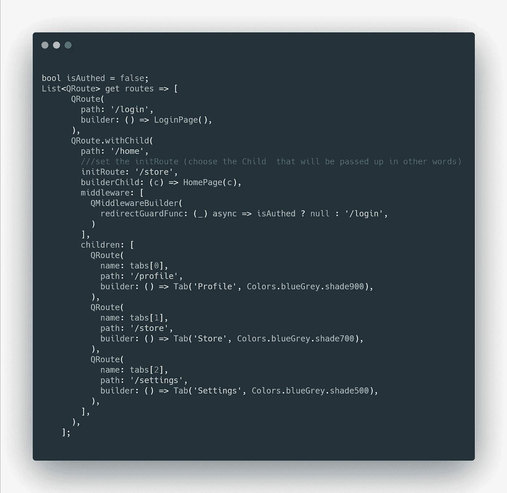
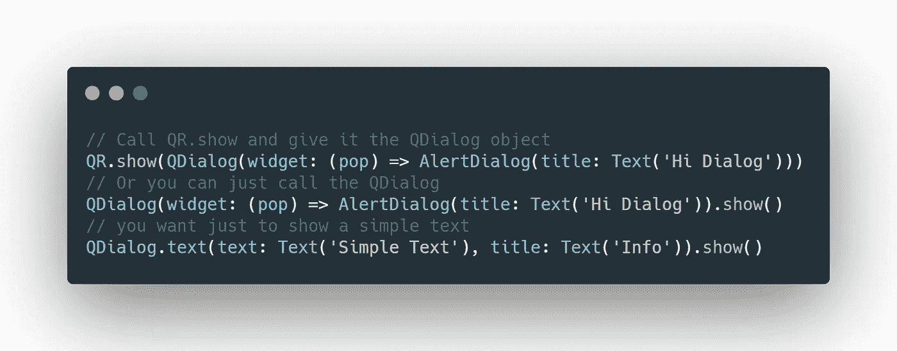

# Qlevar 路由器，一个聪明的 Navigator 2 包装器。

> 原文：<https://itnext.io/qlevar-router-a-clever-navigator-2-wrapper-8d05fec13d16?source=collection_archive---------2----------------------->

你开始使用新的 Flutter **Navigator 2** 了吗😍？

让我们来看看 Navigator 2 将会带来什么。

> 1.一种更加多变的声明式风格。
> 
> 2.更好地支持屏幕更换。
> 
> 3.更好地支持多次推送和弹出。
> 
> 4.完全支持传入网址(例如:Flutter Web 和/或 app 深度链接)。
> 
> 5.使用 Flutter Web 时完全支持浏览器历史。

我敢打赌，你一定很想试一试，所以如果你到现在还没用过，那就不要用😢

请注意,**导航器 2** 本身没有任何问题，但问题在于如何使用它，以及为了执行最简单的任务您必须编写的样板代码的数量。

说了这么多，让我们看看如何用最简单的方式充分利用 Navigator 2。

嗯？向 [Qlevar 路由器](https://pub.dev/packages/qlevar_router)问好👏



Qlevar

> 问 levar router 是一个 flutter 包，可以帮助您管理您的项目路由、导航、深度链接、路由参数等…使用 Navigator 2.0 管理您的项目路由并创建嵌套路由。导航到新路线时，仅更改页面上的一个小部件。在没有上下文的情况下从任何地方导航到任何地方。

听起来真的很有帮助😍让我们来看一些真实世界的例子。

## 在这个故事的每一部分之后，都有一个详细的例子或者每个想法的代码摘要。

把它添加到你的 pubspec.yaml 就行了

> **qlevar _ router:[最新版本]**

然后使用`QRoute`定义您的应用程序路线:

假设我们有一个显示产品列表的产品页面，我想从中选择并显示一个产品。

所以理论上 singleProdcuctPage 是 ProductPage 的直接子级。

或者路线会是这样的:



qlevar _ 路由器

例如，现在访问 id 为 3 的产品:您的路线将类似于`/products/3`

问:如何导航到该产品？

A.使用 QR 智能路由器只需调用 `QR.to('/products/3')`或使用路由名称并像这样传递参数:

`*QR.toName( AppRoutes.singleProductPage, params: {‘id’: 3})*`

问:在这种情况下，如何接收我们传递给`:id`或`3`的参数？

A.使用`QR.params['id']`

好了路径参数，那么查询参数呢？

A.相同:}使用`QR.params['YourExptectedQueryParameter']`

现在我们将使用 MaterialApp.router，它只是告诉 flutter 我们正在创建一个使用[Router]而不是[Navigator]的[MaterialApp]。

将`*QRouteInformationParser()*` *和* `QRouterDelegate()`传递给 MaterialApp。`QRouterDelegate`是传递您定义的过程的地方，您有一个可选的 initPath 参数



我们最终得到的是:



代码摘要:

到目前为止一切顺利。

现在让我们试试别的



在这种情况下，我们有一个大的观点，只有它的内容(个人资料-商店-设置)将发生变化。

所以 bottomNavigationBar 和 App 应该总是一样的。

我们已经同意，我们的主页将是相同的，只有它的孩子的将被改变，所以我们将使用特殊的路由调用`**QRoute.withChild**`，它将通过它的建设者的孩子，我们将直接从`childern`

想象一下，如果我将 ProfileTabWidget、StoreTabWidget 或 SettingsTabWidget 传递给它的父亲(在这种情况下是主页)

比如你按下`/home/profile`

builderChild 会说嘿，我小时候有 ProfileTabWidget，我希望你会用到它😥

> →主页(ProfileTabWidget())；



传递的`child`是一个`QRouter`小部件。

现在去商店的路线将是:`/home/store`



试着把它改成`/home/profile or /home/settings`

一切都应该按预期运行。

但是如果我点击一个底部的导航图标，我不应该也能改变这个部分吗？。嗯，当然，但这实际上更像是一个国家管理问题

在这个简单的例子中，您可以像这样破解它:

`QR.navigator.addListener(() => setState(() {}));`

通过在导航器上设置一个监听器，并在每次改变时重新构建 UI。

代码摘要:

酷酷🤯

等等，如果我只想让授权用户访问主页，该怎么办？

不要担心，Qlevar 路由器来加载😆

将一个中间件参数添加到您的 QRoute 中，它将获取一个如下所示的 QMiddleware 列表:

提示:使用 **redirectGuardFunc** *该函数将在* `*[onEnter]*` *之前和* `*[onMatch]*` *之后被调用。如果来自该页面的结果为空，则该页面将被创建或者结果应该是重定向到的路径。*



我相信你的认证服务比一个布尔型的认证标志更强大😁然而，发生了什么呢？我们正在检查用户是否被授权，如果为真，我们只是返回 null，就像**什么都不做**一样简单，如果不是，那么转到您已经定义的任何路由，这里我们重定向到`login`路由。

当然我们有更多的 **redirectGuardFunc，比如:**

## canPop

这个路由可以弹出，当试图删除页面时调用。

## onMatch

每当一条路径匹配它时，这个方法就会被调用*。*

## onEnter

在将页面添加到堆栈之前和页面构建之前，将调用此方法

## onExit

将在从堆栈中移除页面之前调用此方法

— — — — — — — — — — — — — — — — — — — — — — — — — -

# 未找到页面(404)

您可以设置自定义的“未找到”页面，以便在未找到页面时显示该页面，否则将设置默认页面。

```
QR.settings.notFoundPage = QRoute(path: '/404',builder: () => NotFound404View(),);
```

汇总代码:

**此外**，

# 覆盖-对话框

要用`QR`打开一个对话框，你可以简单地这样做



# 参数特征

*   **keepAlive** :默认情况下，当导航到不包含该参数的新路径时，该参数将被删除，因此，如果您不想在这种情况下删除该参数，请将该属性设置为 true，只要该属性为 true，就不会删除该包
*   ***onChange** :设置该参数改变时调用的函数，该函数给出当前值和新值*
*   ***onDelete** :设置删除该参数时调用的函数*
*   ***asInt** :将返回值为 Int？*
*   ***asDouble** :将返回双精度值*
*   ***valueAs** :将返回给定类型的值*

# *移除 Url 标签*

*如果你想在你的 main 方法中移除 url 中的标签*

```
***void** main() {
  QR.setUrlStrategy();
  runApp(MyApp());
}*
```

**注意:*有时候在发布模式下，当你移除标签时会出错，要解决这个问题，请看[这个](https://github.com/SchabanBo/qlevar_router/issues/10)*

# *越来越*

*要查看使用 Qlevar 路由器的更多高级示例，请查看此[报告](https://github.com/SchabanBo/qr_samples)。*

> *快乐编码🥳🥳*