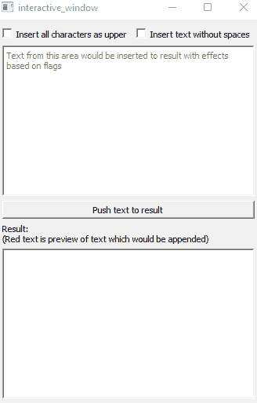

# QT +反应性编程= ❤

> 原文：<https://itnext.io/qt-reactiveprogramming-1ba0106c17d8?source=collection_archive---------3----------------------->

[ReactivePlusPlus](https://github.com/victimsnino/ReactivePlusPlus) 增加了对 QT 库的原生支持。所以，是时候向您展示如何将反应式编程范例轻松应用于 QT，以使代码更加强大了！为此，让我们创建一些基于 QT 的应用程序！

# 应用理念

它将是一种具有以下特征的文本预处理程序:

1.  该应用程序有一个文本区插入键入一些文本
2.  存储结果的另一个文本区域(只读)
3.  按钮将键入的文本从第一个区域追加到结果区域
4.  两个复选框来修改我们想要插入的文本:
    1)将所有符号设为大写
    2)删除文本中的所有空格
5.  预览模式:根据复选框实时显示修改后的文本。

示例:

为什么我们需要反应式编程？为此，我们需要对用户的多个操作做出反应:

*   键入新符号-通过应用修改将其添加到预览文本中
*   复选框状态已更改—对预览文本重新应用修改
*   单击按钮—添加已应用修改的文本并重置原始文本区域

此列表中的任何操作都会启动对另一个小部件的一系列操作/更改。此外，这些事件中的任何一个都是在“某个时间点”出现的，我们不知道“什么时候”，但是我们知道我们需要对那个事件做什么！而且有了反应式编程的帮助就容易多了！

# 实施:QT 部分

让我们从添加应用程序所需的所有小部件开始:

# 实现:反应式逻辑

正如我们上面讨论的，我们需要对 3 种类型的事件做出反应。让我们从最简单的复选框开始:

在那里，我们创建了两个**观察对象**，当它们的内部状态**改变**时，它们将发出**复选框的新状态**。因此，机罩下，一旦 **QCheckBox** 的相应**信号**被**发出**，它就会发出数值。另外，我们想知道订阅时的状态。因此，observable 从**发出复选框的当前(默认)状态**开始。

那么，下一步是什么？现在我们需要处理输入事件，并根据我们的 checkbox-observables 应用修改。我们可以用下面的方法来做:

我们从监听`textChanged`信号开始，因为它是代表我们打字的事件。因此，目前，我们有一个可观察的“什么都没有”，但我们想把它转换成当前的文本！为此，我们可以应用`map`操作符，它将发出当前文本。

然后神奇的事情发生了:我们**将来自**两个**可观察值**的最新值与复选框的当前**状态的**当前文本**和**可观察值**相结合，方法是将 lambda 应用于其中两个值。
但**当**发生时呢？`combine_latest`订阅这两个观察值，并在**任何**新值来自**任何这些**观察值:
-文本更新
-复选框的新状态时调用 lambda。
因此，我们在**中**跟踪变化**两个可观测量**！太神奇了！因此，我们为每个复选框做了两次！**

为了跟踪进度，我们可以应用`tap`操作符来添加一些日志记录。“只读”操作符不能影响可观察的发射！

还有一点需要实现:我们需要在结果区域显示文本=提交+预览。我们可以用下面的方法来做！

在那里，我们跟踪点击按钮事件。我们用`with_latest_from`代替`combine_latest` 。它有类似的行为，但是 lambda 只有在主观察对象发出一个新值时才会被调用！
所以，当点击按钮时，我们从文本区域获取当前文本，然后重置它(操作员`tap`)以便能够放置新的文本！
然后我们应用`scan`操作符来累积结果文本区域的当前状态。它有内部的`seed`值，用每个新的发射更新它，并发送每个更新的值。在我们的例子中，当我们点击按钮时，它只是在末尾添加新的文本并发送更新的值。

然后我们想从一个空字符串开始，因为我们的最终文本区域的初始状态是一个空字符串！目前，在这一点上，我们有可观察发射文本的结果文本区域的当前实际状态。但是还有一点:预览文本。

为此，我们需要将当前的累积状态与第一个文本区域的修改文本的可观察性结合起来。要做到这一点，我们应该再次使用`combine_latest`！因此，我们可以在不修改实际累积状态的情况下添加预览文本。但是因为我们需要两次订阅相同的可观察值并保持相同的值(而不是生成一个新的可观察值),所以我们在`text_to_append_obs`的末尾添加了`publish().ref_count()`。

最后，我们需要订阅这个可观察对象，只需更新结果文本区域的文本！

链接到 [github](https://github.com/victimsnino/ReactivePlusPlus/blob/main/src/examples/rppqt/interactive_window/interactive_window.cpp) 上的完整示例

此外，请随意查看 https://github.com/victimsnino/ReactivePlusPlus 的[库，将反应式编程应用到您的 C++20 代码中！](https://github.com/victimsnino/ReactivePlusPlus)