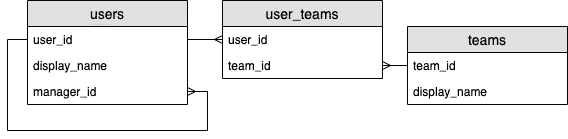

# 使用 Node.js 查询 Postgres 中的嵌套数据

> 原文：<https://itnext.io/query-nested-data-in-postgres-using-node-js-35e985368ea4?source=collection_archive---------0----------------------->


由[拍摄的照片由](https://unsplash.com/@photosbybeks?utm_source=unsplash&utm_medium=referral&utm_content=creditCopyText) [Unsplash](https://unsplash.com/s/photos/elephant?utm_source=unsplash&utm_medium=referral&utm_content=creditCopyText) 上的 Beks 拍摄

当构建提供 JSON 数据的服务器时，无论是使用 REST 还是 GraphQL，我们经常想要查询某个时间，以及它的“孩子”。如果我们不小心，我们可能会以大量低效的查询而告终。幸运的是，Postgres 有一些函数允许直接以“JSON”的形式返回复杂的数据结构。这对于 node.js 来说非常有用，因为它们只是变成了原生的 JavaScript 对象。

# 问题是

考虑数据库模式:



一个包含 3 个表的数据库模式:“users”、“user_teams”和“teams”。每个用户都有一个由“经理 id”字段标识的经理。“用户团队”表链接“用户”和“经理”。

我们可以通过运行以下命令来创建这个数据库模式以及一些示例数据:

```
**CREATE TABLE** users (
  user_id **BIGSERIAL NOT NULL PRIMARY KEY**,
  display_name **TEXT NOT NULL**,
  manager_id **BIGINT NULL REFERENCES** users(user_id)
);**CREATE TABLE** teams (
  team_id **BIGSERIAL NOT NULL PRIMARY KEY**,
  display_name **TEXT NOT NULL**
);**CREATE TABLE** user_teams (
  user_id **BIGINT NOT NULL REFERENCES** users,
  team_id **BIGINT NOT NULL REFERENCES** teams,
  **PRIMARY KEY**(user_id, team_id)
);**INSERT INTO** users
  (user_id, display_name, manager_id)
**VALUES**
  (1, 'Forbes', NULL), (2, 'John', NULL), (3, 'Joe', 1);**INSERT** **INTO** teams
  (team_id, display_name)
**VALUES**
  (1, 'Awesome Team'), (2, 'Team of One');**INSERT** **INTO** user_teams
  (user_id, team_id)
**VALUES**
  (1, 1), (2, 1), (1, 2);
```

现在假设我们想要运行一个查询，如下所示:

> 获取所有用户的列表，并为每个用户获取他们的团队和经理

我们希望输出看起来像这样:

```
[
  {
    **"id"**: 1,
    **"display_name"**: "Forbes",
    **"manager"**: null,
    **"teams"**: [
      {
        **"id"**: 1,
        **"display_name"**: "Awesome Team"
      },
      {
        **"id"**: 2,
        **"display_name"**: "Team of One"
      }
    ]
  },
  {
    **"id"**: 2,
    **"display_name"**: "John",
    **"manager"**: null,
    **"teams"**: [
      {
        **"id"**: 1,
        **"display_name"**: "Awesome Team"
      }
    ]
  },
  {
    **"id"**: 3,
    **"display_name"**: "Joe",
    **"manager"**: {
      **"id"**: 1,
      **"display_name"**: "Forbes"
    },
    **"teams"**: []
  }
]
```

# 最简单的解决方法？

我们有几个选择。我们可以使用 node.js 递归运行所有查询，使用`[@databases/pg](https://www.atdatabases.org/docs/pg)`合并所有数据:

```
**const** results = **await** Promise.all(
  (**await** db.query(
    sql`
      **SELECT** u.user_id **AS** id, u.display_name, u.manager_id
      **FROM** users u
    `,
  )).map(**async** ({manager_id, ...user}) => ({
    ...user,
    manager:
      (**await** db.query(
        sql`
          **SELECT** u.user_id **AS** id, u.display_name
          **FROM** users u
          **WHERE** u.user_id=${manager_id}
        `,
      ))[0] || null,
    teams: **await** db.query(
      sql`
        **SELECT** t.team_id **AS** id, t.display_name
        **FROM** user_teams ut
        **JOIN** teams t **USING** (team_id)
        **WHERE** ut.user_id = ${user.id}
      `,
    ),
  })),
);
console.log(results);
```

这很好，只要数据集很小。唯一的问题是我们正在运行`2n + 1`查询(其中`n`是用户数量)。在获取所有用户之前，我们也不能运行内部查询。这给我们的 node.js 服务器和 Postgres 服务器都带来了很多不必要的负载。

# 选择`ANY`

如果您熟悉 JavaScript，并对 SQL 有所了解，您可能会想到通过 3 个查询来解决这个问题:

```
**const** users = **await** db.query(
  sql`
    **SELECT** u.user_id **AS** id, u.display_name, u.manager_id
    **FROM** users u
  `,
);**const** userTeams = **await** db.query(
  sql`
    **SELECT** t.team_id **AS** id, t.display_name, ut.user_id AS user_id
    **FROM** user_teams ut
    **JOIN** teams t **USING** (team_id)
    **WHERE** ut.user_id = **ANY**(${users.map(u => u.id)})
  `,
);**const** managers = **await** db.query(
  sql`
    **SELECT** u.user_id **AS** id, u.display_name
    **FROM** users u
    **WHERE** u.user_id = **ANY**(${users.map(u => u.manager_id)})
  `,
);
```

这要高效得多，但是我们仍然需要在 JavaScript 领域做大量的工作来将这些结果组合成想要的嵌套结构。我们已经相当有效地获取了所有数据，但我们仍有大部分工作要做。

# JSON 来救援了！

如果 Postgres 可以直接以我们想要的格式返回嵌套数据，那不是很好吗？好消息是，它可以！

首先，我们需要了解一点数据类型

1.  `Record`数据类型，代表一行 SQL 数据。在顶层，所有的 SQL 查询都返回一个`Record`列表。不幸的是，如果我们尝试返回嵌套的行，这些返回的是笨拙的字符串，很难解码成任何有用的东西。
2.  `Array`数据类型代表一系列事物，例如 JSON 对象。
3.  `JSON`数据类型，代表一个对象或数组。

我们将使用以下函数来处理所有这些类型:

1.  `row_to_json`乘`Record`返回`JSON`。
2.  `array_agg`是一个“聚合函数”。如果您在一个`SELECT`查询中使用它，您将得到一个包含一个`Array`值的记录，而不是许多每个包含一个值的记录。
3.  `array_to_json`取一个`Array`(例如`array_agg`的结果)转换成`JSON`。
4.  `coalesce`取两个值，如果第一个值是`NULL`则取第二个值(将其转换为第一个值的类型)。

## 处理经理字段

首先是`row_to_json`。可以使用只返回一个值的子查询作为 SQL 中的字段。这里我们需要做的就是将行转换成 JSON，这样我们的一个值就可以是一个复杂的对象:

```
**const** results = **await** db.query(
  sql`
    **SELECT**
      u.user_id **AS** id,
      u.display_name,
      (
        **SELECT** *row_to_json*(x) **FROM**
        (
          **SELECT** m.user_id **AS** id, m.display_name
          **FROM** users m **WHERE** m.user_id = u.manager_id
        ) x
      ) **AS** manager
    **FROM** users u
  `,
);
```

额外的嵌套是为了让我们可以给我们的记录一个明确的名字`x`，并把它传递给`row_to_json`。

我们可以用一个辅助函数来解决这个问题:

```
**function** nestQuerySingle(query) {
  **return** sql`
    (**SELECT** *row_to_json*(x) **FROM** (${query}) x)
  `;
}
```

那么我们的查询变成了:

```
**const** results = **await** db.query(
  sql`
    **SELECT**
      u.user_id **AS** id,
      u.display_name,
      ${nestQuerySingle(
        sql`
          **SELECT** m.user_id **AS** id, m.display_name
          **FROM** users m **WHERE** m.user_id = u.manager_id
        `
      )} **AS** manager
    **FROM** users u
  `,
);
```

> 注意:如果管理器查询曾经返回多个记录，这将在 Postgres 中抛出一个错误

## 管理团队

现在我们已经把我们的`Record`转换成了`JSON`，但是我们需要解决另一个问题来处理团队。问题是一个字段中不能有多个值。这就是`array_agg`与`array_to_json`和`coalesce`一起出现的地方。

```
**const** results = **await** db.query(
  sql`
    **SELECT**
      u.user_id **AS** id,
      u.display_name,
      ${nestQuerySingle(
        sql`
          **SELECT** m.user_id **AS** id, m.display_name
          **FROM** users m **WHERE** m.user_id = u.manager_id
        `
      )} **AS** manager,
      *coalesce*(
        (
          **SELECT** *array_to_json*(*array_agg*(*row_to_json*(x)))
          **FROM** (
            **SELECT** t.team_id **AS** id, t.display_name
            **FROM** user_teams ut
            **JOIN** teams t **USING** (team_id)
            **WHERE** ut.user_id = u.user_id
          ) x
        ),
        '[]'
      ) **AS** teams
    **FROM** users u
  `,
);
```

我们使用一个子查询来获取`teams`，然后使用`array_to_json(array_agg(row_to_json(x)))`将许多记录转换成一个单独的`JSON`值。不幸的是，如果没有记录，Postgres 将在这里返回`NULL`，而不是`[]`，所以我们需要使用`coalesce`来指定一个默认值。这里默认的字符串`'[]'`自动转换为`JSON`以匹配`array_to_json`的结果类型。

又一个助手功能:

```
**function** nestQuery(query) {
  **return** sql`
    *coalesce*(
      (
        **SELECT** *array_to_json*(*array_agg*(*row_to_json*(x)))
        **FROM** (${query}) x
      ),
      '[]'
    )
  `;
}
```

我们还有最后一个问题:

```
**const** results = **await** db.query(
  sql`
    **SELECT**
      u.user_id **AS** id,
      u.display_name,
      ${nestQuerySingle(
        sql`
          **SELECT** m.user_id **AS** id, m.display_name
          **FROM** users m **WHERE** m.user_id = u.manager_id
        `
      )} **AS** manager,
      ${nestQuery(
        sql`
          **SELECT** t.team_id **AS** id, t.display_name
          **FROM** user_teams ut
          **JOIN** teams t **USING** (team_id)
          **WHERE** ut.user_id = u.user_id
        `
      )} **AS** teams
    **FROM** users u
  `,
);
```

这将返回与我们使用嵌套在 node.js 中的查询的“简单”解决方案完全相同的数据，只是现在嵌套发生在 SQL 中。这将更具性能，更不用说更易于维护。

# 结论

您可能需要一些辅助函数，但是带有`[@databases](https://www.atdatabases.org/docs/pg)`的 Postgres 非常适合查询嵌套数据结构。如果你喜欢这篇文章，你一定要点击“关注”按钮。很快，我将写一篇关于如何执行递归查询的文章。例如，如果我想在经理层级中让每个人都在我之上(例如，我的经理、他们的经理、他们的经理……等等)，该怎么办？).