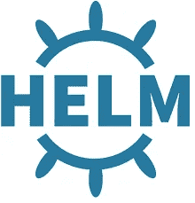
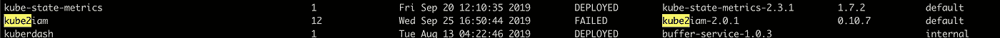
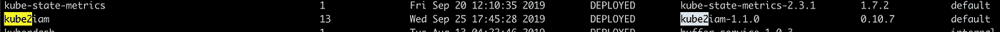

# 关于图表向后兼容性的 Kubernetes Helm 快速学习

> 原文：<https://itnext.io/quick-helm-learnings-on-chart-backward-compatibility-75799e34d381?source=collection_archive---------6----------------------->

在 Buffer，我们利用 [kube2iam](https://github.com/jtblin/kube2iam) 获得 AWS 权限。它通过[稳定舵图表库](https://github.com/helm/charts/tree/master/stable/kube2iam)进行部署、升级和管理。

它一直工作得很好，直到上周由于我的疏忽。这种情况在 30 分钟内得到解决，没有用户受到影响。尽管如此，我还是很乐意与社区分享我的经验。

为了升级`kube2iam`,我一直在使用这个命令

`helm upgrade kube2iam --install stable/kube2iam --namespace default -f ./values.yaml`

其中的`values.yaml`文件包含一堆被覆盖的变量。在我们的例子中，它看起来像

该命令会将`kube2iam`升级到包含升级后的`kube2iam`图像的最新图表。至少，这是我所希望的。

令我惊讶的是，返回了一条错误消息。它抱怨一些新标签没有被认可。然后我检查了头盔的展开状态，发现展开失败了。

即使部署失败，已经运行的 pod 仍继续正常运行。这类似于你的桌面应用程序升级失败，不应该删除旧的。因此没有生产服务受到影响。尽管如此，这是我需要尽快弄清楚的事情。让这个失败的部署持续太久感觉不太好，因为可能会有一些负面影响。

我很快研究了这个问题，发现有问题的标签就在几个月前被添加到了 kube2iam 头盔图中。在[提交](https://github.com/helm/charts/commit/520dee4464c62ce4ab341f9ecdb638261716e87e#diff-86128f9a45e1fe4ea0dac1fc5378d5c1)中，我们可以看到海图维护者试图遵循[新舵手海图标准](https://helm.sh/docs/chart_best_practices/#standard-labels)(我相信是源于 k8s 的[)并对这一突破性变化发出警告。](https://kubernetes.io/docs/concepts/overview/working-with-objects/common-labels/)

在`kube2iam`的例子中，删除部署并重新创建不是一个选项，因为我们的许多生产服务都需要它。我只需要找到一种新的方法来升级`kube2iam`版本，而不更新图表版本。

幸运的是，我用这个命令找到了一个很好的方法

`helm upgrade kube2iam --install stable/kube2iam --namespace default -f ./values.yaml --version 1.1.0`

它告诉 Helm 安装版本 1.1.0，而不是 2.0.1。这解决了头盔升级的问题。

关于`kube2iam`镜像升级，我给`values.yaml`添加了一个新的镜像标签(0.10.7)，如下所示。

这两种方法的结合帮助我们在升级了`kube2iam`映像的情况下成功部署了头盔。

# 关键学习点

*   舵图不一定是向后兼容的
*   由于上述原因，在掌舵命令中使用`--dry-run`旗来看看会发生什么总是好的
*   如果出现向后兼容问题，使用`--version`找到一个可用的版本
*   由于新标签推荐(`app` → `app.kubernetes.io/name`和`release` → `app.kubernetes.io/instance`)，期待更多突破性的舵图
*   失败的头盔部署不会移除现有的头盔

快乐驾驶！

*原载于*[*http://github.com*](https://gist.github.com/stevenc81/584c8ad382d614375a81452037057ced)*。*