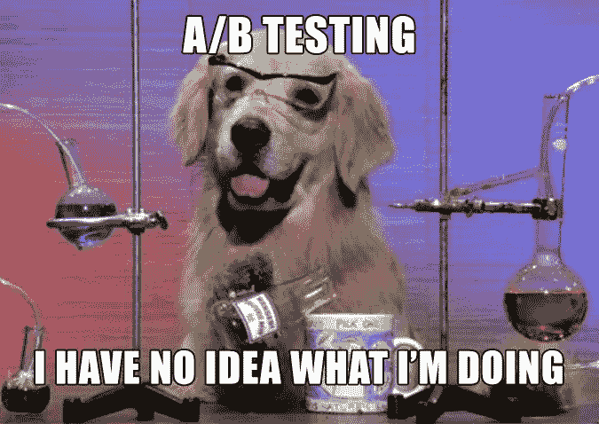
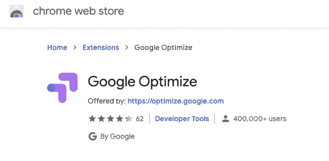
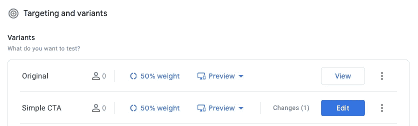
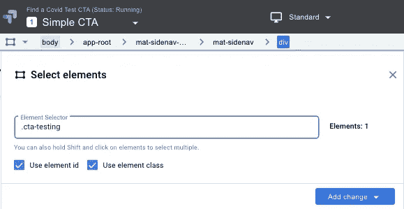
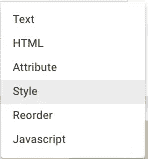
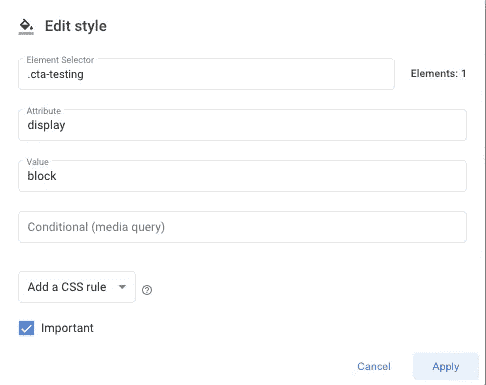

# 使用 Google Optimize & Angular 进行 A/B 测试的快速说明

> 原文：<https://itnext.io/quick-note-on-a-b-testing-using-google-optimize-angular-c5699f653773?source=collection_archive---------2----------------------->



**TLDR** : A/B 测试是向不同的访问者展示不同版本的登陆页面，以便找出哪个版本更好——我 5 岁时的定义:P

正如你在标题中看到的，我将使用 Angular (2+)和 [Google Optimize 来运行 A/B 测试。](https://marketingplatform.google.com/about/optimize/)你不知道搜一下 Angular+ A/B 测试的指令有多稀有。

在运行和测试实现之后，它可能没有那么难。我将分享我的使用案例，因此您将有一个如何在 Angular SPA 上完成它的示例。

**我的 A/B 测试是什么？**

我们有一个登录页面，我们想通过实验来了解

*   如果我们应该显示一个 CTA 按钮，
*   万一它出现了，有多少人会与之互动？

**设置谷歌优化**

请阅读他们的 [**谷歌优化文档**](https://support.google.com/optimize/answer/6211921#zippy=%2Cin-this-article) 获取最新说明。

**设置角度跟踪**

设置好 Google Optimize 后，您将有一个需要放入`<head>`的脚本。我会直接把它放在`index.html`里，不过，如果你有 GTM 的话，应该是在 GTM 里做的。

```
// index.html<!DOCTYPE html>
<html lang="en">
  <head>
    <meta charset="utf-8" />
    <title>Dale Nguyen - Optimize</title>
    <base href="/" />
    <meta name="viewport" content="width=device-width, initial-scale=1" />
    <link rel="icon" type="image/x-icon" href="favicon.ico" />...
    <script src="[https://www.googleoptimize.com/optimize.js?id=**YOUR_ID**](https://www.googleoptimize.com/optimize.js?id=YOUR_ID)"></script> -->

    ....(other scripts, ...GA, GTM...)</body>
</html>
```

Chrome 中你应该安装的一个有用的扩展是**谷歌优化**。



**触发跟踪事件**

优化是在我想要运行实验的登录页面上触发的。每当登录页面的组件初始化时，都会触发此活动事件。

```
ngOnInit(): void {
   dataLayer.push({'event': 'optimize.activate'});
}
```

**为测试元件(有角度)**

对于 CTA 按钮，我可以默认显示它，也可以使用 CSS 隐藏它。如果你想探索，还有更多的东西。

```
.cta-testing {
  display: none;
}
```

**为测试元素(谷歌优化)**



为 CTA 创建了一个变体，它以按钮为目标，并将其显示给 50%的流量。

因为默认情况下它是隐藏的，所以您必须使用 select 元素并手动键入类名来定位按钮。



找到 1 个元素

然后你可以**添加改变>样式**



因为按钮是隐藏的，所以我添加了规则以将其显示为一个块。



**运行您的 A/B 测试**

完成配置后，您可以**玩**体验，测试也差不多完成了。

A/B 测试快乐！