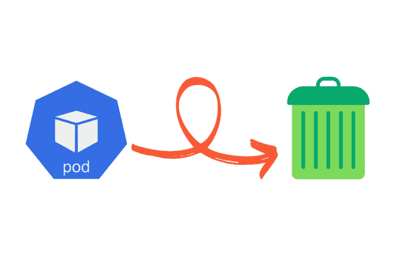
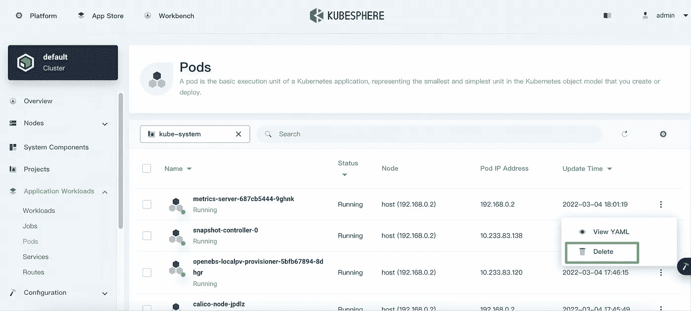

# 快速提示:删除 Kubernetes 豆荚

> 原文：<https://itnext.io/quick-tips-deleting-kubernetes-pods-52071802446c?source=collection_archive---------2----------------------->

如果使用 Kubernetes 部署容器化的应用程序，出于各种原因，例如调试节点问题、升级节点或从集群中删除节点，您可能必须从一个或多个工作节点中删除 pods。

使用 kubectl 命令，从一个节点中删除一个或多个 Kubernetes pods 是一个简单的过程。在本文中，我们来看看如何在实践中删除 pod。

# 删除 Kubernetes 豆荚

# 删除特定的 pod

当您想要删除特定的 pod 时，应该确保在运行 pod 的节点上进行删除。

1.  运行以下命令获取节点名称。

`kubectl get nodes`

2.确认节点名称后，运行以下命令列出该节点上运行的所有 pod，以标识要删除的 pod。

`kubectl get pods -o wide | grep <node name>`

3.确认 pod 的名称后，运行以下命令将其删除。

`kubectl delete pods <pod name>`

4.(可选)如果 pod 卡在`terminating`状态，您需要运行以下命令强制删除 pod。如果您使用的是 kubectl < = 1.4 的任何版本，那么您应该省略`--force`选项。

`kubectl delete pods <pod name> --grace-period=0 --force`

*注*

*如果 pod 卡在* `*unknown*` *状态，运行命令* `*kubectl patch pod <pod> -p '{"metadata":{"finalizers":null}}'*` *将其从集群中移除。当您尝试删除 StatefulSet pods 时，要小心潜在的风险。更多信息，请查看 Kubernetes 文档* *。*

# 删除节点上的现有窗格

当您想要删除一个节点上的所有现有 pod 时，您必须确保在适当的时间进行此类删除，以避免对您的服务造成潜在影响。

1.  运行以下命令获取节点名称。

`kubectl get nodes`

2.确认节点名称后，运行以下命令以列出该节点上运行的所有 pod，并仔细检查是否可以删除所有现有的 pod。

`kubectl get pods -o wide | grep <node name>`

3.运行以下命令停止将 pod 调度到该节点。

`kubectl cordon <node name>`

4.运行以下命令从该节点中退出所有现有的 pod。

`kubectl drain <node name> --ignore-daemonsets --delete-emptydir-data`

5.一旦您准备好将该节点恢复到 pod 调度，运行以下命令以继续在该节点上调度新的 pod。

`kubectl uncordon <node name>`

# 删除 KubeSphere 上的 Kubernetes 豆荚

作为一个开源项目， [KubeSphere](https://kubesphere.io/) 是一个基于 Kubernetes 构建的分布式操作系统。它提供了一个用户友好的向导 web 控制台来提高 Kubernetes 管理的效率。要删除 KubeSphere 上的 Kubernetes pods，只需要点击几个按钮就搞定了！

# 概述

尽管删除 Kubernetes pods 是一个简单的过程，但我们在实践中实现这种删除时仍然必须小心，以避免对我们的服务产生潜在影响。如果我们熟悉不同的 Kubernetes 工作负载，比如 Deployment 和 StatefulSet，会比直接处理 pod 更好。