# Golang 的快速检查测试

> 原文：<https://itnext.io/quickcheck-testing-in-golang-772e820f0bd5?source=collection_archive---------7----------------------->

上一部:[https://itnext.io/types-and-specifications-c4d34ade6d5c](/types-and-specifications-c4d34ade6d5c)

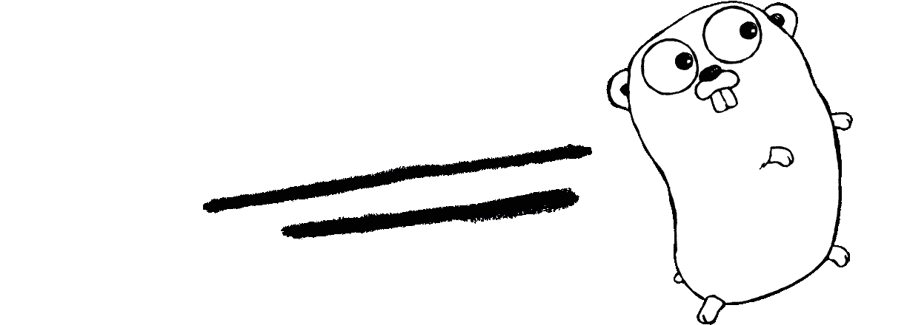

*“我们只看到我们知道的东西。”****——****[**歌德**](https://en.wikipedia.org/wiki/Johann_Wolfgang_von_Goethe)*

*在我上一篇关于测试的文章中，我介绍了 QuickCheck 的概念，使用了一种表面上是非类型化的语言 clojure。虽然我认为基于规范的检查优于依赖类型系统来建立正确性，但是您可能会发现自己处于一种必须使用类型化语言的情况。我最喜欢的类型语言之一是混合函数/过程语言 golang。Golang 有对 QuickCheck 的原生支持，但是你使用它的方式与 spec/check 有很大的不同，它也不是 erlang 或 Haskell 中 QuickCheck 的全功能实现。尽管如此，这个包允许开发人员为他们的工作创建各种各样的模糊测试，只要有足够的时间和创造力，就可以产生强大的生成性测试。*

# *测试框架:goConvey*

*在我开始写代码之前，我想向您介绍我最喜欢的 golang 测试框架之一:goConvey。虽然 golang 原生测试很棒，但它是相当程序化的，会导致大量围绕 t.Fail()或 t.Fatal()行的条件逻辑。虽然默认测试对于小项目来说已经足够了，但是 goConvey 可以进行更密集的测试，并且随着项目的增长，这些密集的测试可以更好地记录您的代码。此外，goConvey 对函数的操作并不严格依赖于允许组合和数据驱动测试的条件。*

*虽然这在我的“玩错误的游戏”中有所涉及，但 post goConvey 还通过启动本地 web 服务器作为持续构建集成来促进 TDD 和代码覆盖。虽然我敦促您不要玩覆盖率游戏，但是简单地在浏览器上有一个快速的反馈，表明构建/测试在后台自动通过，这就创建了一个伟大的连续工作流。你可以在这里找到:[http://goconvey.co/](http://goconvey.co/)*

# *收集工具*

*在基本层面上，testing/quick 提供了两个工具:Check 和 CheckEqual。这些函数接受一个或两个函数和一个配置。Check 就是 CheckEqual，但第二个函数相当于“持续为真”。*

*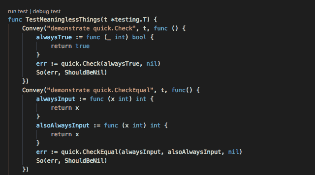*

*虽然 QuickCheck 在工作时总是很好，但使用它的原因是为了找到错误，为了找到错误，我们需要对产生错误的输入进行反馈。这些信息是在 CheckError 和 CheckEqualError 接口中捕获的。通过转换输出错误，我们可以看到调用计数、输入(表示为接口的一部分)以及在 CheckEqualError 的情况下不匹配的输出(也是接口的一部分)。*

*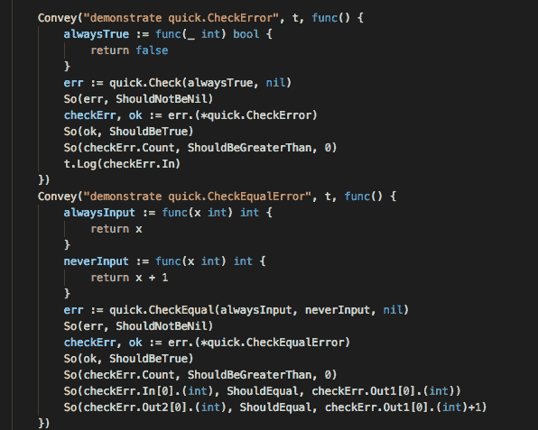*

# *安排一些免费的午餐*

*虽然上面的内容非常简单，但为了便于讨论，让我们做一些真实的、简单明了的事情。一个纯函数可以很容易地与带有 CheckEqual 的简化函数相比较。回溯解析，不是因为它特别有趣，而是因为似乎有无数种方法可以做到这一点。我们将比较基于正则表达式的解析器和时间包中内置的解析器，以展示 QuickCheck 如何神奇地为我们完成所有工作，并在正则表达式中找到一个 bug:*

*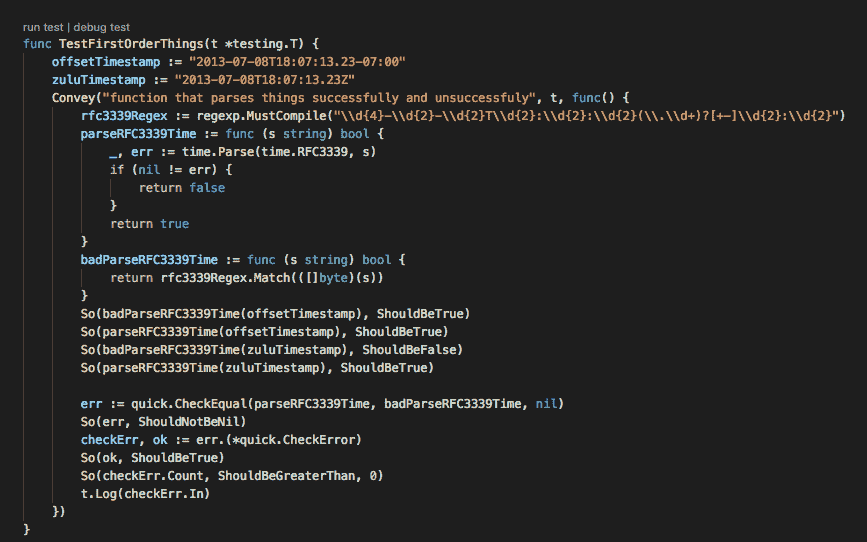*

*检查 goConvey 我发现这并不像希望的那么简单:*

*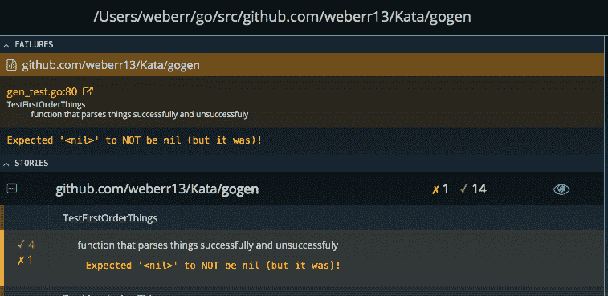*

*说明错误的静态测试通过了，但是 QuickCheck 无法找到可以在没有帮助的情况下找到错误的非常具体的字符串。增加迭代次数可能最终会找到无效的字符串，但是考虑到在任意长度的字符串中可能出现的难以想象的变化，增加迭代次数是没有用的。*

# *有限随机性*

*我们需要做的是帮助 QuickCheck 创建这些输入，就像我们在 clojure 规范中做的那样。对此有几种选择。如果您的输入不是简单类型，您可以实现 Generate 接口，或者您可以直接实现 quick 的“Values”函数。对于这个例子，我将选择后者。*

*我想在 RFC3339 规范有一些变化的地方创建测试。每个字符串的基本头应该相当一致，但有几个时区格式以及可能的毫秒/等。我用随机有效日期格式对此建模，但是用“垃圾”格式，我让随机生成来掩盖我在阅读 RFC 时的懒惰。*

**

*定义了 TimeValues 函数后，我们可以在 quick 的“值”部分使用它。配置以及更大的最大迭代次数，以便更有信心找到罪魁祸首:*

*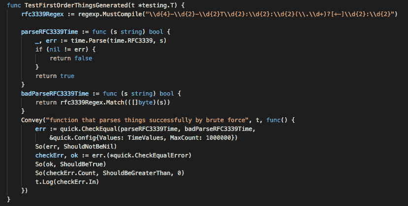*

*正如希望的那样，QuickCheck 为我们找到了一个无效的格式:*

*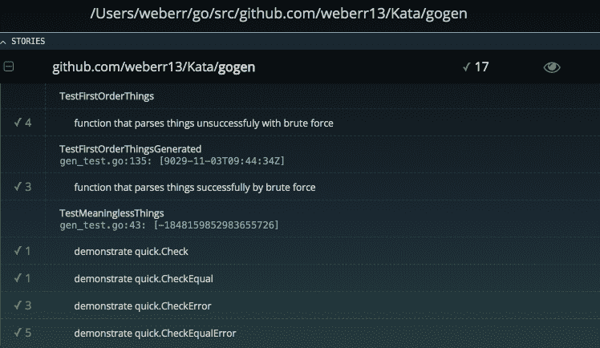*

*当然，日期部分是不相关的，但祖鲁语/GMT 时间丢失的“Z”很快被找到，我可以用它来修复这个错误。现在，很容易进一步探索这条道路，可能会加入更大的 unicode 字符或改变格式，但总的来说，这显示了如何检查单个函数。*

# *顺序输入*

*纯函数的生成测试是有帮助的，它肯定能找到单元测试可能遗漏的极限情况。不过，用 QuickCheck 测试有状态系统会更好，这样可以发现更复杂的错误。这些更像是“组件”甚至“集成”级别的测试，golang 中的 QuickCheck 确实给了我们这样做的方法。*

*假设我们有一个需要测试的 API。有许多可能的端点/过程可用，我们希望找到在任意命令序列之后发生的任何问题。我们要保证的是，任何命令序列都不会导致数据库进入崩溃状态。下面的“API”说明了这一点*

*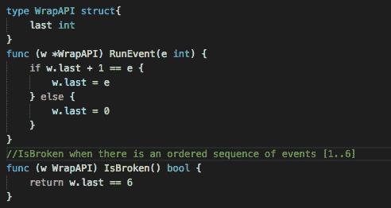*

*它有一个处理程序和一些状态，如果我们按顺序运行事件 1 到 6 并生成一个“错误”，它将进行跟踪。您可以想象这些整数查找可能是命令映射的关键，但是为了便于讨论，这是一个非常简单的 API，它只是直接获取整数值。我们还需要一些辅助函数来将事物连接在一起:*

*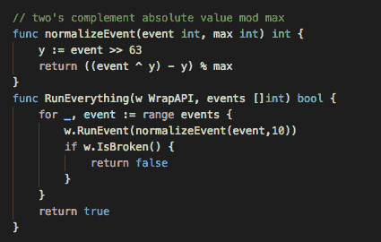*

*第一种方法是快速获得一个能够正确处理负值的余数函数，这样我们就可以使用默认情况下 int64 的 QuickCheck 提供给我们的任意切片。第二个是一个函数，它接受一个 API，按顺序运行给定的事件，并在 API“is broken”的任何时候返回 false。有了这些工具，我们可以使用 quickCheck 找到破坏 API 的事件序列:*

*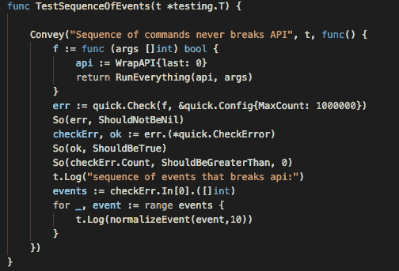*

*它传递给我们一个破坏 API 的序列:*

*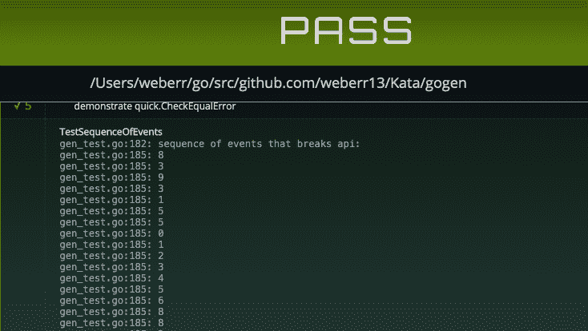*

*这不是理想的解决方案(真正的 QuickCheck 会将输入减少到最小可能的解决方案，golang 不会免费提供给我们)，但它是“破坏”测试中的 API 的解决方案之一。*

*虽然 QuickCheck 的这种实现并没有完全达到最小故障集，但是它允许对纯函数进行定制的模糊测试，并且如上所述，在处理诸如 API、外部数据库等系统时，还可以运行更多的有状态系统测试。代码示例可在此处找到:*

*[https://github . com/weberr 13/Kata/blob/master/gogen/gen _ test . go](https://github.com/weberr13/Kata/blob/master/gogen/gen_test.go)*

*因为回购协议中的所有内容都是在麻省理工学院的许可下呈现的。*

*系列下一篇:[https://it next . io/go pter-property-based-testing-in-golang-b 36728 c 7 c 6d 7](/gopter-property-based-testing-in-golang-b36728c7c6d7)*