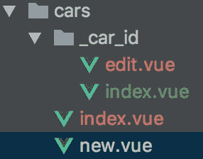

# 在 NuxtJS 中快速构建 RESTful UI

> 原文：<https://itnext.io/quickly-building-restful-uis-in-nuxtjs-782bce539440?source=collection_archive---------0----------------------->

我已经使用 NuxtJS 大约一年了，我对它赞不绝口。Vue 是一个很好的框架:它足够灵活，只关心 HTML，并且有能力满足财富 500 强公司的更大需求。

在本文中，我们将介绍如何快速启动一个 NuxtJS 应用程序，以及如何创建一个基本的 RESTful 风格布局。我假设你已经遵循了 Nuxt 的入门说明，并且正盯着起始页面。从这一点上，我们将忙于使它变得有用。我将使用`[yarn](https://yarnpkg.org)`来安装依赖项，但是当然可以随意转换成任何适合您需求的包管理器。

# 关于应用程序

我们首先需要向`package.json`添加几个关键依赖项:

```
...
"dependencies": {
  "@nuxtjs/auth": "^4.5.1",
  "@nuxtjs/axios": "^5.3.1",
  "bootstrap-vue": "^2.0.0-rc.11",
  "lodash.assign": "^4.2.0",
  "lodash.merge": "^4.6.1",
  "nuxt": "^1.0.0",
  "nuxt-i18n": "^3.3.0",
  "vee-validate": "^2.1.0-beta.6",
  "velocity-animate": "^1.5.1",
  "vue-moment": "^4.0.0",
  "vue-notification": "^1.3.10"
},
"devDependencies": {
  "babel-eslint": "^8.2.1",
  "eslint": "^4.15.0",
  "eslint-friendly-formatter": "^3.0.0",
  "eslint-loader": "^1.7.1",
  "eslint-plugin-vue": "^4.0.0",
  "node-sass": "^4.9.0",
  "postcss-preset-env": "^5.1.0",
  "sass-loader": "^7.0.3"
}
...
```

*   用于用户登录的@nuxtjs/auth
*   @nuxtjs/axios 用于使用 axios http 客户端
*   bootstrap-vue 是我们的 UI 组件工具包
*   总是著名的处理对象和数组合并的 lodash 助手
*   vee-validate 用于处理表单验证
*   速度-动画/vue-通知，用于出色的 toast 通知
*   vue——著名的日期时间格式库与 vue 集成的时刻

接下来我们运行`yarn`来安装所有东西。开始配置`nuxt.config.js:`

```
**const** i18n = require('./config/locales');
module.exports = {
  /*
  ** Headers of the page
  */
  head: {
    title: 'My App',
    meta: [
      {charset: 'utf-8'},
      {name: 'viewport', content: 'width=device-width, initial-scale=1'},
      {hid: 'description', name: 'description', content: 'My App'}
    ],
    link: [
      {rel: 'icon', type: 'image/x-icon', href: '/favicon.ico'}
    ]
  },
  css: [
    '@/assets/scss/app.scss'
  ],
  /*
  ** Customize the progress bar color
  */
  loading: {color: '#3B8070'},
  /*
  ** Build configuration
  */
  build: {
    /*
    ** Run ESLint on save
    */
    extend(config, {isDev, isClient}) {
      **const** vueLoader = config.module.rules.find((rule) => rule.loader === 'vue-loader')
      vueLoader.options.transformToRequire = {
        'img': 'src',
        'image': 'xlink:href',
        'b-img': 'src',
        'b-img-lazy': ['src', 'blank-src'],
        'b-card': 'img-src',
        'b-card-img': 'img-src',
        'b-carousel-slide': 'img-src',
        'b-embed': 'src'
      };
      **if** (isDev && isClient) {
        config.module.rules.push({
          enforce: 'pre',
          test: /\.(js|vue)$/,
          loader: 'eslint-loader',
          exclude: /(node_modules)/
        })
      }
    }
  },
  modules: [
    ['bootstrap-vue/nuxt', {css: **false**}],
    ['nuxt-i18n', i18n],
    ['@nuxtjs/axios'],
    ['@nuxtjs/auth']

  ],
  plugins: [
    {src: '~/plugins/vue-notifications', ssr: **false**},
    {src: '~/plugins/vee-validate'},
    {src: '~/plugins/vue-moment'}
  ],
  router: {
    middleware: ['auth']
  },
  auth: {
    strategies: {
      local: {
        endpoints: {
          login: {url: '/auth/login', method: 'post', propertyName: 'jwt'},
          logout: {url: '/auth/logout', method: 'post'},
          user: {url: '/auth/user', method: 'get', propertyName: 'user'}
        }
      }
    }
  },
  axios: {
    /* set API_URL environment variable to configure access to the API
    */
    baseURL: process.env.API_URL || 'http://localhost:3001/',
    redirectError: {
      401: '/login',
      404: '/notfound'
    }
  }
}
```

从上到下，主要新增内容如下:

*   在顶部导入一个`nuxt-i18n`配置脚本，然后在模块定义中使用它。
*   `css`使用 SCSS 以我们喜欢的方式处理配置引导的属性
*   `build`部分有`vueLoader`配置，用于为相关`bootstrap-vue`组件转换 nuxtjs 中的图像路径
*   `modules`包括`bootstrap-vue`、`nuxt-i18n`、`axios`和`auth`模块。
*   `plugins`通知、验证和时刻的配置脚本
*   `router`增加了`auth`中间件
*   最后是 auth 和 axios 的配置部分

当你给 Nuxt 添加插件时，它们实际上每次都是一样的。如果您遇到未定义`document`或`window`的问题，那是因为依赖项需要浏览器，但 Nuxt 默认情况下会进行 nodejs 服务器端渲染，而这两者并不存在。

## 添加一些风格

创建`~/app/scss/app.scss`:

`[@import](http://twitter.com/import) ‘~bootstrap/scss/bootstrap’;`

# 制作一些插件文件

`~/plugins/vue-notifications.js`:

```
**import** Vue **from** 'vue';
**import** Notifications **from** 'vue-notification'
**import** velocity **from** 'velocity-animate'

Vue.use(Notifications, {velocity});
```

`~/plugins/vue-moment.js`:

```
**import** Vue **from** 'vue'
**import** VueMoment **from** 'vue-moment'

Vue.use(VueMoment);
```

`~/plugins/vee-validate.js`:

```
**import** Vue **from** 'vue'
**import** VeeValidate **from** 'vee-validate'

Vue.use(VeeValidate, {
  inject: **true**,
  fieldsBagName: 'veeFields'
});
```

现在我们有更多的工作来添加对 i18n 的支持。创建一个名为`config/locales`的文件夹，并在其中创建一个`index.js`文件:

```
module.exports = {
  locales: [
    {
      code: 'en',
      iso: 'en-US',
      name: 'English',
      file: 'en.json'
    }
  ],
  defaultLocale: 'en',
  seo: **true**,
  lazy: **true**,
  detectBrowserLanguage: {
    cookieKey: 'redirected',
    useCookie: **true** },
  langDir: 'config/locales/',
  parsePages: **false**,
  pages: {},
  vueI18n: {
    fallbackLocale: 'en'
  }
}
```

您将会看到添加一个新的区域设置非常容易，只需复制`locales`数组中的对象并添加所需的值。对于`en.json`并不奇怪，因为它是一个标准的 JSON 格式的文件。

```
{
  "actions": "Actions",
  "yes": "Yes",
  "no": "No",
  "edit": "Edit",
  "password": "Password",
  "password_confirm": "Confirm Password",
  "login": "Log In",
  "forgot_password": "Forgot Password?",
  "remove": "Remove",
  "destroy_confirm_title": "Please Confirm",
  "destroy_confirm": "Are you sure you want to remove this?",
  "logout": "Log Out",
  "back": "Back",
  "save": "Save",
  "update": "Update",
  "forms": {
    "errors": {
      "required": "Please fill this out.",
      "standard": "A server error occurred."
    }
  },
  "cars": {
    "singular": "car",
    "plural": "cars",
    "new": "New Car",
    "edit": "Edit Car"
  }
}
```

有些人想让这个文件尽可能扁平，然后按字母顺序排列。我喜欢定义我的实体对象，并从那里翻译我的页面。这里真的是想用什么风格就用什么风格。保持一致就好。

这是我们的应用程序配置，现在让我们建立东西。

我们可能首先需要一个更加自举的布局。打开`~/layouts/default.vue`并添加以下内容:

```
<template>
  <main>
    <no-ssr>
    <notifications group="alerts"
                   position="bottom right">
      <template slot="body" slot-scope="props">
        <b-alert :show="props.item.duration || 3000"
                 dismissible
                 :variant="props.item.type || 'info'"
                 @dismissed="props.item.timer=0">
          <p>{{props.item.text}}</p>
          <b-progress :variant="props.item.type"
                      striped
                      :animated="true"
                      :max="props.item.duration"
                      :value="props.item.timer"
                      height="4px">
          </b-progress>
        </b-alert>
      </template>
    </notifications>
    </no-ssr>
    <b-row no-gutters class="mb-3">
      <b-col class="bg-dark">
        <b-navbar toggleable="md" type="dark" variant="dark">
          <b-navbar-toggle target="nav_collapse"></b-navbar-toggle>
          <b-navbar-brand href="/">My App</b-navbar-brand>
          <b-collapse is-nav id="nav_collapse">
            <b-navbar-nav>
              <b-nav-item class="text-white" :to="'/cars'">{{$t('new_car')}}</b-nav-item>
              <b-nav-item class="text-white" :to="'/admin'" v-if="admin">{{$t('admin')}}</b-nav-item>
            </b-navbar-nav>
            <b-navbar-nav class="ml-auto">
              <b-nav-item class="text-white" :to="'login'" v-if="!$auth.loggedIn">{{$t('login')}}</b-nav-item>
              <b-nav-item class="text-white" @click="logout" v-if="$auth.loggedIn">{{$t('logout')}}</b-nav-item>
            </b-navbar-nav>
          </b-collapse>
        </b-navbar>
      </b-col>
    </b-row>
    <b-container fluid>
      <nuxt/>
    </b-container>
  </main>
</template>
<script>
  **export default** {
    methods: {
      logout() {
        **this**.$auth.logout()
      },
      admin() {
        **return this**.$auth.loggedIn && **this**.$auth.user.admin
      }
    }
  }
</script>
```

好了，我们已经将通知与引导程序集成在一起，显示了一个倒计时定时器。很酷吧？旁边是一个非常平淡无奇的基本引导导航条。我展示了一个用户在登录时有一个“admin”布尔设置，它可以打开或关闭元素。`nuxt-auth`为我们登录时提供用户对象。在底部，你可以看到一个`b-container` 组件，它保存了我们特殊的`nuxt`组件渲染标签，我们的页面将在这里结束。

编辑:注意，如果你用`ssr: false`配置一个插件，那么你也可以在模板中使用`no-ssr`组件。否则，您会从 HMR 那里得到一个错误，抱怨服务器内容与呈现的内容不匹配。

# 使用 Vuex 获取、存储和改变数据

Nuxt 使得为 vuex 配置模块变得非常简单。您只需将其命名为您想要管理的实体。在这种情况下，我们使用*汽车，*所以让我们制作`~/store/cars.js`:

```
**import** *merge* **from** "lodash.merge";
**import** *assign* **from** 'lodash.assign';

**export const** state = () => ({
  list: [],
  car: {},
});

**export const** mutations = {
  set(state, car) {
    state.list = car
  },
  add(state, value) {
    merge(state.list, value)
  },
  remove(state, {car}) {
    state.list.filter(c => car.id !== c.id)
  },
  mergeCars(state, form) {
    assign(state.car, form)
  },
  setCars(state, form) {
    state.car = form
  }
};

**export const** actions = {
  **async** get({commit}) {
    **await this**.$axios.get(`/cars`)
      .then((res) => {
        **if** (res.status === 200) {
          commit('set', res.data)
        }
      })
  },
  **async** show({commit}, params) {
    **await this**.$axios.get(`/cars/${params.car_id}`)
      .then((res) => {
        **if** (res.status === 200) {
          commit('mergeCars', res.data)
        }
      })
  },
  **async** set({commit}, cars) {
    **await** commit('set', cars)
  },
  **async** form({commit}, form) {
    **await** commit('mergeCars', form)
  },
  **async** add({commit}, car) {
    **await** commit('add', car)
  },
  create({commit}, params) {
    **return this**.$axios.post(`/cars`, {car: params})
  },
  update({commit}, params) {
    **return this**.$axios.put(`/cars/${params.id}`, {car: params})
  },
  **delete**({commit}, params) {
    **return this**.$axios.delete(`/cars/${params.id}`)
  }
};
```

在我们的`state`中，我们有两个键，一个用于保存汽车列表，一个用于我们正在查看的当前汽车。

在 vuex 中突变是同步的，这一点值得注意。这被组织成使得`set, add, remove`都处理`list`状态的突变，而`mergeCars, setCars`处理`car`状态。

然而，动作不必是同步的。这使得它们成为 Ajax 调用的好地方。我们可以在这里返回承诺，处理突变，等等。轻而易举。

# 关于 Nuxt 路由

我花了一点时间来理解自动路由器是如何工作的，所以我希望这也能让你明白。



此文件夹结构导致生成以下 URL:

```
/cars -> cars/index.vue (view all)
/cars/:id -> cars/_car_id/index.vue (view one)
/cars/:id/edit -> cars/_car_id/edit.vue (edit view)
/cars/new -> cars/new.vue (new view)
```

当 nuxt 看到一个以下划线开头的文件夹时，它假定文件夹名是组件需要接收的 URL 参数。您也可以将其与新文件夹(cars/_car_id/pickups/_id 等)嵌套。

`~/cars/index.vue`:

```
<template>
  <b-row>
    <b-col>
      <b-btn variant="outline-success" class="mb-3" :to="'/cars/new'">
        {{$t('cars.new')}}
      </b-btn>
      <b-table striped hover :items="list" :fields="fields">
        <template slot="name" slot-scope="data">
          <b-link :to="`/cars/${data.item.id}/edit`">{{data.item.name}}</b-link>
        </template>
        <template slot="members" slot-scope="data">
          {{data.item.users.length}}
        </template>
        <template slot="updated_at" slot-scope="data">
          {{data.item.updated_at | moment("from", "now")}}
        </template>
        <template slot="actions" slot-scope="data">
          <b-btn variant="primary" :to="'cars/'+data.item.id+'/edit'">
            {{$t('edit')}}
          </b-btn>
          &nbsp;
          <b-btn variant="outline-secondary" @click="id = data.item.id" v-b-modal.confirmDestroy>
            {{$t('remove')}}
          </b-btn>
        </template>
      </b-table>
      <b-modal id="confirmDestroy" :title="$t('destroy_confirm_title')" @ok="destroy">
        {{$t('destroy_confirm')}}
      </b-modal>
    </b-col>
  </b-row>
</template>

<script>
  **import** {mapState} **from** 'vuex';

  **export default** {
    **async** fetch({store}) {
      **await** store.dispatch('cars/get')
    },
    computed: {
      ...mapState({
        list: state => {
          **return** state.cars.list
        }
      })
    },
    data() {
      **return** {
        id: 0,
        fields: [
          {
            key: 'name',
            label: **this**.$t('name'),
            sortable: **true**,
          },
          {
            key: 'updated_at',
            sortable: **true**,
            label: **this**.$t('updated_at')
          },
          {
            key: 'actions',
            label: **this**.$t('actions')
          }
        ]
      }
    },
    methods: {
      destroy() {
        **this**.$store.dispatch('cars/delete', {id: **this**.id}).then(() => **this**.$store.dispatch('cars/get'))
      }
    }
  }
</script>
```

我在这里对他们的`mapState`助手使用了一点 vuex 魔法。这是字面上的意思。它获取汽车列表的状态，并将其映射到一个名为 list 的局部变量。bootstrap-vue 中的表格组件真的很牛逼。无需任何配置，您就可以呈现所有的字段，但它仍然暴露了自己，足以使用动态模板标签进行超级定制。您会注意到我添加了一个带有编辑和删除按钮的“操作”列。删除按钮触发一个确认模式。该模态正在监听`@ok`事件，然后在单击 ok 按钮时调用`destroy`方法。

新视图和编辑视图实际上是相同的，只有一个小的变化。看看你是否能发现它:

`~/cars/new.vue`:

```
<template>
    <car-form></car-form>
</template>

<script>
  **import** CarForm **from** '~/components/CarForm';
  **export default** {
    components: {CarForm},
    fetch({store}) {
      store.commit('car/setCar', {})
    }
  }
</script>
```

`~/cars/_car_id/edit.vue`:

```
<template>
  <car-form></car-form>
</template>

<script>
  **import** CarForm **from** "~/components/CarForm";
  **export default** {
    name: "editCar",
    components: {CarForm},
    **async** fetch({store, params}) {
      **await** store.dispatch('car/show', {car_id: params.car_id});
    }
  }
</script>
```

我在两种情况下都使用了`fetch`，但是我在新方法中告诉 vuex 从一个新的`state.cars.car`对象开始。在编辑模式下，我需要获取当前值，所以我使用 params 从后端获取。

这样，我只有一个用于新建和编辑的表单:

```
<template>
    <b-form [@submit](http://twitter.com/submit).prevent="submit">
      <b-row align-h="end">
        <b-col class="text-right">
          <b-link :to="'/cars'">
            {{$t('back')}}
          </b-link>
        </b-col>
      </b-row>
      <b-form-group :label="$t('name')">
        <b-form-input id="carNameInput"
                      name="car[name]"
                      ref="name"
                      :state="validateState('name')"
                      type="text"
                      v-validate="{required: true}"
                      data-vv-delay="500"
                      :placeholder="$t('cars.name_placeholder')"
                      [@input](http://twitter.com/input)="mergeCar({'name': $event})"
                      :value="car.name"></b-form-input>
        <b-form-invalid-feedback>{{$t('forms.errors.required')}}</b-form-invalid-feedback>
      </b-form-group>
      <b-btn class="my-3" type="submit">{{isUpdate() ? $t('update') : $t('save')}}</b-btn>
    </b-form>
</template><script>
  import {mapMutations, mapState} from 'vuex';export default {
    name: "CarForm",
    computed: {
      ...mapState('cars', [
        'car'
      ])
    },
    methods: {
      ...mapMutations('cars', ['mergeCar']),
      isUpdate() { return this.car.hasOwnProperty('id') },
      submit() {
        let vm = this;
        let action = 'cars/' + (this.isUpdate() ? 'update' : 'create');
        this.$validator.validateAll().then((result) => {
          if(result) {
            this.$store.dispatch(action, this.car)
              .then((resp) => {
                let msg = resp.data.name + " " + (vm.$t('car.' + this.isUpdate() ? 'updated' : 'created'));
                vm.$notify({text: msg, type: 'success', group: 'alerts'});
                vm.$router.push('/cars')
              })
              .catch((resp) => {
                vm.$notify({text: vm.$t('forms.errors.standard'), type: 'warning', group: 'alerts'})
              })
          } else {
            vm.$notify({text: vm.$t('forms.errors.invalid'), type: 'warning', group: 'alerts'})
          }
        })
      },
      validateState(ref) {
        if (this.veeFields[ref] && this.veeFields[ref].dirty) {
          return !this.errors.has(ref)
        } else {
          return null
        }
      }
    }
  }
</script>
```

你会注意到我没有使用 v-model。虽然我很想这样做，但 vuex 并不支持这一点。你不能在严格模式下直接改变状态，撤销严格模式是个坏主意。

最后一个视图是`show`视图。这基本上是 edit 的“只读”版本。这是本教程中的一块空白画布。

```
<template>
  <div>
    <h3>{{$store.state.cars.car.title}}</h3>
  </div>
</template>

<script>
  **export default** {
    name: "showCar",
    **async** fetch({store, params}) {
      **await** store.dispatch('car/show', {car_id: params.car_id});
    }
  }
</script>

<style scoped>

</style>
```

我们已经采取了相同的方法来使用`fetch`填充商店，然后我们将状态中的内容显示给视图。

恭喜你，你已经为只有一个属性的汽车建立了一个完整的 CRUD MVC 设计模式！我希望您发现这很有用，并且您的想象力可以从这里尽情发挥。如果你需要帮助，欢迎在下面评论。如果你需要帮助，你也可以在 Nuxt gitter 或 bootstrap-vue slack room 找到我。

编辑:很多很棒的反馈，最大的请求是*“代码在哪里？”*

这就是:[https://github.com/toadkicker/nuxt-crud-example](https://github.com/toadkicker/nuxt-crud-example)