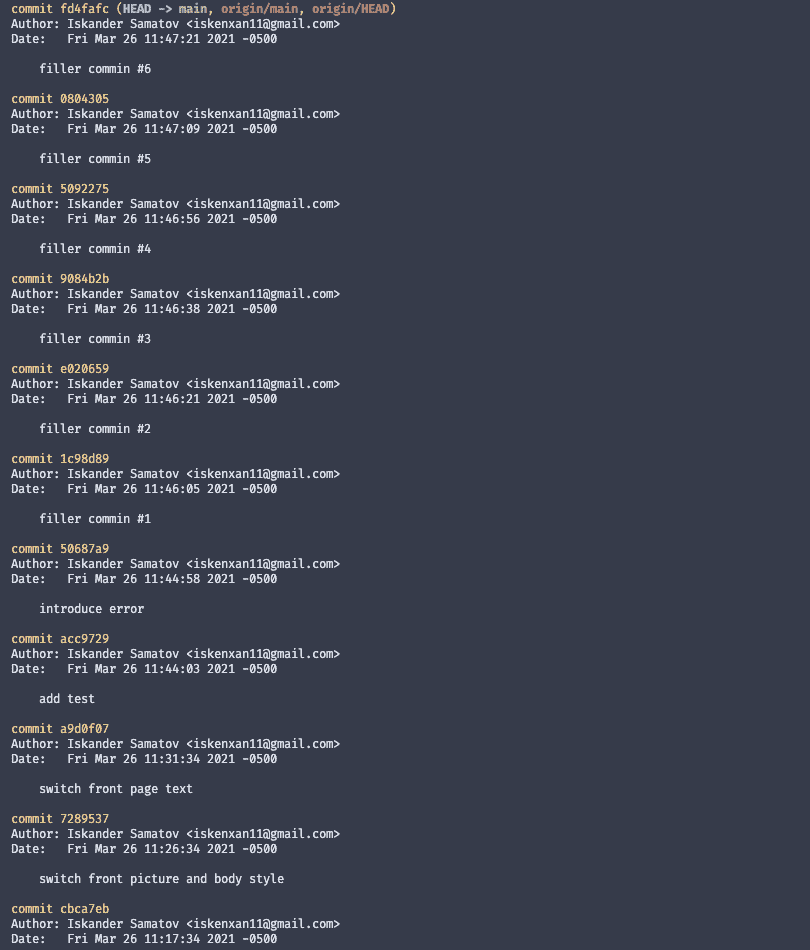
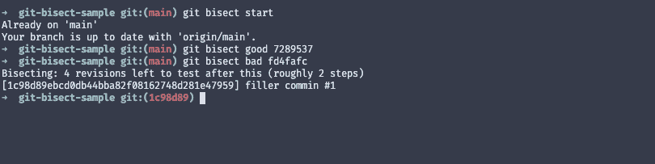
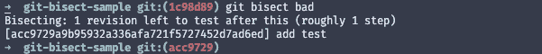
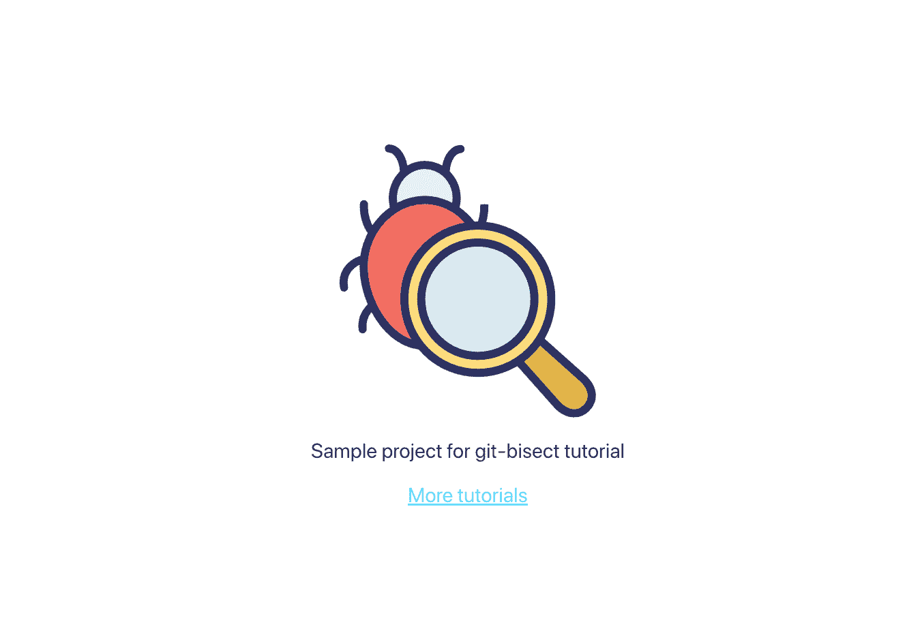
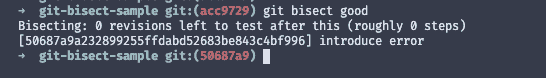
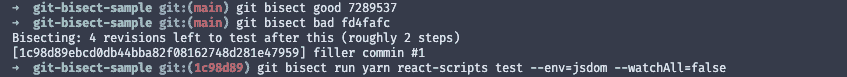
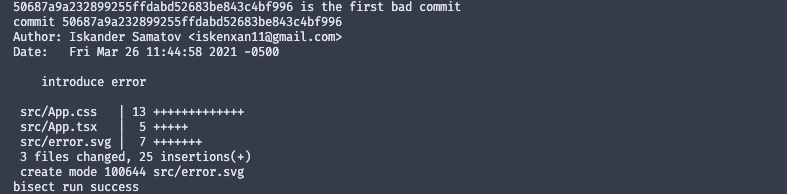

# 使用 git 二等分快速找到错误的提交

> 原文：<https://itnext.io/quickly-find-bad-commits-using-git-bisect-610dcbbc29e1?source=collection_archive---------1----------------------->

你是否曾经被报告过一个回归错误，你怀疑这个错误是在很多次提交之前引入的？

如果你认为找到罪魁祸首将是一个漫长而痛苦的过程，先不要翻白眼。您可以使用`git bisect`命令更快地找到违规提交。

在本教程中，我们将通过动手练习来复习`git bisect`的基础知识。

# git 平分是什么？

简而言之，`git bisect`是一个命令行工具，用于分析提交历史并找出错误的提交。Git 二等分使用二分搜索法算法。二分搜索法使得查找错误提交变得相当快，即使在很长的提交历史中。

现在，让我们开始吧！我建议跟随这篇文章，以便更好地理解这个主题。为了确保我没有捏造事实。你可以克隆这个回购[来跟进。](https://github.com/iskenxan/git-bisect-sample)

# 使用 git 二等分

`git bisect`使用好/坏提交方法。当 git 遍历提交时，您需要告诉 git 当前的提交是好是坏。这样做将有助于`git bisect`快速缩小目标提交范围。

一旦开始 git 二等分，步骤就很简单了:

1.  测试当前提交并检查您正在追踪的 bug 是否存在。
2.  根据第一步，将当前提交标记为好或坏。

现在让我们看看实际情况。如果您在本地运行该应用程序，您可以清楚地看到错误:

首先，让我们运行`git log`命令来查看提交历史:

引入错误的提交是`introduce error`。但是让我们假装不知道。对于第一个好的提交，我们将选择`switch front picture and body style`。据我们所知，这是没有错误的最新提交。对于第一个糟糕的提交，我们来挑选最新的一个，`filler commin #6`(请忽略错别字)。

现在让我们运行`git bisect`命令，并提供初始的错误和正确提交。

多亏了二分搜索法，看起来我们只剩下两次迭代要测试了。你现在的当前活动提交是`1c98d89`，也就是`filler commin #1`。现在你需要手动测试应用程序，看看 bug 是否还在。在我们的例子中，`1c98d89`仍然包含错误，所以我们使用`git bisect bad`将这个提交标记为坏的。以下是控制台输出:

继续下一次迭代。现在我们再次测试，看起来这个提交没有我们正在跟踪的错误。

所以我们使用`git bisect good`将其标记为好的:

从控制台输出中，您可以看到没有更多要测试的修订。这意味着我们找到了违规的提交，在我们的例子中是`introduce error`。干得好！

一旦您完成了测试，您可以使用`git bisect reset`重置 git 等分。

# 自动搜索

手动运行`git bisect`通常是一个不错的解决方案。但是如果你有一个测试脚本，你可以运行它来验证提交，你可以用它来自动化整个事情。

下面是我如何使用样例 repo 中的测试脚本让`git bisect`为我找到目标提交:

将开始搜索，并将在每次迭代中运行测试脚本。下面是最终结果:

我不再需要每次都手动测试提交。命令工具和测试脚本为我完成了工作！

`git bisect`是一个方便的小工具，可以快速找到棘手的提交。它与好的测试脚本配合得特别好，这是支持在您的项目中拥有健壮的测试套件的另一点。编码快乐！

*原载于 2021 年 3 月 29 日 https://isamatov.com**的* [*。*](https://isamatov.com/git-bisect/)