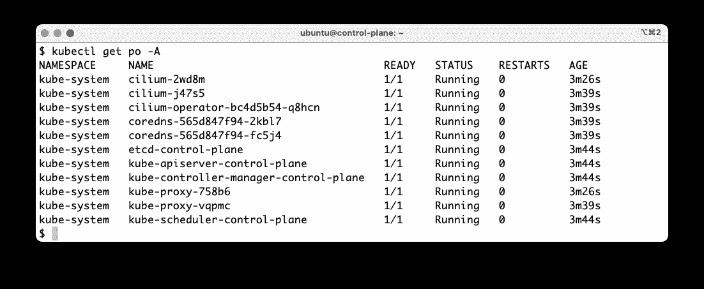
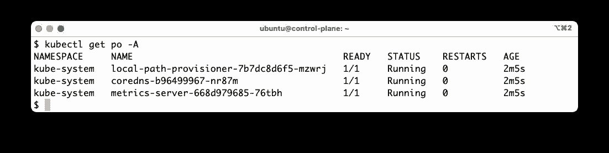
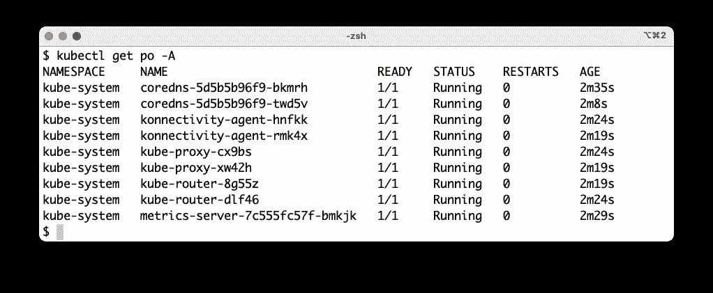

# 快速设置本地 K8s 集群

> 原文：<https://itnext.io/quickly-setup-a-local-k8s-cluster-da97c66e7a33?source=collection_archive---------2----------------------->

## kubeadm，k3s，k0s…你选


照片由[凯特琳·贝克](https://unsplash.com/@kaitlynbaker?utm_source=unsplash&utm_medium=referral&utm_content=creditCopyText)在 [Unsplash](https://unsplash.com/s/photos/computer?utm_source=unsplash&utm_medium=referral&utm_content=creditCopyText) 上拍摄

这篇快速的文章介绍了 3 个小的 shell 脚本，您可以用它们在几分钟内在本地机器上建立一个 Kubernetes 集群。您只需要首先安装两个先决条件:

*   [kubectl](https://kubernetes.io/docs/tasks/tools/#kubectl) 从您的主机与集群通信
*   [Multipass](https://multipass.run/) ，一个让你在 Mac、Linux 或 Windows 工作站上几秒钟内启动 Ubuntu 虚拟机的工具。根据您的操作系统，Multipass 本机使用 Hyper-V、HyperKit、KVM 或 VirtualBox 来实现最快的启动时间。


第一个脚本在[https://luc.run/k8s.sh](https://luc.run/k8s.sh)上可用，它允许您创建一个 [kubeadm](https://kubernetes.io/docs/reference/setup-tools/kubeadm/) 集群。它可以与默认选项一起使用，如下所示:

```
$ curl https://luc.run/k8s.sh | bash -s
```

它执行以下操作:

*   使用多通道创建 2 个 Ubuntu 虚拟机
*   在每个虚拟机上安装所需的软件包(kubeadm、containerd 等)
*   控制平面虚拟机上的群集初始化
*   加入工作节点

根据工作节点的数量，创建集群需要几分钟的时间(可能需要对脚本进行一些优化，以便并行执行一些操作)。

创建完成后，您只需使用输出中提供的命令配置您的本地 kubectl:

```
export KUBECONFIG=$PWD/kubeconfig.cfg
```

然后，您可以使用这个新创建的集群，从列出节点开始(节点可能需要几十秒钟才能达到就绪状态):

```
**$ kubectl get no** NAME            STATUS   ROLES           AGE   VERSION
control-plane   Ready    control-plane   51s   v1.25.2
worker1         Ready    <none>          31s   v1.25.2
```

您还可以列出已经运行的窗格:



如果您愿意，可以下载这个脚本并在本地使用。可用选项如下:

```
**$ ./k8s.sh** ...
-v VERSION: Kubernetes version (default is 1.25.2)
-w WORKERS: number of worker nodes (defaults is 1)
-c CPU: cpu used by each Multipass VM (default is 2)
-m MEM: memory used by each Multipass VM (default is 2G)
-d DISK: disk size (default 10G)
-p CNI: Network plugin among weavenet, calico and cilium (default)
-D: destroy the cluster
```

例如，如果您希望创建一个具有 2 个工作节点的集群，并且该集群使用 calico 作为网络插件，那么您可以使用以下命令:

```
$ curl https://luc.run/k8s.sh | bash -s -- -w 2 -p calico
```

使用完群集后，您可以按如下方式销毁它:

```
$ curl https://luc.run/k8s.sh | bash -s -- -D
```

或者如果您已经在本地检索了脚本

```
$ ./k8s.sh -D
```


第二个脚本在[https://luc.run/k3s.sh](https://luc.run/k3s.sh)上可用，允许创建一个 [k3s](https://k3s.io/) 集群(k3s 是由 Rancher / SUSE 创建的轻量级 Kubernetes 发行版)。它可以与默认选项一起使用，如下所示:

```
$ curl https://luc.run/k3s.sh | bash -s
```

它执行以下操作:

*   使用多通道创建 2 个 Ubuntu 虚拟机
*   控制平面虚拟机上的群集初始化
*   加入工作节点

根据工作节点的数量，创建集群需要几分钟时间。这比创建 kubeadm 集群要快得多，因为 k3s 更轻量级。

一旦创建完成，您只需要用输出中提供的命令配置您的本地 kubectl

```
export KUBECONFIG=$PWD/kubeconfig.k3s
```

然后，您可以使用这个新创建的集群，从列出节点开始(节点可能需要几十秒钟才能达到就绪状态):

```
**$ kubectl get no**
NAME            STATUS   ROLES                  AGE   VERSION
control-plane   Ready    control-plane,master   70s   v1.24.6+k3s1
worker1         Ready    <none>                 61s   v1.24.6+k3s1
```

您还可以列出已经运行的窗格:



如果您愿意，可以下载这个脚本并在本地使用。可用选项如下:

```
**$ ./k3s.sh -h** ...
-w WORKERS: number of worker nodes (defaults is 1)
-c CPU: cpu used by each VM (default is 2)
-m MEMORY: memory used by each VM (default is 2G)
-d DISK: disk space used by each VM (default is 10G)
-D: destroy the cluster
```

例如，如果需要创建一个包含 4 个工作节点的集群，可以使用以下命令:

```
$ curl https://luc.run/k3s.sh | bash -s -- -w 4
```

使用完群集后，您可以按如下方式销毁它:

```
$ curl https://luc.run/k3s.sh | bash -s -- -D
```

或者如果您已经在本地检索了脚本

```
$ ./k3s.sh -D
```


第三个脚本在[https://luc.run/k0s.sh](https://luc.run/k0s.sh)上可用，允许创建一个 [k0s](https://k0sproject.io/) 集群(k0s 是由 Mirantis 创建的 Kubernetes 发行版)。它可以与默认选项一起使用，如下所示:

```
$ curl https://luc.run/k0s.sh | bash -s
```

它执行以下操作:

*   使用多通道创建 3 个 Ubuntu 虚拟机
*   控制平面虚拟机上的群集初始化
*   加入 2 个工作节点

根据工作节点的数量，创建集群需要几分钟时间。至于 k3s，它比创建一个 kubeadm 集群要快得多。

一旦创建完成，您只需要用输出中提供的命令配置您的本地 kubectl

```
export KUBECONFIG=$PWD/kubeconfig.k0s
```

然后，您可以使用这个新创建的集群，从列出节点开始(节点可能需要几十秒钟才能达到就绪状态):

```
**$ kubectl get no**
NAME      STATUS   ROLES    AGE   VERSION
worker1   Ready    <none>   27s   v1.25.2+k0s
worker2   Ready    <none>   32s   v1.25.2+k0s
```

注意:没有列出控制平面节点，只有工作节点列出。

您还可以列出已经运行的窗格:



如果您愿意，可以下载这个脚本并在本地使用。可用选项如下:

```
**$ ./k0s.sh -h** ...
-v VERSION: Kubernetes version (default is 1.25.2)
-w WORKERS: number of worker nodes (defaults is 2)
-c CPU: cpu used by each Multipass VM (default is 2)
-m MEM: memory used by each Multipass VM (default is 2G)
-d DISK: disk size (default 10G)
-D: destroy the cluster
```

例如，如果需要创建一个包含 4 个工作节点的集群，可以使用以下命令:

```
$ curl https://luc.run/k0s.sh | bash -s -- -w 4
```

使用完群集后，您可以按如下方式销毁它:

```
$ curl https://luc.run/k0s.sh | bash -s -- -D
```

或者如果您已经在本地检索了脚本

```
$ ./k0s.sh -D
```

我经常使用这些脚本来测试 Kubernetes 生态系统的不同项目。不要犹豫去测试它们，提供反馈，并告诉你是否觉得它们有用。