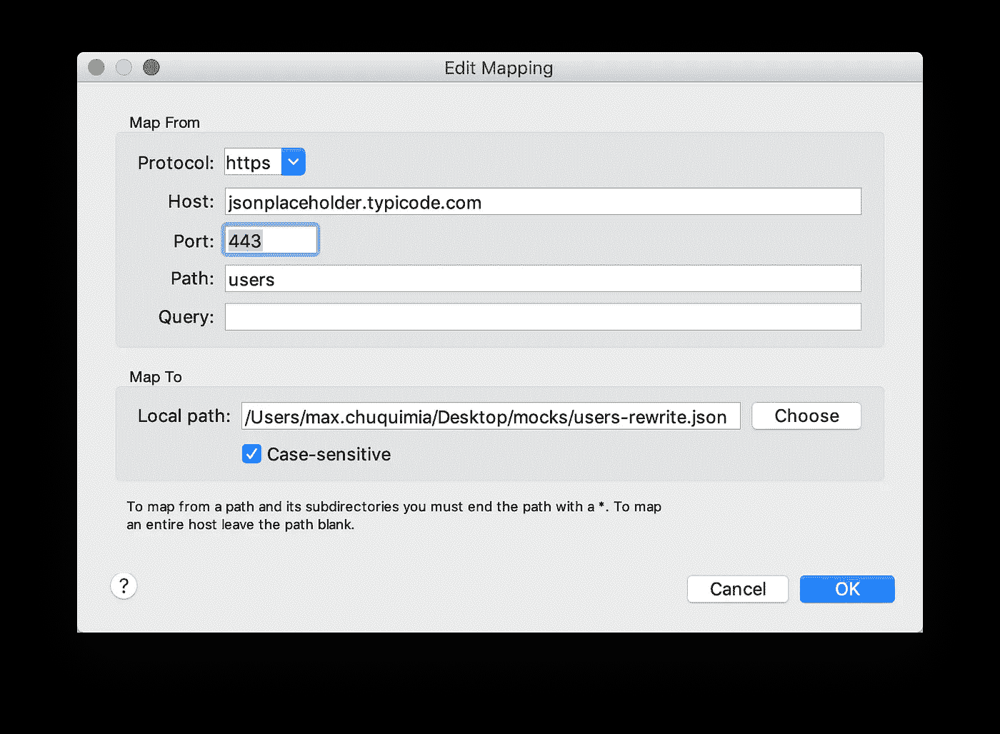
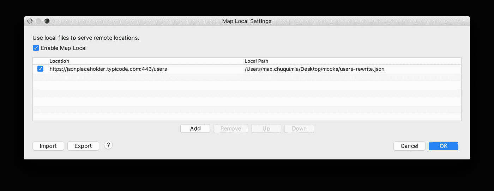
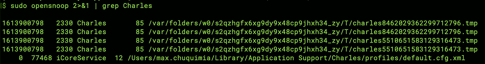

# 使用 Charles 在本地模拟之间快速切换

> 原文：<https://itnext.io/quickly-switch-between-local-mocks-with-charles-51ffda2d8a29?source=collection_archive---------4----------------------->

## 不可避免的是，当 sprint 开始时，你正在开发的 API 并没有完全发挥作用，或者你没有得到涵盖你需要处理的所有可能情况的用户帐户。您可以在 Charles 中添加一个断点，每次都改变响应…但是请继续阅读，寻找更好的方法！

[Charles](https://www.charlesproxy.com/) 是一个强大的工具，用于检查来自设备的 HTTP 请求。我假设您在阅读本文之前已经使用过 Charles😉

实际上我有乳糖不耐症，但我还是用查尔斯

在我参与的每个项目中，开发人员和 QA 工程师都使用 Charles 来定制对他们需求的响应。断点是模仿响应的最常见方式:在有问题的请求上添加一个断点，当响应返回时，在允许 Charles 将它发送到客户机设备之前手动修改有效负载。这是一项繁琐的工作，因为您经常需要多次使用相同的响应进行重新测试，否则在您发现如何修改有效负载之前，应用程序的内部请求就会超时。

# 地图本地

中级 Charles 用户可以利用“映射本地”的能力:对于给定的端点，返回磁盘上的文件内容，而不是远程服务器返回的有效负载。您可以从请求的右键菜单或从“工具”>“重写”菜单项添加本地映射:

现在，所有通过 Charles 路由到`https://jsonplaceholder.typecode.com/users`的请求都将从`/Users/max.chuquimia/Desktop/mocks/users-rewrite.json`返回有效负载

这已经比使用断点前进了一步，因为这意味着您可以在客户端设备发出请求之前编辑文件*——不再需要在 Charles 的界面上对每个响应进行处理！*

# 但这还不够快！

当您的票证被审核或您正在演示您的产品时，您通常需要即时向您的产品负责人展示所有场景。如果您需要登录单独的帐户或编辑有效负载来调用项目中每个可能的 UI 状态，这可能会很乏味。关于如何解决这个问题，我的第一个想法是直接写入 Charles 的首选项，并更改本地映射的路径。

使用 opensnoop 查看 Charles 在保存🕵️‍♂️贴图设置时写入了哪些文件

然而，这是徒劳的(我的典型过度工程)——对我来说，一个更好的解决方案应该是显而易见的:创建一个脚本来轻松地更改本地映射的内容。

当然，我选择用 Swift 写这篇文章。你可以用我的，或者用你最喜欢的语言写你自己的！

因此，现在您需要做的就是在从客户端设备发出请求之前，键入一个数字并按 enter 键，以获得特定的响应👌

不要忘记:作为一名开发人员，你有权力编写自己的工具——这个脚本可能不是每个人都可以重用的，但它只花了五分钟就编写好了，可以在将来省去很多麻烦。