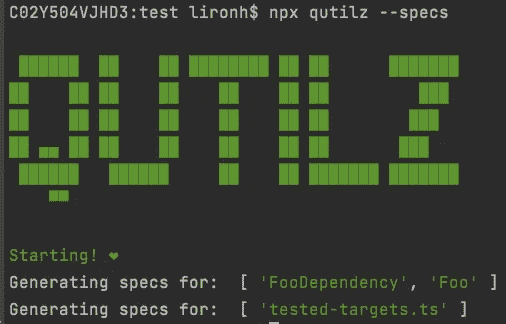

# qutilz——为了更快的单元测试开发🚀

> 原文：<https://itnext.io/qutilz-for-a-quicker-unit-testing-development-55cc614c3964?source=collection_archive---------5----------------------->



我创建了 Q [utilz](https://www.npmjs.com/package/qutilz) npm 包📦为了减少开发人员设置单元测试(spec)文件所需的时间，还需要设置一些前置 req 依赖项。

我认为 [qutilz](https://www.npmjs.com/package/qutilz) 是一个自以为是的规范模板生成器，用于快速单元测试设置，包括使用 [ts-mockito](https://github.com/NagRock/ts-mockito) 嘲讽库进行依赖嘲讽(我猜它的名字是为了向更老的 java mockito lib :P 致敬)。

[ts-mockito](https://github.com/NagRock/ts-mockito) 在 DI 驱动框架(Angular，Nest)方面大放异彩，当需要提供模拟依赖关系时，它通过在运行时代理目标依赖关系( [Proxy API](https://developer.mozilla.org/en-US/docs/Web/JavaScript/Reference/Global_Objects/Proxy) )并捕获其方法，使我们能够将“模拟”代理作为实例传递给测试目标，并使用它作为存根返回测试所需的任何内容，从而消除了在更新依赖关系时手动创建/更新模拟的需要。

Qutilz 还为导出的实用函数和包含静态方法的类创建测试模板。

**实现细节:** Qutilz 是使用 [ts-morph](https://github.com/dsherret/ts-morph) lib 构建的，它提供了对 tsc (typescript 编译器)功能的简单访问，当收集用于生成规范文件的元数据时，它使得解析测试源代码 AST 变得容易。
以后我打算把穿越部分换成 Rust 只是为了好玩..

**如何使用:**
要使用 Qutilz 生成测试，您只需从目标文件夹中运行以下命令:

```
npx quitilz --specs
```

回购包含一些例子。

有好看的编码:)

干杯，

利伦。