# 逆向工程雷达 2-第 1 部分

> 原文：<https://itnext.io/radare2-for-reverse-engineering-part1-eedf0a47b5cc?source=collection_archive---------0----------------------->

# **概述**

最近，作为我正在进行的[课程](https://medium.com/@sandeepbaldawa/my-journey-to-ecre-elearnsecurity-certified-reverse-engineer-2d9ba626dc2b)和 CTFs 的一部分，我花了一些时间来反转二进制文件。

考虑到汇编代码的性质和这种代码的编写方式(不像 Python 这样的高级语言)，在调试器中分析二进制文件本身就是一项具有挑战性的复杂任务。由于缺乏用户友好的拆卸工具，这个问题变得更加复杂。这就是 radare2 这样的工具大放异彩的地方。

其他逆向工程工具还有很多，包括 [IDA](https://www.hex-rays.com/products/ida/) 、 [Hopper](http://www.hopperapp.com/) 、 [BinaryNinja](https://binary.ninja/) 等。不过，[radar 2](https://github.com/radareorg/radare2)是我经常使用的工具之一。反转二进制文件不仅需要理解汇编代码模式，还需要理解与二进制文件相关的元数据。在这篇文章中，我们将使用 radare2 快速地研究一个简单的二进制程序。

# 谁应该阅读这篇博文？

这篇博客是为逆向工程初学者和正在寻找快速入门指南的人写的。

无论如何，这肯定不是一个详细的雷达提前指南。

# radare2 是什么？

Radare2 是一个开源的逆向框架。它结合了多种工具来帮助分析二进制文件。我通常将它与 gdb 一起运行，以了解二进制文件在做什么(当我们没有源代码时)😄).该项目的[主页](https://github.com/radareorg/radare2#introduction)解释了该工具支持什么以及如何安装。

以下是一些有用的链接:

*   [备忘单](https://github.com/radare/radare2/blob/master/doc/intro.md)
*   [radar 2 博客](http://radare.today/)
*   [雷达 2 维基](https://github.com/radare/radare2/wiki)

# 我们开始吧

让我们从反转一个简单的二进制开始。

使用[这个](https://github.com/sandeepbaldawa/Testing/blob/master/test.c)源代码，按照这里的[步骤](https://github.com/sandeepbaldawa/Testing/blob/master/README.md)创建二进制文件。我在 Ubuntu 上试过，但应该很可能在任何其他版本的 Linux 上都能工作。我们可以看到，我们未能破解密码，二进制期望密码匹配。

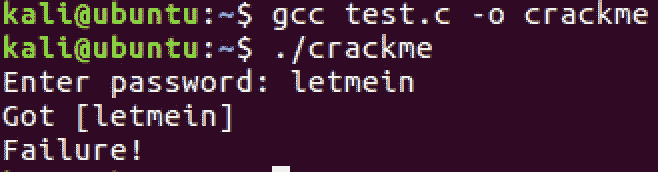

密码失败

我们现在该怎么破解密码？

# 第一步

让我们从分析文件的元数据开始。这对于理解二进制代码是否被剥离(没有调试符号)、ELF 类型、体系结构、动态/静态、保护等来说是很重要的。

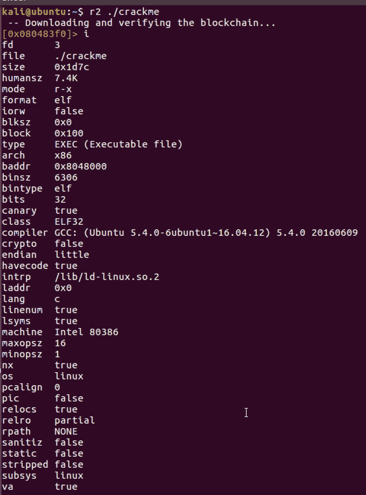

如果我们看到上面的一些保护，如 NX，canary，relocs 等。这对于现代操作系统来说是相当标准的。

可以使用`ie`找到二进制文件的入口点，使用`iM`找到主地址，如下所示:

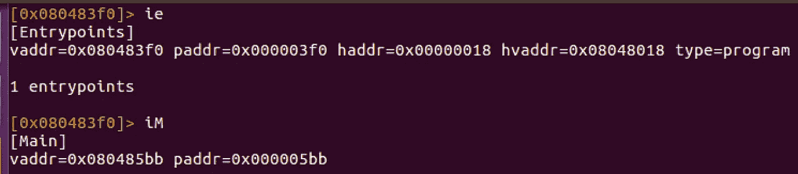

此外，二进制文件不会被剥离。

分析这些信息很重要，因为二进制文件可能有很多细微之处，这可能会妨碍调试。了解这一点将有助于我们找到保护措施的变通办法。目前，这是一个非常简单的带有标准保护的二进制文件。

# 第二步

在二进制文件中，分析字符串对于发现我们可以反汇编并更密切关注的有趣代码片段是很重要的。您可以使用命令`iz`找到二进制文件中的字符串

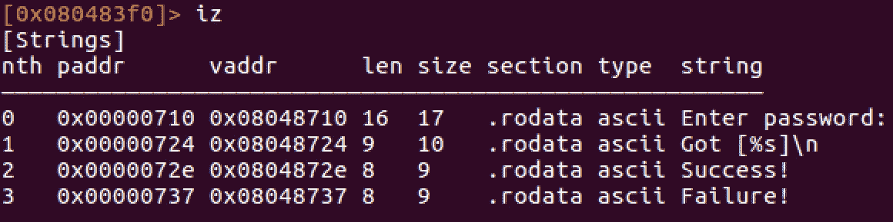

这里的字符串很简单。在一个更复杂的例子中，它们可以被加密并且不容易被看到。当我们分解二进制文件时，让我们记下这一点。

假设我们想找到包含`Success`的字符串在二进制文件中的位置，我们可以运行下面的命令。注意我们是如何使用`aaa`和`axt`来分析代码的。命令`axt`允许我们看到字符串被引用的位置。

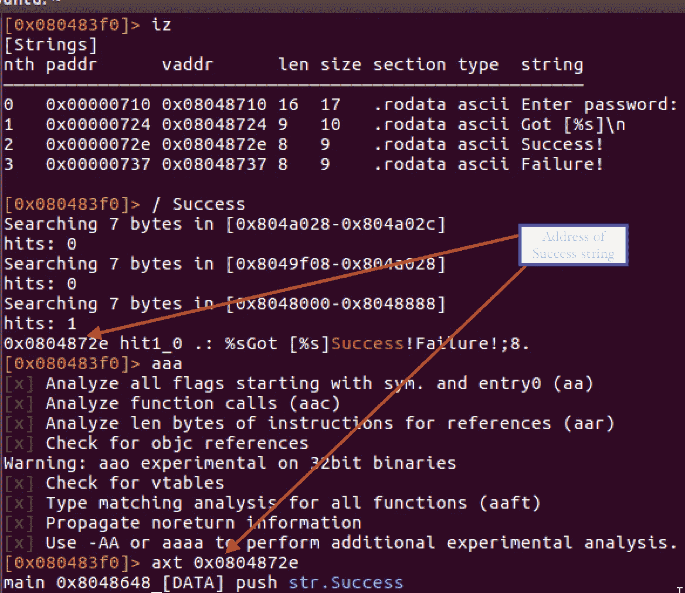

# 第三步

假设我们希望找到二进制文件中使用的所有函数。我们可以使用命令`aaa`后跟`afl`，如下所示

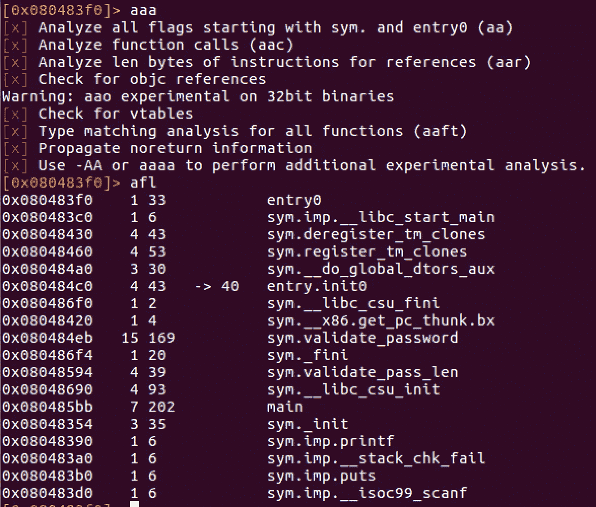

二进制函数

大多数名为`sym.imp*`的函数通常属于内部库。一些有趣的函数是`sym.validate_password`和`sym.validate_pass_len`

现在我们知道了函数名，让我们试着反汇编它们。

# 第四步

main 函数看起来确实很有趣，因为它引用了二进制文件中的`Success`字符串。为了反汇编，我们需要使用`s main`将光标提示符移到 main，然后使用`pdf`反汇编代码

查看光标中的地址如何变化以指向主地址

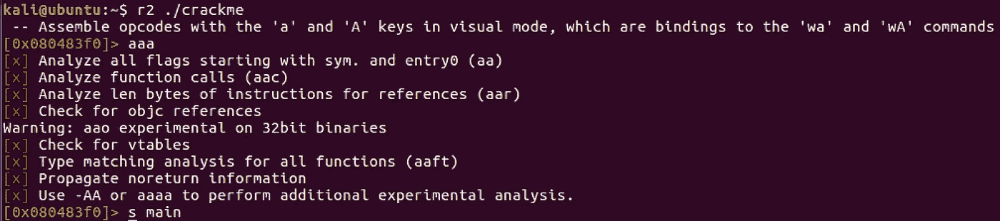

使用`pdf`命令进行拆卸会产生以下输出:

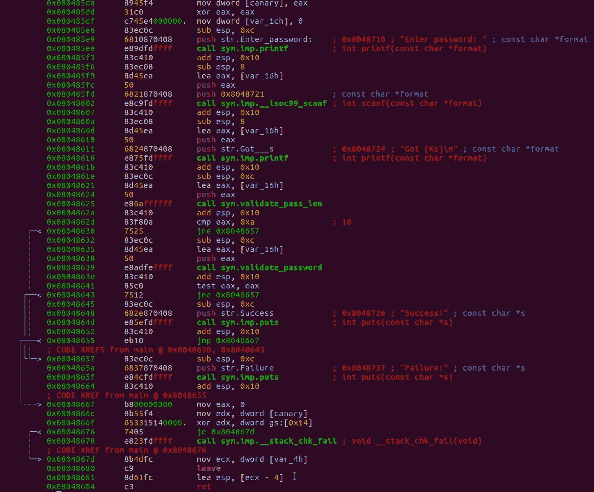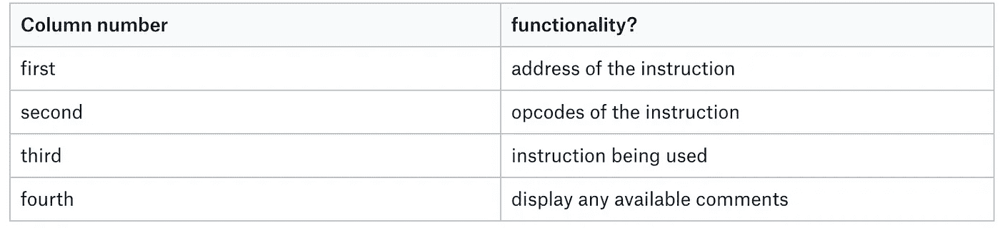

列及其含义

该命令显示每一列及其出现的原因。箭头标记和它们的方向描述了代码中的跳转。

# 第五步

现在，让我们尝试使用可视化模式来研究主函数。使用`VVV`命令进入视觉模式。

你可以看到代码成功和失败的路径。我们之前发现的函数`sym.validate_password`似乎很有趣。看起来这是在打印`Success`或`Failure`字符串之前验证密码的地方。

您可以使用`up`或`down`箭头在大型图表中导航。

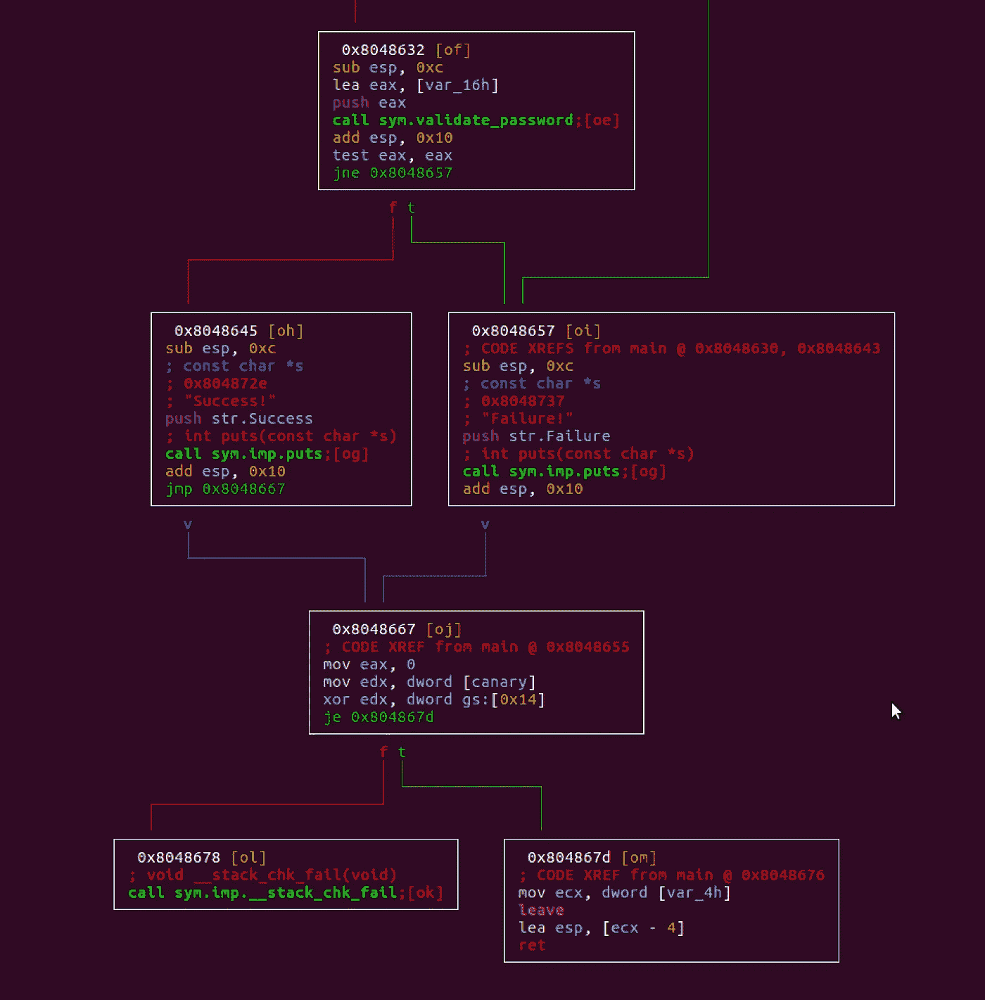

我通常使用命令`q`来退出可视模式或切换十六进制模式。视觉模式看起来是这样的:

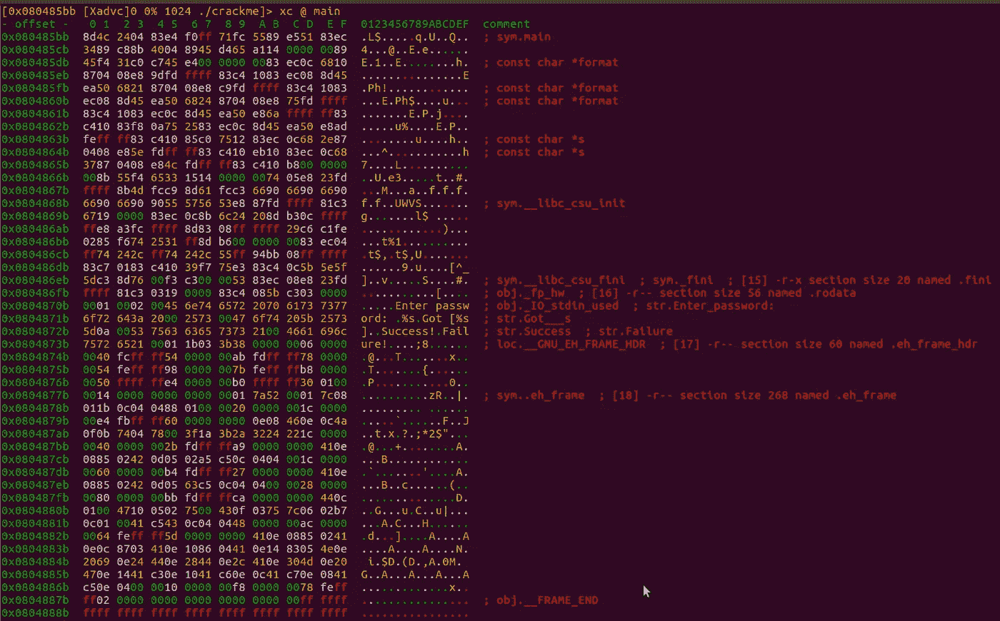

使用`C`命令管理注释和数据转换。您可以定义一个程序字节范围，将其解释为代码、二进制数据或字符串。有许多命令可以更改元数据，如下所示:

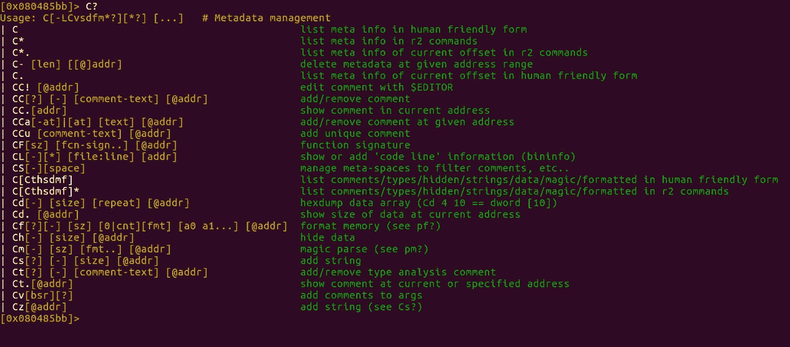

要给特定行/地址添加注释，可使用`Ca`命令

有趣的代码片段似乎是在下面的`Success`或`Failure`上做出决定的地方。`test eax,eax`验证返回值是否为零，如果不是，我们有一个`jne`指令来打印“失败”。

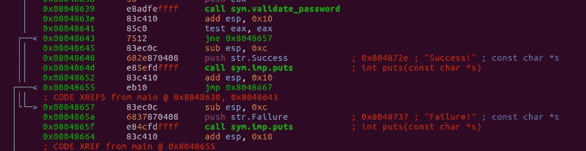

# 第六步

函数`sym.validate_password`看起来很有趣，所有的密码验证都在这里进行。让我们尝试使用我们在前面步骤中学到的命令进行反汇编:

1.  `s sym.validate_password`
2.  `pdf`
3.  `VVV`

第三步给了我们视觉模式，这通常是我最喜欢的。在可视化模式下，你可以看到函数正在进行的一系列验证。这串验证看起来像这样:

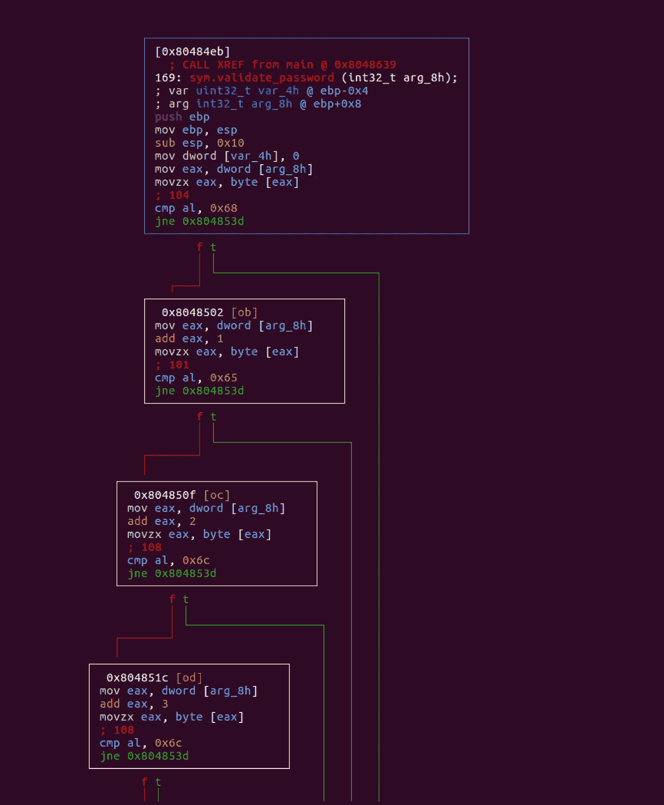

注意`cmp al, <value>`——这里，每次`al`寄存器与十六进制值进行比较时，二进制都会进行比较，如果比较成功，我们继续，否则我们继续。

让我们试着记下所有进行比较的十六进制值。你可以使用类似于[这个](http://www.asciitable.com/)的十六进制图表或者 python 库将十六进制转换成字符。现在，如果我们追踪代码，我们可以看到与之比较的密码是`helloworld`。

让我们试着用这个密码运行二进制文件。瞧啊。它工作了🎉

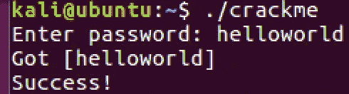

# 结论

本快速入门教程只是触及了皮毛。然而，Radare 是一把用于反转二进制的瑞士军刀。它还可以进行修补、动态分析等。

反汇编二进制文件有很多不同的方式，有很多东西需要学习。反转二进制是一种创造性的艺术。每次我使用反汇编工具，我都会学到一些新的东西😺

再见了。

# 参考资料:-

1.  [QuickTime 中的 Radare](https://blog.techorganic.com/2016/03/08/radare-2-in-0x1e-minutes/)
2.  [雷达 2 教程](https://www.megabeets.net/a-journey-into-radare-2-part-1/)
3.  [深潜](https://github.com/ifding/radare2-tutorial)
4.  *图片来源:图片来源:*[*https://searchengineland.com/*](https://searchengineland.com/)