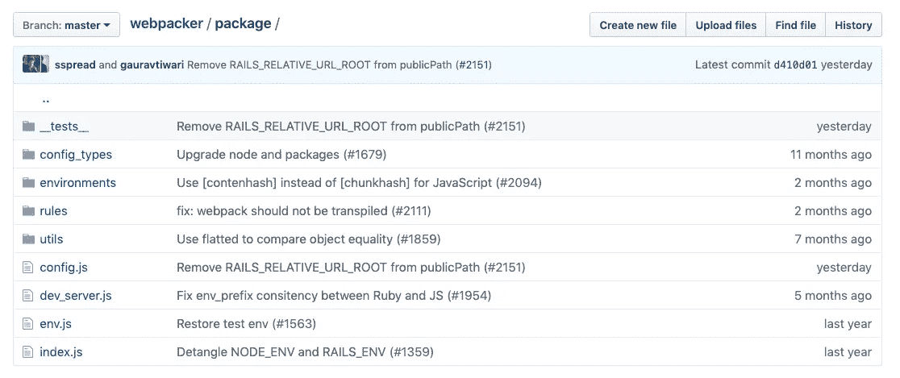
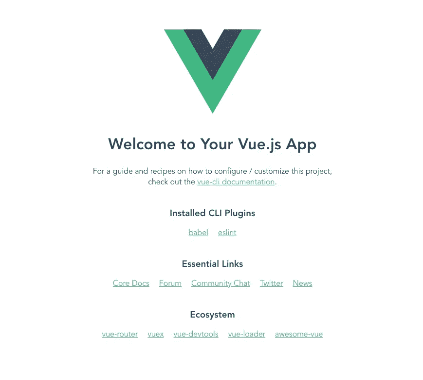

# Rails、Webpacker 和 Vue CLI 实际上可以很好地发挥作用

> 原文：<https://itnext.io/rails-webpacker-and-vue-cli-can-actually-play-nicely-10215fe833e1?source=collection_archive---------1----------------------->

*(2011 年 9 月 6 日更新，以指定 webpack-assets-manifest 包的具体版本，并对 vue.config.js 稍作修改，以支持 Webpack 4)*

*(2011 年 9 月 7 日再次更新，修复了热模块替换或实时重新加载，这显然与原始配置无法正常工作)*

# 动机

当我最初设想写这篇文章时，我完全打算写一篇文章，展示如何集成 Rails 和 Vue CLI(或者甚至 Webpack ),而不必使用或接触 [Webpacker](https://github.com/rails/webpacker) gem。如果你不熟悉的话，Webpacker 是官方的 Ruby on Rails 集成 Webpack 的方式。它被合并到 Rails 5.1 中，并被设置为 Rails 6 中的默认资产打包系统，有效地取代了[资产管道](https://guides.rubyonrails.org/asset_pipeline.html)。那么，如果这个 gem 是集成 Webpack 的 Rails 标准，为什么我要避免使用它呢？我的理由很简单。

我尝试了一下，获得了不同程度的成功。然而，当我试图将它与 VueJS 结合使用时，遇到了一些突出的问题。

首先，文档处于过渡状态。这是在 Webpacker 4 正式发布之前。版本 3 强迫我使用特定 VueJS NPM 包的旧版本，比如 [vue-template-loader](https://github.com/ktsn/vue-template-loader) 。Webpacker 4 有预发行版本，但是缺少文档(我相信现在也是)。

其次，这与我的第一点密切相关，我的终端收到了大量警告。从没完没了地抱怨 javascript 解析器到过时的 NPM 依赖项，尽管我尽了最大努力，还是无法更新到最新最好的版本。

第三，也是我的主要观点，Webpacker gem 似乎强迫你以一种非常 Ruby-on-Rails 特有的方式进行 Webpack 配置。虽然为开发、测试和生产使用单独的配置本身并没有什么错，而且我也很喜欢使用 webpacker.yml 配置文件，但我不喜欢的是它从本质上劫持了 Webpack 配置并夺走了我的控制权，同时给幕后发生的事情增加了一定程度的神秘/ WTF 时刻。这也有效地让你在使用 Webpacker 和 Vue CLI 之间做出选择。

Webpacker 将配置从您手中拿走的主要方式是将一个 NPM 依赖项注入到名为“@rails/webpacker”的 package.json 文件中。这是一个作为 Webpacker gem 本身的一部分管理和创建的包。简单看一下回购的这一部分，就能看出一个方案的侵入性和广泛性:



这有很多文件，更糟糕的是，这些文件中有很多 Rails 的神奇之处。如果除了在 webpacker.yml 配置文件中可以修改的内容之外，您并不真正关心 Webpack 的配置，那么这可能很好。但是如果你想做一些微调，毫无疑问，你首先会发现自己在研究 Webpack 的文档，然后你可能需要钻研 Webpacker 的文档，以了解如何以 Ruby on Rails 的方式做同样的事情。如果在那里找不到答案，你可能不得不开始钻研 Webpacker 的源代码，而这正是我发现自己正在做的事情。

与资产管道不同，Webpack 是一个完全存在于 Ruby on Rails 领域之外的工具。依我拙见，使用它最有效的方法是直接使用，而不是局限于特定的、通常是旧版本的依赖项中。想用 Vue CLI 3 这种前沿的东西会怎么样？根本没有这样做的机制。如果您只是使用 Webpacker Vue 安装程序，您肯定不会使用 Vue CLI 和它提供的所有功能和灵活性。

有人可能会说，如果你想使用像 Vue CLI 这样的工具，你可以简单地创建一个连接到任何后端的独立项目，包括 Rails。好吧，我同意你的说法。但是，假设(无论出于什么原因，您认为有必要)您希望将所有代码放在一个地方，并且您可能希望在 Vue 应用程序和 Rails 应用程序之间共享诸如样式和脚本之类的资产？那么将它们构建到同一个项目中可能是有意义的。

正如我第一次提到的，我最初试图在没有 Webpacker 的情况下连接 Ruby on Rails 和 Webpack。我甚至为我工作的公司 [MobileCause](https://www.mobilecause.com/) 创建了一个概念证明。我深入到 Webpacker 源代码中，以弄清楚他们是如何解决某些问题的，比如代理、Rails 和 Vue 之间的共享配置、webpack-dev-server 的检测、前端资源变更的检测、manifest.json 文件的生成等。我甚至在我们的代码库中重新利用了 Webpacker 代码的小片段来支持这种集成。随着我在这个集成中添加更多的功能，我发现自己越来越深入地钻研 Webpacker 的源代码。在我在我们的知识库中全面复制他们的源代码之前，我决定可能值得再尝试使用这个宝石。然而，这一次，我带着尽可能使用 Webpacker 的 Rails 端代码的心态去做，但是自己做所有的 Webpack 配置。下面是在你自己的项目中可以遵循的步骤。

# 安装 Webpacker

首先，要么用 Webpack 生成一个新的 Rails 应用程序并禁用链轮/资产管道，要么将 webpacker gem 添加到现有项目中

```
// ------ FOR A NEW RAILS APPLICATION --------
// From command line
rails new webpackerapp --skip-sprockets --webpack
// -------------------------------------------// ------ FOR AN EXISTING RAILS APPLICATION --
// Add to Gemfile:
gem 'webpacker'
// From command line
bundle install
// ------ FOR RAILS >= 5 ---------------------
bundle exec rails webpacker:install
// ------ FOR RAILS < 5 ----------------------
bundle exec rake webpacker:install
// -------------------------------------------
```

*注意:Webpacker 需要 Rails 4.2 或更高版本。运行上面的 install 命令，您可能会在尝试运行上面的 rake 命令时收到一个错误，类似于“没有这样的文件或目录-”。/bin/rake (LoadError)"。如果是这种情况，这仅仅意味着您的项目可能是在使用新的 Rails 应用程序自动生成 binstubs 之前创建的(这在 Rails 4 中的某个时候开始发生)。只需运行“rake rails:update:bin”来生成它们，然后重新运行安装命令。*

# 撕掉 Webpacker 的大部分

现在 Webpacker 已经安装好了，有趣的部分来了:让我们把它的大部分拆出来:

```
rm -rf node_modules/ package.json yarn.lock babel.config.js config/webpack app/javascript .browserslistrc postcss.config.js
```

他们进来了，大多数人出去了。事实上，应该只剩下三个特定于 Webpacker 的文件:

*   “config/webpacker.yml”:该文件将作为在 Rails 应用程序(使用 Webpacker gem)和前端应用程序之间共享配置数据的一种方式，我们将在前端应用程序中配置该文件以从中读取
*   “bin/webpack”:web packer gem 使用这个文件来构建用于生产的 web pack 条目文件。Webpacker gem 修改了 Rake assets:precompile 任务，以便在我们进行部署时在我们的生产服务器上编译我们的 Webpack 条目文件
*   “bin/webpack-dev-server”:我们不会以任何有意义的方式使用这个文件；然而，Webpacker gem 依赖于它的存在来编译我们的代码，所以我们保留它仅仅是因为这个原因。

事实上，Webpacker gem 的 Ruby 端的所有东西都依赖于这三个文件的存在，我们将很好地利用前两个文件。但是首先，让我们使用 Vue CLI 创建一个 Vue 应用程序。

# 使用 Vue CLI 生成 Vue 应用程序

请确保您已经安装了 [Vue CLI 3](https://cli.vuejs.org/) 所需的所有软件包。如果一切安装正确，就可以开始生成 Vue 应用程序了。在本次演示中，我将在名为“frontend”的子目录中的 Rails 目录“app”中生成 Vue 应用程序:

```
// From command line, within the root directory of the project
cd app
vue create frontend
// For my app, I chose "Manually select features",
//  then added CSS Preprocessors, dart-scss, and
//  ESLint + Standard Configuration, Lint on Save,
//  and dedicated config files
cd frontend
```

# 模仿 Webpacker 的组织和设置

好了，现在我们已经有了 Vue CLI 生成的文件，我们将把它们移到我们的 root Rails 目录中，代替由 Webpacker 安装的文件。

```
// From command line, within the app/frontend directory
mv node_modules/ yarn.lock package.json babel.config.js ../..
// There may be additional files to move depending on your
//   selections when generating the app using Vue CLI
cd ../..
```

现在，回到 Rails 应用程序的根目录，我们将安装“@rails/webpacker”已经为我们安装的一个关键依赖项(如果我们没有删除它): [webpack-assets-manifest](https://www.npmjs.com/package/webpack-assets-manifest) 。该 Webpack 插件将自动生成一个 manifest.json 文件，其中包括 Webpack 托管资产与其 Webpack 生成路径之间的映射:

```
// From command line, within the root directory of the project
yarn add -D webpack-assets-manifest@3.1.1
// Note: the @3.1.1 is a recent edit from 09/06/21 as newer versions of the package appear not to work properly with vue ui
```

现在，让我们对位于 config/webpacker.yml 中的 Webpacker 配置文件做一些小的修改:

1.  将“source_path”属性更改为“app/frontend/src”
2.  将“source_entry_path”属性更改为空字符串' '
    这是上述“source_path”指定目录内的目录，所有条目文件都将位于该目录中。默认情况下，Webpackser 假设您希望将所有的条目文件放在它们自己的名为 pack 的目录中。这可能只是个人偏好的问题，但是 Vue 应用程序中的惯例似乎总是将这些文件放在 src 目录的根级别；因此，将这个值设置为空字符串可以确保遵循这个 Vue 约定。
3.  将“hmr”属性(嵌套在开发/dev_server 中)更改为 true。这将在 webpack dev 服务器运行时启用热模块替换或 livereload。

让我们也借此机会改变 Webpacker 构建入口点的方式。我们将修改“bin/webpack”脚本，使用 Yarn 和 Vue CLI 进行编译，而不是使用 Webpacker 的内部设置进行编译。打开“bin/webpack ”,将内容更改为:

```
#!/usr/bin/env ruby
ENV["NODE_ENV"] ||= "development"Dir.chdir(File.expand_path("..", __dir__)) do
  Kernel.exec(ENV, "yarn build")
end
```

进行这些更改将有效地修改 Rake 任务“webpacker:compile ”,以使用我们的 Vue CLI 应用程序生成的 package . JSON“build”任务进行构建。这也将改变 Rake 任务“assets:precompile”在将我们的应用程序部署到生产环境时的运行方式。

# 使用 Vue CLI 共享 Webpacker 的配置

通过在 root Rails 目录下创建一个名为“vue.config.js”的文件，可以配置 Vue CLI 应用程序，而不仅仅是现成的。下面是我使用的带注释的配置文件:

实际上，我们读取了安装 webpacker 时包含的 YAML 配置文件“webpacker.yml”。我们使用该文件中的各种配置来构建我们的 Vue Webpack 配置。这包括动态确定入口点、生成 manifest.json 文件的配置、指定 webpack dev 服务器设置等。

# 在 Rails 中使用 Webpacker

好了，现在我们已经大致准备好了开始使用 Webpacker 从 Webpack Dev 服务器提供资产，并使用 Vue CLI 进行配置。让我们生成一个简单的例子，把所有的部分都拉进来。

首先，让我们生成一个简单的控制器和动作

```
// From command line
rails generate controller pages index
```

进入布局文件“app/views/layouts/application . html . erb ”,将对“stylesheet_link_tag”和“javascript_include_tag”的调用替换为:

```
<%= stylesheet_packs_with_chunks_tag 'main' %>
```

就在 body 标记结束之前，添加下面一行:

```
<%= javascript_packs_with_chunks_tag 'main' %>
```

进入模板文件“app/views/pages/index ”,将文件内容替换为:

```
<div id="app"></div>
```

使用`rails server`在一个选项卡中启动您的服务器，使用`yarn serve` 在另一个选项卡中启动 webpack-dev-server，并通过访问[http://localhost:3000/pages/index](http://localhost:3000/pages/index)查看您的页面。

如果一切正常，您应该会看到类似如下的页面:



# 包扎

如果你的页面渲染正确，恭喜你！您已经成功地将 Webpacker 与 Vue CLI 集成在一起。通过修改 Vue 应用程序中的代码，比如修改“app/frontend/src/App.vue”，继续尝试热模块重载。您几乎可以立即在网页上看到变化。

您也可以尝试退出 webpack-dev-server 并再次点击页面。这一次，由于它首先需要编译，所以可能需要更长一点的时间，但是随后的加载应该几乎是即时的。但是，如果您对 Webpacker 管理的任何资产进行了更改，Webpacker 将在您下次重新加载页面时自动重新编译。

当您部署您的应用程序时，Webpacker 将自动注入到 assets:precompile 步骤中，并且应该使用 NODE_ENV production 来构建您的代码。

这里我们可能会涉及到更多内容，比如如何利用 VueCLI 自动注入但 Rails 会丢失的预取和预加载链接，如何从 Webpack 渲染 ERB 模板，如何结合 Rails 的路由器使用 Vue-router 的历史模式等，但我会将这些内容留到以后的文章中讨论。

我欢迎反馈、建议或故障排除请求，希望本文对您有所帮助。