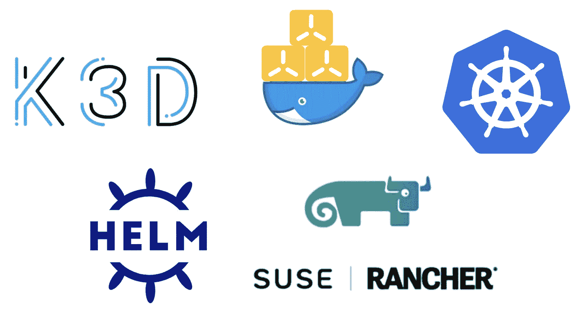
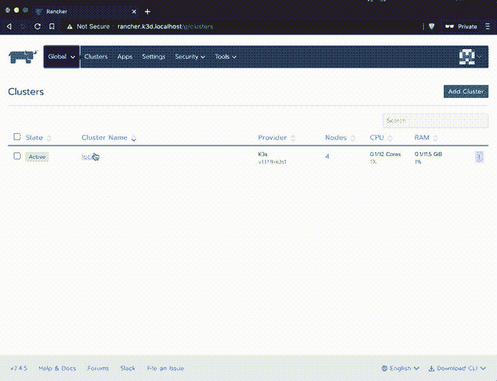
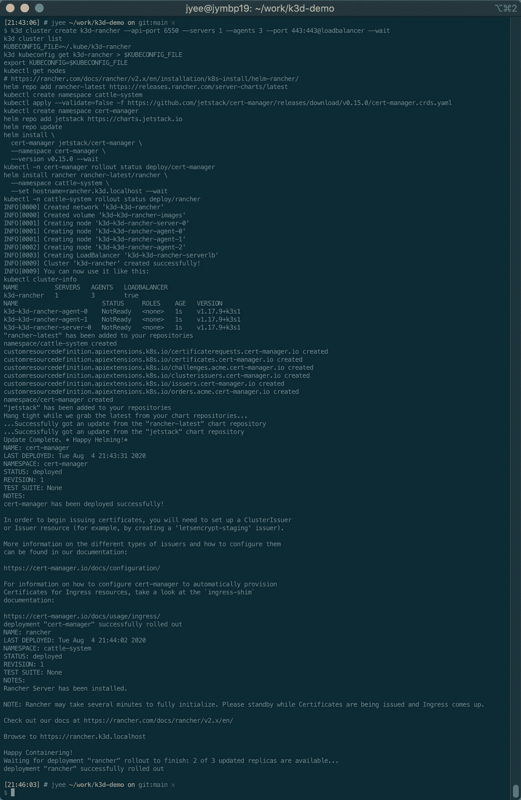
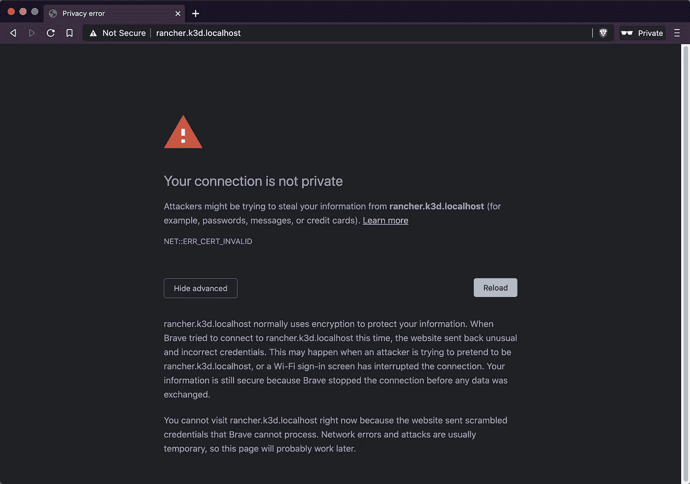
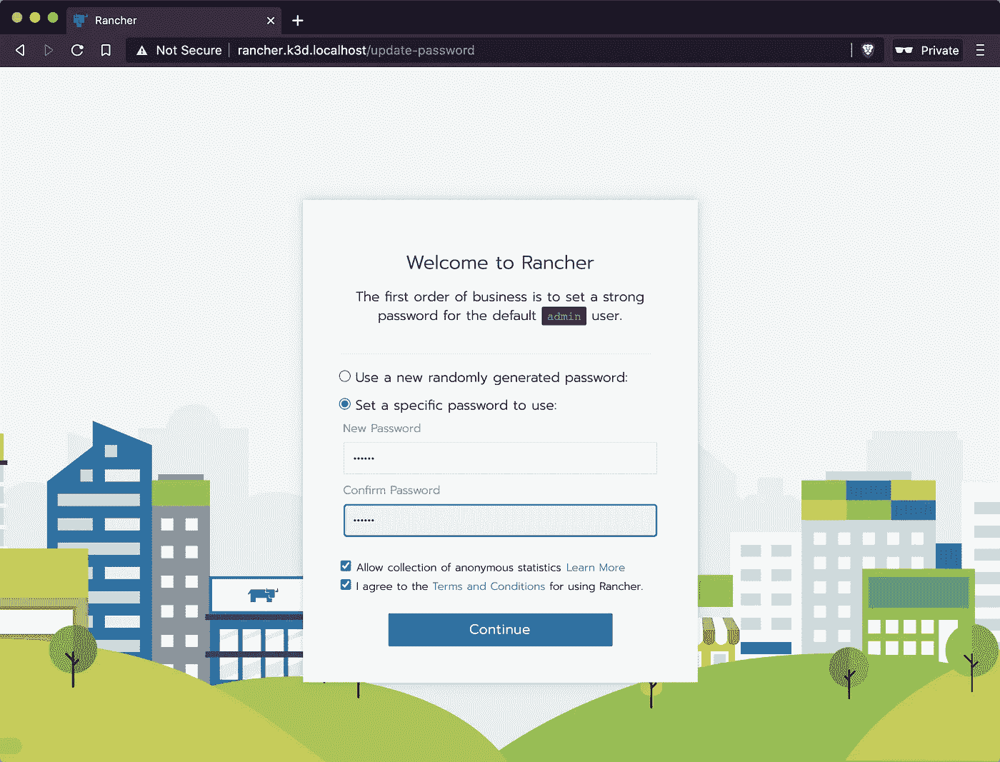
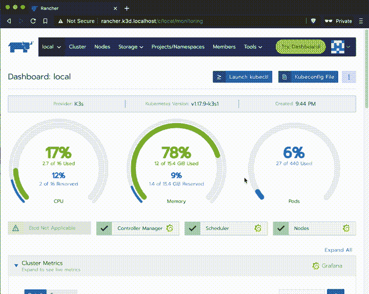

# macOS 笔记本电脑上的 Rancher 2.4 & Kubernetes 和 Docker & k3d

> 原文：<https://itnext.io/rancher-2-4-kubernetes-on-your-macos-laptop-with-docker-k3d-b578b1c7568b?source=collection_archive---------2----------------------->



这篇文章描述了如何使用由 Rancher(最近被 SUSE 收购)监控的 k3d 在 macOS Catalina 上建立一个 Kubernetes (k8s)测试/开发环境，并且受到了这个惊人的[视频](https://www.youtube.com/watch?v=hMr3prm9gDM)和由 [Thorsten K](https://medium.com/u/f4cb33e4a07f?source=post_page-----b578b1c7568b--------------------------------) 制作的 [repo](https://github.com/iwilltry42/k3d-demo) 的启发

## 本文的目标是在本地建立一个 Kubernetes 集群来进行实验并了解 kubectl

> 另见:[https://medium . com/@ jyeee/kubernetes-on-your-MAC OS-laptop-with-multipass-k3s-and-rancher-2-4-6e 9 CBF 013 f 58](https://medium.com/@jyeee/kubernetes-on-your-macos-laptop-with-multipass-k3s-and-rancher-2-4-6e9cbf013f58)

在获得了一点 k8s 的使用体验后，我想不出比一个 app 容器化部署到 k8s 更好的实现“写一次到处跑”梦想的方法了！在 k8s 之上，我发现 Rancher 是部署应用程序和操作/维护集群的最佳界面。

我很幸运在一家伟大的公司/客户那里工作，这让我能够获得惊人的资源，在那里我可以运行多个集群。对于我可能没有这些资源的家庭项目，我想在我的笔记本电脑上建立一个实验室，这样我就可以练习了。



# 先决条件

1.  MAC OS Catalina(10.15)w/8gb mem(lmk 如果你能用更少的来做！)
2.  Docker CE 桌面([安装文档](https://hub.docker.com/editions/community/docker-ce-desktop-mac/))
3.  自制软件([安装文档](https://docs.brew.sh/Installation))，用于安装 k3d、kubectl 和 helm

# 概观

1.  安装 k3d 和 k8s 工具 helm & kubectl
2.  创建一个 k8s 集群并添加 Rancher 来管理它
3.  通过 Rancher 测试/开发 k8s

# 1/3 安装 k3d 和 k8s 工具头盔和 kubectl

我们没有使用整个虚拟机作为 k8s 集群中的一个节点，而是使用 [k3s，这是一个轻量级认证的 Kubernetes 发行版](https://k3s.io/)，为物联网&边缘计算而构建，已经[在美国空军 F-16 战斗机上使用(真的！)](https://thenewstack.io/how-the-u-s-air-force-deployed-kubernetes-and-istio-on-an-f-16-in-45-days/)。

我们将使用轻量级包装器 [k3d 在 docker](https://k3d.io/) 中运行 k3s，然后我们将使用 kubectl 管理 k8s 集群。

一旦我们有了 k8s 集群，我们将希望使用 k8s 的包管理器 [helm 来安装应用程序/依赖项，就像我们使用 brew、apt、yum 或 choco 这样的包管理器一样。](https://helm.sh/)

有很多话，但我们需要的所有东西都是通过一个命令安装的，这要感谢你终端中的自制软件🙌

```
**$ brew install k3d kubectl helm** ==> Downloading [https://homebrew.bintray.com/bottles/k3d-3.0.0.catalina.bottle.tar.gz](https://homebrew.bintray.com/bottles/k3d-3.0.0.catalina.bottle.tar.gz)
...
=> Pouring k3d-3.0.0.catalina.bottle.tar.gz
🍺  /usr/local/Cellar/k3d/3.0.0: 5 files, 24.1MB
...
==> Summary
🍺  /usr/local/Cellar/kubernetes-cli/1.18.6: 232 files, 49.2MB
...
==> Summary
🍺  /usr/local/Cellar/helm/3.2.4_1: 54 files, 42.7MB
==> helm
Bash completion has been installed to:
  /usr/local/etc/bash_completion.dzsh completions have been installed to:
  /usr/local/share/zsh/site-functions
```

# 2/3 创建一个 k8s 集群，并添加牧场主来管理它

现在您已经安装了 k8s 工具，创建 k8s 集群并使用这些命令安装 Rancher(这也可以用作脚本，所以您可以随意将其全部复制并粘贴到您的终端中)



这些命令(可以作为脚本运行)执行以下操作:

1.使用 k3d 创建一个集群，将端口 443 连接到 k3d 提供的负载平衡器

2.设置一个 kubeconfig，这样您就可以在当前会话中使用 kubectl

3.根据文档[https://Rancher . com/docs/Rancher/v2 . x/en/installation/k8s-install/helm-Rancher/](https://rancher.com/docs/rancher/v2.x/en/installation/k8s-install/helm-rancher/)使用 helm 安装 Rancher(及其依赖证书管理器)

# 3/3 测试/开发 k8s via Rancher

打开浏览器，进入[https://rancher . k3d . localhost](https://rancher.k3d.localhost)

如果在 Chrome/Brave ( [哪个解析。本地主机域到回环](https://codereview.chromium.org/938093003))，使用`thisisunsafe`技巧进入并让 Rancher 满意证书([https://dev.to/brettimus/this-is-unsafe-and-a-bad-idea-5ej4](https://dev.to/brettimus/this-is-unsafe-and-a-bad-idea-5ej4))。

如果使用另一个浏览器，您必须编辑您的/etc/hosts 以将 rancher.k3d.localhost 指向您的回环(添加行` 127.0.0.1 rancher.k3d.localhost `)



不开玩笑，点击红色三角形并输入“这是不安全的”

为 Rancher 选择一个密码，并确认 Rancher 服务器 URL。



> 如果群集表示它处于非活动状态，请刷新页面，您将看到您的群集转变为活动状态

现在点击本地集群，享受 Rancher 的奇妙 GUI 来管理 k8s 集群！下面的 gif 显示了如何启用监控，这可以在 Grafana 中可视化，如下一个 gif 所示


Grafana 在你的笔记本上！



# 结论

就是这样！现在，您的笔记本电脑上有了一个最小的 Kubernetes 集群，可以用作个人实验室。

我想看的下一个视频是 Thorsten K 的 Rancher k3d 演示，它让我意识到使用 k3d 来构建一个 dev env【https://www.youtube.com/watch?v=hMr3prm9gDM】T3[https://github.com/iwilltry42/k3d-demo](https://github.com/iwilltry42/k3d-demo)是多么容易

现在我已经有了一个集群，我要读的下一篇文章是如何将这样的 webapp 容器化[https://dev . to/rieckpil/deploy-a-react-application-to-kubernetes-in-5-easy-steps-516j](https://dev.to/rieckpil/deploy-a-react-application-to-kubernetes-in-5-easy-steps-516j)——一旦你将它容器化并推送到 repo，你就可以在本地集群中部署它。

欢迎🤙！

来加入我的技术智能解决方案([https://www.techint.us/](https://www.techint.us/))！[https://www.linkedin.com/in/jyeee/](https://www.linkedin.com/in/jyeee/)