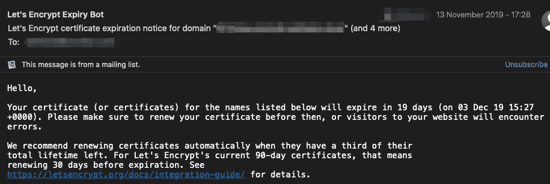
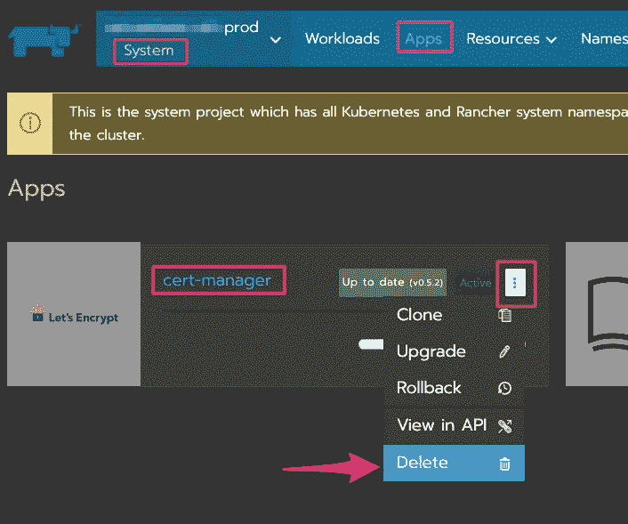
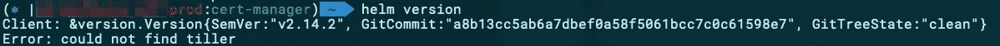
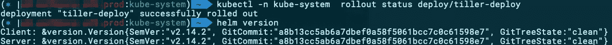
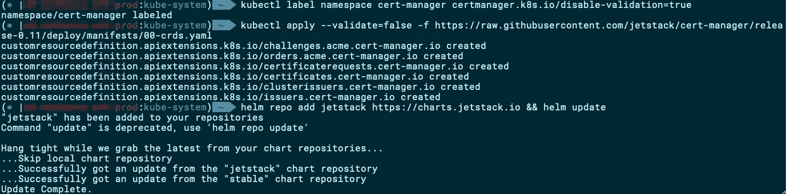
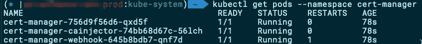
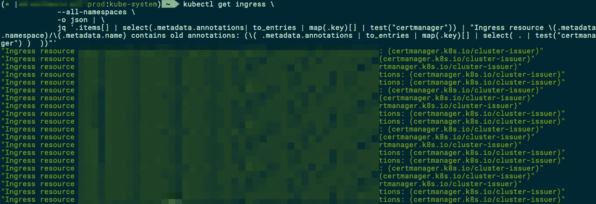

# Rancher 2.x 证书管理器升级

> 原文：<https://itnext.io/rancher-cert-manager-upgrade-bd15468bac9c?source=collection_archive---------10----------------------->

## 如何在为时已晚之前升级您的 Kubernetes 集群


照片由[普里西拉·杜·普里兹](https://unsplash.com/@priscilladupreez?utm_source=medium&utm_medium=referral)在 [Unsplash](https://unsplash.com?utm_source=medium&utm_medium=referral) 上拍摄

如果您选择使用 Rancher 管理的 [Helm](https://helm.sh/) 图表在您的 Rancher 管理的 Kubernetes 集群中安装`cert-manager`, Let ' s Encrypt 的好心人可能会很快向您发送以下通知:



“你的 ACME 客户太老了。请升级到较新的版本。—现在怎么办？

检查集群中`cert-manager`的日志，您可以看到 Let Encrypt 拒绝了更新您的证书的请求，因为“您的 ACME 客户端太旧了”。请升级到新版本”。是时候卷起袖子开始了。

# 使用牧场主策划的头盔图升级

我猜你的第一个想法可能和我的相似:让我们用相应的舵图的最新版本升级`cert-manager`。让我告诉你这不是一个选项，以节省你的时间。不幸的是，牧场主为`cert-manager`策划的头盔图表似乎[仍然在 v0.5.2](https://github.com/rancher/charts/tree/master/charts/cert-manager) 上，所以没有*一键、*无痛升级可用。

那么，还有什么其他的选择呢？官方舵轮图。

# 升级官方舵轮图

计划很简单:牧场主为`cert-manager`策划的头盔图将被移除，取而代之的是头盔中由 [Jetstack](https://www.jetstack.io/) 维护的[图。](https://hub.helm.sh/charts/jetstack/cert-manager)

在我们开始警告之前。从 v0.5.2 到现在稳定的 v0.11.0 很多东西[都变了](https://docs.cert-manager.io/en/latest/tasks/upgrading/index.html)。**将**影响您的部署的最深刻的变化是新引入的 CRDs 和各自的配置格式。因此，一旦执行了升级，您需要将您的资源定义更新为新的格式。幸运的是，`cert-manager`为我们提供了一个升级脚本，我们将在这篇文章的结尾使用它。

## 移除牧场主策划的舵图

1.  登录到你的牧场主界面。
2.  切换到最初安装`cert-manager`的项目(很可能是 System)。
3.  点击“应用程序”。
4.  单击垂直省略号按钮，然后选择“删除”。



您现在已经删除了最初安装的`cert-manager`。请注意，此删除不会影响过去已经创建的证书，此时您的入口配置应该会像以前一样继续工作。

## 安装舵杆

Tiller 是 Helm 的服务器端小兄弟，所以要在我们的 CLI 中使用 Helm，我们需要在我们的 Kubernetes 集群中安装 Tiller。您可以通过发出以下命令来验证是否已经安装了 Tiller:

```
helm version
```



验证分蘖是否存在

如果您的输出与上面类似，Tiller 不存在，您需要安装它。如果您已经安装了它，您可以跳过这一部分。

所以，你没有提勒？没问题，我们来装吧。首先，我们需要创建一个服务帐户，授予我们远程安装 Tiller 和安装图表的权限。

```
kubectl -n kube-system create serviceaccount tillerkubectl create clusterrolebinding tiller \
  --clusterrole=cluster-admin \
  --serviceaccount=kube-system:tiller
```

启动舵杆安装问题:

```
helm init --service-account tiller
```

几秒钟后，您可以通过重新发布`helm version`来验证 Tiller 已安装，或者通过以下方式验证您的 Kubernetes Tiller 部署

```
kubectl -n kube-system rollout status deploy/tiller-deploy:
```



Helm(客户端)和 Tiller(服务器)都可用，并且它们的版本匹配

## 正在安装证书管理器

在继续安装`cert-manager`之前，我们需要先准备一些东西。

1.  禁用资源验证以允许`cert-manager`的 webhook 组件正常工作([见原因](http://kubectl -n kube-system  rollout status deploy/tiller-deploy))。
2.  安装新的(v0.11.1) CRDs
3.  正在添加 Jetstack repos。

```
kubectl label namespace cert-manager certmanager.k8s.io/disable-validation=truekubectl apply --validate=false -f [https://raw.githubusercontent.com/jetstack/cert-manager/release-0.11/deploy/manifests/00-crds.yaml](https://raw.githubusercontent.com/jetstack/cert-manager/release-0.11/deploy/manifests/00-crds.yaml)helm repo add jetstack [https://charts.jetstack.io](https://charts.jetstack.io) && helm update
```



正在准备证书管理器安装

至此，我们已经为`cert-manager`的实际安装和验证做好准备:

```
helm install \
  --name cert-manager \
  --namespace cert-manager \
  --version v0.11.0 \
  jetstack/cert-managerkubectl get pods --namespace cert-manager
```



cert-manager v.0.11.0 安装成功

## 升级旧的资源引用和配置

如果你去检查你的入境证明，你会发现什么都没有改变。这是意料之中的，因为过去在 v0.5.2 中使用的入口定义不包含 v0.11.0 的适当配置。`cert-manager`为我们提供了一个方便的“一行程序”,通过以下方式找出哪个集群资源仍然引用旧值:

```
kubectl get ingress \
      --all-namespaces \
      -o json | \
      jq '.items[] | select(.metadata.annotations| to_entries | map(.key)[] | test("certmanager")) | "Ingress resource \(.metadata.namespace)/\(.metadata.name) contains old annotations: (\( .metadata.annotations | to_entries | map(.key)[] | select( . | test("certmanager") )  ))"'
```



找出不兼容的 v0.5.2 配置

根据 Kubernetes 集群的部署数量，上面的列表可能更短或更长，手动编辑所有部署可能需要相当长的时间。以下是来自`cert-admin`文档的指令，用于自动执行该过程:

> *#首先，为您的给定平台下载二进制文件*
> `wget -O api-migration https://github.com/jetstack/cert-manager/releases/download/v0.11.0/api-migration-linux`
> *#或者为 Darwin*
> `wget -O api-migration https://github.com/jetstack/cert-manager/releases/download/v0.11.0/api-migration-darwin`
> 
> *#将二进制文件标记为可执行文件，并针对您的集群运行该二进制文件*
> `chmod +x api-migration && ./api-migration --kubeconfig /path/to/my/kubeconfig.yaml`
> 
> *#按照命令行输出并检查文件*
> `diff ingress.yaml ingress-migrated.yaml`
> 
> *#最后，检查完新的入口资源后*

## 重新引入集群发行者

好了，我们快完成了。我们完成迁移需要做的最后一件事是重新引入集群发布者(如果您喜欢将`kind`注释改为`Issuer`，也可以选择每个名称空间发布者)。

下面的摘录使用 HTTP01 流创建了两个使用加密阶段和生产的集群发布者。

```
---
apiVersion: cert-manager.io/v1alpha2
kind: ClusterIssuer
metadata:
  name: letsencrypt-staging
spec:
  acme:
    email: [e](mailto:esthesis@eurodyn.com)xample@example.com
    server: [https://acme-staging-v02.api.letsencrypt.org/directory](https://acme-staging-v02.api.letsencrypt.org/directory)
    privateKeySecretRef:
      name: letsencrypt-staging-account-key
    solvers:
    - http01:
        ingress:
          class: nginx---
apiVersion: cert-manager.io/v1alpha2
kind: ClusterIssuer
metadata:
  name: letsencrypt-prod
spec:
  acme:
    email: [e](mailto:esthesis@eurodyn.com)xample@example.com
    server: [https://acme-v02.api.letsencrypt.org/directory](https://acme-v02.api.letsencrypt.org/directory)
    privateKeySecretRef:
      name: letsencrypt-prod-account-key
    solvers:
    - http01:
        ingress:
          class: nginx
```

一两分钟后，您的所有入口都将更新为指向新颁发的证书。请记住，如果您以前的证书不在续订窗口内(目前是到期前 30 天)，您将不会注意到任何差异。