# 适用于本地 K8s 开发的 Rancher Desktop 和 nerdctl

> 原文：<https://itnext.io/rancher-desktop-and-nerdctl-for-local-k8s-dev-d1348629932a?source=collection_archive---------1----------------------->

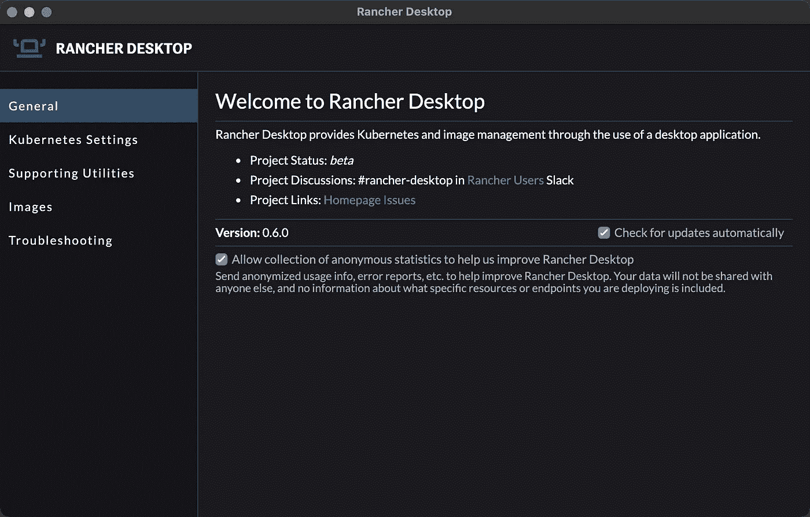

当 (2.6) [尝试](/kubernetes-rancher-2-5-on-your-windows-10-laptop-with-k3d-and-k3s-7404f288342f) (2.5) [为 Kubernetes 初学者开发人员找出](https://jyeee.medium.com/rancher-2-4-14c31af12b7a) (2.4)一个[好的本地开发设置](https://jyeee.medium.com/rancher-2-3-on-windows-10-with-minikube-and-helm-e4e2ae962994) (2.3)时，我花了相当多的[，我想我已经通过运行 Rancher Desktop(](/kubernetes-rancher-cluster-manager-2-6-on-your-macos-laptop-with-k3d-k3s-in-5-min-8acdb94f3376)[https://rancherdesktop.io/](https://rancherdesktop.io/))和使用 nerdctl 而不是 docker build/pull/commit/tag/push 找到了它。

本文展示了如何使用 nerdctl(通过 Rancher Desktop 安装)来拉取、编辑(提交)、本地运行和部署到 K8s。

## 注意:🤙零 Docker 桌面🐳本文中使用了 or `docker`命令🤙

如果你需要帮助安装 Rancher Desktop，请查看下面的文章

[](https://medium.com/macoclock/rancher-desktop-setup-for-k8s-on-your-macos-laptop-6f1c576ceb48) [## macOS 笔记本电脑上 K8s 的 Rancher 桌面设置

### 对于我在 MacBook 上的个人 K8s 测试实验室，我使用的是 Rancher Desktop。我试过 MiniKube(牛逼)和 K3d(也…

medium.com](https://medium.com/macoclock/rancher-desktop-setup-for-k8s-on-your-macos-laptop-6f1c576ceb48) 

使用 Rancher Desktop，kubectl、helm、nerdctl 和 kim 会自动安装，并设置为当前配置上下文。无需使用 brew 或手动安装任何这些工具🙌

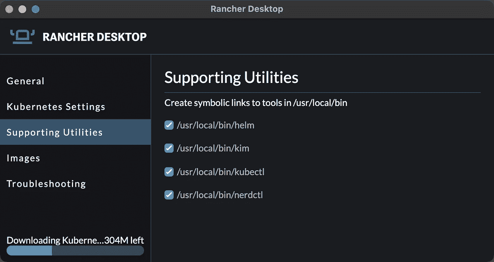

# 用 nerdctl 运行一个容器映像

使用 nerdctl 提取容器映像，显示提取的容器映像，并运行容器。使用 nerdctl 感觉就像使用 docker 一样！

> 因为我们希望使用 K8s 集群来构建和管理映像，所以请确保通过指定 k8s.io 名称空间来使用 K8s 集群名称空间来存储映像。这是通过在 nerdctl: `-n k8s.io`中提供这些参数来实现的

我们在这个例子中使用的容器图像是一个基本的 nginx，它提供了我在下面的文章中制作的一个 kaboomjs([https://kaboomjs.com/](https://kaboomjs.com/)♥️)游戏

[](https://javascript.plainenglish.io/kaboom-js-repl-it-custom-top-down-shooter-in-5-min-ebad8157073a) [## 使用 kaboom.js 和 repl.it 在 5 分钟内创建一个自定义的自上而下的射手

### 我小时候喜欢玩自上而下的射击游戏，比如《银河战舰》和《太空入侵者》,希望我也能自己定制一款…

javascript.plainenglish.io](https://javascript.plainenglish.io/kaboom-js-repl-it-custom-top-down-shooter-in-5-min-ebad8157073a) 

```
# default from docker.io
$ nerdctl -n k8s.io pull jwsy/jade-shooter:v1.1$ nerdctl -n k8s.io images | grep jwsy
```

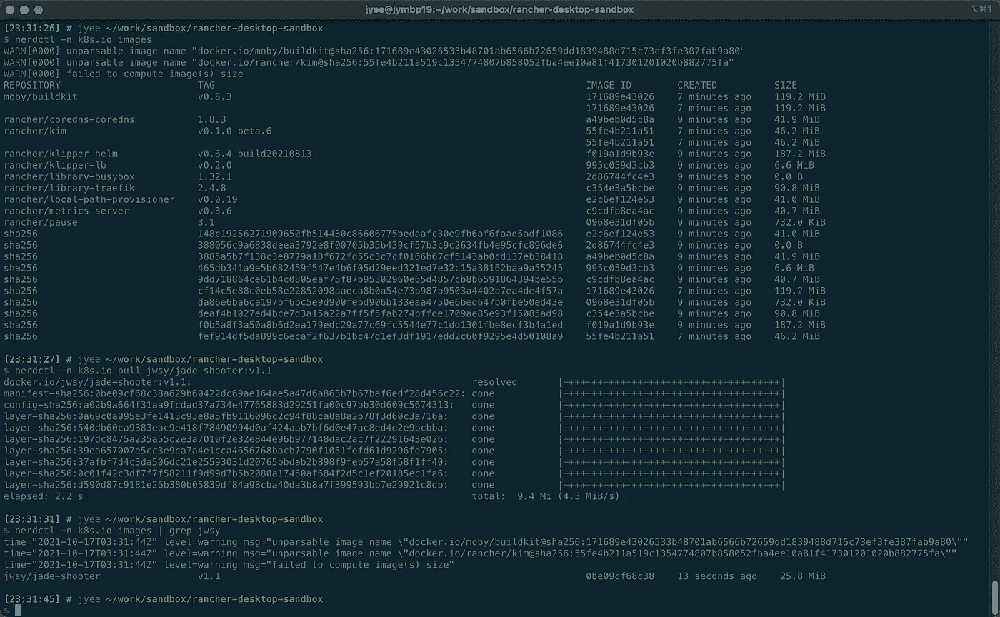

感觉就像用 docker 一样

用 nerdctl 运行图像，并浏览到`localhost:8080`进行查看。注意创建的容器 ID，在本例中是`e2a5....`

```
$ nerdctl -n k8s.io run -d -p 8080:80 jwsy/jade-shooter:v1.1
**e2a5**bea0471b3173b68268901551c0906a29fea55bd4cba34d9f446bfaa765c2
```

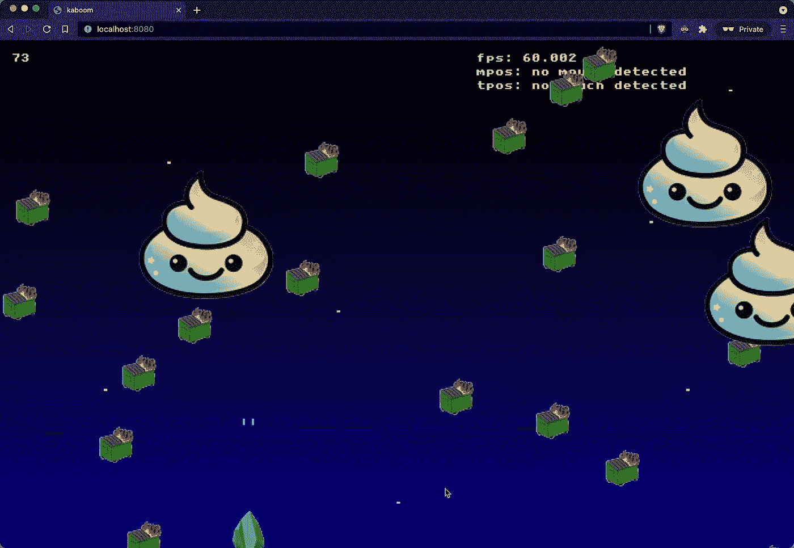

请注意，只有两颗“子弹”发射

# 编辑映像，并使用 nerdctl 测试和创建一个新的容器映像

为了模拟开发，使用 nerdctl exec 打开并编辑容器——特别是 kaboom.js 应用程序中发射的子弹数量。下面显示我修改了一个特定的函数`keypress(["space", "up]), () => {`,用三个项目符号(即调用 spawnBullet)代替两个。

```
$ nerdctl -n k8s.io exec -it **e2a5** sh/ # grep -A5 'keyPress(\[\"space' /usr/share/nginx/html/index.html/ # vi /usr/share/nginx/html/index.html/ # grep -A5 'keyPress(\[\"space' /usr/share/nginx/html/index.html**# this shows THREE spawnBullet calls after editing**
```

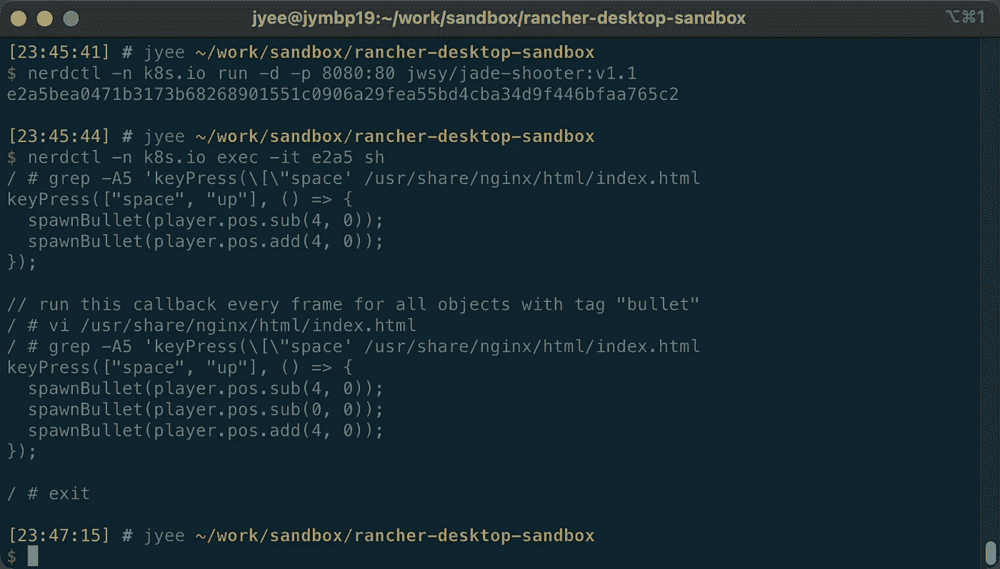

使用`nerdctl commit`创建一个新的容器图像&标签。输出是创建的容器图像的 sha256，您可以使用`nerdctl -n k8s.io images`再次列出图像，以显示新创建的容器图像

```
$ nerdctl -n k8s.io commit **e2a5** local/jwsy/jade-shooter:v1.2
sha256:73334cd58f5207e605728aad170228a2e7233bacabf37c0fbf8f75c931c59640$ nerdctl -n k8s.io images
```

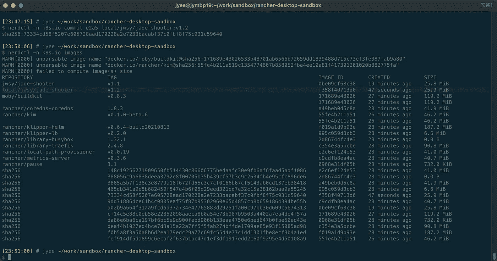

此时，您可以使用 nerdctl 测试保存和加载图像

```
$ nerdctl -n k8s.io save -o local_jwsy_jade-shooter_v1.2.tar local/jwsy/jade-shooter:v1.2$ nerdctl -n k8s.io load -i local_jwsy_jade-shooter_v1.2.tar
```

在不同的端口上本地测试容器映像(8081 与 8080)

```
$ nerdctl -n k8s.io run -d -p 8081:80 local/jwsy/jade-shooter:v1.2
```

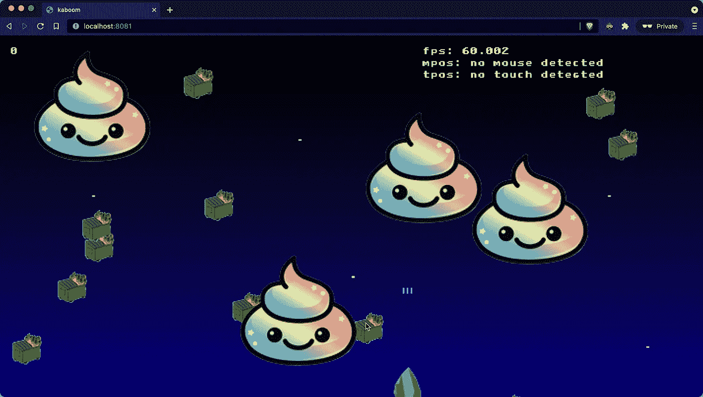

localhost:8081 —这次三颗子弹！

# 在 K8s 上部署容器映像

使用部署、服务和入口的基本清单在 K8s 上部署映像(滚动到底部查看要点)。

因为 Rancher Desktop 运行在您的本地主机上，Chromium 浏览器知道将任何`*.localhost` DNS 重定向到`localhost`，所以我们可以利用这个合理的缺省值来创建一个入口。

```
$ kubectl apply -f jade-shooter
deployment.apps/jade-shooter created
ingress.networking.k8s.io/jade-shooter created
service/jade-shooter-service created
```

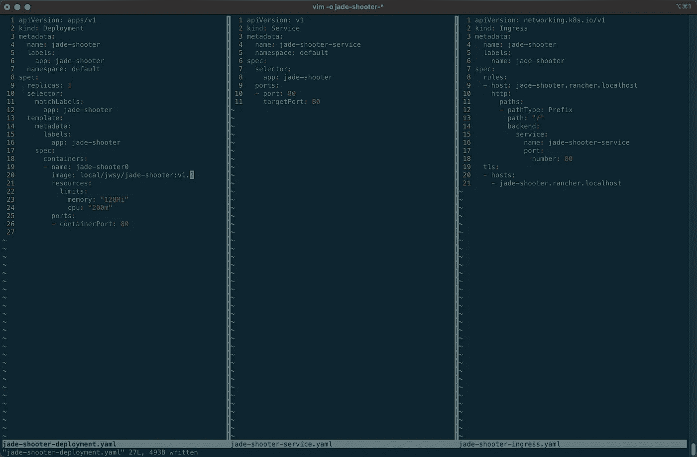

浏览入口文件中指定的[https://jade-shooter . rancher . localhost](https://jade-shooter.rancher.localhost)，您将看到最新版本！

> *你做* ***不做*** *必须改变你的* `*/etc/hosts*` *如果你* ***使用基于 Chrome 或 Firefox 的浏览器像 Brave/Canary*** *(即不是 Safari)因为我们会使用*`*.localhost*`*[*DNS magic*](https://en.wikipedia.org/wiki/.localhost)*让你的浏览器自动路由任何否则，你需要更新* `*/etc/hosts*` *来拥有条目* `*127.0.0.1 jade-shooter.rancher.localhost*`*

*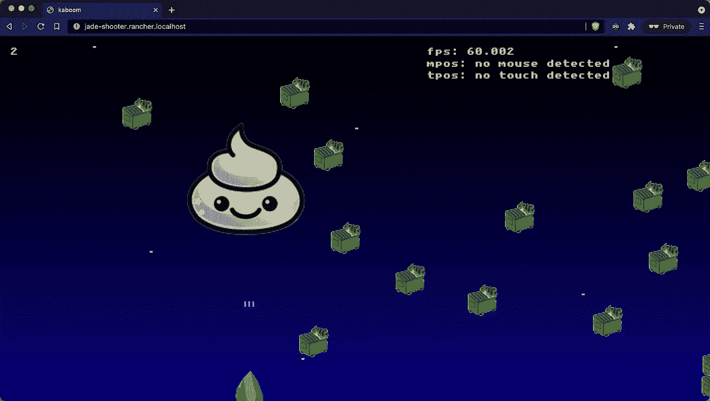*

*三颗子弹和正确的 DNS*

*下面是部署、服务和入口三个清单的要点。您应该看到的是，要实现这一点需要大量的样板配置，而且入口必须是特定于 DNS 的*

# *奖励内容:牧场主集群管理器 2.6*

*下面的截图是牧场主集群管理器 2.6 中的应用程序。按照以下说明在您的机器上设置它:[https://it next . io/kubernetes-rancher-cluster-manager-2-6-on-your-MAC OS-laptop-with-k3d-k3s-in-5-min-8 acdb 94 f 3376](/kubernetes-rancher-cluster-manager-2-6-on-your-macos-laptop-with-k3d-k3s-in-5-min-8acdb94f3376)*

*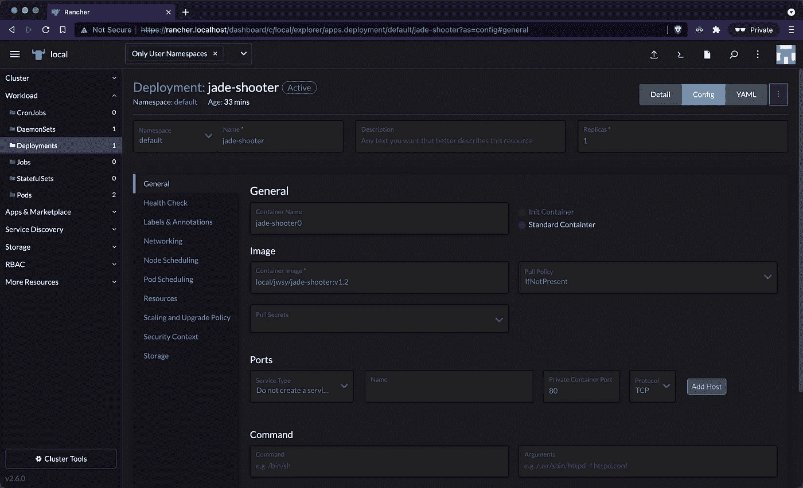**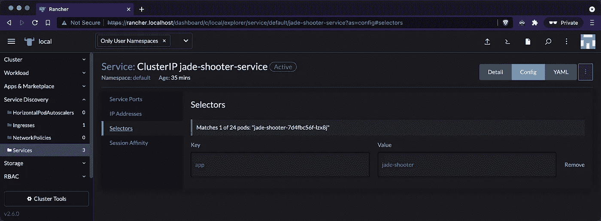**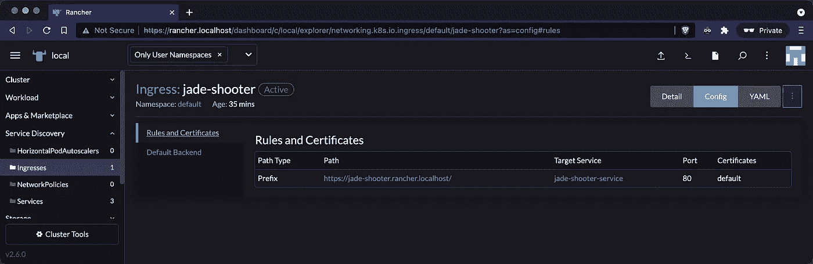**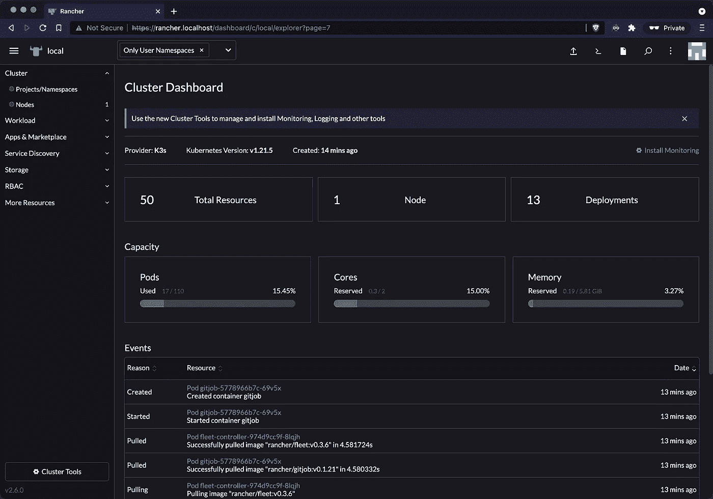**[](https://jyeee.medium.com/membership) [## 通过我的推荐链接加入 Medium-Jason Yee

### 作为一个媒体会员，你的会员费的一部分会给你阅读的作家，你可以完全接触到每一个故事…

jyeee.medium.com](https://jyeee.medium.com/membership)*